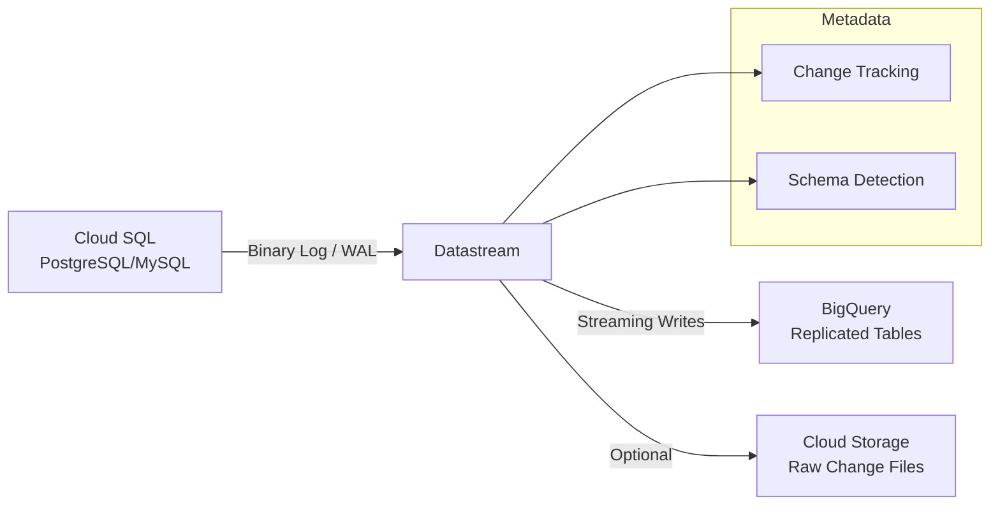

# How to Build a Change Data Capture Pipeline from Cloud SQL to BigQuery Using Datastream

Author: [nawazdhandala](https://www.github.com/nawazdhandala)

Tags: GCP, Datastream, Cloud SQL, BigQuery, CDC, Change Data Capture, Data Replication

Description: A hands-on guide to setting up real-time change data capture from Cloud SQL to BigQuery using Google Datastream for continuous database replication.

---

Change data capture (CDC) is how you keep your analytics warehouse in sync with your operational database without running expensive full table scans. Instead of periodically dumping entire tables, CDC watches for individual row-level changes and replicates them in near real-time. Google Datastream is a serverless CDC service that makes this remarkably straightforward to set up between Cloud SQL and BigQuery. Let me walk through the setup.

## What Datastream Does Under the Hood

Datastream reads the MySQL binary log or PostgreSQL replication stream from your Cloud SQL instance. It captures every INSERT, UPDATE, and DELETE operation and writes the changes to BigQuery. The result is a BigQuery table that mirrors your operational database, usually with just a few seconds of lag.



## Prerequisites

Before setting up Datastream, you need to configure your Cloud SQL instance for replication:

For PostgreSQL:

```bash
# Enable logical replication on Cloud SQL PostgreSQL
gcloud sql instances patch my-postgres-instance \
  --database-flags=cloudsql.logical_decoding=on

# Note: This requires a restart of the instance
```

For MySQL:

```bash
# Enable binary logging on Cloud SQL MySQL (usually enabled by default)
gcloud sql instances patch my-mysql-instance \
  --database-flags=log_bin=ON,binlog_format=ROW,binlog_row_image=FULL
```

Create a dedicated replication user:

```sql
-- For PostgreSQL: Create a replication user
CREATE USER datastream_user WITH REPLICATION LOGIN PASSWORD 'secure-password';

-- Grant necessary permissions
GRANT SELECT ON ALL TABLES IN SCHEMA public TO datastream_user;
GRANT USAGE ON SCHEMA public TO datastream_user;

-- Create a publication for the tables you want to replicate
CREATE PUBLICATION datastream_pub FOR TABLE orders, customers, products;
```

```sql
-- For MySQL: Create a replication user
CREATE USER 'datastream_user'@'%' IDENTIFIED BY 'secure-password';

-- Grant replication permissions
GRANT REPLICATION SLAVE, REPLICATION CLIENT ON *.* TO 'datastream_user'@'%';
GRANT SELECT ON my_database.* TO 'datastream_user'@'%';
FLUSH PRIVILEGES;
```

## Step 1: Create a Connection Profile for Cloud SQL

The connection profile tells Datastream how to connect to your source database:

```bash
# Create a connection profile for the Cloud SQL source
gcloud datastream connection-profiles create cloudsql-source \
  --location=us-central1 \
  --type=postgresql \
  --postgresql-hostname=10.0.0.5 \
  --postgresql-port=5432 \
  --postgresql-username=datastream_user \
  --postgresql-password=secure-password \
  --postgresql-database=production \
  --display-name="Production Cloud SQL"
```

If your Cloud SQL instance uses a private IP, you need to set up VPC peering or a reverse proxy. For private IP connectivity:

```bash
# Create a private connectivity configuration
gcloud datastream private-connections create my-private-conn \
  --location=us-central1 \
  --vpc=projects/my-project/global/networks/my-vpc \
  --subnet=10.1.0.0/29 \
  --display-name="Datastream Private Connection"

# Wait for the private connection to be provisioned (takes a few minutes)
gcloud datastream private-connections describe my-private-conn \
  --location=us-central1
```

## Step 2: Create a Connection Profile for BigQuery

The BigQuery destination profile is simpler:

```bash
# Create a connection profile for the BigQuery destination
gcloud datastream connection-profiles create bigquery-dest \
  --location=us-central1 \
  --type=bigquery \
  --display-name="Analytics BigQuery"
```

## Step 3: Create the Datastream Stream

The stream ties the source and destination together and defines what to replicate:

```bash
# Create the stream configuration
gcloud datastream streams create orders-replication \
  --location=us-central1 \
  --source=cloudsql-source \
  --postgresql-source-config='{
    "publication": "datastream_pub",
    "replicationSlot": "datastream_slot",
    "includeObjects": {
      "postgresqlSchemas": [{
        "schema": "public",
        "postgresqlTables": [
          {"table": "orders"},
          {"table": "customers"},
          {"table": "products"},
          {"table": "order_items"}
        ]
      }]
    }
  }' \
  --destination=bigquery-dest \
  --bigquery-destination-config='{
    "sourceHierarchyDatasets": {
      "datasetTemplate": {
        "location": "us-central1",
        "datasetIdPrefix": "replicated_"
      }
    },
    "dataFreshness": "30s"
  }' \
  --display-name="Orders CDC to BigQuery" \
  --backfill-all
```

The `--backfill-all` flag tells Datastream to do an initial full load of existing data before switching to change tracking. The `dataFreshness` setting of 30 seconds means BigQuery tables will be at most 30 seconds behind the source.

## Step 4: Start the Stream

```bash
# Start the replication stream
gcloud datastream streams update orders-replication \
  --location=us-central1 \
  --state=RUNNING
```

Monitor the stream status:

```bash
# Check stream status and health
gcloud datastream streams describe orders-replication \
  --location=us-central1

# View stream objects (tables being replicated)
gcloud datastream streams objects list \
  --stream=orders-replication \
  --location=us-central1
```

## Step 5: Understanding the Replicated Data

Datastream adds metadata columns to each replicated table in BigQuery:

```sql
-- Query the replicated orders table
SELECT
  -- Your original columns
  order_id,
  customer_id,
  total_amount,
  status,
  created_at,

  -- Datastream metadata columns
  datastream_metadata.uuid AS change_uuid,
  datastream_metadata.source_timestamp AS change_timestamp,
  datastream_metadata.is_deleted AS is_deleted
FROM `my-project.replicated_public.orders`
WHERE datastream_metadata.is_deleted = FALSE
ORDER BY datastream_metadata.source_timestamp DESC
LIMIT 100;
```

The `is_deleted` flag is important. When a row is deleted from the source, Datastream does not delete it from BigQuery. Instead, it marks it with `is_deleted = true`. This gives you a complete history of all changes.

## Step 6: Create Clean Views for Consumers

Your downstream consumers probably do not want to deal with deleted rows and metadata columns. Create views that present a clean version of the data:

```sql
-- Create a view that shows only the current state of each order
CREATE OR REPLACE VIEW `my-project.analytics.orders_current` AS
WITH latest_changes AS (
  SELECT
    *,
    ROW_NUMBER() OVER (
      PARTITION BY order_id
      ORDER BY datastream_metadata.source_timestamp DESC
    ) AS rn
  FROM `my-project.replicated_public.orders`
)
SELECT
  order_id,
  customer_id,
  total_amount,
  status,
  created_at,
  updated_at
FROM latest_changes
WHERE rn = 1
  AND datastream_metadata.is_deleted = FALSE;
```

For tables where you want historical tracking:

```sql
-- Create a history view that shows all changes to each order
CREATE OR REPLACE VIEW `my-project.analytics.orders_history` AS
SELECT
  order_id,
  customer_id,
  total_amount,
  status,
  created_at,
  updated_at,
  datastream_metadata.source_timestamp AS change_timestamp,
  CASE
    WHEN datastream_metadata.is_deleted THEN 'DELETE'
    WHEN datastream_metadata.source_timestamp = created_at THEN 'INSERT'
    ELSE 'UPDATE'
  END AS change_type
FROM `my-project.replicated_public.orders`
ORDER BY order_id, datastream_metadata.source_timestamp;
```

## Step 7: Handle Schema Changes

One of the nice things about Datastream is that it handles many schema changes automatically. When you add a column to the source table, Datastream will add it to the BigQuery table on the next change event. However, there are some cases you need to handle:

```sql
-- If a column type changes, you may need to update your views
-- Check for schema differences between source and destination
SELECT
  column_name,
  data_type,
  is_nullable
FROM `my-project.replicated_public.INFORMATION_SCHEMA.COLUMNS`
WHERE table_name = 'orders'
ORDER BY ordinal_position;
```

For column renames or drops, you may need to pause the stream, update the BigQuery schema, and restart.

## Monitoring and Alerting

Set up monitoring to catch replication issues early:

```bash
# Create an alert for high replication lag
gcloud monitoring policies create \
  --display-name="Datastream Replication Lag Alert" \
  --condition-display-name="Replication lag over 5 minutes" \
  --condition-filter='resource.type="datastream.googleapis.com/Stream" AND metric.type="datastream.googleapis.com/stream/total_latencies"' \
  --condition-threshold-value=300000 \
  --condition-threshold-duration=300s \
  --notification-channels="projects/my-project/notificationChannels/12345"
```

You can also query the replication lag directly:

```sql
-- Check the replication lag for each table
SELECT
  _TABLE_SUFFIX AS table_name,
  MAX(datastream_metadata.source_timestamp) AS latest_source_change,
  TIMESTAMP_DIFF(
    CURRENT_TIMESTAMP(),
    MAX(datastream_metadata.source_timestamp),
    SECOND
  ) AS lag_seconds
FROM `my-project.replicated_public.*`
GROUP BY 1
ORDER BY lag_seconds DESC;
```

## Cost Considerations

Datastream pricing is based on the volume of data processed. Here are some tips to keep costs under control:

1. Only replicate the tables you need. There is no point replicating a logging table with millions of rows per day if nobody queries it in BigQuery.

2. Use the `dataFreshness` setting wisely. Tighter freshness (like 10 seconds) means more frequent writes and higher BigQuery streaming costs. For most analytics use cases, 30 to 60 seconds is plenty.

3. Partition your BigQuery tables by the source timestamp. This keeps query costs low when analyzing recent changes.

4. Consider archiving old CDC data. After a few months, the detailed change history gets expensive to store. Move it to Cloud Storage if needed.

## When CDC Beats Batch Exports

CDC is not always the right choice. For small tables that change infrequently, a daily batch export might be simpler and cheaper. CDC shines when:

- You need near real-time data in your warehouse
- Your tables are large and only a small percentage of rows change each day
- You want to track the history of changes, not just the current state
- Full table scans on the source database would impact production performance

Datastream handles the hard parts of CDC - log reading, exactly-once delivery, schema tracking, and backfill management. Once the stream is running, it requires very little ongoing maintenance, which is exactly what you want from infrastructure plumbing.
