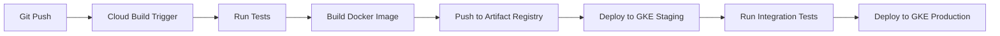

# How to Build a CI/CD Pipeline for Microservices on GKE Using Cloud Build and Artifact Registry

Author: [nawazdhandala](https://www.github.com/nawazdhandala)

Tags: GCP, Cloud Build, Artifact Registry, GKE, CI/CD, Microservices, DevOps

Description: Set up a complete CI/CD pipeline for building, testing, and deploying microservices to GKE using Google Cloud Build and Artifact Registry with automated rollbacks.

---

Getting a solid CI/CD pipeline for microservices on GKE is one of those foundational investments that pays off immediately. Every code push goes through automated tests, gets built into a container image, pushed to Artifact Registry, and deployed to your GKE cluster - all without manual steps. Here is how to set it up from scratch using Cloud Build.

## Architecture Overview

The pipeline flow looks like this:



## Prerequisites

Before starting, enable the required APIs and set up Artifact Registry:

```bash
# Enable the required GCP APIs
gcloud services enable \
  cloudbuild.googleapis.com \
  artifactregistry.googleapis.com \
  container.googleapis.com

# Create an Artifact Registry Docker repository
gcloud artifacts repositories create microservices \
  --repository-format=docker \
  --location=us-central1 \
  --description="Docker images for microservices"

# Grant Cloud Build permission to deploy to GKE
gcloud projects add-iam-policy-binding my-project \
  --member="serviceAccount:$(gcloud projects describe my-project --format='value(projectNumber)')@cloudbuild.gserviceaccount.com" \
  --role="roles/container.developer"
```

## Repository Structure

For a microservices monorepo, organize your code so each service has its own directory with a Dockerfile and Kubernetes manifests:

```
/
  services/
    user-service/
      src/
      tests/
      Dockerfile
      k8s/
        deployment.yaml
        service.yaml
    order-service/
      src/
      tests/
      Dockerfile
      k8s/
        deployment.yaml
        service.yaml
  cloudbuild.yaml
```

## The Dockerfile

Here is a multi-stage Dockerfile that keeps the final image small:

```dockerfile
# Build stage - install dependencies and compile
FROM node:20-alpine AS builder
WORKDIR /app
COPY package*.json ./
RUN npm ci --only=production
COPY src/ ./src/

# Production stage - only include what is needed to run
FROM node:20-alpine
WORKDIR /app

# Run as non-root user for security
RUN addgroup -S appgroup && adduser -S appuser -G appgroup
COPY --from=builder /app/node_modules ./node_modules
COPY --from=builder /app/src ./src
COPY package.json ./

USER appuser
EXPOSE 8080
CMD ["node", "src/index.js"]
```

## Cloud Build Configuration

This is the core of the pipeline. The `cloudbuild.yaml` file defines all the build steps:

```yaml
# cloudbuild.yaml - CI/CD pipeline for microservices
steps:
  # Step 1: Run unit tests
  - name: 'node:20-alpine'
    id: 'run-tests'
    dir: 'services/${_SERVICE_NAME}'
    entrypoint: 'sh'
    args:
      - '-c'
      - |
        npm ci
        npm test
    waitFor: ['-']  # Start immediately

  # Step 2: Build the Docker image
  - name: 'gcr.io/cloud-builders/docker'
    id: 'build-image'
    args:
      - 'build'
      - '-t'
      - '${_REGION}-docker.pkg.dev/${PROJECT_ID}/microservices/${_SERVICE_NAME}:${SHORT_SHA}'
      - '-t'
      - '${_REGION}-docker.pkg.dev/${PROJECT_ID}/microservices/${_SERVICE_NAME}:latest'
      - '-f'
      - 'services/${_SERVICE_NAME}/Dockerfile'
      - 'services/${_SERVICE_NAME}'
    waitFor: ['run-tests']  # Wait for tests to pass

  # Step 3: Push the image to Artifact Registry
  - name: 'gcr.io/cloud-builders/docker'
    id: 'push-image'
    args:
      - 'push'
      - '--all-tags'
      - '${_REGION}-docker.pkg.dev/${PROJECT_ID}/microservices/${_SERVICE_NAME}'
    waitFor: ['build-image']

  # Step 4: Deploy to staging
  - name: 'gcr.io/cloud-builders/gke-deploy'
    id: 'deploy-staging'
    args:
      - 'run'
      - '--filename=services/${_SERVICE_NAME}/k8s/'
      - '--image=${_REGION}-docker.pkg.dev/${PROJECT_ID}/microservices/${_SERVICE_NAME}:${SHORT_SHA}'
      - '--cluster=${_STAGING_CLUSTER}'
      - '--location=${_REGION}'
      - '--namespace=staging'
    waitFor: ['push-image']

  # Step 5: Run integration tests against staging
  - name: 'gcr.io/cloud-builders/curl'
    id: 'integration-tests'
    entrypoint: 'sh'
    args:
      - '-c'
      - |
        # Wait for the deployment to stabilize
        sleep 30
        # Run a basic health check against the staging endpoint
        STATUS=$(curl -s -o /dev/null -w "%{http_code}" \
          https://staging.my-app.com/api/${_SERVICE_NAME}/healthz)
        if [ "$STATUS" != "200" ]; then
          echo "Integration test failed: health check returned $STATUS"
          exit 1
        fi
        echo "Integration tests passed"
    waitFor: ['deploy-staging']

  # Step 6: Deploy to production
  - name: 'gcr.io/cloud-builders/gke-deploy'
    id: 'deploy-production'
    args:
      - 'run'
      - '--filename=services/${_SERVICE_NAME}/k8s/'
      - '--image=${_REGION}-docker.pkg.dev/${PROJECT_ID}/microservices/${_SERVICE_NAME}:${SHORT_SHA}'
      - '--cluster=${_PROD_CLUSTER}'
      - '--location=${_REGION}'
      - '--namespace=production'
    waitFor: ['integration-tests']

# Substitution variables with defaults
substitutions:
  _SERVICE_NAME: 'user-service'
  _REGION: 'us-central1'
  _STAGING_CLUSTER: 'staging-cluster'
  _PROD_CLUSTER: 'production-cluster'

# Build options
options:
  machineType: 'E2_HIGHCPU_8'  # Faster builds
  logging: CLOUD_LOGGING_ONLY

# Store the built images list
images:
  - '${_REGION}-docker.pkg.dev/${PROJECT_ID}/microservices/${_SERVICE_NAME}:${SHORT_SHA}'
  - '${_REGION}-docker.pkg.dev/${PROJECT_ID}/microservices/${_SERVICE_NAME}:latest'

timeout: '1200s'  # 20 minute timeout
```

## Setting Up Build Triggers

Create a trigger that builds the affected service when its code changes:

```bash
# Create a trigger for the user-service that runs on pushes to main
gcloud builds triggers create github \
  --name="deploy-user-service" \
  --repo-name="my-app" \
  --repo-owner="my-org" \
  --branch-pattern="^main$" \
  --included-files="services/user-service/**" \
  --build-config="cloudbuild.yaml" \
  --substitutions="_SERVICE_NAME=user-service"

# Create a trigger for the order-service
gcloud builds triggers create github \
  --name="deploy-order-service" \
  --repo-name="my-app" \
  --repo-owner="my-org" \
  --branch-pattern="^main$" \
  --included-files="services/order-service/**" \
  --build-config="cloudbuild.yaml" \
  --substitutions="_SERVICE_NAME=order-service"
```

The `--included-files` flag is crucial for a monorepo. It ensures that a change to the user-service does not trigger a rebuild of the order-service.

## Kubernetes Deployment Manifests

Here is the deployment manifest that the pipeline uses:

```yaml
# services/user-service/k8s/deployment.yaml
apiVersion: apps/v1
kind: Deployment
metadata:
  name: user-service
spec:
  replicas: 3
  selector:
    matchLabels:
      app: user-service
  strategy:
    rollingUpdate:
      # Allow one extra pod during rollout
      maxSurge: 1
      # Do not remove old pods until new ones are ready
      maxUnavailable: 0
    type: RollingUpdate
  template:
    metadata:
      labels:
        app: user-service
    spec:
      containers:
        - name: user-service
          # The image tag gets replaced by gke-deploy during the build
          image: us-central1-docker.pkg.dev/my-project/microservices/user-service
          ports:
            - containerPort: 8080
          resources:
            requests:
              cpu: "250m"
              memory: "256Mi"
          readinessProbe:
            httpGet:
              path: /healthz
              port: 8080
            initialDelaySeconds: 5
            periodSeconds: 10
          livenessProbe:
            httpGet:
              path: /healthz
              port: 8080
            initialDelaySeconds: 15
            periodSeconds: 20
```

## Automated Rollbacks

If a deployment goes bad, you want to roll back automatically. Add a post-deploy verification step and rollback logic:

```yaml
  # After production deploy, verify the rollout
  - name: 'gcr.io/cloud-builders/kubectl'
    id: 'verify-rollout'
    args:
      - 'rollout'
      - 'status'
      - 'deployment/${_SERVICE_NAME}'
      - '-n'
      - 'production'
      - '--timeout=300s'
    env:
      - 'CLOUDSDK_COMPUTE_REGION=${_REGION}'
      - 'CLOUDSDK_CONTAINER_CLUSTER=${_PROD_CLUSTER}'
    waitFor: ['deploy-production']
```

If the rollout status check fails (pods crash-loop or never become ready), Cloud Build marks the step as failed. You can set up a separate Cloud Function that watches for failed builds and triggers a rollback:

```python
# rollback_function/main.py - Triggered by Cloud Build failure notifications
from google.cloud import container_v1
import google.auth
import subprocess

def rollback_on_failure(event, context):
    """Roll back the deployment when a Cloud Build pipeline fails."""
    build = event['attributes']

    if build.get('status') != 'FAILURE':
        return

    # Extract the service name from build substitutions
    service_name = build.get('substitutions', {}).get('_SERVICE_NAME')
    if not service_name:
        return

    # Execute rollback using kubectl
    subprocess.run([
        'kubectl', 'rollout', 'undo',
        f'deployment/{service_name}',
        '-n', 'production'
    ], check=True)

    print(f'Rolled back {service_name} in production')
```

## Image Vulnerability Scanning

Artifact Registry can automatically scan your images for known vulnerabilities:

```bash
# Enable vulnerability scanning on the repository
gcloud artifacts repositories update microservices \
  --location=us-central1 \
  --enable-vulnerability-scanning

# Check scan results for a specific image
gcloud artifacts docker images list \
  us-central1-docker.pkg.dev/my-project/microservices/user-service \
  --show-occurrences \
  --format="table(package,version,fixAvailable,severity)"
```

## Wrapping Up

A well-structured CI/CD pipeline removes the friction from deploying microservices. Cloud Build handles the orchestration, Artifact Registry stores your images securely with vulnerability scanning, and GKE manages the actual deployment. The key design decisions are: use monorepo triggers with path filters so services build independently, implement rolling updates with zero unavailability, run integration tests against staging before promoting to production, and set up automated rollbacks for failed deployments. Once this foundation is in place, shipping changes to any microservice is as simple as merging a pull request.
