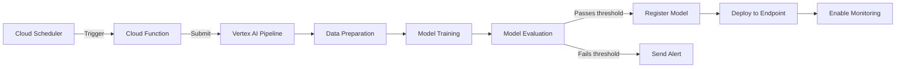

# How to Build a Continuous Training Pipeline with Vertex AI Pipelines and Cloud Scheduler

Author: [nawazdhandala](https://www.github.com/nawazdhandala)

Tags: Vertex AI, MLOps, Continuous Training, Cloud Scheduler, Google Cloud

Description: Step-by-step guide to building a continuous training pipeline using Vertex AI Pipelines and Cloud Scheduler for automated model retraining on Google Cloud.

---

A machine learning model is only as good as the data it was trained on, and that data gets stale fast. Whether you are building a recommendation engine, a fraud detection system, or a demand forecasting model, you need to retrain regularly. Doing this manually is tedious and error-prone. What you need is a continuous training pipeline that runs automatically on a schedule, trains on fresh data, evaluates the new model, and deploys it if it meets your quality bar.

In this post, I will show you how to build exactly that using Vertex AI Pipelines for orchestration and Cloud Scheduler for triggering.

## Architecture Overview

Here is the overall flow of the continuous training system.



## Step 1: Define the Pipeline Components

Each step in the pipeline is a component. I use the Kubeflow Pipelines SDK to define them, since that is what Vertex AI Pipelines uses under the hood.

First, the data preparation component that fetches and processes fresh training data.

```python
# components/data_prep.py
from kfp.v2 import dsl
from kfp.v2.dsl import Dataset, Output, Input, Metrics

@dsl.component(
    base_image="python:3.10",
    packages_to_install=["google-cloud-bigquery", "pandas", "pyarrow"]
)
def prepare_training_data(
    project_id: str,
    dataset_name: str,
    output_train: Output[Dataset],
    output_test: Output[Dataset],
    lookback_days: int = 90,
):
    """Fetch recent data from BigQuery and split into train/test sets."""
    from google.cloud import bigquery
    import pandas as pd

    client = bigquery.Client(project=project_id)

    # Query fresh data from the last N days
    query = f"""
    SELECT *
    FROM `{project_id}.{dataset_name}.features`
    WHERE created_at > TIMESTAMP_SUB(CURRENT_TIMESTAMP(), INTERVAL {lookback_days} DAY)
    """

    df = client.query(query).to_dataframe()
    print(f"Fetched {len(df)} rows from BigQuery")

    # Split into train and test sets (80/20 split)
    train_df = df.sample(frac=0.8, random_state=42)
    test_df = df.drop(train_df.index)

    # Save to the output artifacts
    train_df.to_csv(output_train.path, index=False)
    test_df.to_csv(output_test.path, index=False)

    print(f"Training set: {len(train_df)} rows")
    print(f"Test set: {len(test_df)} rows")
```

Next, the training component.

```python
# components/training.py
@dsl.component(
    base_image="python:3.10",
    packages_to_install=[
        "google-cloud-aiplatform",
        "pandas",
        "scikit-learn",
        "xgboost",
        "joblib"
    ]
)
def train_model(
    train_data: Input[Dataset],
    model_artifact: Output[dsl.Model],
    metrics: Output[Metrics],
    target_column: str = "label",
    n_estimators: int = 100,
    learning_rate: float = 0.1,
):
    """Train an XGBoost model on the prepared training data."""
    import pandas as pd
    import xgboost as xgb
    from sklearn.metrics import accuracy_score, f1_score
    import joblib
    import json

    # Load training data
    df = pd.read_csv(train_data.path)
    X = df.drop(columns=[target_column])
    y = df[target_column]

    # Train the model
    model = xgb.XGBClassifier(
        n_estimators=n_estimators,
        learning_rate=learning_rate,
        eval_metric="logloss",
        use_label_encoder=False,
    )
    model.fit(X, y)

    # Calculate training metrics
    predictions = model.predict(X)
    train_accuracy = accuracy_score(y, predictions)
    train_f1 = f1_score(y, predictions, average="weighted")

    # Log metrics for pipeline tracking
    metrics.log_metric("train_accuracy", train_accuracy)
    metrics.log_metric("train_f1_score", train_f1)

    print(f"Training accuracy: {train_accuracy:.4f}")
    print(f"Training F1 score: {train_f1:.4f}")

    # Save the trained model
    joblib.dump(model, model_artifact.path)
```

The evaluation component decides whether the new model is good enough to deploy.

```python
# components/evaluation.py
@dsl.component(
    base_image="python:3.10",
    packages_to_install=["pandas", "scikit-learn", "xgboost", "joblib"]
)
def evaluate_model(
    model_artifact: Input[dsl.Model],
    test_data: Input[Dataset],
    metrics: Output[Metrics],
    target_column: str = "label",
    accuracy_threshold: float = 0.85,
) -> bool:
    """Evaluate the trained model against the test set.
    Returns True if the model passes the quality threshold."""
    import pandas as pd
    from sklearn.metrics import accuracy_score, f1_score, classification_report
    import joblib

    # Load model and test data
    model = joblib.load(model_artifact.path)
    df = pd.read_csv(test_data.path)
    X = df.drop(columns=[target_column])
    y = df[target_column]

    # Generate predictions on the test set
    predictions = model.predict(X)

    # Calculate metrics
    accuracy = accuracy_score(y, predictions)
    f1 = f1_score(y, predictions, average="weighted")

    metrics.log_metric("test_accuracy", accuracy)
    metrics.log_metric("test_f1_score", f1)
    metrics.log_metric("accuracy_threshold", accuracy_threshold)

    print(f"Test accuracy: {accuracy:.4f}")
    print(f"Test F1 score: {f1:.4f}")
    print(f"Threshold: {accuracy_threshold}")
    print(classification_report(y, predictions))

    # Check if model meets the quality threshold
    passes = accuracy >= accuracy_threshold
    print(f"Model {'PASSES' if passes else 'FAILS'} the quality threshold")

    return passes
```

## Step 2: Assemble the Pipeline

Now wire the components together into a complete pipeline.

```python
# pipeline.py
from kfp.v2 import dsl, compiler

@dsl.pipeline(
    name="continuous-training-pipeline",
    description="Automated model training pipeline that runs on a schedule"
)
def continuous_training_pipeline(
    project_id: str,
    dataset_name: str,
    endpoint_id: str,
    accuracy_threshold: float = 0.85,
    lookback_days: int = 90,
):
    # Step 1: Prepare the training data
    data_prep_task = prepare_training_data(
        project_id=project_id,
        dataset_name=dataset_name,
        lookback_days=lookback_days,
    )

    # Step 2: Train the model
    training_task = train_model(
        train_data=data_prep_task.outputs["output_train"],
        target_column="label",
    )

    # Step 3: Evaluate the model
    eval_task = evaluate_model(
        model_artifact=training_task.outputs["model_artifact"],
        test_data=data_prep_task.outputs["output_test"],
        accuracy_threshold=accuracy_threshold,
    )

    # Step 4: Conditionally register and deploy the model
    with dsl.Condition(eval_task.output == True):
        register_task = register_model(
            project_id=project_id,
            model_artifact=training_task.outputs["model_artifact"],
        )
        deploy_task = deploy_model(
            project_id=project_id,
            model_resource=register_task.output,
            endpoint_id=endpoint_id,
        )

# Compile the pipeline to a JSON file
compiler.Compiler().compile(
    pipeline_func=continuous_training_pipeline,
    package_path="continuous_training_pipeline.json"
)
```

## Step 3: Set Up Cloud Scheduler to Trigger the Pipeline

Now create a Cloud Function that submits the pipeline and a Cloud Scheduler job that triggers it.

```python
# cloud_function/main.py
from google.cloud import aiplatform
import functions_framework

@functions_framework.http
def trigger_training_pipeline(request):
    """Cloud Function that triggers the continuous training pipeline."""

    aiplatform.init(
        project="my-project",
        location="us-central1",
        staging_bucket="gs://my-pipeline-bucket"
    )

    # Submit the pipeline run
    job = aiplatform.PipelineJob(
        display_name="scheduled-training-run",
        template_path="gs://my-pipeline-bucket/pipelines/continuous_training_pipeline.json",
        parameter_values={
            "project_id": "my-project",
            "dataset_name": "ml_features",
            "endpoint_id": "ENDPOINT_ID",
            "accuracy_threshold": 0.85,
            "lookback_days": 90,
        },
        enable_caching=False,  # Always use fresh data
    )

    job.submit()

    return {"status": "pipeline_submitted", "job_name": job.resource_name}
```

Deploy the Cloud Function and set up the scheduler.

```bash
# Deploy the Cloud Function
gcloud functions deploy trigger-training-pipeline \
  --gen2 \
  --runtime python310 \
  --trigger-http \
  --entry-point trigger_training_pipeline \
  --region us-central1 \
  --service-account ml-pipeline-sa@my-project.iam.gserviceaccount.com

# Create a Cloud Scheduler job that runs weekly on Sunday at 2am
gcloud scheduler jobs create http weekly-model-training \
  --schedule="0 2 * * 0" \
  --uri="https://us-central1-my-project.cloudfunctions.net/trigger-training-pipeline" \
  --http-method=POST \
  --oidc-service-account-email=scheduler-sa@my-project.iam.gserviceaccount.com \
  --location=us-central1
```

## Step 4: Add Model Registration and Deployment Components

Complete the pipeline with model registration and deployment steps.

```python
# components/register_and_deploy.py
@dsl.component(
    base_image="python:3.10",
    packages_to_install=["google-cloud-aiplatform"]
)
def register_model(
    project_id: str,
    model_artifact: Input[dsl.Model],
) -> str:
    """Register the trained model in Vertex AI Model Registry."""
    from google.cloud import aiplatform

    aiplatform.init(project=project_id, location="us-central1")

    model = aiplatform.Model.upload(
        display_name="my-model",
        artifact_uri=model_artifact.uri,
        serving_container_image_uri="us-docker.pkg.dev/vertex-ai/prediction/sklearn-cpu.1-2:latest",
    )

    print(f"Model registered: {model.resource_name}")
    return model.resource_name


@dsl.component(
    base_image="python:3.10",
    packages_to_install=["google-cloud-aiplatform"]
)
def deploy_model(
    project_id: str,
    model_resource: str,
    endpoint_id: str,
):
    """Deploy the registered model to the production endpoint."""
    from google.cloud import aiplatform

    aiplatform.init(project=project_id, location="us-central1")

    model = aiplatform.Model(model_resource)
    endpoint = aiplatform.Endpoint(endpoint_id)

    # Deploy with traffic split - start with 100% on the new model
    model.deploy(
        endpoint=endpoint,
        deployed_model_display_name=f"model-{model.version_id}",
        machine_type="n1-standard-4",
        min_replica_count=1,
        max_replica_count=5,
        traffic_percentage=100,
    )

    print(f"Model deployed to endpoint: {endpoint.resource_name}")
```

## Step 5: Add Notification for Failed Evaluations

When a model fails the quality threshold, you want to know about it.

```python
# components/notification.py
@dsl.component(
    base_image="python:3.10",
    packages_to_install=["google-cloud-pubsub"]
)
def send_failure_notification(
    project_id: str,
    metrics_summary: str,
):
    """Send a notification when model evaluation fails."""
    from google.cloud import pubsub_v1
    import json

    publisher = pubsub_v1.PublisherClient()
    topic = f"projects/{project_id}/topics/ml-pipeline-alerts"

    message = json.dumps({
        "alert_type": "model_evaluation_failed",
        "message": f"Scheduled training produced a model below quality threshold. Metrics: {metrics_summary}",
        "severity": "warning"
    }).encode("utf-8")

    publisher.publish(topic, message)
    print("Failure notification sent")
```

## Wrapping Up

A continuous training pipeline is one of the most valuable pieces of MLOps infrastructure you can build. By combining Vertex AI Pipelines for orchestration with Cloud Scheduler for triggering, you get automated model retraining that runs reliably without manual intervention. The key design decisions are: how often to retrain (weekly is a good starting point), what quality threshold to enforce, and how to handle failures gracefully. Start simple, monitor the results, and adjust the schedule and thresholds based on how quickly your data drifts.
