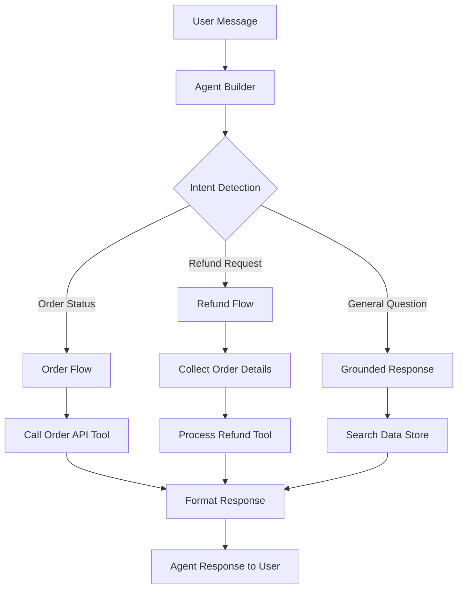

# How to Build a Conversational AI Agent with Vertex AI Agent Builder

Author: [nawazdhandala](https://www.github.com/nawazdhandala)

Tags: GCP, Vertex AI, Agent Builder, Conversational AI, Chatbot

Description: Build a production-ready conversational AI agent using Vertex AI Agent Builder with natural language understanding, tool use, and enterprise data grounding.

---

Conversational AI agents go beyond simple chatbots. They understand context, maintain state across turns, use tools to fetch real-time information, and ground their responses in your enterprise data. Vertex AI Agent Builder is Google Cloud's managed platform for building these agents without having to stitch together individual AI components yourself. It handles the orchestration, memory, grounding, and deployment so you can focus on defining what the agent should do.

This guide walks through building a conversational agent from scratch using Vertex AI Agent Builder, from initial setup through testing and deployment.

## What Vertex AI Agent Builder Provides

Agent Builder bundles several capabilities:

- **Natural language understanding** powered by Gemini models
- **Built-in conversation management** with session tracking
- **Tool integration** for calling APIs and executing actions
- **Data grounding** with Vertex AI Search data stores
- **A testing console** for iterating on agent behavior
- **Deployment APIs** for integrating the agent into your applications

## Prerequisites

- Google Cloud project with Vertex AI API and Dialogflow API enabled
- Python 3.9+

```bash
# Enable required APIs
gcloud services enable aiplatform.googleapis.com --project=your-project-id
gcloud services enable dialogflow.googleapis.com --project=your-project-id

# Install the SDK
pip install google-cloud-aiplatform google-cloud-dialogflow-cx
```

## Step 1: Create the Agent

You can create an agent through the Cloud Console or programmatically. Here is the programmatic approach.

```python
from google.cloud import aiplatform

def create_agent(
    project_id: str,
    location: str,
    display_name: str,
):
    """Create a new conversational agent using Vertex AI Agent Builder."""
    aiplatform.init(project=project_id, location=location)

    # The agent is created through the Agent Builder interface
    # For programmatic creation, we use the Dialogflow CX API
    from google.cloud.dialogflowcx_v3 import AgentsClient, Agent

    client = AgentsClient()
    parent = f"projects/{project_id}/locations/{location}"

    agent = Agent(
        display_name=display_name,
        default_language_code="en",
        time_zone="America/New_York",
        description="A conversational AI agent for customer support",
        start_flow=None,  # Will use default start flow
        enable_stackdriver_logging=True,
    )

    created_agent = client.create_agent(parent=parent, agent=agent)
    print(f"Agent created: {created_agent.name}")
    return created_agent
```

## Step 2: Define the Agent's Capabilities

### Creating Intents

Intents define what the agent can understand. Each intent represents a user's goal.

```python
from google.cloud.dialogflowcx_v3 import IntentsClient, Intent

def create_intent(agent_name: str, display_name: str, training_phrases: list):
    """Create an intent with training phrases for the agent."""
    client = IntentsClient()

    # Build training phrases from example utterances
    phrases = []
    for text in training_phrases:
        phrase = Intent.TrainingPhrase(
            parts=[Intent.TrainingPhrase.Part(text=text)],
            repeat_count=1,
        )
        phrases.append(phrase)

    intent = Intent(
        display_name=display_name,
        training_phrases=phrases,
    )

    created = client.create_intent(parent=agent_name, intent=intent)
    print(f"Intent created: {created.display_name}")
    return created

# Create intents for common user goals
create_intent(
    agent_name="projects/your-project/locations/us-central1/agents/your-agent-id",
    display_name="check_order_status",
    training_phrases=[
        "Where is my order?",
        "Check order status",
        "I want to track my package",
        "What is the status of order 12345?",
        "Has my order shipped yet?",
    ],
)

create_intent(
    agent_name="projects/your-project/locations/us-central1/agents/your-agent-id",
    display_name="request_refund",
    training_phrases=[
        "I want a refund",
        "How do I get my money back?",
        "Can I return this item?",
        "I need to request a refund for my purchase",
        "Process a return",
    ],
)
```

### Configuring Flows

Flows define the conversation structure. Each flow handles a specific part of the conversation.

```python
from google.cloud.dialogflowcx_v3 import FlowsClient, Flow

def create_flow(agent_name: str, display_name: str, description: str):
    """Create a conversation flow for a specific topic."""
    client = FlowsClient()

    flow = Flow(
        display_name=display_name,
        description=description,
    )

    created = client.create_flow(parent=agent_name, flow=flow)
    print(f"Flow created: {created.display_name}")
    return created

# Create flows for different conversation paths
order_flow = create_flow(
    agent_name="projects/your-project/locations/us-central1/agents/your-agent-id",
    display_name="Order Management",
    description="Handles order status checks, tracking, and modifications",
)

refund_flow = create_flow(
    agent_name="projects/your-project/locations/us-central1/agents/your-agent-id",
    display_name="Refund Processing",
    description="Handles refund requests and return processing",
)
```

## Step 3: Add Tool Integration

Tools let the agent interact with external systems. Define the tools your agent needs.

```python
from google.cloud.dialogflowcx_v3 import ToolsClient

def create_api_tool(agent_name: str):
    """Create a tool that connects the agent to an external API."""
    # Tools are defined as OpenAPI specs that the agent can call
    openapi_spec = {
        "openapi": "3.0.0",
        "info": {"title": "Order API", "version": "1.0"},
        "paths": {
            "/orders/{order_id}": {
                "get": {
                    "operationId": "getOrderStatus",
                    "summary": "Get the status of an order",
                    "parameters": [
                        {
                            "name": "order_id",
                            "in": "path",
                            "required": True,
                            "schema": {"type": "string"},
                        }
                    ],
                    "responses": {
                        "200": {
                            "description": "Order status",
                            "content": {
                                "application/json": {
                                    "schema": {
                                        "type": "object",
                                        "properties": {
                                            "status": {"type": "string"},
                                            "tracking_number": {"type": "string"},
                                            "estimated_delivery": {"type": "string"},
                                        },
                                    }
                                }
                            },
                        }
                    },
                }
            }
        },
    }

    print("Tool defined with OpenAPI spec for order status lookup")
    return openapi_spec
```

## Step 4: Add Data Grounding

Ground the agent's responses in your enterprise data using Vertex AI Search data stores.

```python
def configure_grounding(agent_name: str, data_store_id: str, project_id: str):
    """Configure the agent to ground responses using a Vertex AI Search data store."""
    # Grounding connects the agent to your indexed documents
    # so it can answer questions based on your actual content

    grounding_config = {
        "data_store": f"projects/{project_id}/locations/global/collections/default_collection/dataStores/{data_store_id}",
        "grounding_enabled": True,
    }

    print(f"Grounding configured with data store: {data_store_id}")
    print("The agent will now use your indexed documents to answer questions")
    return grounding_config
```

## Step 5: Test the Agent

### Using the Sessions API

```python
from google.cloud.dialogflowcx_v3 import SessionsClient, TextInput, QueryInput
import uuid

def chat_with_agent(
    project_id: str,
    location: str,
    agent_id: str,
    session_id: str,
    message: str,
):
    """Send a message to the agent and get a response."""
    client = SessionsClient()

    session_path = (
        f"projects/{project_id}/locations/{location}"
        f"/agents/{agent_id}/sessions/{session_id}"
    )

    # Build the query
    text_input = TextInput(text=message)
    query_input = QueryInput(text=text_input, language_code="en")

    # Send the message
    response = client.detect_intent(
        session=session_path,
        query_input=query_input,
    )

    # Extract the agent's response
    response_messages = response.query_result.response_messages
    for msg in response_messages:
        if msg.text:
            print(f"Agent: {msg.text.text[0]}")

    return response

# Start a conversation
session_id = str(uuid.uuid4())

chat_with_agent(
    project_id="your-project-id",
    location="us-central1",
    agent_id="your-agent-id",
    session_id=session_id,
    message="Hi, I want to check on my order",
)

# Continue the conversation in the same session
chat_with_agent(
    project_id="your-project-id",
    location="us-central1",
    agent_id="your-agent-id",
    session_id=session_id,
    message="The order number is 98765",
)
```

## Step 6: Deploy the Agent

### Expose via Cloud Run

```python
# agent_api.py - FastAPI wrapper for the agent
from fastapi import FastAPI
from pydantic import BaseModel
from google.cloud.dialogflowcx_v3 import SessionsClient, TextInput, QueryInput
import uuid

app = FastAPI()
sessions_client = SessionsClient()

PROJECT_ID = "your-project-id"
LOCATION = "us-central1"
AGENT_ID = "your-agent-id"

class ChatRequest(BaseModel):
    message: str
    session_id: str = None

class ChatResponse(BaseModel):
    response: str
    session_id: str

@app.post("/chat", response_model=ChatResponse)
async def chat(request: ChatRequest):
    """Chat endpoint that connects to the Vertex AI agent."""
    session_id = request.session_id or str(uuid.uuid4())

    session_path = (
        f"projects/{PROJECT_ID}/locations/{LOCATION}"
        f"/agents/{AGENT_ID}/sessions/{session_id}"
    )

    text_input = TextInput(text=request.message)
    query_input = QueryInput(text=text_input, language_code="en")

    response = sessions_client.detect_intent(
        session=session_path,
        query_input=query_input,
    )

    # Collect all text responses
    texts = []
    for msg in response.query_result.response_messages:
        if msg.text:
            texts.extend(msg.text.text)

    agent_response = " ".join(texts) if texts else "I did not understand that. Could you rephrase?"

    return ChatResponse(response=agent_response, session_id=session_id)
```

## Conversation Flow Diagram



## Best Practices

When building conversational agents, write diverse training phrases for each intent - at least 10-15 variations per intent. Keep conversation flows focused and avoid trying to handle too many topics in a single flow. Test extensively with real user queries, not just the training phrases you wrote. Use the built-in analytics to identify where users get stuck or where the agent misunderstands intent.

Set up fallback handling for unrecognized inputs so the agent can gracefully redirect rather than getting stuck. And always provide an escape hatch for users to reach a human agent when the AI cannot help.

## Summary

Vertex AI Agent Builder provides a structured approach to building conversational AI agents that goes beyond simple chatbots. By combining intent detection, conversation flows, tool integration, and data grounding, you can create agents that handle real customer interactions. Start with a focused use case - like order status checking - validate the experience, then expand to more conversation flows as you build confidence in the agent's capabilities.
