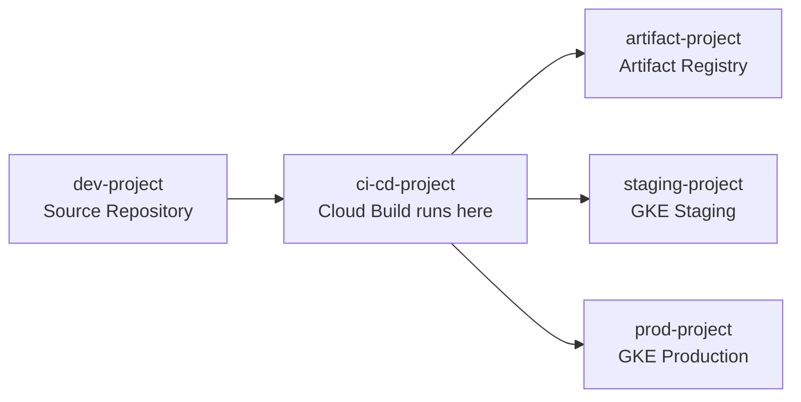

# How to Build a Cross-Project CI/CD Pipeline on GCP Using Cloud Build Triggers and Service Accounts

Author: [nawazdhandala](https://www.github.com/nawazdhandala)

Tags: GCP, Cloud Build, CI/CD, Service Accounts, IAM, Cross-Project, DevOps

Description: Learn how to set up Cloud Build pipelines that span multiple GCP projects using service accounts, IAM bindings, and cross-project triggers for enterprise deployment workflows.

---

Most GCP setups beyond a basic proof of concept involve multiple projects - one for development, one for staging, one for production, maybe separate ones for shared services. Setting up a CI/CD pipeline that works across these project boundaries is something most teams need to figure out eventually, and the IAM configuration can get confusing fast. This guide walks through the entire setup step by step.

## Why Cross-Project Pipelines?

The typical enterprise GCP layout has dedicated projects for different environments and concerns. Your build might run in a CI/CD project, pull source from a dev project, push images to a shared artifact registry, and deploy to staging and production projects. Each boundary crossing requires the right IAM permissions, and getting them wrong usually results in cryptic "permission denied" errors.

## The Architecture

Here is the project layout we are working with:



Cloud Build runs in the `ci-cd-project`. It needs to push container images to the `artifact-project`, and deploy to both `staging-project` and `prod-project`.

## Step 1: Identify the Cloud Build Service Account

Cloud Build uses a default service account or a user-specified one. Let us find the default:

```bash
# Get the Cloud Build default service account for the CI/CD project
PROJECT_NUMBER=$(gcloud projects describe ci-cd-project --format='value(projectNumber)')
echo "Cloud Build SA: ${PROJECT_NUMBER}@cloudbuild.gserviceaccount.com"
```

For production setups, I recommend creating a dedicated service account instead of using the default:

```bash
# Create a dedicated service account for cross-project builds
gcloud iam service-accounts create cross-project-builder \
  --project=ci-cd-project \
  --display-name="Cross-Project Cloud Build SA" \
  --description="Service account for cross-project CI/CD pipelines"
```

## Step 2: Grant Cross-Project Permissions

This is where most teams get stuck. You need to grant the build service account permissions in every target project.

For pushing images to Artifact Registry in another project:

```bash
# Allow the build SA to push images to the artifact project's registry
gcloud projects add-iam-policy-binding artifact-project \
  --member="serviceAccount:cross-project-builder@ci-cd-project.iam.gserviceaccount.com" \
  --role="roles/artifactregistry.writer"

# Allow it to read images too (for base image pulls)
gcloud projects add-iam-policy-binding artifact-project \
  --member="serviceAccount:cross-project-builder@ci-cd-project.iam.gserviceaccount.com" \
  --role="roles/artifactregistry.reader"
```

For deploying to GKE in the staging project:

```bash
# Grant GKE developer role in the staging project
gcloud projects add-iam-policy-binding staging-project \
  --member="serviceAccount:cross-project-builder@ci-cd-project.iam.gserviceaccount.com" \
  --role="roles/container.developer"

# Grant permission to get cluster credentials
gcloud projects add-iam-policy-binding staging-project \
  --member="serviceAccount:cross-project-builder@ci-cd-project.iam.gserviceaccount.com" \
  --role="roles/container.clusterViewer"
```

For deploying to production:

```bash
# Same roles needed in the production project
gcloud projects add-iam-policy-binding prod-project \
  --member="serviceAccount:cross-project-builder@ci-cd-project.iam.gserviceaccount.com" \
  --role="roles/container.developer"

gcloud projects add-iam-policy-binding prod-project \
  --member="serviceAccount:cross-project-builder@ci-cd-project.iam.gserviceaccount.com" \
  --role="roles/container.clusterViewer"
```

## Step 3: Configure Cloud Build with the Custom Service Account

Specify your custom service account in the Cloud Build configuration:

```yaml
# cloudbuild.yaml - Cross-project pipeline configuration
serviceAccount: 'projects/ci-cd-project/serviceAccounts/cross-project-builder@ci-cd-project.iam.gserviceaccount.com'
options:
  logging: CLOUD_LOGGING_ONLY  # Required when using custom SA

steps:
  # Build the container image
  - name: 'gcr.io/cloud-builders/docker'
    args:
      - 'build'
      - '-t'
      - 'us-docker.pkg.dev/artifact-project/my-repo/myapp:${SHORT_SHA}'
      - '.'
    id: 'build'

  # Push to Artifact Registry in the artifact project
  - name: 'gcr.io/cloud-builders/docker'
    args:
      - 'push'
      - 'us-docker.pkg.dev/artifact-project/my-repo/myapp:${SHORT_SHA}'
    waitFor: ['build']
    id: 'push'

  # Deploy to staging GKE cluster
  - name: 'gcr.io/cloud-builders/gke-deploy'
    args:
      - 'run'
      - '--image=us-docker.pkg.dev/artifact-project/my-repo/myapp:${SHORT_SHA}'
      - '--cluster=staging-cluster'
      - '--location=us-central1'
      - '--project=staging-project'
      - '--filename=k8s/staging/'
    waitFor: ['push']
    id: 'deploy-staging'
```

## Step 4: Set Up Cross-Project Triggers

Cloud Build triggers can watch repositories and kick off builds. When using a source repository in a different project, you need additional configuration:

```bash
# Connect the source repository from the dev project
# First, grant the CI/CD project's Cloud Build SA access to the source repo
gcloud projects add-iam-policy-binding dev-project \
  --member="serviceAccount:cross-project-builder@ci-cd-project.iam.gserviceaccount.com" \
  --role="roles/source.reader"

# Create a trigger in the CI/CD project that watches the dev project repo
gcloud builds triggers create cloud-source-repositories \
  --project=ci-cd-project \
  --repo=projects/dev-project/repos/my-app \
  --branch-pattern="^main$" \
  --build-config=cloudbuild.yaml \
  --service-account="projects/ci-cd-project/serviceAccounts/cross-project-builder@ci-cd-project.iam.gserviceaccount.com" \
  --description="Deploy on push to main"
```

For GitHub repositories, use a GitHub trigger instead:

```bash
# Create a GitHub-connected trigger
gcloud builds triggers create github \
  --project=ci-cd-project \
  --repo-name=my-org/my-app \
  --repo-owner=my-org \
  --branch-pattern="^main$" \
  --build-config=cloudbuild.yaml \
  --service-account="projects/ci-cd-project/serviceAccounts/cross-project-builder@ci-cd-project.iam.gserviceaccount.com"
```

## Step 5: Production Deployment with Approval Gates

You probably do not want every commit to automatically deploy to production. Add a manual approval step using a separate trigger:

```yaml
# cloudbuild-prod.yaml - Production deployment with approval
serviceAccount: 'projects/ci-cd-project/serviceAccounts/cross-project-builder@ci-cd-project.iam.gserviceaccount.com'
options:
  logging: CLOUD_LOGGING_ONLY

steps:
  # Verify the image exists in artifact registry
  - name: 'gcr.io/cloud-builders/gcloud'
    args:
      - 'artifacts'
      - 'docker'
      - 'images'
      - 'describe'
      - 'us-docker.pkg.dev/artifact-project/my-repo/myapp:${_IMAGE_TAG}'
    id: 'verify-image'

  # Deploy to production GKE cluster
  - name: 'gcr.io/cloud-builders/gke-deploy'
    args:
      - 'run'
      - '--image=us-docker.pkg.dev/artifact-project/my-repo/myapp:${_IMAGE_TAG}'
      - '--cluster=prod-cluster'
      - '--location=us-central1'
      - '--project=prod-project'
      - '--filename=k8s/production/'
    waitFor: ['verify-image']
    id: 'deploy-prod'

substitutions:
  _IMAGE_TAG: ''  # Passed when trigger is invoked manually
```

Create the trigger with the `--require-approval` flag:

```bash
# Create a manual trigger for production deployments
gcloud builds triggers create manual \
  --project=ci-cd-project \
  --build-config=cloudbuild-prod.yaml \
  --service-account="projects/ci-cd-project/serviceAccounts/cross-project-builder@ci-cd-project.iam.gserviceaccount.com" \
  --require-approval \
  --substitutions="_IMAGE_TAG=" \
  --description="Production deployment - requires approval"
```

## Step 6: Accessing Secrets Across Projects

Your build might need secrets stored in another project. Grant the build service account access to Secret Manager in the target project:

```bash
# Grant access to secrets in the staging and production projects
gcloud projects add-iam-policy-binding staging-project \
  --member="serviceAccount:cross-project-builder@ci-cd-project.iam.gserviceaccount.com" \
  --role="roles/secretmanager.secretAccessor"
```

Reference cross-project secrets in your build config:

```yaml
# Access secrets from another project
availableSecrets:
  secretManager:
    - versionName: projects/staging-project/secrets/db-password/versions/latest
      env: 'STAGING_DB_PASSWORD'

steps:
  - name: 'gcr.io/cloud-builders/gcloud'
    entrypoint: 'bash'
    args:
      - '-c'
      - 'echo "Deploying with staging credentials"'
    secretEnv: ['STAGING_DB_PASSWORD']
```

## Debugging Permission Issues

When something goes wrong (and it will), here is how to debug:

```bash
# Check what roles the service account has in a target project
gcloud projects get-iam-policy staging-project \
  --flatten="bindings[].members" \
  --filter="bindings.members:cross-project-builder@ci-cd-project.iam.gserviceaccount.com" \
  --format="table(bindings.role)"

# Test if the service account can access a specific resource
gcloud iam service-accounts get-iam-policy \
  cross-project-builder@ci-cd-project.iam.gserviceaccount.com
```

## Least Privilege Recommendations

Avoid granting `roles/owner` or `roles/editor` across projects. Use the most specific role possible:

| Action | Recommended Role |
|--------|-----------------|
| Push images | `roles/artifactregistry.writer` |
| Deploy to GKE | `roles/container.developer` |
| Read cluster info | `roles/container.clusterViewer` |
| Access secrets | `roles/secretmanager.secretAccessor` |
| Read source repos | `roles/source.reader` |
| View logs | `roles/logging.viewer` |

## Summary

Cross-project CI/CD pipelines on GCP require careful IAM configuration, but the pattern is consistent: create a dedicated service account, grant it specific roles in each target project, and reference it in your Cloud Build configuration. Starting with a clean service account and adding permissions incrementally is much easier to debug than starting with broad permissions and trying to lock them down later.

The key insight is that Cloud Build itself does not need to know about your project boundaries - it just needs a service account that has the right permissions everywhere it needs to operate. Once that is in place, your cloudbuild.yaml files look the same whether they are deploying within a single project or across ten.
