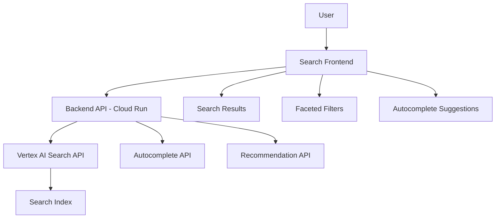

# How to Build a Custom Search Application with Vertex AI Search API

Author: [nawazdhandala](https://www.github.com/nawazdhandala)

Tags: GCP, Vertex AI Search, Search API, Custom Search, Application Development

Description: Build a custom search application using the Vertex AI Search API with features like autocomplete, faceted search, pagination, and personalized ranking.

---

The Vertex AI Search widget is great for quick implementations, but most production applications need more control. You want custom styling, specific result layouts, faceted navigation, autocomplete, and integration with your existing application framework. The Vertex AI Search API gives you full programmatic access to build exactly the search experience your users need.

This guide covers building a complete custom search application from scratch using the Vertex AI Search API, including features that go beyond basic search.

## Architecture



## Prerequisites

- A Vertex AI Search engine with indexed content
- Python 3.9+
- FastAPI for the backend (or your preferred framework)

```bash
pip install google-cloud-discoveryengine fastapi uvicorn
```

## Building the Search Backend

### Search Service Class

Create a reusable service class that wraps the Vertex AI Search API.

```python
# search_service.py
from google.cloud import discoveryengine_v1 as discoveryengine
from typing import Optional

class SearchService:
    """Wrapper around the Vertex AI Search API for custom search applications."""

    def __init__(self, project_id: str, location: str, engine_id: str):
        self.project_id = project_id
        self.location = location
        self.engine_id = engine_id
        self.search_client = discoveryengine.SearchServiceClient()
        self.completion_client = discoveryengine.CompletionServiceClient()

        # Build the serving config path once
        self.serving_config = (
            f"projects/{project_id}/locations/{location}"
            f"/collections/default_collection/engines/{engine_id}"
            f"/servingConfigs/default_search"
        )

    def search(
        self,
        query: str,
        page_size: int = 10,
        offset: int = 0,
        filter_expr: Optional[str] = None,
        order_by: Optional[str] = None,
        boost_spec: Optional[dict] = None,
        facet_specs: Optional[list] = None,
    ) -> dict:
        """Execute a search query with full configuration options."""

        # Build content search spec with snippets and answers
        content_spec = discoveryengine.SearchRequest.ContentSearchSpec(
            snippet_spec=discoveryengine.SearchRequest.ContentSearchSpec.SnippetSpec(
                return_snippet=True,
                max_snippet_count=3,
            ),
            extractive_content_spec=discoveryengine.SearchRequest.ContentSearchSpec.ExtractiveContentSpec(
                max_extractive_answer_count=2,
                max_extractive_segment_count=2,
            ),
            summary_spec=discoveryengine.SearchRequest.ContentSearchSpec.SummarySpec(
                summary_result_count=3,
                include_citations=True,
            ),
        )

        # Build the request
        request = discoveryengine.SearchRequest(
            serving_config=self.serving_config,
            query=query,
            page_size=page_size,
            offset=offset,
            content_search_spec=content_spec,
        )

        # Apply optional filters
        if filter_expr:
            request.filter = filter_expr

        if order_by:
            request.order_by = order_by

        # Apply facet specifications for faceted navigation
        if facet_specs:
            request.facet_specs = [
                discoveryengine.SearchRequest.FacetSpec(
                    facet_key=discoveryengine.SearchRequest.FacetSpec.FacetKey(
                        key=spec["key"],
                    ),
                    limit=spec.get("limit", 10),
                )
                for spec in facet_specs
            ]

        # Execute the search
        response = self.search_client.search(request)

        # Format the response
        return self._format_response(response)

    def autocomplete(self, query: str, max_suggestions: int = 5) -> list:
        """Get autocomplete suggestions for a partial query."""
        data_store_path = (
            f"projects/{self.project_id}/locations/{self.location}"
            f"/collections/default_collection/dataStores/{self.engine_id}"
        )

        request = discoveryengine.CompleteQueryRequest(
            data_store=data_store_path,
            query=query,
            query_model="document-completable",
            max_suggestions=max_suggestions,
        )

        response = self.completion_client.complete_query(request)

        suggestions = []
        for suggestion in response.query_suggestions:
            suggestions.append(suggestion.suggestion)

        return suggestions

    def _format_response(self, response) -> dict:
        """Format the raw API response into a clean structure."""
        results = []
        for result in response.results:
            doc_data = result.document.derived_struct_data

            formatted_result = {
                "id": result.document.id,
                "title": doc_data.get("title", "Untitled"),
                "link": doc_data.get("link", ""),
                "snippets": [],
                "extractive_answers": [],
                "extractive_segments": [],
            }

            # Format snippets
            for snippet in doc_data.get("snippets", []):
                formatted_result["snippets"].append({
                    "text": snippet.get("snippet", ""),
                    "html": snippet.get("snippet_with_html_tag", ""),
                })

            # Format extractive answers
            for answer in doc_data.get("extractive_answers", []):
                formatted_result["extractive_answers"].append({
                    "content": answer.get("content", ""),
                    "page": answer.get("pageNumber"),
                })

            # Format extractive segments
            for segment in doc_data.get("extractive_segments", []):
                formatted_result["extractive_segments"].append({
                    "content": segment.get("content", ""),
                    "page": segment.get("pageNumber"),
                    "score": segment.get("relevanceScore", 0),
                })

            results.append(formatted_result)

        # Format facets
        facets = {}
        for facet_result in response.facets:
            key = facet_result.key
            values = []
            for value in facet_result.values:
                values.append({
                    "value": value.value,
                    "count": value.count,
                })
            facets[key] = values

        # Format summary
        summary = None
        if response.summary and response.summary.summary_text:
            summary = response.summary.summary_text

        return {
            "total_results": response.total_size,
            "results": results,
            "facets": facets,
            "summary": summary,
        }
```

### FastAPI Application

```python
# main.py
from fastapi import FastAPI, Query
from fastapi.middleware.cors import CORSMiddleware
from typing import Optional
from search_service import SearchService

app = FastAPI(title="Custom Search API")

# Allow cross-origin requests from your frontend
app.add_middleware(
    CORSMiddleware,
    allow_origins=["*"],
    allow_methods=["*"],
    allow_headers=["*"],
)

# Initialize the search service
search_service = SearchService(
    project_id="your-project-id",
    location="global",
    engine_id="your-engine-id",
)

@app.get("/api/search")
async def search(
    q: str = Query(..., description="Search query"),
    page: int = Query(1, ge=1, description="Page number"),
    page_size: int = Query(10, ge=1, le=50, description="Results per page"),
    category: Optional[str] = Query(None, description="Filter by category"),
):
    """Search endpoint with pagination and optional filtering."""
    offset = (page - 1) * page_size

    # Build filter expression if category is specified
    filter_expr = None
    if category:
        filter_expr = f'category: ANY("{category}")'

    # Define facets for the sidebar
    facet_specs = [
        {"key": "category", "limit": 10},
        {"key": "content_type", "limit": 5},
    ]

    results = search_service.search(
        query=q,
        page_size=page_size,
        offset=offset,
        filter_expr=filter_expr,
        facet_specs=facet_specs,
    )

    # Add pagination metadata
    total_pages = (results["total_results"] + page_size - 1) // page_size
    results["pagination"] = {
        "current_page": page,
        "page_size": page_size,
        "total_pages": total_pages,
        "has_next": page < total_pages,
        "has_previous": page > 1,
    }

    return results

@app.get("/api/autocomplete")
async def autocomplete(
    q: str = Query(..., min_length=2, description="Partial query for suggestions"),
):
    """Autocomplete endpoint for search-as-you-type functionality."""
    suggestions = search_service.autocomplete(query=q, max_suggestions=5)
    return {"suggestions": suggestions}

@app.get("/api/health")
async def health():
    return {"status": "healthy"}
```

## Implementing Pagination

Pagination is essential for any search application. Here is how to handle it properly with the API.

```python
def paginated_search(search_service: SearchService, query: str, page: int, page_size: int):
    """Execute a paginated search request."""
    offset = (page - 1) * page_size

    results = search_service.search(
        query=query,
        page_size=page_size,
        offset=offset,
    )

    total = results["total_results"]
    total_pages = (total + page_size - 1) // page_size

    return {
        "results": results["results"],
        "pagination": {
            "page": page,
            "page_size": page_size,
            "total_results": total,
            "total_pages": total_pages,
        },
    }

# Get page 3 of results with 10 per page
page_3 = paginated_search(search_service, "deployment guide", page=3, page_size=10)
```

## Implementing Faceted Navigation

Facets let users narrow results by category, type, date range, or any other metadata field.

```python
def search_with_facets(search_service: SearchService, query: str, active_facets: dict = None):
    """Search with faceted navigation support."""
    # Build filter from active facets
    filters = []
    if active_facets:
        for key, value in active_facets.items():
            filters.append(f'{key}: ANY("{value}")')

    filter_expr = " AND ".join(filters) if filters else None

    # Request facet counts
    facet_specs = [
        {"key": "category", "limit": 10},
        {"key": "author", "limit": 10},
        {"key": "year", "limit": 5},
    ]

    results = search_service.search(
        query=query,
        page_size=10,
        filter_expr=filter_expr,
        facet_specs=facet_specs,
    )

    return results

# Search with an active category facet
results = search_with_facets(
    search_service,
    query="getting started",
    active_facets={"category": "tutorials"},
)
```

## Deploying to Cloud Run

```bash
# Build and deploy
gcloud builds submit --tag gcr.io/your-project-id/search-api
gcloud run deploy search-api \
    --image gcr.io/your-project-id/search-api \
    --region us-central1 \
    --memory 512Mi \
    --cpu 1 \
    --min-instances 1 \
    --max-instances 10 \
    --project your-project-id
```

## Summary

Building a custom search application with the Vertex AI Search API gives you full control over the user experience while leveraging Google's search infrastructure for the heavy lifting. The API supports everything you need for a production search application - pagination, faceted navigation, autocomplete, extractive answers, and AI summaries. Wrap the API in a service class for clean code organization, expose it through a REST API, and connect it to your frontend framework of choice. The result is a search experience that matches your brand and integrates naturally with the rest of your application.
