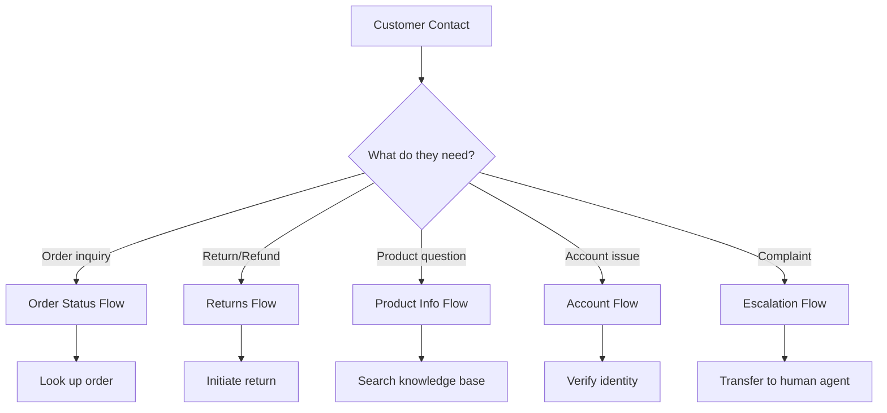

# How to Build a Customer Service Agent with Vertex AI Agent Builder and Dialogflow CX

Author: [nawazdhandala](https://www.github.com/nawazdhandala)

Tags: GCP, Vertex AI, Dialogflow CX, Customer Service, Agent Builder

Description: Build a production customer service agent using Vertex AI Agent Builder and Dialogflow CX with intent handling, entity extraction, and handoff capabilities.

---

Customer service is one of the most impactful use cases for AI agents. Customers want quick answers, and support teams want to handle volume without burning out. Vertex AI Agent Builder combined with Dialogflow CX gives you a platform for building customer service agents that handle common inquiries automatically, escalate complex issues to human agents, and maintain natural conversations throughout.

This guide covers building a complete customer service agent from the ground up, including conversation design, entity extraction, fulfillment logic, and human handoff.

## Designing the Customer Service Agent

Before writing code, map out what your agent needs to handle. For a typical e-commerce support scenario:



## Prerequisites

- Google Cloud project with Dialogflow CX API enabled
- Python 3.9+

```bash
# Enable required APIs
gcloud services enable dialogflow.googleapis.com --project=your-project-id

# Install the SDK
pip install google-cloud-dialogflow-cx
```

## Step 1: Create the Agent

```python
from google.cloud.dialogflowcx_v3 import AgentsClient, Agent

def create_customer_service_agent(project_id: str, location: str):
    """Create a Dialogflow CX agent for customer service."""
    client = AgentsClient()
    parent = f"projects/{project_id}/locations/{location}"

    agent = Agent(
        display_name="Customer Service Agent",
        default_language_code="en",
        time_zone="America/New_York",
        description="AI-powered customer service agent for handling order inquiries, returns, and general support",
        enable_stackdriver_logging=True,
        speech_to_text_settings=Agent.SpeechToTextSettings(
            enable_speech_adaptation=True,
        ),
    )

    created_agent = client.create_agent(parent=parent, agent=agent)
    print(f"Agent created: {created_agent.name}")
    return created_agent

agent = create_customer_service_agent("your-project-id", "us-central1")
```

## Step 2: Define Entity Types

Entity types let the agent extract structured information from user messages.

```python
from google.cloud.dialogflowcx_v3 import EntityTypesClient, EntityType

def create_entity_types(agent_name: str):
    """Create entity types for extracting order IDs, product names, etc."""
    client = EntityTypesClient()

    # Order ID entity - matches patterns like ORD-12345
    order_entity = EntityType(
        display_name="order_id",
        kind=EntityType.Kind.KIND_REGEXP,
        entities=[
            EntityType.Entity(
                value="order_id",
                synonyms=["ORD-[0-9]{5,}", "[A-Z]{2,3}-[0-9]{4,}"],
            ),
        ],
    )

    created = client.create_entity_type(parent=agent_name, entity_type=order_entity)
    print(f"Entity type created: {created.display_name}")

    # Priority level entity
    priority_entity = EntityType(
        display_name="priority_level",
        kind=EntityType.Kind.KIND_MAP,
        entities=[
            EntityType.Entity(value="urgent", synonyms=["urgent", "emergency", "critical", "asap"]),
            EntityType.Entity(value="high", synonyms=["high", "important", "priority"]),
            EntityType.Entity(value="medium", synonyms=["medium", "normal", "standard"]),
            EntityType.Entity(value="low", synonyms=["low", "minor", "when you can"]),
        ],
    )

    created = client.create_entity_type(parent=agent_name, entity_type=priority_entity)
    print(f"Entity type created: {created.display_name}")

create_entity_types(agent.name)
```

## Step 3: Create Intents

```python
from google.cloud.dialogflowcx_v3 import IntentsClient, Intent

def create_service_intents(agent_name: str):
    """Create intents for common customer service requests."""
    client = IntentsClient()

    intents = {
        "order.status": [
            "Where is my order?",
            "Check order status",
            "Track my order ORD-12345",
            "Has my package shipped?",
            "When will my order arrive?",
            "I want to know about order ORD-98765",
            "Can you track my delivery?",
            "What is the status of my recent order?",
        ],
        "return.request": [
            "I want to return an item",
            "How do I return something?",
            "I need to send this back",
            "Start a return for order ORD-12345",
            "Can I get a refund?",
            "I want my money back",
            "This product is defective and I want to return it",
            "Process a return please",
        ],
        "account.password_reset": [
            "I forgot my password",
            "Reset my password",
            "I cannot log in to my account",
            "Help me recover my account",
            "My password is not working",
            "How do I change my password?",
        ],
        "escalate.human": [
            "I want to speak to a person",
            "Transfer me to a human",
            "Let me talk to a real person",
            "I need a manager",
            "This is not helping, get me a human agent",
            "I want to speak to someone",
        ],
        "greeting": [
            "Hi",
            "Hello",
            "Hey there",
            "Good morning",
            "I need help",
            "Can you help me?",
        ],
    }

    created_intents = {}
    for intent_name, phrases in intents.items():
        training_phrases = [
            Intent.TrainingPhrase(
                parts=[Intent.TrainingPhrase.Part(text=phrase)],
                repeat_count=1,
            )
            for phrase in phrases
        ]

        intent = Intent(
            display_name=intent_name,
            training_phrases=training_phrases,
        )

        created = client.create_intent(parent=agent_name, intent=intent)
        created_intents[intent_name] = created
        print(f"Intent created: {created.display_name}")

    return created_intents

intents = create_service_intents(agent.name)
```

## Step 4: Build Conversation Flows

### Order Status Flow

```python
from google.cloud.dialogflowcx_v3 import (
    FlowsClient, Flow, PagesClient, Page,
    Fulfillment, ResponseMessage,
)

def create_order_status_flow(agent_name: str):
    """Create the order status inquiry flow."""
    flow_client = FlowsClient()

    # Create the flow
    flow = Flow(
        display_name="Order Status",
        description="Handles order tracking and status inquiries",
    )

    created_flow = flow_client.create_flow(parent=agent_name, flow=flow)
    print(f"Flow created: {created_flow.display_name}")

    # Create pages within the flow
    page_client = PagesClient()

    # Page 1: Collect order ID
    collect_order_page = Page(
        display_name="Collect Order ID",
        entry_fulfillment=Fulfillment(
            messages=[
                ResponseMessage(
                    text=ResponseMessage.Text(
                        text=["I would be happy to help you check your order status. Could you please provide your order ID? It usually starts with ORD- followed by numbers."]
                    )
                )
            ]
        ),
    )

    page_client.create_page(parent=created_flow.name, page=collect_order_page)

    # Page 2: Look up and display status
    display_status_page = Page(
        display_name="Display Order Status",
        entry_fulfillment=Fulfillment(
            messages=[
                ResponseMessage(
                    text=ResponseMessage.Text(
                        text=["Let me look that up for you..."]
                    )
                )
            ],
            # In production, this would call your webhook for order lookup
            tag="order_lookup",
        ),
    )

    page_client.create_page(parent=created_flow.name, page=display_status_page)

    return created_flow
```

## Step 5: Implement Webhooks for Fulfillment

Webhooks let the agent call your backend services to look up data and perform actions.

```python
# webhook.py - Cloud Function or Cloud Run service for agent fulfillment
from flask import Flask, request, jsonify

app = Flask(__name__)

@app.route("/webhook", methods=["POST"])
def handle_webhook():
    """Handle Dialogflow CX webhook requests."""
    req = request.get_json()

    # Extract the fulfillment tag to determine which action to take
    tag = req.get("fulfillmentInfo", {}).get("tag", "")

    if tag == "order_lookup":
        return handle_order_lookup(req)
    elif tag == "initiate_return":
        return handle_return(req)
    elif tag == "human_handoff":
        return handle_escalation(req)
    else:
        return jsonify({"fulfillmentResponse": {
            "messages": [{"text": {"text": ["I am not sure how to help with that. Let me connect you with a team member."]}}]
        }})

def handle_order_lookup(req):
    """Look up order status from the backend."""
    # Extract order ID from session parameters
    params = req.get("sessionInfo", {}).get("parameters", {})
    order_id = params.get("order_id", "unknown")

    # In production, call your actual order management system
    # For this example, return a mock response
    order_data = {
        "status": "shipped",
        "tracking": "1Z999AA10123456784",
        "estimated_delivery": "February 20, 2026",
        "carrier": "UPS",
    }

    response_text = (
        f"I found your order {order_id}. Here is the status:\n\n"
        f"Status: {order_data['status'].title()}\n"
        f"Carrier: {order_data['carrier']}\n"
        f"Tracking: {order_data['tracking']}\n"
        f"Estimated delivery: {order_data['estimated_delivery']}\n\n"
        f"Is there anything else I can help you with?"
    )

    return jsonify({
        "fulfillmentResponse": {
            "messages": [{"text": {"text": [response_text]}}]
        },
        "sessionInfo": {
            "parameters": {
                "order_status": order_data["status"],
                "tracking_number": order_data["tracking"],
            }
        },
    })

def handle_return(req):
    """Process a return request."""
    params = req.get("sessionInfo", {}).get("parameters", {})
    order_id = params.get("order_id", "unknown")

    response_text = (
        f"I have started a return for order {order_id}. "
        f"You will receive an email with a prepaid return label within 24 hours. "
        f"Once we receive the returned item, your refund will be processed within 5-7 business days."
    )

    return jsonify({
        "fulfillmentResponse": {
            "messages": [{"text": {"text": [response_text]}}]
        }
    })

def handle_escalation(req):
    """Hand off to a human agent."""
    return jsonify({
        "fulfillmentResponse": {
            "messages": [{"text": {"text": [
                "I understand you would like to speak with a human agent. "
                "Let me transfer you now. Your wait time is approximately 3 minutes. "
                "A support representative will have access to our conversation history."
            ]}}]
        },
        "targetPage": "projects/your-project/locations/us-central1/agents/your-agent/flows/main/pages/human_handoff",
    })

if __name__ == "__main__":
    app.run(port=8080)
```

## Step 6: Testing the Agent

```python
from google.cloud.dialogflowcx_v3 import SessionsClient, TextInput, QueryInput
import uuid

def test_conversation(project_id: str, location: str, agent_id: str, messages: list):
    """Run a test conversation with the agent."""
    client = SessionsClient()
    session_id = str(uuid.uuid4())
    session_path = f"projects/{project_id}/locations/{location}/agents/{agent_id}/sessions/{session_id}"

    print(f"Starting test conversation (session: {session_id[:8]}...)")
    print("=" * 50)

    for message in messages:
        text_input = TextInput(text=message)
        query_input = QueryInput(text=text_input, language_code="en")

        response = client.detect_intent(
            session=session_path,
            query_input=query_input,
        )

        print(f"\nCustomer: {message}")

        for msg in response.query_result.response_messages:
            if msg.text:
                for text in msg.text.text:
                    print(f"Agent: {text}")

        # Show detected intent
        intent = response.query_result.intent
        if intent:
            print(f"  [Intent: {intent.display_name}]")

# Run a test conversation
test_conversation(
    project_id="your-project-id",
    location="us-central1",
    agent_id="your-agent-id",
    messages=[
        "Hi, I need help with my order",
        "My order number is ORD-54321",
        "Actually, I want to return it",
        "The product arrived damaged",
        "Thanks for your help",
    ],
)
```

## Step 7: Human Agent Handoff

Configure smooth transitions to human agents for cases the AI cannot handle.

```python
def configure_human_handoff(agent_name: str):
    """Set up human handoff integration."""
    # The handoff configuration depends on your contact center platform
    # Common integrations: Genesys, NICE, Five9, or custom solutions

    handoff_config = {
        "triggers": [
            "Customer explicitly requests human agent",
            "Agent fails to resolve after 3 attempts",
            "Sentiment detected as very negative",
            "Issue involves billing dispute over $100",
        ],
        "context_passed": [
            "Full conversation transcript",
            "Detected intent and entities",
            "Customer ID and account details",
            "Issue category and priority",
        ],
    }

    print("Human handoff configured with triggers:")
    for trigger in handoff_config["triggers"]:
        print(f"  - {trigger}")

    return handoff_config
```

## Monitoring and Improving

Track these metrics to continuously improve your agent:

- **Containment rate**: Percentage of conversations resolved without human intervention
- **Average handle time**: How long conversations take
- **Intent detection accuracy**: How often the agent correctly identifies what the user wants
- **Customer satisfaction**: Post-conversation surveys
- **Escalation rate**: How often users request human agents

## Summary

Building a customer service agent with Vertex AI Agent Builder and Dialogflow CX gives you a structured, production-ready platform. The key is thoughtful conversation design - map out your flows before coding, define clear intents with diverse training phrases, and implement reliable webhooks for backend integration. Start with the most common customer requests (usually order status and returns), measure the containment rate, and expand the agent's capabilities based on what users actually ask for. Always provide a clean path to human agents for issues the AI should not handle on its own.
