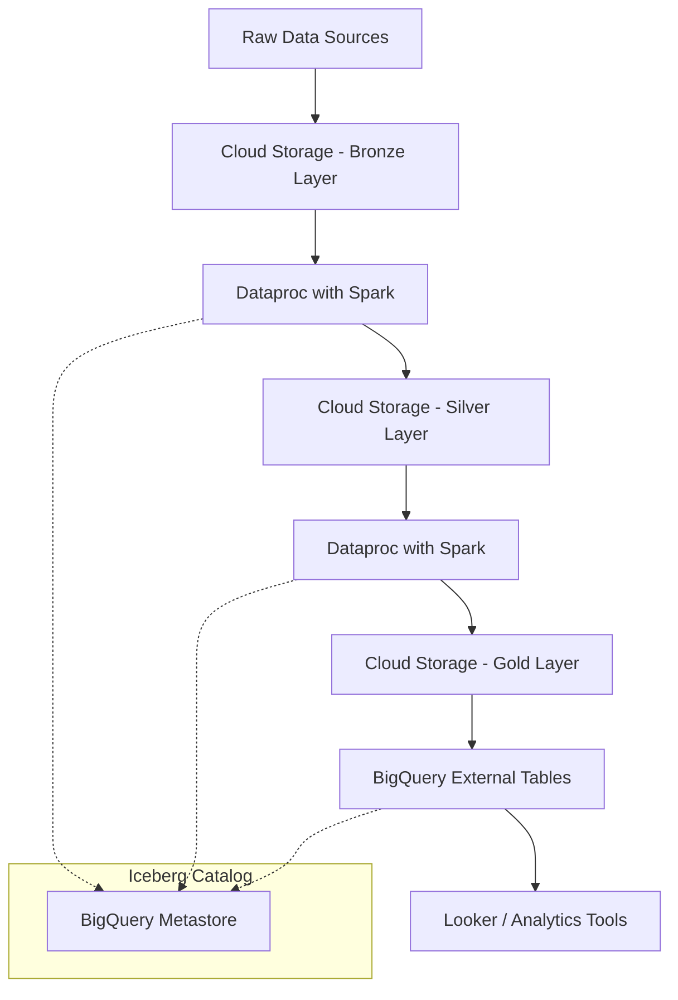

# How to Build a Data Lakehouse Architecture on GCP Using Cloud Storage Dataproc and BigQuery

Author: [nawazdhandala](https://www.github.com/nawazdhandala)

Tags: GCP, Data Lakehouse, Cloud Storage, Dataproc, BigQuery, Apache Iceberg, Data Engineering

Description: A practical guide to building a data lakehouse on GCP that combines the flexibility of a data lake with the performance of a data warehouse using Cloud Storage, Dataproc, and BigQuery.

---

The data lakehouse concept has been gaining traction because it addresses the core frustration of maintaining two separate systems - a data lake for raw storage and a data warehouse for analytics. On GCP, you can build a lakehouse by combining Cloud Storage as the storage layer, Dataproc for processing, and BigQuery for query and analytics. This guide walks through the architecture and implementation.

## What Makes a Lakehouse Different

A traditional data lake stores everything in open formats but lacks the performance and governance features of a warehouse. A data warehouse gives you great query performance but locks you into a proprietary format and can get expensive for large datasets. A lakehouse aims to give you both: open file formats on cheap object storage with ACID transactions, schema enforcement, and fast query performance.

The secret ingredient is a table format like Apache Iceberg, Delta Lake, or Apache Hudi that sits on top of your Parquet files and provides the warehouse-like features.

## The Architecture



## Step 1: Set Up Cloud Storage Buckets

Create separate buckets for each layer of the lakehouse:

```bash
# Create buckets for each data layer
gcloud storage buckets create gs://myproject-lakehouse-bronze \
  --location=us-central1 \
  --uniform-bucket-level-access

gcloud storage buckets create gs://myproject-lakehouse-silver \
  --location=us-central1 \
  --uniform-bucket-level-access

gcloud storage buckets create gs://myproject-lakehouse-gold \
  --location=us-central1 \
  --uniform-bucket-level-access

# Set lifecycle rules to move old data to cheaper storage classes
gcloud storage buckets update gs://myproject-lakehouse-bronze \
  --lifecycle-file=lifecycle-rules.json
```

The lifecycle configuration to move old data to nearline storage:

```json
{
  "rule": [
    {
      "action": {
        "type": "SetStorageClass",
        "storageClass": "NEARLINE"
      },
      "condition": {
        "age": 90,
        "matchesPrefix": ["raw/"]
      }
    }
  ]
}
```

## Step 2: Create a Dataproc Cluster with Iceberg Support

Create a Dataproc cluster that has Apache Iceberg libraries pre-installed:

```bash
# Create a Dataproc cluster with Iceberg and BigQuery connector
gcloud dataproc clusters create lakehouse-cluster \
  --region=us-central1 \
  --zone=us-central1-a \
  --master-machine-type=n2-standard-4 \
  --worker-machine-type=n2-standard-4 \
  --num-workers=4 \
  --image-version=2.2-debian12 \
  --optional-components=JUPYTER \
  --properties="spark:spark.jars.packages=org.apache.iceberg:iceberg-spark-runtime-3.5_2.12:1.4.3,spark:spark.sql.extensions=org.apache.iceberg.spark.extensions.IcebergSparkSessionExtensions,spark:spark.sql.catalog.lakehouse=org.apache.iceberg.spark.SparkCatalog,spark:spark.sql.catalog.lakehouse.type=hadoop,spark:spark.sql.catalog.lakehouse.warehouse=gs://myproject-lakehouse-silver/iceberg" \
  --enable-component-gateway
```

## Step 3: Ingest Raw Data to the Bronze Layer

The bronze layer holds raw data exactly as it arrives from source systems. Here is a PySpark job that ingests data:

```python
# bronze_ingestion.py - Ingest raw data into the bronze layer
from pyspark.sql import SparkSession
from pyspark.sql.functions import current_timestamp, input_file_name, lit
from datetime import datetime

# Initialize Spark session with Iceberg support
spark = SparkSession.builder \
    .appName("BronzeIngestion") \
    .config("spark.sql.catalog.lakehouse", "org.apache.iceberg.spark.SparkCatalog") \
    .config("spark.sql.catalog.lakehouse.type", "hadoop") \
    .config("spark.sql.catalog.lakehouse.warehouse", "gs://myproject-lakehouse-bronze/iceberg") \
    .getOrCreate()

# Read raw CSV files from the landing zone
raw_orders = spark.read \
    .option("header", "true") \
    .option("inferSchema", "true") \
    .csv("gs://myproject-lakehouse-bronze/landing/orders/")

# Add metadata columns for lineage tracking
bronze_orders = raw_orders \
    .withColumn("_ingested_at", current_timestamp()) \
    .withColumn("_source_file", input_file_name()) \
    .withColumn("_batch_id", lit(datetime.now().strftime("%Y%m%d_%H%M%S")))

# Write to Iceberg table in the bronze layer
bronze_orders.writeTo("lakehouse.bronze.orders") \
    .using("iceberg") \
    .tableProperty("write.format.default", "parquet") \
    .tableProperty("write.parquet.compression-codec", "snappy") \
    .createOrReplace()

print(f"Ingested {bronze_orders.count()} records to bronze layer")
spark.stop()
```

## Step 4: Transform Data in the Silver Layer

The silver layer contains cleaned, validated, and standardized data. This is where you handle data quality issues:

```python
# silver_transform.py - Clean and transform data for the silver layer
from pyspark.sql import SparkSession
from pyspark.sql.functions import (
    col, when, trim, lower, to_date, current_timestamp
)

spark = SparkSession.builder \
    .appName("SilverTransformation") \
    .config("spark.sql.catalog.lakehouse", "org.apache.iceberg.spark.SparkCatalog") \
    .config("spark.sql.catalog.lakehouse.type", "hadoop") \
    .config("spark.sql.catalog.lakehouse.warehouse", "gs://myproject-lakehouse-silver/iceberg") \
    .getOrCreate()

# Read from the bronze Iceberg table
bronze_orders = spark.read.format("iceberg") \
    .load("gs://myproject-lakehouse-bronze/iceberg/bronze/orders")

# Apply cleaning transformations
silver_orders = bronze_orders \
    .filter(col("order_id").isNotNull()) \
    .filter(col("total_amount") > 0) \
    .withColumn("customer_email", lower(trim(col("customer_email")))) \
    .withColumn("order_date", to_date(col("order_date"), "yyyy-MM-dd")) \
    .withColumn("status", when(col("status").isNull(), "unknown")
                .otherwise(lower(trim(col("status"))))) \
    .withColumn("_transformed_at", current_timestamp()) \
    .dropDuplicates(["order_id"])

# Write to the silver Iceberg table using MERGE for idempotency
silver_orders.createOrReplaceTempView("updates")

spark.sql("""
    MERGE INTO lakehouse.silver.orders AS target
    USING updates AS source
    ON target.order_id = source.order_id
    WHEN MATCHED THEN
        UPDATE SET *
    WHEN NOT MATCHED THEN
        INSERT *
""")

print(f"Processed {silver_orders.count()} records to silver layer")
spark.stop()
```

## Step 5: Build the Gold Layer for Analytics

The gold layer contains business-level aggregates optimized for specific use cases:

```python
# gold_aggregation.py - Create business-ready aggregated tables
from pyspark.sql import SparkSession
from pyspark.sql.functions import (
    col, sum as _sum, count, avg, max as _max, min as _min,
    date_trunc, current_timestamp
)

spark = SparkSession.builder \
    .appName("GoldAggregation") \
    .config("spark.sql.catalog.lakehouse", "org.apache.iceberg.spark.SparkCatalog") \
    .config("spark.sql.catalog.lakehouse.type", "hadoop") \
    .config("spark.sql.catalog.lakehouse.warehouse", "gs://myproject-lakehouse-gold/iceberg") \
    .getOrCreate()

# Read from silver layer
silver_orders = spark.read.format("iceberg") \
    .load("gs://myproject-lakehouse-silver/iceberg/silver/orders")

# Create daily order summary - a common gold layer table
daily_summary = silver_orders \
    .groupBy(date_trunc("day", col("order_date")).alias("date")) \
    .agg(
        count("order_id").alias("total_orders"),
        _sum("total_amount").alias("total_revenue"),
        avg("total_amount").alias("avg_order_value"),
        _max("total_amount").alias("max_order_value"),
        _min("total_amount").alias("min_order_value"),
        count(when(col("status") == "completed", 1)).alias("completed_orders"),
        count(when(col("status") == "cancelled", 1)).alias("cancelled_orders")
    ) \
    .withColumn("_computed_at", current_timestamp())

# Write the gold table
daily_summary.writeTo("lakehouse.gold.daily_order_summary") \
    .using("iceberg") \
    .tableProperty("write.format.default", "parquet") \
    .partitionedBy(col("date")) \
    .createOrReplace()

print("Gold layer aggregation complete")
spark.stop()
```

## Step 6: Connect BigQuery to the Lakehouse

BigQuery can query Iceberg tables directly through BigLake, giving you the power of BigQuery's SQL engine on your lakehouse data:

```sql
-- Create an external connection for BigLake
-- Run this in the BigQuery console or bq CLI

-- First, create a BigLake connection
-- (done via gcloud, shown in bash below)
```

```bash
# Create a BigLake connection
bq mk --connection \
  --connection_type=CLOUD_RESOURCE \
  --location=us-central1 \
  lakehouse-connection

# Get the service account created for the connection
bq show --connection --location=us-central1 lakehouse-connection

# Grant the connection's service account access to Cloud Storage
gsutil iam ch serviceAccount:<connection-sa>:objectViewer \
  gs://myproject-lakehouse-gold
```

Now create BigQuery external tables pointing to your Iceberg data:

```sql
-- Create a BigLake table over the gold layer Iceberg data
CREATE OR REPLACE EXTERNAL TABLE `my-project.lakehouse.daily_order_summary`
WITH CONNECTION `us-central1.lakehouse-connection`
OPTIONS (
  format = 'ICEBERG',
  uris = ['gs://myproject-lakehouse-gold/iceberg/gold/daily_order_summary/metadata/v1.metadata.json']
);

-- Now you can query it with standard SQL
SELECT
  date,
  total_orders,
  total_revenue,
  avg_order_value
FROM `my-project.lakehouse.daily_order_summary`
WHERE date >= DATE_SUB(CURRENT_DATE(), INTERVAL 30 DAY)
ORDER BY date DESC;
```

## Step 7: Orchestrate with Cloud Composer

Tie everything together with an Airflow DAG:

```python
# lakehouse_dag.py - Orchestrates the full lakehouse pipeline
from airflow import DAG
from airflow.providers.google.cloud.operators.dataproc import (
    DataprocSubmitPySpark JobOperator,
)
from airflow.utils.dates import days_ago

# Define the DAG
dag = DAG(
    "lakehouse_pipeline",
    schedule_interval="0 2 * * *",  # Run daily at 2 AM
    start_date=days_ago(1),
    catchup=False,
)

# Bronze ingestion step
bronze_task = DataprocSubmitPySparkJobOperator(
    task_id="bronze_ingestion",
    main="gs://myproject-lakehouse-scripts/bronze_ingestion.py",
    cluster_name="lakehouse-cluster",
    region="us-central1",
    dag=dag,
)

# Silver transformation step
silver_task = DataprocSubmitPySparkJobOperator(
    task_id="silver_transform",
    main="gs://myproject-lakehouse-scripts/silver_transform.py",
    cluster_name="lakehouse-cluster",
    region="us-central1",
    dag=dag,
)

# Gold aggregation step
gold_task = DataprocSubmitPySparkJobOperator(
    task_id="gold_aggregation",
    main="gs://myproject-lakehouse-scripts/gold_aggregation.py",
    cluster_name="lakehouse-cluster",
    region="us-central1",
    dag=dag,
)

# Define task dependencies
bronze_task >> silver_task >> gold_task
```

## Cost Optimization Tips

1. Use Dataproc Serverless for intermittent workloads instead of maintaining a long-running cluster. You pay only for the compute time you actually use.

2. Partition your Iceberg tables by date. This dramatically reduces the amount of data scanned for time-range queries.

3. Compact small files periodically. Many small Parquet files are slower to read than fewer large ones. Iceberg's compaction feature handles this.

4. Use Cloud Storage lifecycle policies to move older data to cheaper storage classes. Data in the bronze layer older than 90 days rarely gets accessed at full speed.

5. Consider BigQuery BI Engine for frequently accessed gold layer tables. It caches query results in memory for sub-second response times.

The lakehouse pattern on GCP gives you the best of both worlds - cheap, scalable storage in open formats combined with the query performance of BigQuery. The key is choosing the right table format (Iceberg is my recommendation for GCP) and being disciplined about your bronze-silver-gold layer boundaries.
