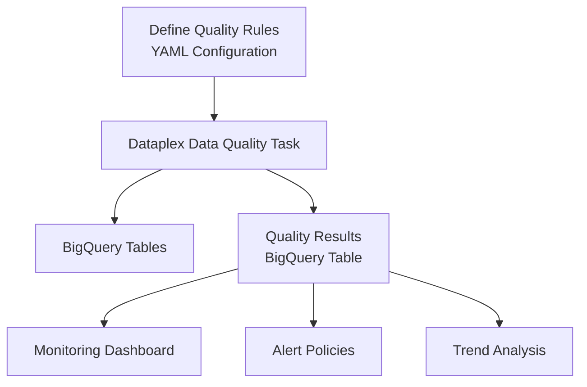

# How to Build a Data Quality Monitoring Framework on BigQuery Using Dataplex Data Quality Tasks

Author: [nawazdhandala](https://www.github.com/nawazdhandala)

Tags: GCP, Dataplex, BigQuery, Data Quality, Data Governance, Monitoring

Description: Learn how to build a comprehensive data quality monitoring framework for BigQuery tables using Dataplex Data Quality Tasks with automated checks, alerting, and dashboards.

---

Bad data is worse than no data because it leads to wrong decisions made with confidence. If you are running analytics on BigQuery, you need automated data quality checks that catch issues before they reach your dashboards and reports. Dataplex Data Quality Tasks provide a managed way to define, run, and monitor these checks. Here is how to build a complete data quality framework on top of it.

## What Dataplex Data Quality Tasks Offer

Dataplex Data Quality Tasks let you define rules against your BigQuery tables and run them on a schedule. Each rule checks a specific aspect of your data - completeness, uniqueness, freshness, validity, or custom business logic. Results are stored in BigQuery so you can build dashboards and set up alerts.



## Step 1: Enable Dataplex and Set Up the Environment

```bash
# Enable the Dataplex API
gcloud services enable dataplex.googleapis.com

# Create a Dataplex lake for organizing data quality assets
gcloud dataplex lakes create analytics-lake \
  --location=us-central1 \
  --display-name="Analytics Data Lake" \
  --description="Central lake for data quality management"

# Create a zone within the lake for curated data
gcloud dataplex zones create curated-zone \
  --lake=analytics-lake \
  --location=us-central1 \
  --resource-location-type=SINGLE_REGION \
  --type=CURATED \
  --display-name="Curated Data Zone"
```

## Step 2: Define Data Quality Rules

Create a YAML file that defines quality rules for your tables:

```yaml
# dq_rules/orders_quality.yaml - Data quality rules for the orders table
metadata_registry_defaults:
  dataplex:
    projects: my-project
    locations: us-central1
    lakes: analytics-lake
    zones: curated-zone

row_filters:
  RECENT_DATA: "order_date >= DATE_SUB(CURRENT_DATE(), INTERVAL 7 DAY)"
  TODAY_ONLY: "order_date = CURRENT_DATE()"

rule_dimensions:
  - consistency
  - correctness
  - completeness
  - uniqueness
  - timeliness

rules:
  # Completeness checks - are required fields populated?
  NOT_NULL_ORDER_ID:
    rule_type: NOT_NULL
    dimension: completeness
    params:
      custom_sql_expr: order_id IS NOT NULL

  NOT_NULL_CUSTOMER_ID:
    rule_type: NOT_NULL
    dimension: completeness
    params:
      custom_sql_expr: customer_id IS NOT NULL

  NOT_NULL_ORDER_DATE:
    rule_type: NOT_NULL
    dimension: completeness
    params:
      custom_sql_expr: order_date IS NOT NULL

  # Uniqueness checks - no duplicate records
  UNIQUE_ORDER_ID:
    rule_type: UNIQUENESS
    dimension: uniqueness
    params:
      custom_sql_expr: order_id

  # Correctness checks - values are within expected ranges
  POSITIVE_AMOUNT:
    rule_type: CUSTOM_SQL_EXPR
    dimension: correctness
    params:
      custom_sql_expr: total_amount > 0

  VALID_STATUS:
    rule_type: CUSTOM_SQL_EXPR
    dimension: correctness
    params:
      custom_sql_expr: >
        status IN ('pending', 'confirmed', 'shipped', 'delivered', 'cancelled')

  REASONABLE_AMOUNT:
    rule_type: CUSTOM_SQL_EXPR
    dimension: correctness
    params:
      custom_sql_expr: total_amount < 100000

  # Consistency checks - referential integrity
  VALID_CUSTOMER_REF:
    rule_type: CUSTOM_SQL_STATEMENT
    dimension: consistency
    params:
      custom_sql_statement: >
        SELECT COUNT(*) AS num_rows
        FROM `my-project.silver.orders` o
        LEFT JOIN `my-project.silver.customers` c ON o.customer_id = c.customer_id
        WHERE c.customer_id IS NULL
          AND o.order_date >= DATE_SUB(CURRENT_DATE(), INTERVAL 1 DAY)

  # Timeliness checks - data is fresh
  DATA_FRESHNESS:
    rule_type: CUSTOM_SQL_EXPR
    dimension: timeliness
    params:
      custom_sql_expr: >
        TIMESTAMP_DIFF(CURRENT_TIMESTAMP(), _processed_at, HOUR) < 2

rule_bindings:
  ORDERS_QUALITY:
    entity_uri: bigquery://projects/my-project/datasets/silver/tables/orders
    column_id: order_id
    row_filter_id: RECENT_DATA
    rule_ids:
      - NOT_NULL_ORDER_ID
      - NOT_NULL_CUSTOMER_ID
      - NOT_NULL_ORDER_DATE
      - UNIQUE_ORDER_ID
      - POSITIVE_AMOUNT
      - VALID_STATUS
      - REASONABLE_AMOUNT
      - VALID_CUSTOMER_REF
      - DATA_FRESHNESS
```

## Step 3: Create the Data Quality Task

```bash
# Create a BigQuery dataset to store quality results
bq mk --dataset \
  --location=us-central1 \
  --description="Data quality monitoring results" \
  my-project:data_quality

# Upload the rules file to Cloud Storage
gsutil cp dq_rules/orders_quality.yaml gs://my-project-dq-rules/orders_quality.yaml

# Create the Dataplex data quality task
gcloud dataplex tasks create orders-quality-check \
  --location=us-central1 \
  --lake=analytics-lake \
  --trigger-type=RECURRING \
  --trigger-schedule="0 */2 * * *" \
  --execution-service-account=dataplex-dq@my-project.iam.gserviceaccount.com \
  --spark-main-class="com.google.cloud.dataplex.templates.dataqualitycheck.DataQualityCheck" \
  --spark-file-uris="gs://my-project-dq-rules/orders_quality.yaml" \
  --execution-args="^::^TASK_ARGS=--gcs_path=gs://my-project-dq-rules/orders_quality.yaml,--target_bigquery_summary_table=my-project.data_quality.dq_summary"
```

## Step 4: Build Quality Rules for Multiple Tables

Scale your framework by creating rules for all your important tables:

```yaml
# dq_rules/customers_quality.yaml - Quality rules for the customers table
rules:
  VALID_EMAIL:
    rule_type: CUSTOM_SQL_EXPR
    dimension: correctness
    params:
      custom_sql_expr: >
        REGEXP_CONTAINS(email, r'^[a-zA-Z0-9._%+-]+@[a-zA-Z0-9.-]+\.[a-zA-Z]{2,}$')

  NOT_NULL_EMAIL:
    rule_type: NOT_NULL
    dimension: completeness
    params:
      custom_sql_expr: email IS NOT NULL

  UNIQUE_EMAIL:
    rule_type: UNIQUENESS
    dimension: uniqueness
    params:
      custom_sql_expr: email

  VALID_CREATED_DATE:
    rule_type: CUSTOM_SQL_EXPR
    dimension: correctness
    params:
      custom_sql_expr: >
        created_at <= CURRENT_TIMESTAMP()
        AND created_at >= TIMESTAMP('2020-01-01')

rule_bindings:
  CUSTOMERS_QUALITY:
    entity_uri: bigquery://projects/my-project/datasets/silver/tables/customers
    column_id: customer_id
    row_filter_id: ALL_DATA
    rule_ids:
      - VALID_EMAIL
      - NOT_NULL_EMAIL
      - UNIQUE_EMAIL
      - VALID_CREATED_DATE
```

## Step 5: Query Quality Results

Dataplex writes quality check results to the BigQuery table you specified. Query them to understand your data quality posture:

```sql
-- View the latest quality check results
SELECT
  rule_binding_id,
  rule_id,
  dimension,
  table_id,
  column_id,
  rows_validated,
  success_count,
  failed_count,
  SAFE_DIVIDE(success_count, rows_validated) * 100 AS pass_rate_pct,
  execution_ts
FROM `my-project.data_quality.dq_summary`
WHERE execution_ts = (
  SELECT MAX(execution_ts)
  FROM `my-project.data_quality.dq_summary`
)
ORDER BY pass_rate_pct ASC;
```

Build a trend view to track quality over time:

```sql
-- Track quality trends over the past 30 days
CREATE OR REPLACE VIEW `my-project.data_quality.quality_trends` AS
SELECT
  DATE(execution_ts) AS check_date,
  table_id,
  dimension,
  COUNT(*) AS total_rules,
  COUNTIF(SAFE_DIVIDE(success_count, rows_validated) >= 0.99) AS passing_rules,
  AVG(SAFE_DIVIDE(success_count, rows_validated)) * 100 AS avg_pass_rate,
  MIN(SAFE_DIVIDE(success_count, rows_validated)) * 100 AS min_pass_rate
FROM `my-project.data_quality.dq_summary`
WHERE execution_ts >= TIMESTAMP_SUB(CURRENT_TIMESTAMP(), INTERVAL 30 DAY)
GROUP BY 1, 2, 3
ORDER BY check_date DESC, avg_pass_rate ASC;
```

## Step 6: Set Up Alerting

Create Cloud Monitoring alerts that fire when quality checks fail:

```python
# dq_alerting.py - Cloud Function triggered by quality check results
import functions_framework
from google.cloud import bigquery
import requests

SLACK_WEBHOOK = "https://hooks.slack.com/services/YOUR/WEBHOOK/URL"
QUALITY_THRESHOLD = 0.95  # 95% pass rate minimum

@functions_framework.http
def check_quality_results(request):
    """Check latest quality results and alert on failures."""
    client = bigquery.Client()

    # Query for any rules that fell below the threshold
    query = """
    SELECT
        rule_binding_id,
        rule_id,
        table_id,
        dimension,
        rows_validated,
        failed_count,
        SAFE_DIVIDE(success_count, rows_validated) AS pass_rate
    FROM `my-project.data_quality.dq_summary`
    WHERE execution_ts = (
        SELECT MAX(execution_ts)
        FROM `my-project.data_quality.dq_summary`
    )
    AND SAFE_DIVIDE(success_count, rows_validated) < @threshold
    ORDER BY pass_rate ASC
    """

    job_config = bigquery.QueryJobConfig(
        query_parameters=[
            bigquery.ScalarQueryParameter("threshold", "FLOAT64", QUALITY_THRESHOLD)
        ]
    )

    results = client.query(query, job_config=job_config).result()
    failures = list(results)

    if failures:
        # Build alert message
        message = "*Data Quality Alert*\n\n"
        message += f"Found {len(failures)} rules below {QUALITY_THRESHOLD*100}% threshold:\n\n"

        for row in failures:
            message += (
                f"- *{row.rule_id}* on `{row.table_id}`: "
                f"{row.pass_rate:.1%} pass rate "
                f"({row.failed_count} failures)\n"
            )

        # Send to Slack
        requests.post(SLACK_WEBHOOK, json={"text": message})
        return f"Sent alert for {len(failures)} quality failures", 200

    return "All quality checks passing", 200
```

Schedule this function to run after each quality check:

```bash
# Schedule quality alert check to run after the quality task
gcloud scheduler jobs create http dq-alert-check \
  --schedule="30 */2 * * *" \
  --uri="https://us-central1-my-project.cloudfunctions.net/check_quality_results" \
  --http-method=GET
```

## Step 7: Build a Quality Dashboard

Create a comprehensive quality dashboard in BigQuery that your team can monitor:

```sql
-- Quality scorecard - current state of all tables
CREATE OR REPLACE VIEW `my-project.data_quality.scorecard` AS
WITH latest_results AS (
  SELECT
    *,
    ROW_NUMBER() OVER (
      PARTITION BY table_id, rule_id
      ORDER BY execution_ts DESC
    ) AS rn
  FROM `my-project.data_quality.dq_summary`
)
SELECT
  table_id,
  COUNT(*) AS total_rules,
  COUNTIF(SAFE_DIVIDE(success_count, rows_validated) >= 0.99) AS rules_passing,
  COUNTIF(SAFE_DIVIDE(success_count, rows_validated) < 0.99
    AND SAFE_DIVIDE(success_count, rows_validated) >= 0.95) AS rules_warning,
  COUNTIF(SAFE_DIVIDE(success_count, rows_validated) < 0.95) AS rules_failing,
  ROUND(AVG(SAFE_DIVIDE(success_count, rows_validated)) * 100, 2) AS overall_quality_score,
  MAX(execution_ts) AS last_check_time
FROM latest_results
WHERE rn = 1
GROUP BY table_id
ORDER BY overall_quality_score ASC;
```

## Best Practices for Data Quality Rules

1. Start with completeness and uniqueness checks. These catch the most common issues and are easy to define. Add correctness and consistency checks as you learn more about your data.

2. Set appropriate thresholds for each rule. Not every rule needs a 100% pass rate. Some amount of missing data might be expected - the key is knowing the baseline and detecting deviations.

3. Run quality checks after each pipeline run, not on a fixed schedule. This catches issues as soon as they are introduced rather than hours later.

4. Version your quality rules alongside your data pipeline code. When you change a transformation, update the quality checks in the same pull request.

5. Track quality scores over time and set up trend-based alerts. A gradual decline from 99.5% to 98% over a week is just as concerning as a sudden drop to 90%.

Data quality monitoring is not a one-time setup - it is an ongoing practice. Start with your most critical tables, learn from the failures you catch, and expand coverage over time. The goal is to catch data issues before your stakeholders do.
