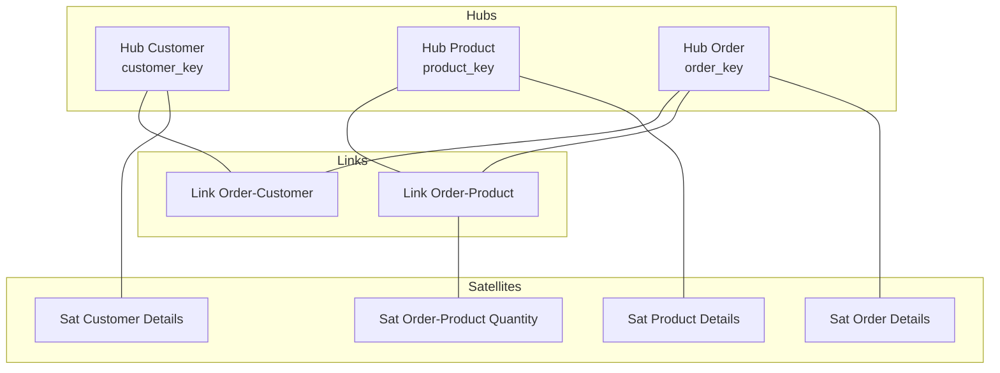

# How to Build a Data Vault Model on BigQuery for Auditable Enterprise Data Warehousing

Author: [nawazdhandala](https://www.github.com/nawazdhandala)

Tags: GCP, BigQuery, Data Vault, Data Warehousing, Data Modeling

Description: Learn how to implement a Data Vault 2.0 model on Google BigQuery for building auditable and scalable enterprise data warehouses.

---

Data Vault is a modeling methodology built for enterprise data warehousing where auditability, traceability, and adaptability matter. Unlike traditional star schemas that are optimized for querying, Data Vault is optimized for loading, historization, and compliance. Every piece of data is tracked with its source, load timestamp, and lineage - nothing gets overwritten or lost.

On BigQuery, Data Vault works particularly well because BigQuery handles the storage and compute scaling that Data Vault's insert-only pattern demands. You do not need to worry about partitioning strategies for performance the same way you would with an on-premises data warehouse.

## Data Vault Core Concepts

Data Vault has three primary entity types:

**Hubs** store unique business keys. A Hub for customers contains only customer IDs. No descriptive attributes, no foreign keys - just the business key and metadata about when it was first loaded.

**Links** store relationships between Hubs. An order-customer link captures the fact that a customer placed an order. Links can connect two or more Hubs.

**Satellites** store descriptive attributes and their history. A customer satellite holds name, email, address - and every time any of those change, a new row is inserted rather than updating the existing one.



## Setting Up Hubs in BigQuery

Hubs are the anchor points of your Data Vault. Each Hub table stores unique business keys with metadata.

```sql
-- Create the Customer Hub
-- The hash key provides a consistent surrogate key derived from the business key
CREATE TABLE IF NOT EXISTS `project.raw_vault.hub_customer` (
  customer_hash_key BYTES NOT NULL,       -- SHA-256 of the business key
  customer_id STRING NOT NULL,            -- The actual business key
  load_timestamp TIMESTAMP NOT NULL,      -- When this record was first loaded
  record_source STRING NOT NULL           -- Which source system provided this key
)
PARTITION BY DATE(load_timestamp)
CLUSTER BY customer_hash_key;

-- Create the Product Hub
CREATE TABLE IF NOT EXISTS `project.raw_vault.hub_product` (
  product_hash_key BYTES NOT NULL,
  product_id STRING NOT NULL,
  load_timestamp TIMESTAMP NOT NULL,
  record_source STRING NOT NULL
)
PARTITION BY DATE(load_timestamp)
CLUSTER BY product_hash_key;

-- Create the Order Hub
CREATE TABLE IF NOT EXISTS `project.raw_vault.hub_order` (
  order_hash_key BYTES NOT NULL,
  order_id STRING NOT NULL,
  load_timestamp TIMESTAMP NOT NULL,
  record_source STRING NOT NULL
)
PARTITION BY DATE(load_timestamp)
CLUSTER BY order_hash_key;
```

## Creating Links

Links capture the relationships between business entities. Each Link contains hash keys referencing the connected Hubs.

```sql
-- Create the Order-Customer Link
-- This captures which customer placed which order
CREATE TABLE IF NOT EXISTS `project.raw_vault.link_order_customer` (
  link_hash_key BYTES NOT NULL,           -- SHA-256 of combined hub keys
  order_hash_key BYTES NOT NULL,          -- FK to hub_order
  customer_hash_key BYTES NOT NULL,       -- FK to hub_customer
  load_timestamp TIMESTAMP NOT NULL,
  record_source STRING NOT NULL
)
PARTITION BY DATE(load_timestamp)
CLUSTER BY link_hash_key;

-- Create the Order-Product Link
CREATE TABLE IF NOT EXISTS `project.raw_vault.link_order_product` (
  link_hash_key BYTES NOT NULL,
  order_hash_key BYTES NOT NULL,
  product_hash_key BYTES NOT NULL,
  load_timestamp TIMESTAMP NOT NULL,
  record_source STRING NOT NULL
)
PARTITION BY DATE(load_timestamp)
CLUSTER BY link_hash_key;
```

## Building Satellites

Satellites store the descriptive attributes and maintain full history through insert-only semantics.

```sql
-- Create the Customer Details Satellite
-- Every change to a customer's attributes creates a new row
CREATE TABLE IF NOT EXISTS `project.raw_vault.sat_customer_details` (
  customer_hash_key BYTES NOT NULL,       -- FK to hub_customer
  load_timestamp TIMESTAMP NOT NULL,      -- When this version was loaded
  load_end_timestamp TIMESTAMP,           -- NULL for current version
  hash_diff BYTES NOT NULL,               -- SHA-256 of all attribute values for change detection
  customer_name STRING,
  email STRING,
  phone STRING,
  address STRING,
  city STRING,
  country STRING,
  record_source STRING NOT NULL
)
PARTITION BY DATE(load_timestamp)
CLUSTER BY customer_hash_key;

-- Create the Order Details Satellite
CREATE TABLE IF NOT EXISTS `project.raw_vault.sat_order_details` (
  order_hash_key BYTES NOT NULL,
  load_timestamp TIMESTAMP NOT NULL,
  load_end_timestamp TIMESTAMP,
  hash_diff BYTES NOT NULL,
  order_date TIMESTAMP,
  order_status STRING,
  total_amount NUMERIC,
  currency STRING,
  shipping_method STRING,
  record_source STRING NOT NULL
)
PARTITION BY DATE(load_timestamp)
CLUSTER BY order_hash_key;
```

## Loading Data into the Vault

The loading process follows a specific pattern: load Hubs first, then Links, then Satellites. Each load is insert-only and uses hash-based deduplication.

```sql
-- Load procedure for Hub Customer
-- Only inserts new business keys that do not already exist
MERGE `project.raw_vault.hub_customer` AS target
USING (
  SELECT DISTINCT
    SHA256(CAST(customer_id AS STRING)) AS customer_hash_key,
    CAST(customer_id AS STRING) AS customer_id,
    CURRENT_TIMESTAMP() AS load_timestamp,
    'source_crm' AS record_source
  FROM `project.staging.stg_customers`
) AS source
ON target.customer_hash_key = source.customer_hash_key
WHEN NOT MATCHED THEN
  INSERT (customer_hash_key, customer_id, load_timestamp, record_source)
  VALUES (source.customer_hash_key, source.customer_id, source.load_timestamp, source.record_source);
```

Loading satellites requires change detection using the hash_diff column.

```sql
-- Load procedure for Customer Details Satellite
-- Only inserts a new row when attributes have actually changed
MERGE `project.raw_vault.sat_customer_details` AS target
USING (
  SELECT
    SHA256(CAST(customer_id AS STRING)) AS customer_hash_key,
    CURRENT_TIMESTAMP() AS load_timestamp,
    SHA256(CONCAT(
      COALESCE(customer_name, ''),
      COALESCE(email, ''),
      COALESCE(phone, ''),
      COALESCE(address, ''),
      COALESCE(city, ''),
      COALESCE(country, '')
    )) AS hash_diff,
    customer_name,
    email,
    phone,
    address,
    city,
    country,
    'source_crm' AS record_source
  FROM `project.staging.stg_customers`
) AS source
ON target.customer_hash_key = source.customer_hash_key
   AND target.load_end_timestamp IS NULL
   AND target.hash_diff = source.hash_diff
WHEN NOT MATCHED THEN
  INSERT (customer_hash_key, load_timestamp, load_end_timestamp, hash_diff,
          customer_name, email, phone, address, city, country, record_source)
  VALUES (source.customer_hash_key, source.load_timestamp, NULL, source.hash_diff,
          source.customer_name, source.email, source.phone, source.address,
          source.city, source.country, source.record_source);

-- Close out previous satellite records where changes were detected
UPDATE `project.raw_vault.sat_customer_details`
SET load_end_timestamp = CURRENT_TIMESTAMP()
WHERE customer_hash_key IN (
  SELECT customer_hash_key
  FROM `project.raw_vault.sat_customer_details`
  GROUP BY customer_hash_key
  HAVING COUNT(*) > 1
)
AND load_end_timestamp IS NULL
AND load_timestamp < (
  SELECT MAX(load_timestamp)
  FROM `project.raw_vault.sat_customer_details` s2
  WHERE s2.customer_hash_key = sat_customer_details.customer_hash_key
);
```

## Building Business Vault and Information Marts

The raw vault stores data as-is from source systems. The Business Vault adds computed columns and business rules. Information Marts present the data in a query-friendly format.

```sql
-- Business Vault: Computed customer lifetime value
CREATE OR REPLACE VIEW `project.business_vault.bv_customer_ltv` AS
SELECT
  hc.customer_hash_key,
  hc.customer_id,
  scd.customer_name,
  COUNT(DISTINCT ho.order_id) AS total_orders,
  SUM(sod.total_amount) AS lifetime_value,
  MIN(sod.order_date) AS first_order_date,
  MAX(sod.order_date) AS last_order_date
FROM `project.raw_vault.hub_customer` hc
JOIN `project.raw_vault.sat_customer_details` scd
  ON hc.customer_hash_key = scd.customer_hash_key
  AND scd.load_end_timestamp IS NULL  -- Current version only
JOIN `project.raw_vault.link_order_customer` loc
  ON hc.customer_hash_key = loc.customer_hash_key
JOIN `project.raw_vault.hub_order` ho
  ON loc.order_hash_key = ho.order_hash_key
JOIN `project.raw_vault.sat_order_details` sod
  ON ho.order_hash_key = sod.order_hash_key
  AND sod.load_end_timestamp IS NULL
GROUP BY hc.customer_hash_key, hc.customer_id, scd.customer_name;
```

## Point-in-Time Queries

One of Data Vault's strengths is the ability to query data as it was at any point in time.

```sql
-- Query customer details as they were on a specific date
-- This is essential for auditing and regulatory compliance
SELECT
  hc.customer_id,
  scd.customer_name,
  scd.email,
  scd.address,
  scd.load_timestamp AS effective_from,
  scd.load_end_timestamp AS effective_to
FROM `project.raw_vault.hub_customer` hc
JOIN `project.raw_vault.sat_customer_details` scd
  ON hc.customer_hash_key = scd.customer_hash_key
WHERE hc.customer_id = 'CUST-12345'
  AND scd.load_timestamp <= TIMESTAMP('2025-06-15 00:00:00')
  AND (scd.load_end_timestamp IS NULL OR scd.load_end_timestamp > TIMESTAMP('2025-06-15 00:00:00'));
```

## Automating the Load Process

Schedule the vault loading using Cloud Scheduler and BigQuery scheduled queries.

```bash
# Schedule the hub loading to run every hour
bq mk --transfer_config \
  --target_dataset=raw_vault \
  --display_name="Load Hubs Hourly" \
  --data_source=scheduled_query \
  --schedule="every 1 hours" \
  --params='{"query":"CALL `project.procedures.load_all_hubs`()"}'
```

## Wrapping Up

Data Vault on BigQuery gives you a data warehouse that is built for auditability and adaptability. The insert-only loading pattern means you never lose data, the hash-based keys make it easy to integrate new sources, and BigQuery's storage and compute scaling handles the growing volume without manual tuning. While Data Vault requires more tables and more complex loading logic than a simple star schema, the benefits for regulated industries and enterprises that need full data lineage are well worth the investment.
