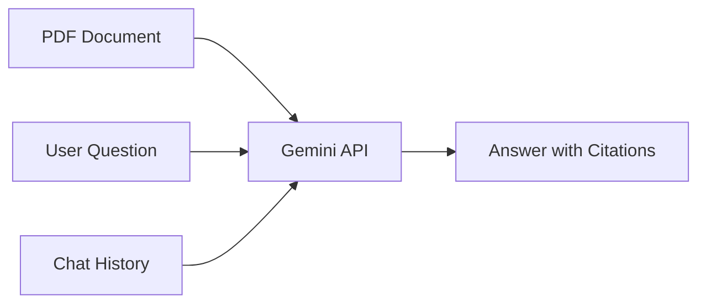

# How to Build a Document QA System Using Gemini Long Context and PDF Parsing

Author: [nawazdhandala](https://www.github.com/nawazdhandala)

Tags: GCP, Gemini, Vertex AI, Document QA, PDF Processing

Description: Build a document question-answering system using Gemini's long context window and native PDF parsing capabilities on Vertex AI for accurate document analysis.

---

Document QA systems let users ask natural language questions about their documents and get accurate answers. Traditionally, this required complex pipelines with text extraction, chunking, embedding, and retrieval. With Gemini's long context window and native PDF support, you can build a document QA system that is simpler and often more accurate.

I built a document QA system for a client that processes technical manuals, contracts, and compliance documents. The simplicity of the long-context approach compared to traditional RAG was striking. Here is how to build one yourself.

## Architecture Overview

The architecture is straightforward: load the document into Gemini's context, then ask questions in a chat session. For documents under a few hundred pages, this works without any chunking or retrieval layer.



For larger document collections, you add a lightweight retrieval layer to select the most relevant documents before sending them to Gemini.

## Loading PDFs Natively

Gemini can process PDF files directly without any text extraction step. This preserves the document structure, including tables, headers, and formatting.

Here is the basic setup for PDF question-answering:

```python
import vertexai
from vertexai.generative_models import GenerativeModel, Part

# Initialize Vertex AI
vertexai.init(project="your-project-id", location="us-central1")

model = GenerativeModel(
    "gemini-2.0-flash",
    system_instruction=(
        "You are a document analysis assistant. Answer questions based "
        "strictly on the provided documents. If the answer is not in the "
        "document, say so clearly. Always cite the specific section or "
        "page where you found the information."
    )
)

# Load a PDF file
with open("technical-manual.pdf", "rb") as f:
    pdf_bytes = f.read()

pdf_part = Part.from_data(data=pdf_bytes, mime_type="application/pdf")

# Ask a question about the document
response = model.generate_content([
    pdf_part,
    "What are the minimum system requirements listed in this manual?"
])

print(response.text)
```

## Building an Interactive QA Session

For multiple questions about the same document, use a chat session. This avoids resending the document with every question and maintains context between questions.

```python
class DocumentQA:
    """Interactive QA system for documents."""

    def __init__(self, model_name="gemini-2.0-flash"):
        self.model = GenerativeModel(
            model_name,
            system_instruction=(
                "You are a precise document analyst. Answer only from the "
                "provided documents. Quote relevant passages when possible. "
                "If something is ambiguous, explain the ambiguity."
            )
        )
        self.chat = None
        self.document_loaded = False

    def load_document(self, file_path):
        """Load a document into the chat context."""
        self.chat = self.model.start_chat()

        # Determine file type and load accordingly
        if file_path.endswith(".pdf"):
            with open(file_path, "rb") as f:
                doc_part = Part.from_data(
                    data=f.read(),
                    mime_type="application/pdf"
                )
        else:
            with open(file_path, "r") as f:
                doc_part = f.read()

        # Send the document as the first message
        response = self.chat.send_message([
            doc_part,
            "I have uploaded a document. Please confirm you have received it "
            "and provide a brief summary of what it contains."
        ])

        self.document_loaded = True
        return response.text

    def ask(self, question):
        """Ask a question about the loaded document."""
        if not self.document_loaded:
            return "No document loaded. Call load_document() first."

        response = self.chat.send_message(question)
        return response.text

# Usage
qa = DocumentQA()

# Load the document
summary = qa.load_document("contract.pdf")
print(f"Document summary: {summary}")

# Ask questions
answer = qa.ask("What is the termination clause?")
print(f"Answer: {answer}")

answer = qa.ask("Are there any penalties for early termination?")
print(f"Answer: {answer}")

answer = qa.ask("What is the total contract value?")
print(f"Answer: {answer}")
```

## Handling Multiple Documents

When users need to query across multiple documents, load them all into the context with clear labels.

```python
class MultiDocumentQA:
    """QA system for multiple documents."""

    def __init__(self):
        self.model = GenerativeModel(
            "gemini-2.0-flash",
            system_instruction=(
                "You analyze multiple documents. When answering, always "
                "specify which document contains the information. "
                "If documents contain conflicting information, point that out."
            )
        )
        self.chat = None

    def load_documents(self, file_paths):
        """Load multiple documents into the context."""
        self.chat = self.model.start_chat()

        parts = []
        for i, path in enumerate(file_paths, 1):
            filename = path.split("/")[-1]

            if path.endswith(".pdf"):
                with open(path, "rb") as f:
                    doc_part = Part.from_data(
                        data=f.read(),
                        mime_type="application/pdf"
                    )
                parts.append(f"Document {i}: {filename}")
                parts.append(doc_part)
            else:
                with open(path, "r") as f:
                    content = f.read()
                parts.append(f"=== Document {i}: {filename} ===\n{content}\n")

        parts.append(
            "I have loaded multiple documents. Confirm receipt and list "
            "the documents you have access to."
        )

        response = self.chat.send_message(parts)
        return response.text

    def ask(self, question):
        """Ask a question across all loaded documents."""
        response = self.chat.send_message(question)
        return response.text

# Usage
multi_qa = MultiDocumentQA()
multi_qa.load_documents([
    "policy_2024.pdf",
    "policy_2025.pdf",
    "amendments.pdf"
])

answer = multi_qa.ask(
    "What changed between the 2024 and 2025 policies regarding data retention?"
)
print(answer)
```

## Extracting Structured Answers

For applications that need programmatic access to answers, configure structured JSON output.

```python
from vertexai.generative_models import GenerationConfig

def extract_structured_answer(pdf_path, questions):
    """Extract structured answers from a document."""
    with open(pdf_path, "rb") as f:
        pdf_part = Part.from_data(data=f.read(), mime_type="application/pdf")

    # Build the extraction prompt
    question_list = "\n".join(
        f"{i+1}. {q}" for i, q in enumerate(questions)
    )

    config = GenerationConfig(
        response_mime_type="application/json",
        response_schema={
            "type": "object",
            "properties": {
                "answers": {
                    "type": "array",
                    "items": {
                        "type": "object",
                        "properties": {
                            "question": {"type": "string"},
                            "answer": {"type": "string"},
                            "confidence": {
                                "type": "string",
                                "enum": ["high", "medium", "low"]
                            },
                            "source_section": {"type": "string"},
                            "found_in_document": {"type": "boolean"}
                        }
                    }
                }
            }
        }
    )

    response = model.generate_content(
        [
            pdf_part,
            f"Answer these questions based on the document:\n{question_list}"
        ],
        generation_config=config
    )

    import json
    return json.loads(response.text)

# Extract answers
result = extract_structured_answer(
    "compliance_report.pdf",
    [
        "When was the last audit conducted?",
        "Were there any critical findings?",
        "What is the remediation deadline?",
        "Who is the responsible officer?"
    ]
)

for answer in result["answers"]:
    print(f"Q: {answer['question']}")
    print(f"A: {answer['answer']}")
    print(f"Confidence: {answer['confidence']}")
    print()
```

## Adding Document Caching

For frequently accessed documents, use context caching to avoid resending the same PDF with every request.

```python
from vertexai.preview import caching

def create_cached_document_qa(pdf_path, cache_ttl="3600s"):
    """Create a QA system with a cached document for faster queries."""
    # Read the PDF
    with open(pdf_path, "rb") as f:
        pdf_bytes = f.read()

    pdf_part = Part.from_data(data=pdf_bytes, mime_type="application/pdf")

    # Create a cache entry for the document
    cached = caching.CachedContent.create(
        model_name="gemini-2.0-flash",
        system_instruction=(
            "You are a document QA assistant. Answer based on the "
            "provided document only. Cite page numbers when possible."
        ),
        contents=[pdf_part],
        display_name=f"doc-cache-{pdf_path.split('/')[-1]}",
        ttl=cache_ttl
    )

    # Create a model from the cached content
    cached_model = GenerativeModel.from_cached_content(cached)

    return cached_model, cached

# Create cached QA
cached_model, cache = create_cached_document_qa("large-manual.pdf")

# Queries are fast because the document is cached
for question in [
    "What is the installation process?",
    "How do I configure networking?",
    "What are the backup procedures?"
]:
    response = cached_model.generate_content(question)
    print(f"Q: {question}")
    print(f"A: {response.text[:200]}...")
    print()

# Clean up cache when done
cache.delete()
```

## Loading Documents from Cloud Storage

In production, documents usually live in Cloud Storage rather than local files.

```python
def load_document_from_gcs(bucket_name, blob_name):
    """Load a document from Cloud Storage."""
    gcs_uri = f"gs://{bucket_name}/{blob_name}"

    # Determine MIME type from extension
    mime_types = {
        ".pdf": "application/pdf",
        ".txt": "text/plain",
        ".html": "text/html",
    }

    ext = "." + blob_name.rsplit(".", 1)[-1].lower()
    mime_type = mime_types.get(ext, "application/octet-stream")

    return Part.from_uri(uri=gcs_uri, mime_type=mime_type)

# Load and query a document from GCS
doc_part = load_document_from_gcs("my-documents", "reports/annual-2025.pdf")

response = model.generate_content([
    doc_part,
    "Summarize the key financial highlights from this annual report."
])
print(response.text)
```

## Error Handling for Document Processing

Documents can be corrupted, too large, or in unsupported formats. Handle these cases.

```python
import os

def safe_document_qa(file_path, question):
    """Process a document with comprehensive error handling."""
    # Validate file exists
    if not os.path.exists(file_path):
        return {"error": f"File not found: {file_path}"}

    # Check file size (Gemini has limits)
    file_size = os.path.getsize(file_path)
    max_size = 100 * 1024 * 1024  # 100MB
    if file_size > max_size:
        return {"error": f"File too large: {file_size / 1024 / 1024:.1f}MB"}

    try:
        with open(file_path, "rb") as f:
            pdf_bytes = f.read()

        pdf_part = Part.from_data(data=pdf_bytes, mime_type="application/pdf")

        response = model.generate_content([pdf_part, question])

        if not response.candidates:
            return {"error": "No response generated - content may be blocked"}

        return {"answer": response.text, "success": True}

    except Exception as e:
        return {"error": f"Processing failed: {str(e)}", "success": False}
```

## Wrapping Up

Building a document QA system with Gemini is remarkably straightforward. Load the document into the context, ask questions, and get answers with citations. For most use cases, you do not need a complex RAG pipeline - the long context window handles documents up to hundreds of pages natively. Add caching for frequently queried documents, structured output for programmatic use, and proper error handling for production robustness. Monitor your document QA system's accuracy and latency with tools like OneUptime to ensure it continues to deliver quality answers.
