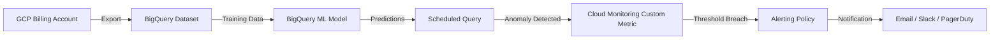

# How to Build a GCP Cost Anomaly Detection System Using Billing Export BigQuery ML and Alerting Policies

Author: [nawazdhandala](https://www.github.com/nawazdhandala)

Tags: GCP, BigQuery, Cost Management, BigQuery ML, Cloud Billing, Alerting

Description: Learn how to build a complete cost anomaly detection system on GCP using billing export to BigQuery, BigQuery ML for forecasting, and Cloud Monitoring alerting policies.

---

If you have ever been hit with a surprise cloud bill, you know the sinking feeling. A misconfigured autoscaler, a forgotten VM, or a runaway data pipeline can rack up thousands of dollars before anyone notices. The good news is that GCP gives you all the building blocks to catch these anomalies early. In this post, we will wire together billing export, BigQuery ML, and alerting policies into a system that flags unusual spending before it becomes a real problem.

## The Architecture

Before jumping into code, let's look at the overall flow of data and signals.



## Step 1 - Enable Billing Export to BigQuery

First things first. You need your billing data flowing into BigQuery. Go to the Billing section in the Cloud Console, select "Billing export," and configure it to export both standard and detailed usage cost data to a BigQuery dataset.

If you prefer doing this with the CLI, here is how you set up the dataset:

```bash
# Create a dedicated dataset for billing data in the US multi-region
bq mk --dataset \
  --description "GCP Billing Export Data" \
  --location US \
  your-project-id:billing_export
```

After enabling the export, it takes a few hours for data to start appearing. The table that matters most is `gcp_billing_export_v1_XXXXXX_XXXXXX`, where the X values correspond to your billing account ID.

## Step 2 - Explore and Prepare the Data

Once you have a few weeks of billing data, run some exploratory queries to understand your spending patterns. This query aggregates daily costs by service:

```sql
-- Aggregate daily costs grouped by GCP service name
SELECT
  DATE(usage_start_time) AS usage_date,
  service.description AS service_name,
  SUM(cost) AS daily_cost
FROM
  `your-project-id.billing_export.gcp_billing_export_v1_XXXXXX`
WHERE
  DATE(usage_start_time) >= DATE_SUB(CURRENT_DATE(), INTERVAL 90 DAY)
GROUP BY
  usage_date, service_name
ORDER BY
  usage_date DESC, daily_cost DESC
```

Look at the results. You will likely see a few dominant services - Compute Engine, BigQuery, Cloud Storage - with relatively predictable patterns. Those patterns are what we will teach a model to recognize.

## Step 3 - Build the BigQuery ML Forecasting Model

BigQuery ML supports ARIMA_PLUS models that work well for time series forecasting. We will create one that learns your normal spending curve and then flags anything that deviates significantly.

Here is the model creation query. This trains on 60 days of historical data with daily granularity:

```sql
-- Create an ARIMA_PLUS model to forecast daily total spend
CREATE OR REPLACE MODEL `your-project-id.billing_export.cost_forecast_model`
OPTIONS(
  model_type = 'ARIMA_PLUS',
  time_series_timestamp_col = 'usage_date',
  time_series_data_col = 'daily_cost',
  auto_arima = TRUE,
  data_frequency = 'DAILY',
  holiday_region = 'US'
) AS
SELECT
  DATE(usage_start_time) AS usage_date,
  SUM(cost) AS daily_cost
FROM
  `your-project-id.billing_export.gcp_billing_export_v1_XXXXXX`
WHERE
  DATE(usage_start_time) BETWEEN
    DATE_SUB(CURRENT_DATE(), INTERVAL 60 DAY) AND DATE_SUB(CURRENT_DATE(), INTERVAL 1 DAY)
GROUP BY
  usage_date
```

Training typically takes a few minutes. The ARIMA_PLUS model handles seasonality, trends, and even holiday effects if you specify a holiday region.

## Step 4 - Generate Forecasts and Detect Anomalies

Now we compare actual spending against what the model predicted. The key idea is simple - if actual spend exceeds the upper bound of the prediction interval by a meaningful margin, something unusual is going on.

```sql
-- Compare actual daily costs against the model's predicted confidence interval
WITH forecast AS (
  SELECT
    forecast_timestamp AS forecast_date,
    forecast_value,
    prediction_interval_lower_bound,
    prediction_interval_upper_bound
  FROM
    ML.FORECAST(MODEL `your-project-id.billing_export.cost_forecast_model`,
      STRUCT(7 AS horizon, 0.95 AS confidence_level))
),
actuals AS (
  SELECT
    DATE(usage_start_time) AS usage_date,
    SUM(cost) AS actual_cost
  FROM
    `your-project-id.billing_export.gcp_billing_export_v1_XXXXXX`
  WHERE
    DATE(usage_start_time) >= DATE_SUB(CURRENT_DATE(), INTERVAL 7 DAY)
  GROUP BY
    usage_date
)
SELECT
  a.usage_date,
  a.actual_cost,
  f.forecast_value AS predicted_cost,
  f.prediction_interval_upper_bound AS upper_bound,
  CASE
    WHEN a.actual_cost > f.prediction_interval_upper_bound THEN 'ANOMALY'
    ELSE 'NORMAL'
  END AS status,
  ROUND(a.actual_cost - f.prediction_interval_upper_bound, 2) AS overage
FROM
  actuals a
JOIN
  forecast f ON a.usage_date = DATE(f.forecast_date)
ORDER BY
  a.usage_date
```

## Step 5 - Automate with Scheduled Queries

You do not want to run this manually every day. Set up a BigQuery scheduled query that runs the anomaly detection logic daily and writes results to a dedicated table.

```bash
# Create a scheduled query that runs every day at 8 AM UTC
bq query --use_legacy_sql=false \
  --schedule='every day 08:00' \
  --display_name='Cost Anomaly Detection' \
  --destination_table='your-project-id:billing_export.anomaly_results' \
  --replace=true \
  'SELECT ... (your anomaly detection query here)'
```

In practice, you would put the full anomaly detection SQL from the previous step into this scheduled query.

## Step 6 - Push Custom Metrics to Cloud Monitoring

The scheduled query gives you a table with anomaly flags. Now you need to get those signals into Cloud Monitoring so you can set up alerting. Use the Cloud Monitoring API to write a custom metric.

Here is a Python script that reads the anomaly results and pushes a custom metric:

```python
# Script to push cost anomaly metrics to Cloud Monitoring
from google.cloud import monitoring_v3, bigquery
import time

def push_anomaly_metric(project_id):
    # Query the anomaly results table for today's data
    bq_client = bigquery.Client(project=project_id)
    query = """
        SELECT actual_cost, predicted_cost, overage, status
        FROM `{}.billing_export.anomaly_results`
        WHERE usage_date = CURRENT_DATE()
        LIMIT 1
    """.format(project_id)

    results = list(bq_client.query(query).result())
    if not results:
        print("No anomaly data for today")
        return

    row = results[0]
    is_anomaly = 1.0 if row.status == 'ANOMALY' else 0.0

    # Write the custom metric to Cloud Monitoring
    client = monitoring_v3.MetricServiceClient()
    project_name = f"projects/{project_id}"

    series = monitoring_v3.TimeSeries()
    series.metric.type = "custom.googleapis.com/billing/cost_anomaly"
    series.resource.type = "global"
    series.resource.labels["project_id"] = project_id

    point = monitoring_v3.Point()
    point.value.double_value = is_anomaly
    now = time.time()
    point.interval.end_time.seconds = int(now)
    series.points = [point]

    client.create_time_series(name=project_name, time_series=[series])
    print(f"Pushed anomaly metric: {is_anomaly}, overage: {row.overage}")

push_anomaly_metric("your-project-id")
```

Deploy this script as a Cloud Function triggered by Cloud Scheduler, or simply run it as part of a Cloud Run job on a daily schedule.

## Step 7 - Create Alerting Policies

The final piece is creating an alerting policy that fires when the custom metric indicates an anomaly.

```bash
# Create an alerting policy using gcloud
gcloud alpha monitoring policies create \
  --display-name="Cost Anomaly Alert" \
  --condition-display-name="Billing anomaly detected" \
  --condition-filter='metric.type="custom.googleapis.com/billing/cost_anomaly" AND resource.type="global"' \
  --condition-threshold-value=0.5 \
  --condition-threshold-comparison=COMPARISON_GT \
  --condition-threshold-duration=0s \
  --notification-channels="projects/your-project-id/notificationChannels/CHANNEL_ID" \
  --combiner=OR
```

Set up notification channels for email, Slack, or PagerDuty depending on your team's preferences. For Slack integration, you can use a webhook-based notification channel.

## Per-Service Anomaly Detection

The approach above works for total spend. But sometimes overall spending looks fine while a single service spikes. To handle that, create separate models per service or use a single model with the service name as a time series ID:

```sql
-- Create a per-service anomaly model using time_series_id_col
CREATE OR REPLACE MODEL `your-project-id.billing_export.per_service_forecast`
OPTIONS(
  model_type = 'ARIMA_PLUS',
  time_series_timestamp_col = 'usage_date',
  time_series_data_col = 'daily_cost',
  time_series_id_col = 'service_name',
  auto_arima = TRUE,
  data_frequency = 'DAILY'
) AS
SELECT
  DATE(usage_start_time) AS usage_date,
  service.description AS service_name,
  SUM(cost) AS daily_cost
FROM
  `your-project-id.billing_export.gcp_billing_export_v1_XXXXXX`
WHERE
  DATE(usage_start_time) >= DATE_SUB(CURRENT_DATE(), INTERVAL 60 DAY)
GROUP BY
  usage_date, service_name
HAVING
  daily_cost > 0
```

This gives you individual forecasts for each GCP service, making it much easier to pinpoint which service is causing the spike.

## Tuning and Maintenance

A few practical tips from running this in production:

- Retrain the model weekly. Cloud costs change as your infrastructure evolves. A model trained once will drift.
- Use a 95% confidence interval to start. If you get too many false positives, bump it to 99%.
- Filter out one-time costs like committed use discount purchases or support charges. These are legitimate spikes that will confuse the model.
- Keep at least 60 days of training data. Less than that and the model will not learn weekly patterns well.

## Wrapping Up

Building a cost anomaly detection system on GCP does not require third-party tools. By chaining together billing export, BigQuery ML, scheduled queries, custom metrics, and alerting policies, you get a fully automated pipeline that catches unusual spending before it becomes a budget crisis. The whole thing runs on managed services, so there is very little operational overhead to maintain it.

Start with the total-spend model to get quick wins, then expand to per-service monitoring as you fine-tune the system. Your finance team will thank you.
