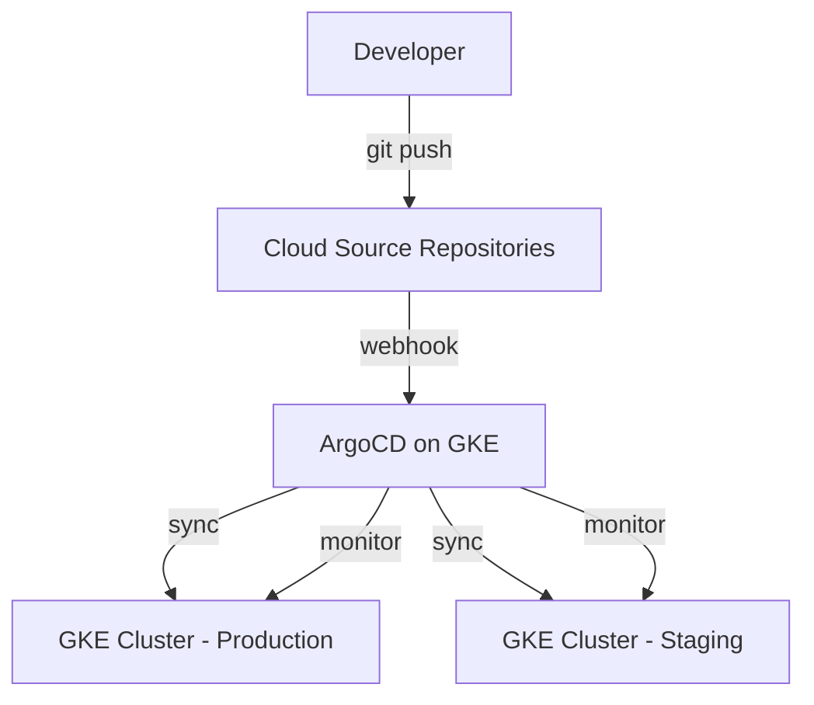

# How to Build a GitOps Workflow for GKE Using ArgoCD with Cloud Source Repositories

Author: [nawazdhandala](https://www.github.com/nawazdhandala)

Tags: GCP, GKE, ArgoCD, GitOps, Cloud Source Repositories

Description: A hands-on guide to building a GitOps workflow for Google Kubernetes Engine using ArgoCD with Cloud Source Repositories for declarative application delivery.

---

ArgoCD is one of the most popular GitOps tools in the Kubernetes ecosystem. While GCP offers Config Sync as its native GitOps solution, many teams prefer ArgoCD for its rich UI, multi-cluster support, and extensive ecosystem of plugins. If you are running GKE and want to use ArgoCD with Cloud Source Repositories, this post covers everything you need to get it working.

## Why ArgoCD on GKE?

ArgoCD brings a few things to the table that teams appreciate:

- A web UI that shows the live state of every application and its drift from Git
- Application-of-apps pattern for managing many services
- Support for Helm, Kustomize, and plain YAML
- Sync waves and hooks for controlling deployment order
- Multi-cluster management from a single ArgoCD instance

## Architecture Overview



## Step 1: Install ArgoCD on GKE

Start by creating a GKE cluster (or use an existing one) and installing ArgoCD:

```bash
# Create a GKE cluster for ArgoCD (or use existing)
gcloud container clusters create argocd-cluster \
  --zone=us-central1-a \
  --num-nodes=3 \
  --machine-type=e2-standard-4 \
  --workload-pool=my-project.svc.id.goog

# Get credentials
gcloud container clusters get-credentials argocd-cluster \
  --zone=us-central1-a

# Install ArgoCD
kubectl create namespace argocd
kubectl apply -n argocd -f https://raw.githubusercontent.com/argoproj/argo-cd/stable/manifests/install.yaml

# Wait for pods to be ready
kubectl wait --for=condition=Ready pods --all -n argocd --timeout=300s

# Get the initial admin password
kubectl -n argocd get secret argocd-initial-admin-secret \
  -o jsonpath="{.data.password}" | base64 -d
```

Expose ArgoCD through a Load Balancer or use port forwarding for initial setup:

```bash
# Option 1: Port forward for initial access
kubectl port-forward svc/argocd-server -n argocd 8080:443

# Option 2: Create a LoadBalancer service
kubectl patch svc argocd-server -n argocd -p '{"spec": {"type": "LoadBalancer"}}'
```

## Step 2: Configure Authentication with Cloud Source Repositories

ArgoCD needs to authenticate with Cloud Source Repositories. The best approach on GKE is using Workload Identity:

```bash
# Create a GCP service account for ArgoCD
gcloud iam service-accounts create argocd-repo-access \
  --display-name="ArgoCD Repository Access"

# Grant read access to Cloud Source Repositories
gcloud projects add-iam-policy-binding my-project \
  --member="serviceAccount:argocd-repo-access@my-project.iam.gserviceaccount.com" \
  --role="roles/source.reader"

# Bind the Kubernetes service account to the GCP service account
gcloud iam service-accounts add-iam-policy-binding \
  argocd-repo-access@my-project.iam.gserviceaccount.com \
  --role="roles/iam.workloadIdentityUser" \
  --member="serviceAccount:my-project.svc.id.goog[argocd/argocd-repo-server]"

# Annotate the ArgoCD repo-server service account
kubectl annotate serviceaccount argocd-repo-server -n argocd \
  iam.gke.io/gcp-service-account=argocd-repo-access@my-project.iam.gserviceaccount.com
```

Alternatively, use a credential helper with a GCP token:

```bash
# Create an access token and add the repository
argocd login localhost:8080 --username admin --password $(kubectl -n argocd get secret argocd-initial-admin-secret -o jsonpath="{.data.password}" | base64 -d)

# Add Cloud Source Repository using HTTPS with token
argocd repo add https://source.developers.google.com/p/my-project/r/my-config-repo \
  --username=oauth2accesstoken \
  --password=$(gcloud auth print-access-token)
```

For a more permanent solution, use a Kubernetes secret:

```yaml
# argocd-repo-secret.yaml
apiVersion: v1
kind: Secret
metadata:
  name: csr-repo-creds
  namespace: argocd
  labels:
    argocd.argoproj.io/secret-type: repo-creds
stringData:
  type: git
  url: https://source.developers.google.com/p/my-project
  # Use a long-lived credential or token refresh mechanism
  username: _json_key_base64
  password: <base64-encoded-service-account-key>
```

## Step 3: Set Up the Config Repository Structure

Organize your config repository for ArgoCD:

```
config-repo/
  apps/
    production/
      api-server.yaml
      web-frontend.yaml
      worker.yaml
    staging/
      api-server.yaml
      web-frontend.yaml
      worker.yaml
  base/
    api-server/
      deployment.yaml
      service.yaml
      hpa.yaml
      kustomization.yaml
    web-frontend/
      deployment.yaml
      service.yaml
      ingress.yaml
      kustomization.yaml
    worker/
      deployment.yaml
      kustomization.yaml
  overlays/
    production/
      api-server/
        kustomization.yaml
        replicas-patch.yaml
      web-frontend/
        kustomization.yaml
    staging/
      api-server/
        kustomization.yaml
      web-frontend/
        kustomization.yaml
```

Create the base Kustomize files:

```yaml
# base/api-server/kustomization.yaml
apiVersion: kustomize.config.k8s.io/v1beta1
kind: Kustomization

resources:
  - deployment.yaml
  - service.yaml
  - hpa.yaml

commonLabels:
  app: api-server
  managed-by: argocd
```

```yaml
# base/api-server/deployment.yaml
apiVersion: apps/v1
kind: Deployment
metadata:
  name: api-server
spec:
  replicas: 2
  selector:
    matchLabels:
      app: api-server
  template:
    metadata:
      labels:
        app: api-server
    spec:
      containers:
        - name: api-server
          image: gcr.io/my-project/api-server:v1.0.0
          ports:
            - containerPort: 8080
          resources:
            requests:
              cpu: 200m
              memory: 256Mi
            limits:
              cpu: 500m
              memory: 512Mi
```

Production overlay with higher replicas:

```yaml
# overlays/production/api-server/kustomization.yaml
apiVersion: kustomize.config.k8s.io/v1beta1
kind: Kustomization

resources:
  - ../../../base/api-server

patchesStrategicMerge:
  - replicas-patch.yaml

# overlays/production/api-server/replicas-patch.yaml
apiVersion: apps/v1
kind: Deployment
metadata:
  name: api-server
spec:
  replicas: 5
```

## Step 4: Create ArgoCD Applications

Define ArgoCD Application resources for each service:

```yaml
# apps/production/api-server.yaml
apiVersion: argoproj.io/v1alpha1
kind: Application
metadata:
  name: api-server-production
  namespace: argocd
  finalizers:
    - resources-finalizer.argocd.argoproj.io
spec:
  project: default
  source:
    repoURL: https://source.developers.google.com/p/my-project/r/config-repo
    targetRevision: main
    path: overlays/production/api-server
  destination:
    server: https://kubernetes.default.svc
    namespace: production
  syncPolicy:
    automated:
      prune: true
      selfHeal: true
    syncOptions:
      - CreateNamespace=true
    retry:
      limit: 5
      backoff:
        duration: 5s
        factor: 2
        maxDuration: 3m
```

## Step 5: Use the App-of-Apps Pattern

Instead of creating each application manually, use the app-of-apps pattern:

```yaml
# root-app.yaml - The parent application
apiVersion: argoproj.io/v1alpha1
kind: Application
metadata:
  name: production-apps
  namespace: argocd
spec:
  project: default
  source:
    repoURL: https://source.developers.google.com/p/my-project/r/config-repo
    targetRevision: main
    path: apps/production
  destination:
    server: https://kubernetes.default.svc
    namespace: argocd
  syncPolicy:
    automated:
      prune: true
      selfHeal: true
```

Apply the root application:

```bash
kubectl apply -f root-app.yaml
```

Now ArgoCD will automatically discover and sync all applications defined in the `apps/production/` directory.

## Step 6: Set Up Webhooks for Faster Sync

By default, ArgoCD polls the repository every 3 minutes. Set up a webhook for instant sync on push:

```bash
# Create a Cloud Function that triggers ArgoCD sync on repository push
gcloud functions deploy argocd-webhook \
  --runtime=nodejs20 \
  --trigger-topic=source-repo-push \
  --entry-point=triggerSync \
  --set-env-vars="ARGOCD_SERVER=argocd.example.com,ARGOCD_TOKEN=your-api-token"
```

```javascript
// webhook-function/index.js - Triggers ArgoCD sync on repo push
const https = require('https');

exports.triggerSync = async (message) => {
  const data = JSON.parse(Buffer.from(message.data, 'base64').toString());

  console.log(`Repository push detected: ${data.name}`);

  // Call ArgoCD API to refresh applications
  const options = {
    hostname: process.env.ARGOCD_SERVER,
    port: 443,
    path: '/api/v1/applications',
    method: 'GET',
    headers: {
      'Authorization': `Bearer ${process.env.ARGOCD_TOKEN}`
    }
  };

  // Get list of applications and trigger refresh for each
  const apps = await makeRequest(options);
  for (const app of JSON.parse(apps).items) {
    const refreshOptions = {
      ...options,
      path: `/api/v1/applications/${app.metadata.name}?refresh=normal`,
      method: 'GET'
    };
    await makeRequest(refreshOptions);
    console.log(`Refreshed: ${app.metadata.name}`);
  }
};

function makeRequest(options) {
  return new Promise((resolve, reject) => {
    const req = https.request(options, (res) => {
      let data = '';
      res.on('data', (chunk) => data += chunk);
      res.on('end', () => resolve(data));
    });
    req.on('error', reject);
    req.end();
  });
}
```

## Step 7: Configure Notifications

Set up ArgoCD notifications to alert on sync failures:

```yaml
# argocd-notifications-cm.yaml
apiVersion: v1
kind: ConfigMap
metadata:
  name: argocd-notifications-cm
  namespace: argocd
data:
  service.slack: |
    token: $slack-token
  template.app-sync-failed: |
    message: |
      Application {{.app.metadata.name}} sync failed.
      Status: {{.app.status.sync.status}}
      Health: {{.app.status.health.status}}
  trigger.on-sync-failed: |
    - when: app.status.sync.status == 'OutOfSync' && app.status.health.status == 'Degraded'
      send: [app-sync-failed]
```

## Wrapping Up

ArgoCD on GKE with Cloud Source Repositories gives you a powerful GitOps platform with a great UI and ecosystem. The setup involves installing ArgoCD, configuring repository authentication, structuring your config repository with Kustomize or Helm, and using the app-of-apps pattern for scalable management.

The workflow is simple: developers push config changes to Git, ArgoCD detects the changes, syncs the cluster, and reports the status. If anything drifts from the desired state, ArgoCD self-heals. This gives you a consistent, auditable, and reproducible deployment process that scales with your team.
