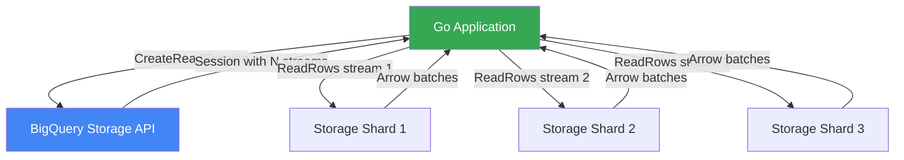

# How to Build a Go Application That Streams BigQuery Results Using the BigQuery Storage Read API

Author: [nawazdhandala](https://www.github.com/nawazdhandala)

Tags: GCP, BigQuery, Go, Storage Read API, Data Streaming, Google Cloud

Description: Build a Go application that streams large BigQuery result sets using the Storage Read API for faster and more efficient data retrieval than standard queries.

---

The standard BigQuery query API works well for moderate result sets, but when you need to read millions of rows, it starts to show its limits. You get paginated JSON responses, which means high serialization overhead and multiple round trips.

The BigQuery Storage Read API takes a different approach. It streams data directly from BigQuery's storage layer in a columnar format (Apache Arrow or Avro), which is dramatically faster for large datasets. In my experience, it can be 10x faster for tables with millions of rows.

Let me show you how to use it in Go.

## When to Use the Storage Read API

Use the standard API when:
- You are running SQL queries and reading the results
- Your result sets are small (under a few thousand rows)
- You need the full SQL query engine

Use the Storage Read API when:
- You need to read entire tables or large partitions
- You want parallel reads across multiple streams
- You need columnar data for analytics workloads
- Performance matters more than convenience

## Setting Up

Install the required dependencies.

```bash
go get cloud.google.com/go/bigquery/storage/apiv1
go get cloud.google.com/go/bigquery/storage/apiv1/storagepb
go get github.com/apache/arrow/go/v15/arrow
go get github.com/apache/arrow/go/v15/arrow/ipc
```

## Creating a Read Session

The first step is creating a read session, which tells BigQuery what table you want to read and how many parallel streams to use.

```go
package main

import (
    "context"
    "fmt"
    "io"
    "log"
    "os"

    bqstorage "cloud.google.com/go/bigquery/storage/apiv1"
    storagepb "cloud.google.com/go/bigquery/storage/apiv1/storagepb"
)

// BigQueryReader wraps the Storage Read API client
type BigQueryReader struct {
    client    *bqstorage.BigQueryReadClient
    projectID string
}

// NewBigQueryReader creates a new reader for the Storage Read API
func NewBigQueryReader(ctx context.Context) (*BigQueryReader, error) {
    client, err := bqstorage.NewBigQueryReadClient(ctx)
    if err != nil {
        return nil, fmt.Errorf("failed to create storage read client: %w", err)
    }

    return &BigQueryReader{
        client:    client,
        projectID: os.Getenv("GOOGLE_CLOUD_PROJECT"),
    }, nil
}

// Close cleans up the client
func (r *BigQueryReader) Close() {
    r.client.Close()
}

// CreateReadSession sets up a read session for a BigQuery table
func (r *BigQueryReader) CreateReadSession(
    ctx context.Context,
    datasetID, tableID string,
    selectedFields []string,
    rowFilter string,
    maxStreams int,
) (*storagepb.ReadSession, error) {
    // Build the table reference
    tablePath := fmt.Sprintf("projects/%s/datasets/%s/tables/%s",
        r.projectID, datasetID, tableID)

    // Configure the read session
    req := &storagepb.CreateReadSessionRequest{
        Parent: fmt.Sprintf("projects/%s", r.projectID),
        ReadSession: &storagepb.ReadSession{
            Table: tablePath,
            // Use Arrow format for efficient columnar reads
            DataFormat: storagepb.DataFormat_ARROW,
            ReadOptions: &storagepb.ReadSession_TableReadOptions{
                // Only read the columns you need
                SelectedFields: selectedFields,
                // Optional row filter in SQL syntax
                RowRestriction: rowFilter,
            },
        },
        // Number of parallel streams to create
        MaxStreamCount: int32(maxStreams),
    }

    session, err := r.client.CreateReadSession(ctx, req)
    if err != nil {
        return nil, fmt.Errorf("failed to create read session: %w", err)
    }

    log.Printf("Created read session with %d streams", len(session.Streams))
    return session, nil
}
```

## Reading Data from a Stream

Each stream in the session can be read independently, making parallel reads straightforward.

```go
// ReadStream reads all rows from a single stream
func (r *BigQueryReader) ReadStream(
    ctx context.Context,
    streamName string,
    processRow func(data []byte) error,
) (int64, error) {
    // Create a read rows request for this stream
    req := &storagepb.ReadRowsRequest{
        ReadStream: streamName,
    }

    // Start reading from the stream
    stream, err := r.client.ReadRows(ctx, req)
    if err != nil {
        return 0, fmt.Errorf("failed to read rows: %w", err)
    }

    var totalRows int64

    // Read responses until the stream is exhausted
    for {
        response, err := stream.Recv()
        if err == io.EOF {
            break
        }
        if err != nil {
            return totalRows, fmt.Errorf("stream read error: %w", err)
        }

        // Get the Arrow record batch from the response
        arrowData := response.GetArrowRecordBatch()
        if arrowData != nil {
            if err := processRow(arrowData.SerializedRecordBatch); err != nil {
                return totalRows, fmt.Errorf("processing error: %w", err)
            }
        }

        totalRows += response.RowCount
    }

    return totalRows, nil
}
```

## Parallel Stream Reading

The real power of the Storage Read API comes from reading multiple streams in parallel.

```go
import "sync"

// ReadResult holds the result from reading a single stream
type ReadResult struct {
    StreamIndex int
    RowCount    int64
    Error       error
}

// ReadAllStreamsParallel reads all streams from a session concurrently
func (r *BigQueryReader) ReadAllStreamsParallel(
    ctx context.Context,
    session *storagepb.ReadSession,
    processRow func(data []byte) error,
) (int64, error) {
    streams := session.Streams
    results := make(chan ReadResult, len(streams))
    var wg sync.WaitGroup

    // Start a goroutine for each stream
    for i, stream := range streams {
        wg.Add(1)
        go func(idx int, streamName string) {
            defer wg.Done()

            count, err := r.ReadStream(ctx, streamName, processRow)
            results <- ReadResult{
                StreamIndex: idx,
                RowCount:    count,
                Error:       err,
            }
        }(i, stream.Name)
    }

    // Close the results channel when all goroutines finish
    go func() {
        wg.Wait()
        close(results)
    }()

    // Collect results
    var totalRows int64
    var errors []error

    for result := range results {
        if result.Error != nil {
            errors = append(errors, result.Error)
            log.Printf("Stream %d error: %v", result.StreamIndex, result.Error)
        } else {
            totalRows += result.RowCount
            log.Printf("Stream %d read %d rows", result.StreamIndex, result.RowCount)
        }
    }

    if len(errors) > 0 {
        return totalRows, fmt.Errorf("encountered %d stream errors", len(errors))
    }

    return totalRows, nil
}
```

## Decoding Arrow Data

The Storage Read API returns data as Arrow record batches. Here is how to decode them.

```go
import (
    "bytes"

    "github.com/apache/arrow/go/v15/arrow"
    "github.com/apache/arrow/go/v15/arrow/ipc"
    "github.com/apache/arrow/go/v15/arrow/memory"
)

// decodeArrowBatch decodes an Arrow serialized record batch using the session schema
func decodeArrowBatch(schema []byte, batch []byte) ([]map[string]interface{}, error) {
    // Combine the schema and batch data for the IPC reader
    alloc := memory.NewGoAllocator()

    // Create a reader from the serialized schema
    buf := bytes.NewBuffer(schema)
    reader, err := ipc.NewReader(buf, ipc.WithAllocator(alloc))
    if err != nil {
        return nil, fmt.Errorf("failed to create arrow reader: %w", err)
    }
    defer reader.Release()

    var rows []map[string]interface{}

    // Read each record batch
    for reader.Next() {
        record := reader.Record()

        // Iterate over rows in the record batch
        numRows := int(record.NumRows())
        numCols := int(record.NumCols())

        for i := 0; i < numRows; i++ {
            row := make(map[string]interface{})
            for j := 0; j < numCols; j++ {
                col := record.Column(j)
                fieldName := record.Schema().Field(j).Name
                row[fieldName] = col.ValueStr(i)
            }
            rows = append(rows, row)
        }
    }

    return rows, nil
}
```

## Putting It All Together

Here is a complete example that reads a BigQuery table and prints the results.

```go
func main() {
    ctx := context.Background()

    reader, err := NewBigQueryReader(ctx)
    if err != nil {
        log.Fatalf("Failed to create reader: %v", err)
    }
    defer reader.Close()

    // Create a read session for the table
    session, err := reader.CreateReadSession(
        ctx,
        "my_dataset",
        "events",
        []string{"event_id", "event_type", "timestamp", "user_id"}, // Only these columns
        "timestamp > '2026-01-01'",                                   // Row filter
        4,                                                             // 4 parallel streams
    )
    if err != nil {
        log.Fatalf("Failed to create session: %v", err)
    }

    // Read all streams in parallel
    var mu sync.Mutex
    var allRows int64

    totalRows, err := reader.ReadAllStreamsParallel(ctx, session, func(data []byte) error {
        // Process each Arrow record batch
        mu.Lock()
        allRows += int64(len(data))
        mu.Unlock()
        return nil
    })

    if err != nil {
        log.Fatalf("Read failed: %v", err)
    }

    log.Printf("Read %d total rows across %d streams", totalRows, len(session.Streams))
}
```

## Data Flow



## Performance Tips

1. **Use selected fields** - Only read the columns you need. The Storage Read API reads data in columnar format, so fewer columns means significantly less data transferred.

2. **Use row filters** - Push filters into the read session rather than filtering in your application. This reduces the data read from storage.

3. **Tune stream count** - More streams means more parallelism, but there is overhead per stream. Start with 4-8 streams and adjust based on your workload.

4. **Use Arrow format** - Arrow is faster than Avro for most Go applications because it uses a zero-copy memory layout.

5. **Process batches, not rows** - Work with entire Arrow record batches when possible rather than deserializing every row individually.

## Wrapping Up

The BigQuery Storage Read API is the right tool when you need to read large amounts of data from BigQuery efficiently. The combination of columnar format, parallel streams, and server-side filtering gives you performance that the standard query API cannot match. The Go client library and Arrow libraries handle the low-level details, so you can focus on what to do with the data.

For monitoring your data pipelines and BigQuery operations, OneUptime can help you track read performance, catch errors early, and ensure your data processing jobs complete on time.
