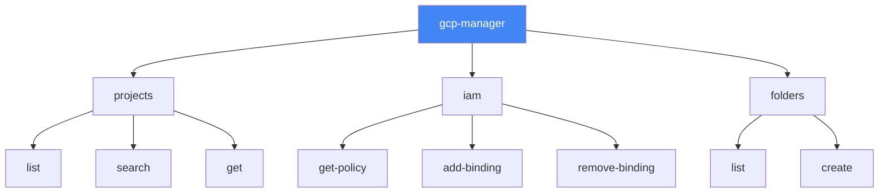

# How to Build a Go CLI Tool That Manages GCP Resources Using the Cloud Resource Manager Client Library

Author: [nawazdhandala](https://www.github.com/nawazdhandala)

Tags: GCP, Cloud Resource Manager, Go, CLI, IAM, Google Cloud

Description: Build a Go CLI tool that manages GCP projects, folders, and IAM policies using the Cloud Resource Manager client library for infrastructure automation.

---

Managing GCP resources through the console works for small setups, but once you have dozens of projects across multiple folders, you need better tooling. Building a custom CLI with the Cloud Resource Manager client library gives you exactly what you need - tailored commands for your organization's workflows without the complexity of Terraform for simple operations.

In this post, I will build a Go CLI tool that can list projects, manage IAM policies, and organize resources using the Cloud Resource Manager API.

## Setting Up

We will use the `cobra` library for CLI structure and the GCP client libraries for API access.

```bash
go mod init gcp-manager
go get github.com/spf13/cobra
go get cloud.google.com/go/resourcemanager/apiv3
go get cloud.google.com/go/iam/apiv1/iampb
go get google.golang.org/api/cloudresourcemanager/v3
```

## Project Structure

```
gcp-manager/
  main.go
  cmd/
    root.go
    projects.go
    iam.go
    folders.go
  internal/
    client.go
```

## The Client Wrapper

First, create a client wrapper that handles authentication and provides helper methods.

```go
// internal/client.go
package internal

import (
    "context"
    "fmt"

    resourcemanager "cloud.google.com/go/resourcemanager/apiv3"
    "cloud.google.com/go/resourcemanager/apiv3/resourcemanagerpb"
    "google.golang.org/api/iterator"
)

// GCPClient wraps the Resource Manager client libraries
type GCPClient struct {
    projects *resourcemanager.ProjectsClient
    folders  *resourcemanager.FoldersClient
}

// NewGCPClient creates a new client with all required API connections
func NewGCPClient(ctx context.Context) (*GCPClient, error) {
    projectsClient, err := resourcemanager.NewProjectsClient(ctx)
    if err != nil {
        return nil, fmt.Errorf("failed to create projects client: %w", err)
    }

    foldersClient, err := resourcemanager.NewFoldersClient(ctx)
    if err != nil {
        projectsClient.Close()
        return nil, fmt.Errorf("failed to create folders client: %w", err)
    }

    return &GCPClient{
        projects: projectsClient,
        folders:  foldersClient,
    }, nil
}

// Close cleans up all clients
func (c *GCPClient) Close() {
    c.projects.Close()
    c.folders.Close()
}

// ListProjects returns all projects under a given parent (org or folder)
func (c *GCPClient) ListProjects(ctx context.Context, parent string) ([]*resourcemanagerpb.Project, error) {
    var projects []*resourcemanagerpb.Project

    req := &resourcemanagerpb.ListProjectsRequest{
        Parent: parent,
    }

    iter := c.projects.ListProjects(ctx, req)
    for {
        project, err := iter.Next()
        if err == iterator.Done {
            break
        }
        if err != nil {
            return nil, fmt.Errorf("error listing projects: %w", err)
        }
        projects = append(projects, project)
    }

    return projects, nil
}

// SearchProjects finds projects matching a query
func (c *GCPClient) SearchProjects(ctx context.Context, query string) ([]*resourcemanagerpb.Project, error) {
    var projects []*resourcemanagerpb.Project

    req := &resourcemanagerpb.SearchProjectsRequest{
        Query: query,
    }

    iter := c.projects.SearchProjects(ctx, req)
    for {
        project, err := iter.Next()
        if err == iterator.Done {
            break
        }
        if err != nil {
            return nil, fmt.Errorf("error searching projects: %w", err)
        }
        projects = append(projects, project)
    }

    return projects, nil
}

// GetProject retrieves details for a specific project
func (c *GCPClient) GetProject(ctx context.Context, projectID string) (*resourcemanagerpb.Project, error) {
    req := &resourcemanagerpb.GetProjectRequest{
        Name: fmt.Sprintf("projects/%s", projectID),
    }

    project, err := c.projects.GetProject(ctx, req)
    if err != nil {
        return nil, fmt.Errorf("failed to get project %s: %w", projectID, err)
    }

    return project, nil
}
```

## The Root Command

```go
// cmd/root.go
package cmd

import (
    "fmt"
    "os"

    "github.com/spf13/cobra"
)

// rootCmd is the base command for the CLI
var rootCmd = &cobra.Command{
    Use:   "gcp-manager",
    Short: "A CLI tool for managing GCP resources",
    Long:  "gcp-manager helps you manage GCP projects, folders, and IAM policies from the command line.",
}

// Execute runs the root command
func Execute() {
    if err := rootCmd.Execute(); err != nil {
        fmt.Fprintln(os.Stderr, err)
        os.Exit(1)
    }
}

func init() {
    // Add subcommands
    rootCmd.AddCommand(projectsCmd)
    rootCmd.AddCommand(iamCmd)
    rootCmd.AddCommand(foldersCmd)
}
```

## The Projects Command

```go
// cmd/projects.go
package cmd

import (
    "context"
    "fmt"
    "os"
    "text/tabwriter"

    "gcp-manager/internal"
    "github.com/spf13/cobra"
)

var projectsCmd = &cobra.Command{
    Use:   "projects",
    Short: "Manage GCP projects",
}

var listProjectsCmd = &cobra.Command{
    Use:   "list",
    Short: "List all projects",
    RunE: func(cmd *cobra.Command, args []string) error {
        ctx := context.Background()

        client, err := internal.NewGCPClient(ctx)
        if err != nil {
            return fmt.Errorf("failed to create client: %w", err)
        }
        defer client.Close()

        parent, _ := cmd.Flags().GetString("parent")

        projects, err := client.ListProjects(ctx, parent)
        if err != nil {
            return err
        }

        // Print projects in a table format
        w := tabwriter.NewWriter(os.Stdout, 0, 0, 2, ' ', 0)
        fmt.Fprintln(w, "PROJECT ID\tNAME\tSTATE\tCREATED")
        for _, p := range projects {
            fmt.Fprintf(w, "%s\t%s\t%s\t%s\n",
                p.ProjectId,
                p.DisplayName,
                p.State.String(),
                p.CreateTime.AsTime().Format("2006-01-02"),
            )
        }
        w.Flush()

        fmt.Printf("\nTotal: %d projects\n", len(projects))
        return nil
    },
}

var searchProjectsCmd = &cobra.Command{
    Use:   "search [query]",
    Short: "Search for projects",
    Args:  cobra.ExactArgs(1),
    RunE: func(cmd *cobra.Command, args []string) error {
        ctx := context.Background()

        client, err := internal.NewGCPClient(ctx)
        if err != nil {
            return err
        }
        defer client.Close()

        projects, err := client.SearchProjects(ctx, args[0])
        if err != nil {
            return err
        }

        w := tabwriter.NewWriter(os.Stdout, 0, 0, 2, ' ', 0)
        fmt.Fprintln(w, "PROJECT ID\tNAME\tSTATE")
        for _, p := range projects {
            fmt.Fprintf(w, "%s\t%s\t%s\n",
                p.ProjectId, p.DisplayName, p.State.String())
        }
        w.Flush()

        return nil
    },
}

func init() {
    listProjectsCmd.Flags().String("parent", "", "Parent resource (e.g., folders/123 or organizations/456)")
    projectsCmd.AddCommand(listProjectsCmd)
    projectsCmd.AddCommand(searchProjectsCmd)
}
```

## The IAM Command

Managing IAM policies is one of the most common tasks in GCP administration.

```go
// cmd/iam.go
package cmd

import (
    "context"
    "fmt"
    "os"
    "text/tabwriter"

    "gcp-manager/internal"
    "github.com/spf13/cobra"
    iampb "google.golang.org/genproto/googleapis/iam/v1"
)

var iamCmd = &cobra.Command{
    Use:   "iam",
    Short: "Manage IAM policies",
}

var getIAMCmd = &cobra.Command{
    Use:   "get-policy [project-id]",
    Short: "Get IAM policy for a project",
    Args:  cobra.ExactArgs(1),
    RunE: func(cmd *cobra.Command, args []string) error {
        ctx := context.Background()
        projectID := args[0]

        client, err := internal.NewGCPClient(ctx)
        if err != nil {
            return err
        }
        defer client.Close()

        policy, err := client.GetIAMPolicy(ctx, projectID)
        if err != nil {
            return err
        }

        // Display the policy in a readable format
        w := tabwriter.NewWriter(os.Stdout, 0, 0, 2, ' ', 0)
        fmt.Fprintf(w, "IAM Policy for project: %s\n\n", projectID)
        fmt.Fprintln(w, "ROLE\tMEMBER")

        for _, binding := range policy.Bindings {
            for _, member := range binding.Members {
                fmt.Fprintf(w, "%s\t%s\n", binding.Role, member)
            }
        }
        w.Flush()

        return nil
    },
}

var addBindingCmd = &cobra.Command{
    Use:   "add-binding",
    Short: "Add an IAM binding to a project",
    RunE: func(cmd *cobra.Command, args []string) error {
        ctx := context.Background()

        projectID, _ := cmd.Flags().GetString("project")
        role, _ := cmd.Flags().GetString("role")
        member, _ := cmd.Flags().GetString("member")

        if projectID == "" || role == "" || member == "" {
            return fmt.Errorf("project, role, and member are required")
        }

        client, err := internal.NewGCPClient(ctx)
        if err != nil {
            return err
        }
        defer client.Close()

        if err := client.AddIAMBinding(ctx, projectID, role, member); err != nil {
            return err
        }

        fmt.Printf("Added %s to %s on project %s\n", member, role, projectID)
        return nil
    },
}

func init() {
    addBindingCmd.Flags().String("project", "", "Project ID")
    addBindingCmd.Flags().String("role", "", "IAM role (e.g., roles/viewer)")
    addBindingCmd.Flags().String("member", "", "Member (e.g., user:email@example.com)")

    iamCmd.AddCommand(getIAMCmd)
    iamCmd.AddCommand(addBindingCmd)
}
```

## IAM Client Methods

```go
// Add these to internal/client.go

// GetIAMPolicy retrieves the IAM policy for a project
func (c *GCPClient) GetIAMPolicy(ctx context.Context, projectID string) (*iampb.Policy, error) {
    req := &iampb.GetIamPolicyRequest{
        Resource: fmt.Sprintf("projects/%s", projectID),
    }

    policy, err := c.projects.GetIamPolicy(ctx, req)
    if err != nil {
        return nil, fmt.Errorf("failed to get IAM policy: %w", err)
    }

    return policy, nil
}

// AddIAMBinding adds a role binding to a project's IAM policy
func (c *GCPClient) AddIAMBinding(ctx context.Context, projectID, role, member string) error {
    // Get the current policy first
    policy, err := c.GetIAMPolicy(ctx, projectID)
    if err != nil {
        return err
    }

    // Check if the binding already exists
    found := false
    for _, binding := range policy.Bindings {
        if binding.Role == role {
            // Check if the member is already in this binding
            for _, m := range binding.Members {
                if m == member {
                    return fmt.Errorf("binding already exists")
                }
            }
            binding.Members = append(binding.Members, member)
            found = true
            break
        }
    }

    // If no binding exists for this role, create one
    if !found {
        policy.Bindings = append(policy.Bindings, &iampb.Binding{
            Role:    role,
            Members: []string{member},
        })
    }

    // Set the updated policy
    req := &iampb.SetIamPolicyRequest{
        Resource: fmt.Sprintf("projects/%s", projectID),
        Policy:   policy,
    }

    _, err = c.projects.SetIamPolicy(ctx, req)
    return err
}
```

## The Main Entry Point

```go
// main.go
package main

import "gcp-manager/cmd"

func main() {
    cmd.Execute()
}
```

## Usage Examples

```bash
# Build the CLI
go build -o gcp-manager

# List projects under an organization
./gcp-manager projects list --parent "organizations/123456789"

# Search for projects by name
./gcp-manager projects search "displayName:production*"

# Get IAM policy for a project
./gcp-manager iam get-policy my-project-id

# Add an IAM binding
./gcp-manager iam add-binding \
  --project my-project-id \
  --role roles/viewer \
  --member "user:developer@example.com"
```

## CLI Command Structure



## Wrapping Up

Building a custom CLI for GCP resource management gives your team exactly the commands they need, with the right guardrails and defaults for your organization. The Cloud Resource Manager client library handles authentication and API complexity, while cobra provides a polished CLI experience. Start with the operations your team runs most frequently and expand from there.

For monitoring the GCP resources you manage with this tool, OneUptime can help you track project-level metrics, IAM changes, and resource utilization across your organization.
