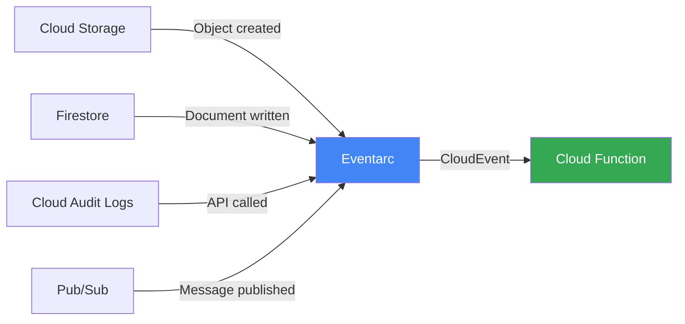
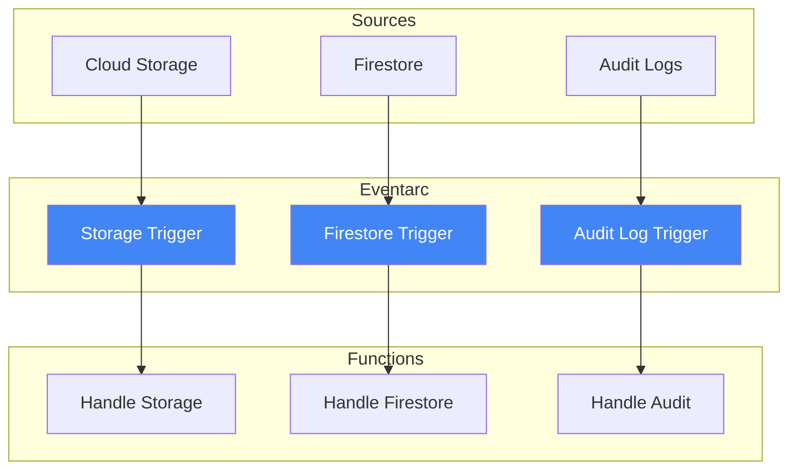

# How to Build a Go Event-Driven Microservice with Cloud Functions and Eventarc Triggers

Author: [nawazdhandala](https://www.github.com/nawazdhandala)

Tags: GCP, Cloud Functions, Eventarc, Go, Event-Driven, Microservices

Description: Build a Go event-driven microservice using Cloud Functions with Eventarc triggers to react to events from Cloud Storage, Pub/Sub, and other GCP services.

---

Event-driven architecture is about reacting to things that happen rather than constantly checking if something changed. On GCP, Eventarc is the glue that connects events from various sources - Cloud Storage uploads, Firestore document changes, Pub/Sub messages, Cloud Audit Log entries - to your Cloud Functions.

In this post, I will show you how to build a Go microservice using Cloud Functions that reacts to events through Eventarc. We will handle events from multiple sources and see how the CloudEvents format standardizes event handling.

## What Is Eventarc?

Eventarc routes events from GCP services to your Cloud Functions (or Cloud Run services). Think of it as a managed event bus. You define triggers that specify what events to listen for and where to send them.



## Project Setup

```bash
# Initialize the project
mkdir eventdriven-service && cd eventdriven-service
go mod init eventdriven-service

# Install dependencies
go get github.com/GoogleCloudPlatform/functions-framework-go/functions
go get github.com/cloudevents/sdk-go/v2
```

## Understanding CloudEvents

Eventarc delivers events in the CloudEvents format. This is a CNCF standard that gives every event a consistent structure regardless of the source.

```go
package myfunction

import (
    "context"
    "encoding/json"
    "fmt"
    "log"
    "time"

    "github.com/GoogleCloudPlatform/functions-framework-go/functions"
    "github.com/cloudevents/sdk-go/v2/event"
)

// init registers all the event handler functions
func init() {
    // Register different handlers for different event types
    functions.CloudEvent("HandleStorageEvent", HandleStorageEvent)
    functions.CloudEvent("HandleFirestoreEvent", HandleFirestoreEvent)
    functions.CloudEvent("HandleAuditLogEvent", HandleAuditLogEvent)
}
```

## Handling Cloud Storage Events

When a file is uploaded to a bucket, Eventarc sends a CloudEvent with the file metadata.

```go
// StorageEventData represents the data payload from a Cloud Storage event
type StorageEventData struct {
    Bucket         string    `json:"bucket"`
    Name           string    `json:"name"`
    ContentType    string    `json:"contentType"`
    Size           string    `json:"size"`
    TimeCreated    time.Time `json:"timeCreated"`
    Metageneration string    `json:"metageneration"`
}

// HandleStorageEvent processes Cloud Storage object events
func HandleStorageEvent(ctx context.Context, e event.Event) error {
    log.Printf("Received event: ID=%s, Type=%s, Source=%s",
        e.ID(), e.Type(), e.Source())

    // Parse the event data
    var data StorageEventData
    if err := e.DataAs(&data); err != nil {
        return fmt.Errorf("failed to parse event data: %w", err)
    }

    log.Printf("Storage event: file=%s, bucket=%s, type=%s, size=%s",
        data.Name, data.Bucket, data.ContentType, data.Size)

    // Route processing based on the event type
    switch e.Type() {
    case "google.cloud.storage.object.v1.finalized":
        return handleFileCreated(ctx, data)
    case "google.cloud.storage.object.v1.deleted":
        return handleFileDeleted(ctx, data)
    case "google.cloud.storage.object.v1.metadataUpdated":
        return handleMetadataUpdated(ctx, data)
    default:
        log.Printf("Unhandled event type: %s", e.Type())
        return nil
    }
}

// handleFileCreated processes newly uploaded files
func handleFileCreated(ctx context.Context, data StorageEventData) error {
    log.Printf("New file uploaded: gs://%s/%s", data.Bucket, data.Name)

    // Add your processing logic here
    // Examples: resize images, parse CSVs, validate uploads

    return nil
}

// handleFileDeleted handles file deletion events
func handleFileDeleted(ctx context.Context, data StorageEventData) error {
    log.Printf("File deleted: gs://%s/%s", data.Bucket, data.Name)

    // Clean up related resources, remove from indexes, etc.

    return nil
}

// handleMetadataUpdated processes metadata change events
func handleMetadataUpdated(ctx context.Context, data StorageEventData) error {
    log.Printf("Metadata updated for: gs://%s/%s", data.Bucket, data.Name)
    return nil
}
```

## Handling Firestore Events

Eventarc can trigger on Firestore document writes, creates, updates, and deletes.

```go
// FirestoreEventData represents the data from a Firestore event
type FirestoreEventData struct {
    OldValue *FirestoreDocument `json:"oldValue,omitempty"`
    Value    *FirestoreDocument `json:"value,omitempty"`
    UpdateMask struct {
        FieldPaths []string `json:"fieldPaths"`
    } `json:"updateMask"`
}

// FirestoreDocument represents a Firestore document in the event payload
type FirestoreDocument struct {
    Name       string                 `json:"name"`
    Fields     map[string]interface{} `json:"fields"`
    CreateTime time.Time              `json:"createTime"`
    UpdateTime time.Time              `json:"updateTime"`
}

// HandleFirestoreEvent processes Firestore document change events
func HandleFirestoreEvent(ctx context.Context, e event.Event) error {
    log.Printf("Firestore event: Type=%s", e.Type())

    var data FirestoreEventData
    if err := e.DataAs(&data); err != nil {
        return fmt.Errorf("failed to parse Firestore event: %w", err)
    }

    // Check what kind of change happened
    switch {
    case data.OldValue == nil && data.Value != nil:
        log.Printf("Document created: %s", data.Value.Name)
        return handleDocumentCreated(ctx, data.Value)
    case data.OldValue != nil && data.Value != nil:
        log.Printf("Document updated: %s, changed fields: %v",
            data.Value.Name, data.UpdateMask.FieldPaths)
        return handleDocumentUpdated(ctx, data.OldValue, data.Value)
    case data.OldValue != nil && data.Value == nil:
        log.Printf("Document deleted: %s", data.OldValue.Name)
        return handleDocumentDeleted(ctx, data.OldValue)
    }

    return nil
}

func handleDocumentCreated(ctx context.Context, doc *FirestoreDocument) error {
    // Send welcome email, initialize user settings, etc.
    log.Printf("Processing new document: %s", doc.Name)
    return nil
}

func handleDocumentUpdated(ctx context.Context, old, new *FirestoreDocument) error {
    // Check for specific field changes and react accordingly
    log.Printf("Processing document update: %s", new.Name)
    return nil
}

func handleDocumentDeleted(ctx context.Context, doc *FirestoreDocument) error {
    // Clean up associated resources
    log.Printf("Processing document deletion: %s", doc.Name)
    return nil
}
```

## Handling Cloud Audit Log Events

Audit log triggers let you react when someone calls a GCP API. This is powerful for security monitoring and automation.

```go
// AuditLogEvent represents a Cloud Audit Log event
type AuditLogEvent struct {
    ProtoPayload struct {
        MethodName         string `json:"methodName"`
        ResourceName       string `json:"resourceName"`
        ServiceName        string `json:"serviceName"`
        AuthenticationInfo struct {
            PrincipalEmail string `json:"principalEmail"`
        } `json:"authenticationInfo"`
    } `json:"protoPayload"`
}

// HandleAuditLogEvent processes Cloud Audit Log events
func HandleAuditLogEvent(ctx context.Context, e event.Event) error {
    log.Printf("Audit log event: Type=%s, Subject=%s", e.Type(), e.Subject())

    var data AuditLogEvent
    if err := e.DataAs(&data); err != nil {
        return fmt.Errorf("failed to parse audit log event: %w", err)
    }

    method := data.ProtoPayload.MethodName
    principal := data.ProtoPayload.AuthenticationInfo.PrincipalEmail
    resource := data.ProtoPayload.ResourceName

    log.Printf("API call: %s by %s on %s", method, principal, resource)

    // Example: Alert on sensitive operations
    if isSensitiveOperation(method) {
        return sendSecurityAlert(ctx, method, principal, resource)
    }

    return nil
}

// isSensitiveOperation checks if the API method is security-sensitive
func isSensitiveOperation(method string) bool {
    sensitiveOps := map[string]bool{
        "google.iam.admin.v1.CreateServiceAccountKey": true,
        "google.iam.admin.v1.SetIamPolicy":            true,
        "google.cloud.sql.v1.Users.Update":             true,
    }
    return sensitiveOps[method]
}

func sendSecurityAlert(ctx context.Context, method, principal, resource string) error {
    log.Printf("SECURITY ALERT: %s called %s on %s", principal, method, resource)
    // Send to Slack, PagerDuty, or your alerting system
    return nil
}
```

## Deploying with Eventarc Triggers

Deploy the function and set up the Eventarc triggers.

```bash
# Deploy the Cloud Storage event handler
gcloud functions deploy handle-storage-event \
  --gen2 \
  --runtime=go122 \
  --region=us-central1 \
  --entry-point=HandleStorageEvent \
  --trigger-event-filters="type=google.cloud.storage.object.v1.finalized" \
  --trigger-event-filters="bucket=my-uploads-bucket"

# Deploy the Firestore event handler
gcloud functions deploy handle-firestore-event \
  --gen2 \
  --runtime=go122 \
  --region=us-central1 \
  --entry-point=HandleFirestoreEvent \
  --trigger-event-filters="type=google.cloud.firestore.document.v1.written" \
  --trigger-event-filters="database=(default)" \
  --trigger-event-filters-path-pattern="document=users/{userId}"

# Deploy the Audit Log event handler
gcloud functions deploy handle-audit-log \
  --gen2 \
  --runtime=go122 \
  --region=us-central1 \
  --entry-point=HandleAuditLogEvent \
  --trigger-event-filters="type=google.cloud.audit.log.v1.written" \
  --trigger-event-filters="serviceName=iam.googleapis.com" \
  --trigger-event-filters="methodName=google.iam.admin.v1.CreateServiceAccountKey"
```

## Event Processing Architecture



## Best Practices

1. **Keep functions focused** - Each function should handle one type of event. Do not build a monolithic handler that processes everything.

2. **Make handlers idempotent** - Events can be delivered more than once. Your handler should produce the same result if called with the same event twice.

3. **Handle errors carefully** - Return an error to trigger a retry. Return nil (even on failure) if retrying will not help.

4. **Set appropriate timeouts** - Eventarc events have a delivery deadline. Make sure your function finishes within that window.

5. **Use event filtering** - Be specific with your triggers. Do not process events you do not care about.

## Wrapping Up

Eventarc with Cloud Functions gives you a clean, serverless way to build event-driven systems on GCP. The CloudEvents standard means your event handling code is consistent regardless of the source, and Eventarc handles the routing and delivery. The key is to keep your functions small, focused, and idempotent.

For monitoring your event-driven architecture - tracking event delivery rates, function execution times, and error rates across all your triggers - OneUptime can provide the observability you need to run reliably in production.
