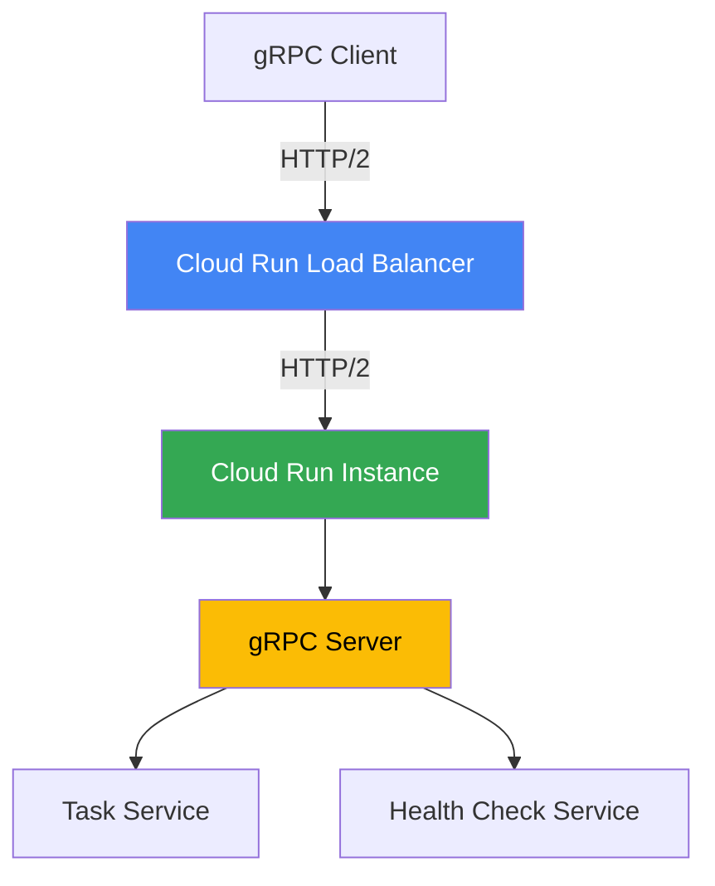

# How to Build a Go gRPC Service and Deploy It to Cloud Run with Health Check Endpoints

Author: [nawazdhandala](https://www.github.com/nawazdhandala)

Tags: GCP, Cloud Run, Go, gRPC, Health Checks, Microservices

Description: Build a Go gRPC service with proper health check endpoints and deploy it to Cloud Run for scalable, low-latency microservice communication.

---

Cloud Run has supported gRPC since its early days, and the experience has gotten smoother over time. If you are building microservices that need low-latency communication with strong typing, gRPC on Cloud Run is a solid choice. You get automatic scaling, TLS termination, and HTTP/2 support out of the box.

The one thing that trips people up is health checks. Cloud Run uses HTTP health probes, and your gRPC service needs to handle those correctly. This guide covers building a gRPC service in Go, adding health checks, and deploying it to Cloud Run.

## Defining the Protocol Buffers

Let us build a simple task management service. Start with the proto definition.

```protobuf
// task.proto - Service definition for the task management gRPC service
syntax = "proto3";

package task;
option go_package = "taskpb";

service TaskService {
  rpc CreateTask(CreateTaskRequest) returns (Task);
  rpc GetTask(GetTaskRequest) returns (Task);
  rpc ListTasks(ListTasksRequest) returns (ListTasksResponse);
  rpc UpdateTask(UpdateTaskRequest) returns (Task);
  rpc DeleteTask(DeleteTaskRequest) returns (DeleteTaskResponse);
}

message Task {
  string id = 1;
  string title = 2;
  string description = 3;
  bool completed = 4;
  string created_at = 5;
}

message CreateTaskRequest {
  string title = 1;
  string description = 2;
}

message GetTaskRequest {
  string id = 1;
}

message ListTasksRequest {
  int32 page_size = 1;
  string page_token = 2;
}

message ListTasksResponse {
  repeated Task tasks = 1;
  string next_page_token = 2;
}

message UpdateTaskRequest {
  string id = 1;
  string title = 2;
  string description = 3;
  bool completed = 4;
}

message DeleteTaskRequest {
  string id = 1;
}

message DeleteTaskResponse {
  bool success = 1;
}
```

Generate the Go code:

```bash
# Install protoc plugins for Go
go install google.golang.org/protobuf/cmd/protoc-gen-go@latest
go install google.golang.org/grpc/cmd/protoc-gen-go-grpc@latest

# Generate Go code from the proto file
protoc --go_out=. --go-grpc_out=. task.proto
```

## Implementing the Service

```go
package main

import (
    "context"
    "fmt"
    "log"
    "sync"
    "time"

    "github.com/google/uuid"
    pb "your-module/taskpb"
    "google.golang.org/grpc/codes"
    "google.golang.org/grpc/status"
)

// taskServer implements the TaskServiceServer interface
type taskServer struct {
    pb.UnimplementedTaskServiceServer
    mu    sync.RWMutex
    tasks map[string]*pb.Task
}

func newTaskServer() *taskServer {
    return &taskServer{
        tasks: make(map[string]*pb.Task),
    }
}

// CreateTask creates a new task and returns it
func (s *taskServer) CreateTask(ctx context.Context, req *pb.CreateTaskRequest) (*pb.Task, error) {
    if req.Title == "" {
        return nil, status.Errorf(codes.InvalidArgument, "title is required")
    }

    task := &pb.Task{
        Id:          uuid.New().String(),
        Title:       req.Title,
        Description: req.Description,
        Completed:   false,
        CreatedAt:   time.Now().UTC().Format(time.RFC3339),
    }

    s.mu.Lock()
    s.tasks[task.Id] = task
    s.mu.Unlock()

    log.Printf("Created task: %s", task.Id)
    return task, nil
}

// GetTask retrieves a task by its ID
func (s *taskServer) GetTask(ctx context.Context, req *pb.GetTaskRequest) (*pb.Task, error) {
    s.mu.RLock()
    task, exists := s.tasks[req.Id]
    s.mu.RUnlock()

    if !exists {
        return nil, status.Errorf(codes.NotFound, "task %s not found", req.Id)
    }

    return task, nil
}

// ListTasks returns all tasks with pagination
func (s *taskServer) ListTasks(ctx context.Context, req *pb.ListTasksRequest) (*pb.ListTasksResponse, error) {
    s.mu.RLock()
    defer s.mu.RUnlock()

    var tasks []*pb.Task
    for _, t := range s.tasks {
        tasks = append(tasks, t)
    }

    return &pb.ListTasksResponse{
        Tasks: tasks,
    }, nil
}

// DeleteTask removes a task by ID
func (s *taskServer) DeleteTask(ctx context.Context, req *pb.DeleteTaskRequest) (*pb.DeleteTaskResponse, error) {
    s.mu.Lock()
    _, exists := s.tasks[req.Id]
    if exists {
        delete(s.tasks, req.Id)
    }
    s.mu.Unlock()

    if !exists {
        return nil, status.Errorf(codes.NotFound, "task %s not found", req.Id)
    }

    return &pb.DeleteTaskResponse{Success: true}, nil
}
```

## Adding Health Checks

Cloud Run supports three types of health probes: startup, liveness, and gRPC health checks. The gRPC health checking protocol is the cleanest option for gRPC services.

```go
package main

import (
    "google.golang.org/grpc"
    "google.golang.org/grpc/health"
    "google.golang.org/grpc/health/grpc_health_v1"
)

// setupHealthCheck registers the gRPC health check service
func setupHealthCheck(server *grpc.Server) *health.Server {
    // Create the health check server
    healthServer := health.NewServer()

    // Register the health service with the gRPC server
    grpc_health_v1.RegisterHealthServer(server, healthServer)

    // Set the service status to SERVING
    // The empty string represents the overall server health
    healthServer.SetServingStatus("", grpc_health_v1.HealthCheckResponse_SERVING)

    // You can also set health for specific services
    healthServer.SetServingStatus("task.TaskService",
        grpc_health_v1.HealthCheckResponse_SERVING)

    return healthServer
}
```

## The Main Function

Tie everything together with the server setup, including an HTTP health check endpoint for Cloud Run's startup probe.

```go
package main

import (
    "context"
    "fmt"
    "log"
    "net"
    "net/http"
    "os"
    "os/signal"
    "syscall"

    "google.golang.org/grpc"
    "google.golang.org/grpc/reflection"
)

func main() {
    port := os.Getenv("PORT")
    if port == "" {
        port = "8080"
    }

    // Create a TCP listener
    listener, err := net.Listen("tcp", ":"+port)
    if err != nil {
        log.Fatalf("Failed to listen: %v", err)
    }

    // Create the gRPC server with interceptors
    server := grpc.NewServer(
        grpc.UnaryInterceptor(loggingInterceptor),
    )

    // Register the task service
    pb.RegisterTaskServiceServer(server, newTaskServer())

    // Register health check service
    healthSrv := setupHealthCheck(server)

    // Enable reflection for debugging with grpcurl
    reflection.Register(server)

    // Handle graceful shutdown
    ctx, stop := signal.NotifyContext(context.Background(), syscall.SIGTERM, syscall.SIGINT)
    defer stop()

    go func() {
        <-ctx.Done()
        log.Println("Shutting down gRPC server...")
        healthSrv.SetServingStatus("", grpc_health_v1.HealthCheckResponse_NOT_SERVING)
        server.GracefulStop()
    }()

    log.Printf("gRPC server listening on port %s", port)
    if err := server.Serve(listener); err != nil {
        log.Fatalf("Server failed: %v", err)
    }
}

// loggingInterceptor logs each gRPC call
func loggingInterceptor(
    ctx context.Context,
    req interface{},
    info *grpc.UnaryServerInfo,
    handler grpc.UnaryHandler,
) (interface{}, error) {
    log.Printf("gRPC call: %s", info.FullMethod)
    resp, err := handler(ctx, req)
    if err != nil {
        log.Printf("gRPC error: %s - %v", info.FullMethod, err)
    }
    return resp, err
}
```

## Cloud Run Configuration

The Dockerfile uses a multi-stage build:

```dockerfile
FROM golang:1.22-alpine AS builder
WORKDIR /app
COPY go.mod go.sum ./
RUN go mod download
COPY . .
RUN CGO_ENABLED=0 go build -o server .

FROM gcr.io/distroless/static-debian12
COPY --from=builder /app/server /server
CMD ["/server"]
```

Deploy with gRPC-specific settings:

```bash
# Build the image
gcloud builds submit --tag gcr.io/YOUR_PROJECT/task-grpc

# Deploy with HTTP/2 and gRPC health checks
gcloud run deploy task-grpc \
  --image gcr.io/YOUR_PROJECT/task-grpc \
  --region us-central1 \
  --use-http2 \
  --port 8080 \
  --liveness-probe grpc-liveness \
  --startup-probe grpc-startup
```

The `--use-http2` flag is critical. Without it, Cloud Run terminates HTTP/2 at the load balancer, and your gRPC service will not work.

## Architecture



## Testing with grpcurl

```bash
# List available services
grpcurl -plaintext localhost:8080 list

# Create a task
grpcurl -plaintext -d '{"title": "Ship feature", "description": "Deploy to prod"}' \
  localhost:8080 task.TaskService/CreateTask

# Check health
grpcurl -plaintext localhost:8080 grpc.health.v1.Health/Check
```

## Wrapping Up

gRPC on Cloud Run gives you typed contracts, efficient serialization, and streaming support - all with serverless scaling. The health check setup is the part most people miss, but it is essential for Cloud Run to properly manage your instances. Make sure to use the gRPC health checking protocol, set `--use-http2` on deployment, and handle graceful shutdown to avoid dropped connections during scale-down.

For monitoring your gRPC services in production - tracking per-method latency, error rates, and health check status - OneUptime can help you set up comprehensive observability for your microservice architecture.
