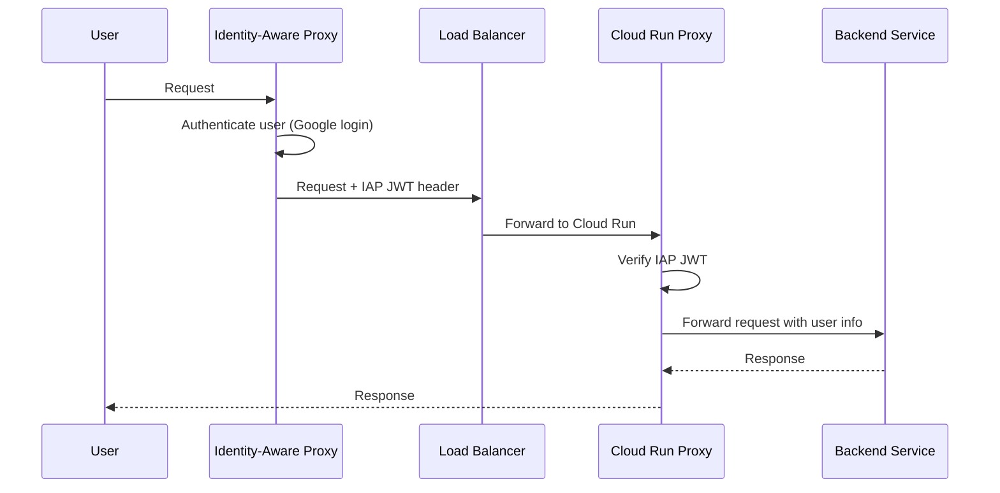

# How to Build a Go HTTP Proxy on Cloud Run That Authenticates Requests with Identity-Aware Proxy

Author: [nawazdhandala](https://www.github.com/nawazdhandala)

Tags: GCP, Cloud Run, Identity-Aware Proxy, Go, Authentication, Security

Description: Build a Go HTTP proxy on Cloud Run that validates Identity-Aware Proxy JWT tokens to secure internal services with Google-managed authentication.

---

Identity-Aware Proxy (IAP) is one of GCP's better-kept secrets. It sits in front of your application and handles user authentication before any request reaches your code. No login pages to build, no session management to worry about, no OAuth flow to implement. IAP handles it all and passes you a signed JWT with the authenticated user's identity.

In this post, I will build a Go HTTP proxy on Cloud Run that verifies IAP JWT tokens and forwards authenticated requests to backend services. This is useful when you want to put multiple internal tools behind a single authentication layer.

## How IAP Works with Cloud Run



## Setting Up IAP

Before writing code, you need to set up IAP on your Cloud Run service.

```bash
# Create a load balancer in front of Cloud Run
# (IAP requires a load balancer - it does not work directly with Cloud Run URLs)

# Create a serverless NEG
gcloud compute network-endpoint-groups create proxy-neg \
  --region=us-central1 \
  --network-endpoint-type=serverless \
  --cloud-run-service=my-proxy

# Create backend service
gcloud compute backend-services create proxy-backend \
  --global \
  --load-balancing-scheme=EXTERNAL

# Add the NEG to the backend service
gcloud compute backend-services add-backend proxy-backend \
  --global \
  --network-endpoint-group=proxy-neg \
  --network-endpoint-group-region=us-central1

# Enable IAP on the backend service
gcloud compute backend-services update proxy-backend \
  --global \
  --iap=enabled
```

## The Proxy Server

Let us build the proxy step by step.

### JWT Verification

IAP sends a signed JWT in the `X-Goog-IAP-JWT-Assertion` header. You need to verify this token before trusting its claims.

```go
package main

import (
    "context"
    "encoding/json"
    "fmt"
    "log"
    "net/http"
    "net/http/httputil"
    "net/url"
    "os"
    "strings"

    "google.golang.org/api/idtoken"
)

// IAPClaims represents the claims extracted from an IAP JWT token
type IAPClaims struct {
    Email  string `json:"email"`
    Sub    string `json:"sub"`
    Issuer string `json:"iss"`
}

// verifyIAPJWT validates the IAP JWT token from the request header
func verifyIAPJWT(r *http.Request, expectedAudience string) (*IAPClaims, error) {
    // IAP puts the JWT in this specific header
    iapJWT := r.Header.Get("X-Goog-IAP-JWT-Assertion")
    if iapJWT == "" {
        return nil, fmt.Errorf("missing X-Goog-IAP-JWT-Assertion header")
    }

    // Validate the token using Google's ID token verifier
    // This checks the signature, expiration, issuer, and audience
    payload, err := idtoken.Validate(r.Context(), iapJWT, expectedAudience)
    if err != nil {
        return nil, fmt.Errorf("JWT validation failed: %w", err)
    }

    // Extract user identity from the claims
    claims := &IAPClaims{}

    if email, ok := payload.Claims["email"].(string); ok {
        claims.Email = email
    }
    if sub, ok := payload.Claims["sub"].(string); ok {
        claims.Sub = sub
    }
    if iss, ok := payload.Claims["iss"].(string); ok {
        claims.Issuer = iss
    }

    // Verify the issuer is Google
    if claims.Issuer != "https://cloud.google.com/iap" {
        return nil, fmt.Errorf("unexpected issuer: %s", claims.Issuer)
    }

    return claims, nil
}
```

### Authentication Middleware

```go
// iapAuthMiddleware verifies IAP JWT tokens and adds user info to the context
func iapAuthMiddleware(expectedAudience string) func(http.Handler) http.Handler {
    return func(next http.Handler) http.Handler {
        return http.HandlerFunc(func(w http.ResponseWriter, r *http.Request) {
            // Health check endpoints skip authentication
            if r.URL.Path == "/health" || r.URL.Path == "/_ah/health" {
                next.ServeHTTP(w, r)
                return
            }

            claims, err := verifyIAPJWT(r, expectedAudience)
            if err != nil {
                log.Printf("IAP authentication failed: %v", err)
                http.Error(w, "Authentication failed", http.StatusUnauthorized)
                return
            }

            log.Printf("Authenticated user: %s", claims.Email)

            // Add user info to the request context
            ctx := context.WithValue(r.Context(), "user_email", claims.Email)
            ctx = context.WithValue(ctx, "user_sub", claims.Sub)

            // Add user info as headers for the backend
            r.Header.Set("X-Authenticated-User", claims.Email)
            r.Header.Set("X-User-ID", claims.Sub)

            next.ServeHTTP(w, r.WithContext(ctx))
        })
    }
}
```

### The Reverse Proxy

The proxy forwards authenticated requests to backend services based on the URL path.

```go
// ProxyConfig defines the routing configuration
type ProxyConfig struct {
    Routes map[string]string // path prefix -> backend URL
}

// ProxyServer handles routing and forwarding requests
type ProxyServer struct {
    config  ProxyConfig
    proxies map[string]*httputil.ReverseProxy
}

// NewProxyServer creates a new proxy with the given routing configuration
func NewProxyServer(config ProxyConfig) (*ProxyServer, error) {
    proxies := make(map[string]*httputil.ReverseProxy)

    for prefix, backendURL := range config.Routes {
        target, err := url.Parse(backendURL)
        if err != nil {
            return nil, fmt.Errorf("invalid backend URL %s: %w", backendURL, err)
        }

        // Create a reverse proxy for this backend
        proxy := httputil.NewSingleHostReverseProxy(target)

        // Customize the director to modify requests before forwarding
        originalDirector := proxy.Director
        proxy.Director = func(req *http.Request) {
            originalDirector(req)
            // Strip the prefix from the path before forwarding
            req.URL.Path = strings.TrimPrefix(req.URL.Path, prefix)
            if req.URL.Path == "" {
                req.URL.Path = "/"
            }
            // Preserve the host header for the backend
            req.Host = target.Host
        }

        // Handle errors from the backend
        proxy.ErrorHandler = func(w http.ResponseWriter, r *http.Request, err error) {
            log.Printf("Proxy error for %s: %v", r.URL.Path, err)
            http.Error(w, "Backend service unavailable", http.StatusBadGateway)
        }

        proxies[prefix] = proxy
        log.Printf("Route configured: %s -> %s", prefix, backendURL)
    }

    return &ProxyServer{
        config:  config,
        proxies: proxies,
    }, nil
}

// ServeHTTP routes requests to the appropriate backend
func (ps *ProxyServer) ServeHTTP(w http.ResponseWriter, r *http.Request) {
    // Find the matching route
    for prefix, proxy := range ps.proxies {
        if strings.HasPrefix(r.URL.Path, prefix) {
            proxy.ServeHTTP(w, r)
            return
        }
    }

    http.Error(w, "Not Found", http.StatusNotFound)
}
```

### Authorization Rules

Beyond authentication, you might want to restrict certain paths to specific users.

```go
// AuthzRule defines an authorization rule
type AuthzRule struct {
    PathPrefix     string
    AllowedEmails  []string
    AllowedDomains []string
}

// authorizationMiddleware checks if the authenticated user is allowed
func authorizationMiddleware(rules []AuthzRule) func(http.Handler) http.Handler {
    return func(next http.Handler) http.Handler {
        return http.HandlerFunc(func(w http.ResponseWriter, r *http.Request) {
            email, ok := r.Context().Value("user_email").(string)
            if !ok {
                http.Error(w, "Unauthorized", http.StatusUnauthorized)
                return
            }

            // Check authorization rules
            for _, rule := range rules {
                if strings.HasPrefix(r.URL.Path, rule.PathPrefix) {
                    if !isAuthorized(email, rule) {
                        log.Printf("Access denied for %s to %s", email, r.URL.Path)
                        http.Error(w, "Forbidden", http.StatusForbidden)
                        return
                    }
                    break
                }
            }

            next.ServeHTTP(w, r)
        })
    }
}

// isAuthorized checks if an email matches the authorization rule
func isAuthorized(email string, rule AuthzRule) bool {
    // Check explicit email allowlist
    for _, allowed := range rule.AllowedEmails {
        if email == allowed {
            return true
        }
    }

    // Check domain allowlist
    parts := strings.SplitN(email, "@", 2)
    if len(parts) == 2 {
        domain := parts[1]
        for _, allowed := range rule.AllowedDomains {
            if domain == allowed {
                return true
            }
        }
    }

    // If no rules match, deny by default
    return len(rule.AllowedEmails) == 0 && len(rule.AllowedDomains) == 0
}
```

### Main Function

```go
func main() {
    // IAP audience is the OAuth client ID from Cloud Console
    iapAudience := os.Getenv("IAP_AUDIENCE")

    // Configure routing
    config := ProxyConfig{
        Routes: map[string]string{
            "/admin":   os.Getenv("ADMIN_BACKEND_URL"),
            "/api":     os.Getenv("API_BACKEND_URL"),
            "/grafana": os.Getenv("GRAFANA_BACKEND_URL"),
        },
    }

    proxy, err := NewProxyServer(config)
    if err != nil {
        log.Fatalf("Failed to create proxy: %v", err)
    }

    // Build the middleware chain
    var handler http.Handler = proxy

    // Authorization rules
    rules := []AuthzRule{
        {
            PathPrefix:     "/admin",
            AllowedDomains: []string{"mycompany.com"},
            AllowedEmails:  []string{"admin@external.com"},
        },
    }
    handler = authorizationMiddleware(rules)(handler)

    // IAP authentication
    handler = iapAuthMiddleware(iapAudience)(handler)

    // Health check endpoint (outside auth middleware)
    mux := http.NewServeMux()
    mux.HandleFunc("/health", func(w http.ResponseWriter, r *http.Request) {
        w.WriteHeader(http.StatusOK)
    })
    mux.Handle("/", handler)

    port := os.Getenv("PORT")
    if port == "" {
        port = "8080"
    }

    log.Printf("IAP proxy starting on port %s", port)
    log.Fatal(http.ListenAndServe(":"+port, mux))
}
```

## Deployment

```bash
gcloud run deploy my-proxy \
  --image gcr.io/YOUR_PROJECT/iap-proxy \
  --region us-central1 \
  --set-env-vars "IAP_AUDIENCE=/projects/PROJECT_NUM/global/backendServices/BACKEND_ID" \
  --set-env-vars "ADMIN_BACKEND_URL=https://admin-service.run.app" \
  --set-env-vars "API_BACKEND_URL=https://api-service.run.app" \
  --no-allow-unauthenticated
```

## Wrapping Up

Identity-Aware Proxy gives you enterprise-grade authentication without writing authentication code. The Go proxy pattern lets you put a consistent auth layer in front of multiple backend services, and the JWT verification ensures that only properly authenticated requests reach your backends. The authorization middleware adds fine-grained access control on top.

For monitoring your proxy and the backends behind it - tracking latency, error rates, and authentication failures - OneUptime can help you maintain visibility across your entire internal tool stack.
