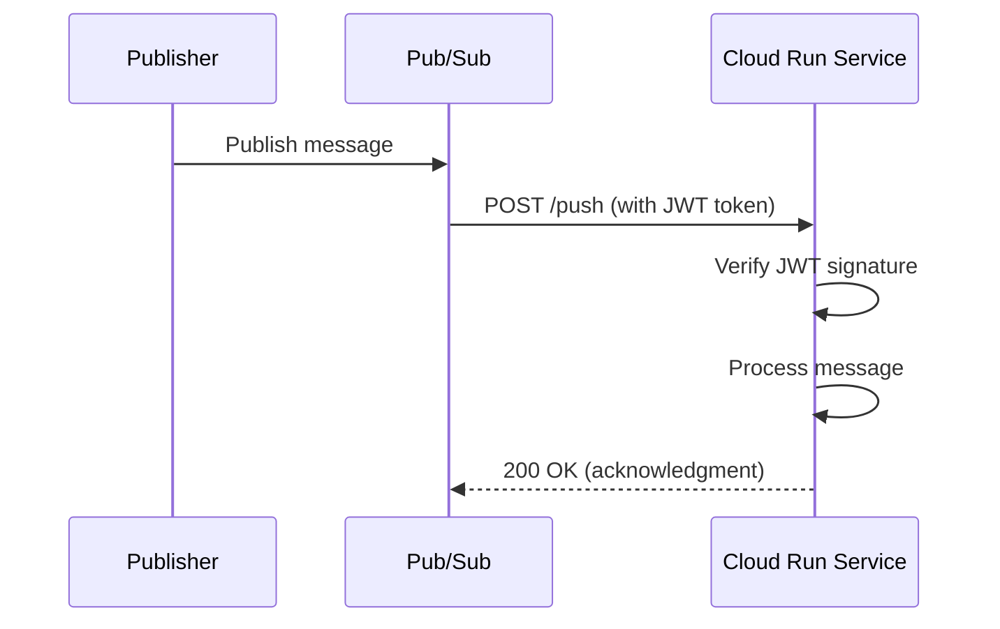

# How to Build a Go Pub/Sub Subscriber Service on Cloud Run with Push Subscriptions and Signature Verification

Author: [nawazdhandala](https://www.github.com/nawazdhandala)

Tags: GCP, Pub/Sub, Cloud Run, Go, Push Subscriptions, Security

Description: Build a Go service on Cloud Run that receives Pub/Sub push messages with proper signature verification for secure message handling.

---

Pub/Sub pull subscriptions work great when you have a long-running process, but on Cloud Run, push subscriptions are the natural fit. Cloud Run scales to zero, and push subscriptions wake it up only when messages arrive. No idle instances burning money, no polling loops.

The catch is that your Cloud Run service is now an HTTP endpoint that receives POST requests from Pub/Sub. Anyone who knows the URL could send fake messages if you do not verify the sender. That is where signature verification comes in.

This guide covers building a Go service that receives Pub/Sub push messages on Cloud Run with proper authentication.

## How Push Subscriptions Work

With a push subscription, Pub/Sub sends an HTTP POST request to your endpoint for each message. The request body contains the message data, and if you configure authentication, it includes a signed JWT token in the Authorization header.



## Setting Up the Infrastructure

Create the topic, push subscription, and a service account for authentication.

```bash
# Create a service account for Pub/Sub to use when pushing messages
gcloud iam service-accounts create pubsub-pusher \
  --display-name="Pub/Sub Push Service Account"

# Grant the service account permission to create tokens
gcloud projects add-iam-policy-binding YOUR_PROJECT \
  --member="serviceAccount:pubsub-pusher@YOUR_PROJECT.iam.gserviceaccount.com" \
  --role="roles/iam.serviceAccountTokenCreator"

# Create the topic
gcloud pubsub topics create orders-topic

# Create a push subscription with authentication
gcloud pubsub subscriptions create orders-push-sub \
  --topic=orders-topic \
  --push-endpoint=https://your-service-xxxxx.run.app/push \
  --push-auth-service-account=pubsub-pusher@YOUR_PROJECT.iam.gserviceaccount.com \
  --push-auth-token-audience=https://your-service-xxxxx.run.app
```

## The Push Message Format

When Pub/Sub pushes a message, the request body looks like this:

```json
{
  "message": {
    "data": "base64-encoded-data",
    "attributes": {
      "key": "value"
    },
    "messageId": "123456789",
    "publishTime": "2026-02-17T10:00:00Z"
  },
  "subscription": "projects/my-project/subscriptions/orders-push-sub"
}
```

## Building the Service

Let us build the Go service step by step.

### Message Types

```go
package main

import (
    "context"
    "encoding/base64"
    "encoding/json"
    "fmt"
    "log"
    "net/http"
    "os"
    "strings"
    "time"

    "google.golang.org/api/idtoken"
)

// PushRequest represents the request body from Pub/Sub push delivery
type PushRequest struct {
    Message      PushMessage `json:"message"`
    Subscription string      `json:"subscription"`
}

// PushMessage represents a single Pub/Sub message in push format
type PushMessage struct {
    Data        string            `json:"data"`
    Attributes  map[string]string `json:"attributes"`
    MessageID   string            `json:"messageId"`
    PublishTime time.Time         `json:"publishTime"`
}

// DecodedData returns the base64-decoded message data
func (m *PushMessage) DecodedData() ([]byte, error) {
    return base64.StdEncoding.DecodeString(m.Data)
}
```

### JWT Verification

This is the critical security piece. We use Google's idtoken library to verify the JWT.

```go
// verifyPushToken validates the JWT token from the Pub/Sub push request
func verifyPushToken(r *http.Request, expectedAudience string) error {
    // Extract the Bearer token from the Authorization header
    authHeader := r.Header.Get("Authorization")
    if authHeader == "" {
        return fmt.Errorf("missing Authorization header")
    }

    // The header format is "Bearer <token>"
    parts := strings.SplitN(authHeader, " ", 2)
    if len(parts) != 2 || parts[0] != "Bearer" {
        return fmt.Errorf("invalid Authorization header format")
    }
    token := parts[1]

    // Validate the token using Google's ID token verifier
    // This checks the signature, expiration, and audience
    payload, err := idtoken.Validate(r.Context(), token, expectedAudience)
    if err != nil {
        return fmt.Errorf("token validation failed: %w", err)
    }

    // Optionally verify the email claim matches your service account
    email, ok := payload.Claims["email"].(string)
    if !ok {
        return fmt.Errorf("missing email claim in token")
    }

    log.Printf("Verified push from service account: %s", email)
    return nil
}
```

### The Push Handler

```go
// handlePush processes incoming Pub/Sub push messages
func handlePush(w http.ResponseWriter, r *http.Request) {
    // Only accept POST requests
    if r.Method != http.MethodPost {
        http.Error(w, "Method not allowed", http.StatusMethodNotAllowed)
        return
    }

    // Verify the JWT signature
    audience := os.Getenv("PUSH_AUDIENCE")
    if audience != "" {
        if err := verifyPushToken(r, audience); err != nil {
            log.Printf("Authentication failed: %v", err)
            http.Error(w, "Unauthorized", http.StatusUnauthorized)
            return
        }
    }

    // Parse the push request body
    var pushReq PushRequest
    if err := json.NewDecoder(r.Body).Decode(&pushReq); err != nil {
        log.Printf("Failed to decode push request: %v", err)
        http.Error(w, "Bad request", http.StatusBadRequest)
        return
    }

    // Decode the message data from base64
    data, err := pushReq.Message.DecodedData()
    if err != nil {
        log.Printf("Failed to decode message data: %v", err)
        http.Error(w, "Bad request", http.StatusBadRequest)
        return
    }

    // Process the message
    log.Printf("Received message %s: %s", pushReq.Message.MessageID, string(data))

    if err := processOrder(r.Context(), data, pushReq.Message.Attributes); err != nil {
        log.Printf("Failed to process message %s: %v", pushReq.Message.MessageID, err)
        // Return 500 so Pub/Sub will retry delivery
        http.Error(w, "Processing failed", http.StatusInternalServerError)
        return
    }

    // Return 200 to acknowledge the message
    // Any 2xx status code tells Pub/Sub the message was processed
    w.WriteHeader(http.StatusOK)
}

// processOrder handles the business logic for an order message
func processOrder(ctx context.Context, data []byte, attrs map[string]string) error {
    var order struct {
        OrderID string  `json:"order_id"`
        Amount  float64 `json:"amount"`
        Product string  `json:"product"`
    }

    if err := json.Unmarshal(data, &order); err != nil {
        return fmt.Errorf("invalid order data: %w", err)
    }

    log.Printf("Processing order %s: %s ($%.2f)", order.OrderID, order.Product, order.Amount)

    // Your business logic goes here - save to database, call APIs, etc.

    return nil
}
```

### The Main Function

```go
func main() {
    // Register the push endpoint
    http.HandleFunc("/push", handlePush)

    // Health check for Cloud Run
    http.HandleFunc("/health", func(w http.ResponseWriter, r *http.Request) {
        w.WriteHeader(http.StatusOK)
    })

    port := os.Getenv("PORT")
    if port == "" {
        port = "8080"
    }

    log.Printf("Starting push subscriber on port %s", port)
    if err := http.ListenAndServe(":"+port, nil); err != nil {
        log.Fatalf("Server failed: %v", err)
    }
}
```

## Error Handling and Retries

Your response code tells Pub/Sub what to do:

- **2xx** - Message acknowledged, will not be redelivered
- **4xx** - Message acknowledged (consider it a permanent failure)
- **5xx** - Message not acknowledged, Pub/Sub will retry

Be thoughtful about which status code you return. If the message data is malformed and will never succeed, return 400 so it does not get retried forever. If your database is temporarily down, return 500 so Pub/Sub retries later.

```go
// handlePushWithRetryLogic demonstrates nuanced error handling
func handlePushWithRetryLogic(w http.ResponseWriter, r *http.Request) {
    var pushReq PushRequest
    if err := json.NewDecoder(r.Body).Decode(&pushReq); err != nil {
        // Malformed request - do not retry
        w.WriteHeader(http.StatusBadRequest)
        return
    }

    data, err := pushReq.Message.DecodedData()
    if err != nil {
        // Bad data - do not retry
        w.WriteHeader(http.StatusBadRequest)
        return
    }

    err = processOrder(r.Context(), data, pushReq.Message.Attributes)
    if err != nil {
        // Check if the error is retryable
        if isRetryable(err) {
            // Return 500 so Pub/Sub retries
            w.WriteHeader(http.StatusInternalServerError)
            return
        }
        // Permanent failure - acknowledge to prevent infinite retries
        log.Printf("Permanent failure for message %s: %v", pushReq.Message.MessageID, err)
        w.WriteHeader(http.StatusOK)
        return
    }

    w.WriteHeader(http.StatusOK)
}
```

## Idempotency

Push subscriptions can deliver the same message more than once, especially during retries. Your handler needs to be idempotent.

```go
// processOrderIdempotent handles duplicate deliveries safely
func processOrderIdempotent(ctx context.Context, messageID string, data []byte) error {
    // Check if we have already processed this message
    // Using the Pub/Sub message ID as a deduplication key
    processed, err := checkIfProcessed(ctx, messageID)
    if err != nil {
        return err
    }

    if processed {
        log.Printf("Message %s already processed, skipping", messageID)
        return nil
    }

    // Process the message
    if err := doProcessing(ctx, data); err != nil {
        return err
    }

    // Mark the message as processed
    return markAsProcessed(ctx, messageID)
}
```

## Deployment

```bash
# Build and deploy to Cloud Run
gcloud builds submit --tag gcr.io/YOUR_PROJECT/push-subscriber

gcloud run deploy push-subscriber \
  --image gcr.io/YOUR_PROJECT/push-subscriber \
  --region us-central1 \
  --set-env-vars "PUSH_AUDIENCE=https://push-subscriber-xxxxx.run.app" \
  --no-allow-unauthenticated

# Grant Pub/Sub permission to invoke the Cloud Run service
gcloud run services add-iam-policy-binding push-subscriber \
  --region us-central1 \
  --member="serviceAccount:pubsub-pusher@YOUR_PROJECT.iam.gserviceaccount.com" \
  --role="roles/run.invoker"
```

## Wrapping Up

Push subscriptions on Cloud Run give you a serverless, event-driven architecture that scales to zero. The JWT verification step is non-negotiable for production - without it, anyone can send messages to your endpoint. Remember to handle idempotency, return the right HTTP status codes for retry behavior, and set a dead-letter topic for messages that repeatedly fail.

For monitoring your push subscription service in production - tracking delivery latency, processing errors, and retry rates - OneUptime can help you set up alerts and dashboards to keep everything running smoothly.
