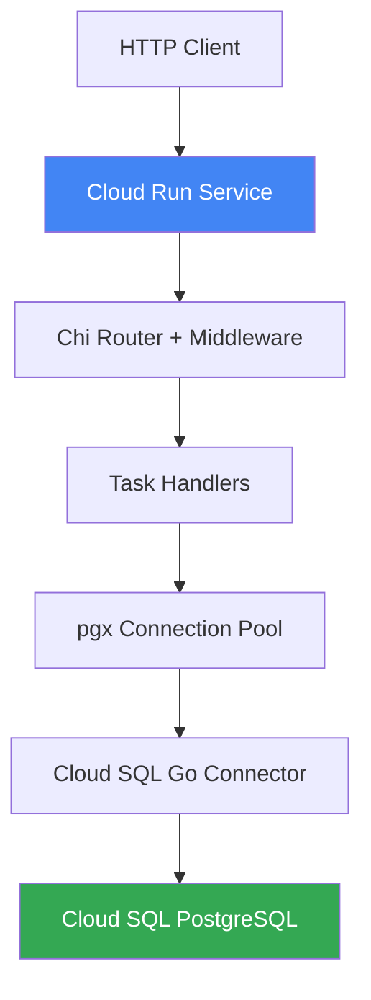

# How to Build a Go REST API with Chi Router and Deploy It to Cloud Run with Cloud SQL Connection

Author: [nawazdhandala](https://www.github.com/nawazdhandala)

Tags: GCP, Cloud Run, Go, Chi Router, Cloud SQL, REST API

Description: Build a production-ready Go REST API using the Chi router framework and deploy it to Cloud Run with a secure Cloud SQL PostgreSQL connection.

---

Building REST APIs in Go is already pleasant thanks to the standard library, but Chi takes it a step further with middleware support, route grouping, and a clean API that stays close to net/http conventions. Pair that with Cloud Run for hosting and Cloud SQL for your database, and you have a solid stack that scales to zero when idle and handles traffic spikes gracefully.

This guide walks through building a simple REST API, connecting it to Cloud SQL PostgreSQL, and deploying the whole thing to Cloud Run.

## Project Setup

Start by initializing your Go module and pulling in the dependencies.

```bash
# Create the project and install dependencies
mkdir chi-api && cd chi-api
go mod init chi-api
go get github.com/go-chi/chi/v5
go get github.com/go-chi/chi/v5/middleware
go get github.com/jackc/pgx/v5/pgxpool
go get cloud.google.com/go/cloudsqlconn
go get cloud.google.com/go/cloudsqlconn/postgres/pgxv5
```

## The Data Model

We will build a simple task management API. Here is the database schema.

```sql
-- Create the tasks table
CREATE TABLE tasks (
    id SERIAL PRIMARY KEY,
    title TEXT NOT NULL,
    description TEXT,
    completed BOOLEAN DEFAULT FALSE,
    created_at TIMESTAMP DEFAULT NOW()
);
```

## Database Connection

Cloud Run connects to Cloud SQL through the Cloud SQL Auth Proxy, which the Go connector handles for you. No need to run a sidecar.

```go
package main

import (
    "context"
    "fmt"
    "log"
    "net"
    "os"

    "cloud.google.com/go/cloudsqlconn"
    "cloud.google.com/go/cloudsqlconn/postgres/pgxv5"
    "github.com/jackc/pgx/v5/pgxpool"
)

// connectDB creates a connection pool to Cloud SQL using the Go connector
func connectDB(ctx context.Context) (*pgxpool.Pool, error) {
    // These come from environment variables set in Cloud Run
    instanceConnection := os.Getenv("INSTANCE_CONNECTION_NAME")
    dbUser := os.Getenv("DB_USER")
    dbPass := os.Getenv("DB_PASS")
    dbName := os.Getenv("DB_NAME")

    // Build the DSN using the Cloud SQL Go connector
    dsn := fmt.Sprintf(
        "user=%s password=%s dbname=%s sslmode=disable",
        dbUser, dbPass, dbName,
    )

    // Register the Cloud SQL dialer so pgx knows how to connect
    cleanup, err := pgxv5.RegisterDriver("cloudsql-postgres",
        cloudsqlconn.WithDefaultDialOptions(cloudsqlconn.WithPrivateIP()),
    )
    if err != nil {
        return nil, fmt.Errorf("failed to register driver: %w", err)
    }
    // Note: cleanup should be called when the app shuts down
    _ = cleanup

    config, err := pgxpool.ParseConfig(dsn)
    if err != nil {
        return nil, fmt.Errorf("failed to parse config: %w", err)
    }

    // Override the dial function to use the Cloud SQL connector
    config.ConnConfig.DialFunc = func(ctx context.Context, network, addr string) (net.Conn, error) {
        d, dialErr := cloudsqlconn.NewDialer(ctx)
        if dialErr != nil {
            return nil, dialErr
        }
        return d.Dial(ctx, instanceConnection)
    }

    // Set pool size limits
    config.MaxConns = 10
    config.MinConns = 2

    pool, err := pgxpool.NewWithConfig(ctx, config)
    if err != nil {
        return nil, fmt.Errorf("failed to create pool: %w", err)
    }

    // Verify the connection works
    if err := pool.Ping(ctx); err != nil {
        return nil, fmt.Errorf("failed to ping database: %w", err)
    }

    log.Println("Connected to Cloud SQL")
    return pool, nil
}
```

## The API Handlers

Now let us write the HTTP handlers. Each handler takes the database pool as a dependency.

```go
package main

import (
    "encoding/json"
    "net/http"
    "strconv"
    "time"

    "github.com/go-chi/chi/v5"
    "github.com/jackc/pgx/v5/pgxpool"
)

// Task represents a task in the system
type Task struct {
    ID          int       `json:"id"`
    Title       string    `json:"title"`
    Description string    `json:"description"`
    Completed   bool      `json:"completed"`
    CreatedAt   time.Time `json:"created_at"`
}

// TaskHandler holds dependencies for task-related HTTP handlers
type TaskHandler struct {
    DB *pgxpool.Pool
}

// ListTasks returns all tasks from the database
func (h *TaskHandler) ListTasks(w http.ResponseWriter, r *http.Request) {
    rows, err := h.DB.Query(r.Context(), "SELECT id, title, description, completed, created_at FROM tasks ORDER BY created_at DESC")
    if err != nil {
        http.Error(w, "Failed to query tasks", http.StatusInternalServerError)
        return
    }
    defer rows.Close()

    var tasks []Task
    for rows.Next() {
        var t Task
        if err := rows.Scan(&t.ID, &t.Title, &t.Description, &t.Completed, &t.CreatedAt); err != nil {
            http.Error(w, "Failed to scan task", http.StatusInternalServerError)
            return
        }
        tasks = append(tasks, t)
    }

    // Return an empty array instead of null when no tasks exist
    if tasks == nil {
        tasks = []Task{}
    }

    w.Header().Set("Content-Type", "application/json")
    json.NewEncoder(w).Encode(tasks)
}

// CreateTask inserts a new task into the database
func (h *TaskHandler) CreateTask(w http.ResponseWriter, r *http.Request) {
    var input struct {
        Title       string `json:"title"`
        Description string `json:"description"`
    }

    if err := json.NewDecoder(r.Body).Decode(&input); err != nil {
        http.Error(w, "Invalid request body", http.StatusBadRequest)
        return
    }

    if input.Title == "" {
        http.Error(w, "Title is required", http.StatusBadRequest)
        return
    }

    var task Task
    err := h.DB.QueryRow(r.Context(),
        "INSERT INTO tasks (title, description) VALUES ($1, $2) RETURNING id, title, description, completed, created_at",
        input.Title, input.Description,
    ).Scan(&task.ID, &task.Title, &task.Description, &task.Completed, &task.CreatedAt)

    if err != nil {
        http.Error(w, "Failed to create task", http.StatusInternalServerError)
        return
    }

    w.Header().Set("Content-Type", "application/json")
    w.WriteHeader(http.StatusCreated)
    json.NewEncoder(w).Encode(task)
}

// GetTask returns a single task by ID
func (h *TaskHandler) GetTask(w http.ResponseWriter, r *http.Request) {
    // Extract the task ID from the URL parameter
    idStr := chi.URLParam(r, "id")
    id, err := strconv.Atoi(idStr)
    if err != nil {
        http.Error(w, "Invalid task ID", http.StatusBadRequest)
        return
    }

    var task Task
    err = h.DB.QueryRow(r.Context(),
        "SELECT id, title, description, completed, created_at FROM tasks WHERE id = $1", id,
    ).Scan(&task.ID, &task.Title, &task.Description, &task.Completed, &task.CreatedAt)

    if err != nil {
        http.Error(w, "Task not found", http.StatusNotFound)
        return
    }

    w.Header().Set("Content-Type", "application/json")
    json.NewEncoder(w).Encode(task)
}
```

## Setting Up the Router

Chi shines when you organize routes with groups and middleware.

```go
package main

import (
    "log"
    "net/http"
    "os"
    "time"

    "github.com/go-chi/chi/v5"
    "github.com/go-chi/chi/v5/middleware"
)

func main() {
    ctx := context.Background()

    // Connect to Cloud SQL
    db, err := connectDB(ctx)
    if err != nil {
        log.Fatalf("Database connection failed: %v", err)
    }
    defer db.Close()

    handler := &TaskHandler{DB: db}

    // Create the Chi router with standard middleware
    r := chi.NewRouter()
    r.Use(middleware.Logger)
    r.Use(middleware.Recoverer)
    r.Use(middleware.Timeout(30 * time.Second))
    r.Use(middleware.RealIP)

    // Health check endpoint for Cloud Run
    r.Get("/health", func(w http.ResponseWriter, r *http.Request) {
        w.WriteHeader(http.StatusOK)
        w.Write([]byte("ok"))
    })

    // Task routes grouped under /api/v1
    r.Route("/api/v1/tasks", func(r chi.Router) {
        r.Get("/", handler.ListTasks)
        r.Post("/", handler.CreateTask)
        r.Get("/{id}", handler.GetTask)
    })

    // Use PORT env var for Cloud Run compatibility
    port := os.Getenv("PORT")
    if port == "" {
        port = "8080"
    }

    log.Printf("Starting server on :%s", port)
    if err := http.ListenAndServe(":"+port, r); err != nil {
        log.Fatalf("Server failed: %v", err)
    }
}
```

## The Dockerfile

Cloud Run needs a container image. Here is a multi-stage Dockerfile that keeps the final image small.

```dockerfile
# Build stage
FROM golang:1.22-alpine AS builder
WORKDIR /app
COPY go.mod go.sum ./
RUN go mod download
COPY . .
RUN CGO_ENABLED=0 GOOS=linux go build -o server .

# Runtime stage - using distroless for a minimal image
FROM gcr.io/distroless/static-debian12
COPY --from=builder /app/server /server
CMD ["/server"]
```

## Deploying to Cloud Run

Build and deploy with these commands.

```bash
# Build the container image using Cloud Build
gcloud builds submit --tag gcr.io/YOUR_PROJECT/chi-api

# Deploy to Cloud Run with Cloud SQL connection
gcloud run deploy chi-api \
  --image gcr.io/YOUR_PROJECT/chi-api \
  --region us-central1 \
  --add-cloudsql-instances YOUR_PROJECT:us-central1:your-instance \
  --set-env-vars "INSTANCE_CONNECTION_NAME=YOUR_PROJECT:us-central1:your-instance" \
  --set-env-vars "DB_USER=apiuser" \
  --set-env-vars "DB_PASS=your-password" \
  --set-env-vars "DB_NAME=taskdb" \
  --allow-unauthenticated
```

## Architecture Overview



## Testing the API

Once deployed, test with curl.

```bash
# Create a task
curl -X POST https://chi-api-xxxxx.run.app/api/v1/tasks \
  -H "Content-Type: application/json" \
  -d '{"title": "Deploy to production", "description": "Ship the API"}'

# List all tasks
curl https://chi-api-xxxxx.run.app/api/v1/tasks
```

## Wrapping Up

Chi's compatibility with net/http makes it a natural choice for Go APIs on Cloud Run. The Cloud SQL Go connector handles the authentication plumbing, and Cloud Run gives you automatic scaling with per-request billing. This stack works well for most CRUD APIs and can be extended with more middleware, authentication, and additional routes as your project grows.

For production deployments, use OneUptime to monitor your API's response times, error rates, and Cloud SQL connection pool health so you can catch issues before they impact your users.
