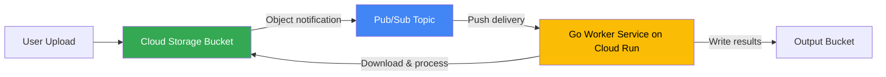

# How to Build a Go Worker Service That Processes Cloud Storage File Uploads via Pub/Sub Notifications

Author: [nawazdhandala](https://www.github.com/nawazdhandala)

Tags: GCP, Cloud Storage, Pub/Sub, Go, Cloud Run, Event-Driven

Description: Build a Go worker service that automatically processes file uploads to Cloud Storage by listening to Pub/Sub notifications for event-driven processing.

---

Automatically processing files when they land in a Cloud Storage bucket is one of the most common patterns on GCP. Think image resizing, CSV parsing, video transcoding, or virus scanning. The architecture is simple: Cloud Storage sends a notification to Pub/Sub when a file is uploaded, and your worker service picks it up and processes it.

In this post, I will build a Go worker service that listens for Cloud Storage upload events via Pub/Sub and processes the files.

## Architecture Overview



## Setting Up the Infrastructure

First, create the buckets, topic, and notification.

```bash
# Create the input and output buckets
gsutil mb -l us-central1 gs://my-uploads-bucket
gsutil mb -l us-central1 gs://my-processed-bucket

# Create the Pub/Sub topic for notifications
gcloud pubsub topics create storage-notifications

# Set up the Cloud Storage notification
# This tells GCS to publish to the topic when objects are created
gsutil notification create \
  -t storage-notifications \
  -f json \
  -e OBJECT_FINALIZE \
  gs://my-uploads-bucket

# Create a push subscription pointing to your Cloud Run service
gcloud pubsub subscriptions create storage-worker-sub \
  --topic=storage-notifications \
  --push-endpoint=https://storage-worker-xxxxx.run.app/process \
  --push-auth-service-account=worker-sa@YOUR_PROJECT.iam.gserviceaccount.com
```

## Understanding the Notification Format

When a file is uploaded to the bucket, Cloud Storage sends a notification to Pub/Sub. The push delivery wraps it in the standard Pub/Sub push format.

```go
package main

import (
    "context"
    "encoding/base64"
    "encoding/json"
    "fmt"
    "io"
    "log"
    "net/http"
    "os"
    "path/filepath"
    "strings"

    "cloud.google.com/go/storage"
)

// PushRequest is the wrapper Pub/Sub uses for push delivery
type PushRequest struct {
    Message struct {
        Data       string            `json:"data"`
        Attributes map[string]string `json:"attributes"`
        MessageID  string            `json:"messageId"`
    } `json:"message"`
    Subscription string `json:"subscription"`
}

// StorageNotification represents the Cloud Storage event data
type StorageNotification struct {
    Kind                    string `json:"kind"`
    ID                      string `json:"id"`
    Name                    string `json:"name"`
    Bucket                  string `json:"bucket"`
    ContentType             string `json:"contentType"`
    Size                    string `json:"size"`
    TimeCreated             string `json:"timeCreated"`
    MetaGeneration          string `json:"metageneration"`
}
```

## The Worker Service

Here is the main worker that receives notifications and processes files.

```go
// Worker holds the dependencies for file processing
type Worker struct {
    storageClient *storage.Client
    outputBucket  string
}

// NewWorker creates a new file processing worker
func NewWorker(ctx context.Context) (*Worker, error) {
    client, err := storage.NewClient(ctx)
    if err != nil {
        return nil, fmt.Errorf("failed to create storage client: %w", err)
    }

    return &Worker{
        storageClient: client,
        outputBucket:  os.Getenv("OUTPUT_BUCKET"),
    }, nil
}

// HandleNotification processes incoming Cloud Storage notifications
func (w *Worker) HandleNotification(rw http.ResponseWriter, r *http.Request) {
    // Parse the Pub/Sub push request
    var pushReq PushRequest
    if err := json.NewDecoder(r.Body).Decode(&pushReq); err != nil {
        log.Printf("Failed to decode push request: %v", err)
        http.Error(rw, "Bad request", http.StatusBadRequest)
        return
    }

    // Decode the base64-encoded notification data
    data, err := base64.StdEncoding.DecodeString(pushReq.Message.Data)
    if err != nil {
        log.Printf("Failed to decode message data: %v", err)
        rw.WriteHeader(http.StatusOK) // Ack to prevent retries
        return
    }

    // Parse the storage notification
    var notification StorageNotification
    if err := json.Unmarshal(data, &notification); err != nil {
        log.Printf("Failed to parse notification: %v", err)
        rw.WriteHeader(http.StatusOK)
        return
    }

    log.Printf("Processing file: gs://%s/%s (type: %s)",
        notification.Bucket, notification.Name, notification.ContentType)

    // Skip processing for non-target file types
    if !w.shouldProcess(notification) {
        log.Printf("Skipping file %s - not a target type", notification.Name)
        rw.WriteHeader(http.StatusOK)
        return
    }

    // Process the file
    if err := w.processFile(r.Context(), notification); err != nil {
        log.Printf("Failed to process file %s: %v", notification.Name, err)
        // Return 500 so Pub/Sub retries
        http.Error(rw, "Processing failed", http.StatusInternalServerError)
        return
    }

    log.Printf("Successfully processed file: %s", notification.Name)
    rw.WriteHeader(http.StatusOK)
}

// shouldProcess checks if the file type is one we want to handle
func (w *Worker) shouldProcess(n StorageNotification) bool {
    // Only process CSV and JSON files
    ext := strings.ToLower(filepath.Ext(n.Name))
    switch ext {
    case ".csv", ".json", ".txt":
        return true
    default:
        return false
    }
}
```

## File Processing Logic

Download the file, process it, and write the results to the output bucket.

```go
// processFile downloads, processes, and outputs the result
func (w *Worker) processFile(ctx context.Context, n StorageNotification) error {
    // Download the file from the source bucket
    data, err := w.downloadFile(ctx, n.Bucket, n.Name)
    if err != nil {
        return fmt.Errorf("download failed: %w", err)
    }

    // Process the file based on its type
    var result []byte
    ext := strings.ToLower(filepath.Ext(n.Name))
    switch ext {
    case ".csv":
        result, err = processCSV(data)
    case ".json":
        result, err = processJSON(data)
    default:
        result, err = processText(data)
    }

    if err != nil {
        return fmt.Errorf("processing failed: %w", err)
    }

    // Write the processed result to the output bucket
    outputName := fmt.Sprintf("processed/%s.result.json", n.Name)
    if err := w.uploadFile(ctx, w.outputBucket, outputName, result); err != nil {
        return fmt.Errorf("upload failed: %w", err)
    }

    return nil
}

// downloadFile reads an object from Cloud Storage into memory
func (w *Worker) downloadFile(ctx context.Context, bucket, name string) ([]byte, error) {
    reader, err := w.storageClient.Bucket(bucket).Object(name).NewReader(ctx)
    if err != nil {
        return nil, err
    }
    defer reader.Close()

    return io.ReadAll(reader)
}

// uploadFile writes data to a Cloud Storage object
func (w *Worker) uploadFile(ctx context.Context, bucket, name string, data []byte) error {
    writer := w.storageClient.Bucket(bucket).Object(name).NewWriter(ctx)
    writer.ContentType = "application/json"

    if _, err := writer.Write(data); err != nil {
        return err
    }

    return writer.Close()
}
```

## Processing Functions

Here are example processors for different file types.

```go
import (
    "bytes"
    "encoding/csv"
)

// ProcessingResult holds the output of file processing
type ProcessingResult struct {
    SourceFile string `json:"source_file"`
    RowCount   int    `json:"row_count"`
    Status     string `json:"status"`
    Summary    string `json:"summary"`
}

// processCSV reads a CSV file and returns a summary
func processCSV(data []byte) ([]byte, error) {
    reader := csv.NewReader(bytes.NewReader(data))

    // Read all records
    records, err := reader.ReadAll()
    if err != nil {
        return nil, fmt.Errorf("CSV parse error: %w", err)
    }

    result := ProcessingResult{
        RowCount: len(records) - 1, // Subtract header row
        Status:   "processed",
        Summary:  fmt.Sprintf("CSV with %d columns and %d data rows", len(records[0]), len(records)-1),
    }

    return json.Marshal(result)
}

// processJSON validates JSON data and returns a summary
func processJSON(data []byte) ([]byte, error) {
    // Validate that it is valid JSON
    var parsed interface{}
    if err := json.Unmarshal(data, &parsed); err != nil {
        return nil, fmt.Errorf("invalid JSON: %w", err)
    }

    result := ProcessingResult{
        Status:  "processed",
        Summary: fmt.Sprintf("Valid JSON, %d bytes", len(data)),
    }

    return json.Marshal(result)
}

// processText handles plain text files
func processText(data []byte) ([]byte, error) {
    lines := bytes.Count(data, []byte("\n")) + 1
    words := len(bytes.Fields(data))

    result := ProcessingResult{
        RowCount: lines,
        Status:   "processed",
        Summary:  fmt.Sprintf("Text file: %d lines, %d words", lines, words),
    }

    return json.Marshal(result)
}
```

## Main Function and Deployment

```go
func main() {
    ctx := context.Background()

    worker, err := NewWorker(ctx)
    if err != nil {
        log.Fatalf("Failed to create worker: %v", err)
    }

    http.HandleFunc("/process", worker.HandleNotification)
    http.HandleFunc("/health", func(w http.ResponseWriter, r *http.Request) {
        w.WriteHeader(http.StatusOK)
    })

    port := os.Getenv("PORT")
    if port == "" {
        port = "8080"
    }

    log.Printf("Worker service listening on port %s", port)
    log.Fatal(http.ListenAndServe(":"+port, nil))
}
```

Deploy to Cloud Run:

```bash
gcloud builds submit --tag gcr.io/YOUR_PROJECT/storage-worker

gcloud run deploy storage-worker \
  --image gcr.io/YOUR_PROJECT/storage-worker \
  --region us-central1 \
  --set-env-vars "OUTPUT_BUCKET=my-processed-bucket" \
  --memory 512Mi \
  --timeout 300 \
  --no-allow-unauthenticated
```

## Handling Edge Cases

A few things to watch out for in production:

1. **Duplicate notifications** - Cloud Storage can send the same notification more than once. Make your processing idempotent or use the object generation number for deduplication.

2. **Large files** - If files are too large to fit in memory, stream them instead of reading everything at once.

3. **Temporary files** - Cloud Storage sends notifications for temporary objects created during resumable uploads. Filter these out by checking the `metageneration` field.

4. **Folder markers** - GCS creates zero-byte objects as folder markers. Skip objects with size "0" unless you specifically need them.

```go
// shouldSkip checks for common cases where we do not want to process the file
func shouldSkip(n StorageNotification) bool {
    // Skip folder markers
    if n.Size == "0" || strings.HasSuffix(n.Name, "/") {
        return true
    }
    // Skip temporary upload fragments
    if strings.Contains(n.Name, ".tmp") {
        return true
    }
    return false
}
```

## Wrapping Up

The Cloud Storage plus Pub/Sub plus Cloud Run pattern gives you a fully serverless file processing pipeline. Files come in, get processed, and results go out - all without managing any servers. The key is getting the notification format right and handling edge cases like duplicates and large files.

For monitoring your file processing pipeline in production - tracking processing times, error rates, and queue depth - OneUptime can help you set up alerts so you know immediately when something goes wrong.
