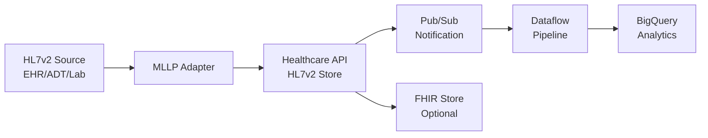

# How to Build a Healthcare Data Pipeline from HL7v2 to BigQuery Using Dataflow and Healthcare API

Author: [nawazdhandala](https://www.github.com/nawazdhandala)

Tags: GCP, Healthcare API, HL7v2, BigQuery, Dataflow, Data Pipeline, Google Cloud

Description: Build an end-to-end healthcare data pipeline that ingests HL7v2 messages through Google Cloud Healthcare API and streams parsed data into BigQuery for analytics.

---

Most hospitals and healthcare systems still rely heavily on HL7v2 for messaging - admissions, lab results, orders, and transfers all flow through HL7v2 interfaces. Getting that data into a modern analytics platform like BigQuery opens up possibilities for operational dashboards, clinical research, and population health analysis. But HL7v2 is a messy, pipe-delimited format that was designed for point-to-point integration, not analytics.

Google Cloud gives you a clean path from HL7v2 to BigQuery using the Healthcare API for ingestion and parsing, Pub/Sub for event streaming, and Dataflow for transformation. In this post, I will build this pipeline from scratch.

## Architecture Overview

Here is what the pipeline looks like end to end:



## Prerequisites

Before starting, make sure you have:

- A Google Cloud project with billing enabled
- Healthcare API, Dataflow, Pub/Sub, and BigQuery APIs enabled
- A service account with appropriate roles
- `gcloud` CLI configured

## Step 1: Create the Healthcare Dataset and HL7v2 Store

The Healthcare API dataset is a container for your stores. The HL7v2 store will receive and parse incoming messages.

These commands set up the dataset and HL7v2 store with Pub/Sub notifications enabled:

```bash
# Create a Healthcare API dataset
gcloud healthcare datasets create healthcare-pipeline \
  --location=us-central1

# Create a Pub/Sub topic for HL7v2 message notifications
gcloud pubsub topics create hl7v2-messages

# Create the HL7v2 store with Pub/Sub notification
gcloud healthcare hl7v2-stores create hl7v2-ingest \
  --dataset=healthcare-pipeline \
  --location=us-central1 \
  --notification-config=pubsubTopic=projects/MY_PROJECT/topics/hl7v2-messages
```

## Step 2: Configure the HL7v2 Store Parser

The parser configuration tells the Healthcare API how to handle incoming HL7v2 messages. You can configure which message types to accept and how to parse them.

This configuration enables parsing for common message types and sets up the schema:

```bash
# Update the HL7v2 store with parser configuration
curl -X PATCH \
  -H "Authorization: Bearer $(gcloud auth print-access-token)" \
  -H "Content-Type: application/json" \
  "https://healthcare.googleapis.com/v1/projects/MY_PROJECT/locations/us-central1/datasets/healthcare-pipeline/hl7V2Stores/hl7v2-ingest?updateMask=parserConfig" \
  -d '{
    "parserConfig": {
      "allowNullHeader": false,
      "segmentTerminator": "DQ==",
      "schema": {
        "schematizedParsingType": "SOFT_FAIL",
        "ignoreMinOccurs": true
      }
    }
  }'
```

## Step 3: Set Up the MLLP Adapter

HL7v2 messages typically travel over MLLP (Minimum Lower Layer Protocol). Google provides an open-source MLLP adapter that bridges between MLLP and the Healthcare API REST endpoint.

This command deploys the MLLP adapter as a container on a GCE instance:

```bash
# Pull the MLLP adapter image
docker pull gcr.io/cloud-healthcare-containers/mllp-adapter:latest

# Run the MLLP adapter
docker run \
  --name mllp-adapter \
  -p 2575:2575 \
  -e GOOGLE_APPLICATION_CREDENTIALS=/credentials/sa-key.json \
  -v /path/to/credentials:/credentials \
  gcr.io/cloud-healthcare-containers/mllp-adapter:latest \
  /usr/mllp_adapter/mllp_adapter \
  --hl7_v2_project_id=MY_PROJECT \
  --hl7_v2_location_id=us-central1 \
  --hl7_v2_dataset_id=healthcare-pipeline \
  --hl7_v2_store_id=hl7v2-ingest \
  --export_stats=false \
  --receiver_ip=0.0.0.0 \
  --port=2575 \
  --api_addr_prefix=https://healthcare.googleapis.com:443/v1
```

## Step 4: Create the BigQuery Dataset and Tables

You need tables in BigQuery to receive the parsed HL7v2 data. The schema depends on which message types you are processing.

This script creates the dataset and tables for ADT (admission/discharge/transfer) and ORU (observation results) messages:

```bash
# Create BigQuery dataset
bq mk --dataset MY_PROJECT:healthcare_analytics

# Create the ADT events table
bq mk --table MY_PROJECT:healthcare_analytics.adt_events \
  message_id:STRING,\
  event_type:STRING,\
  patient_id:STRING,\
  patient_name:STRING,\
  admission_date:TIMESTAMP,\
  discharge_date:TIMESTAMP,\
  department:STRING,\
  attending_physician:STRING,\
  diagnosis_code:STRING,\
  message_timestamp:TIMESTAMP

# Create the lab results table
bq mk --table MY_PROJECT:healthcare_analytics.lab_results \
  message_id:STRING,\
  patient_id:STRING,\
  order_id:STRING,\
  test_code:STRING,\
  test_name:STRING,\
  result_value:STRING,\
  result_units:STRING,\
  reference_range:STRING,\
  abnormal_flag:STRING,\
  observation_date:TIMESTAMP,\
  message_timestamp:TIMESTAMP
```

## Step 5: Build the Dataflow Pipeline

The Dataflow pipeline reads from Pub/Sub, fetches the full HL7v2 message from the Healthcare API, parses it, and writes the structured data to BigQuery.

This Python Dataflow pipeline handles the entire transformation:

```python
import apache_beam as beam
from apache_beam.options.pipeline_options import PipelineOptions
from google.cloud import healthcare_v1
import json
import logging

class FetchHL7Message(beam.DoFn):
    """Fetches the full HL7v2 message from Healthcare API."""

    def process(self, pubsub_message):
        # Parse the Pub/Sub notification to get the message name
        notification = json.loads(pubsub_message)
        message_name = notification.get("name", "")

        if not message_name:
            return

        # Fetch the full message from Healthcare API
        client = healthcare_v1.Hl7V2ServiceClient()
        message = client.get_message(name=message_name)

        yield {
            "name": message_name,
            "data": message.data,
            "parsed_data": message.parsed_data,
            "message_type": message.message_type
        }

class ParseADTMessage(beam.DoFn):
    """Parses ADT messages into structured rows."""

    def process(self, message):
        if not message["message_type"].startswith("ADT"):
            return

        parsed = message.get("parsed_data", {})

        # Extract patient identification from PID segment
        pid = parsed.get("PID", {})
        evn = parsed.get("EVN", {})
        pv1 = parsed.get("PV1", {})

        yield {
            "message_id": message["name"].split("/")[-1],
            "event_type": message["message_type"],
            "patient_id": str(pid.get("3", "")),
            "patient_name": str(pid.get("5", "")),
            "department": str(pv1.get("3", "")),
            "attending_physician": str(pv1.get("7", "")),
            "message_timestamp": str(evn.get("2", ""))
        }

class ParseORUMessage(beam.DoFn):
    """Parses ORU messages into lab result rows."""

    def process(self, message):
        if not message["message_type"].startswith("ORU"):
            return

        parsed = message.get("parsed_data", {})
        pid = parsed.get("PID", {})

        # Each ORU can contain multiple OBX (observation) segments
        obx_segments = parsed.get("OBX", [])
        if not isinstance(obx_segments, list):
            obx_segments = [obx_segments]

        for obx in obx_segments:
            yield {
                "message_id": message["name"].split("/")[-1],
                "patient_id": str(pid.get("3", "")),
                "test_code": str(obx.get("3", "")),
                "test_name": str(obx.get("3", "")),
                "result_value": str(obx.get("5", "")),
                "result_units": str(obx.get("6", "")),
                "reference_range": str(obx.get("7", "")),
                "abnormal_flag": str(obx.get("8", ""))
            }

def run_pipeline():
    # Configure pipeline options for Dataflow
    options = PipelineOptions([
        "--runner=DataflowRunner",
        "--project=MY_PROJECT",
        "--region=us-central1",
        "--temp_location=gs://my-bucket/temp",
        "--staging_location=gs://my-bucket/staging",
        "--streaming"
    ])

    with beam.Pipeline(options=options) as pipeline:
        # Read from Pub/Sub subscription
        messages = (
            pipeline
            | "ReadPubSub" >> beam.io.ReadFromPubSub(
                subscription="projects/MY_PROJECT/subscriptions/hl7v2-sub"
            )
            | "DecodeMessage" >> beam.Map(lambda x: x.decode("utf-8"))
            | "FetchFullMessage" >> beam.ParDo(FetchHL7Message())
        )

        # Process ADT messages and write to BigQuery
        (
            messages
            | "ParseADT" >> beam.ParDo(ParseADTMessage())
            | "WriteADT" >> beam.io.WriteToBigQuery(
                "MY_PROJECT:healthcare_analytics.adt_events",
                write_disposition=beam.io.BigQueryDisposition.WRITE_APPEND,
                create_disposition=beam.io.BigQueryDisposition.CREATE_NEVER
            )
        )

        # Process ORU messages and write to BigQuery
        (
            messages
            | "ParseORU" >> beam.ParDo(ParseORUMessage())
            | "WriteORU" >> beam.io.WriteToBigQuery(
                "MY_PROJECT:healthcare_analytics.lab_results",
                write_disposition=beam.io.BigQueryDisposition.WRITE_APPEND,
                create_disposition=beam.io.BigQueryDisposition.CREATE_NEVER
            )
        )

if __name__ == "__main__":
    run_pipeline()
```

## Step 6: Deploy and Monitor

Create a Pub/Sub subscription and launch the Dataflow job:

```bash
# Create a Pub/Sub subscription for the Dataflow pipeline
gcloud pubsub subscriptions create hl7v2-sub \
  --topic=hl7v2-messages

# Submit the Dataflow job
python pipeline.py
```

Monitor the pipeline in the Dataflow console to check for errors and throughput metrics.

## Step 7: Query the Data in BigQuery

Once messages start flowing, you can run analytics queries. Here is a sample query for admission patterns:

```sql
-- Count admissions by department per day
SELECT
  department,
  DATE(message_timestamp) as admission_date,
  COUNT(*) as admission_count
FROM `MY_PROJECT.healthcare_analytics.adt_events`
WHERE event_type = 'ADT^A01'
GROUP BY department, admission_date
ORDER BY admission_date DESC, admission_count DESC
```

## Summary

Building an HL7v2-to-BigQuery pipeline on Google Cloud involves several components, but each one serves a clear purpose. The MLLP adapter bridges the legacy protocol, the Healthcare API handles parsing and validation, Pub/Sub decouples ingestion from processing, Dataflow transforms the data at scale, and BigQuery provides the analytics layer. Once this pipeline is running, you have real-time healthcare data flowing into a platform where your analytics team can actually work with it.
