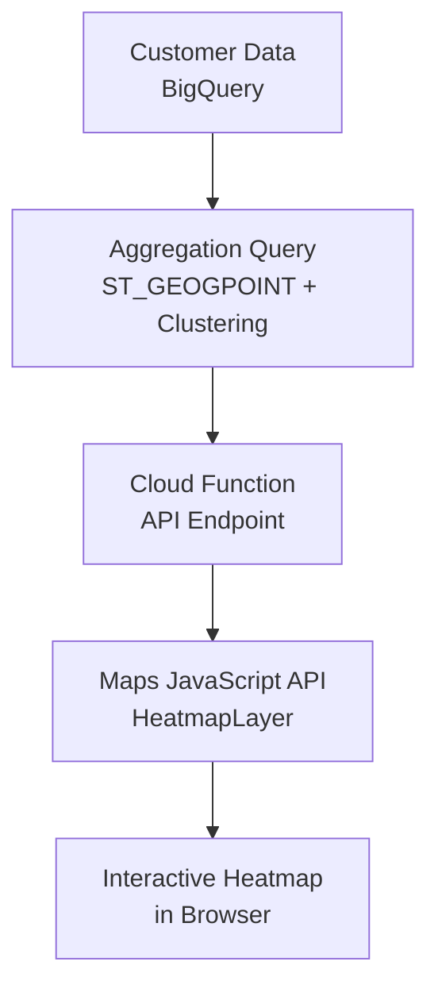

# How to Build a Heatmap of Customer Locations with Google Maps Platform and BigQuery GIS

Author: [nawazdhandala](https://www.github.com/nawazdhandala)

Tags: GCP, BigQuery, GIS, Google Maps, Heatmap, Data Visualization, Google Cloud

Description: Build a customer location heatmap using Google Maps Platform visualization library and BigQuery GIS geospatial data for market analysis and store planning.

---

Heatmaps turn thousands of scattered data points into a visual pattern that instantly communicates density and distribution. When you layer a customer location heatmap over a Google Map, you can immediately see where your customers cluster, identify underserved areas, and make data-driven decisions about store placement, marketing spend, and delivery logistics. In this post, I will build a complete customer heatmap solution using BigQuery GIS for the data processing and Google Maps Platform for the visualization.

## What We Are Building

The end result is a web-based heatmap that:

- Pulls customer location data from BigQuery
- Weights points by customer lifetime value (or any metric you choose)
- Renders as an interactive heatmap on Google Maps
- Updates dynamically when you zoom or filter



## Prerequisites

- Customer data with latitude/longitude in BigQuery
- Google Maps JavaScript API key with the Visualization library enabled
- A Cloud Function for the backend API

## Step 1: Prepare the Data in BigQuery

Raw customer coordinates are a good start, but for a useful heatmap you want to pre-aggregate the data. This reduces the amount of data sent to the browser and improves performance.

This query creates an aggregated grid of customer density:

```sql
-- Create an aggregated customer density grid
-- Uses ST_SNAPTOGRID to bucket nearby customers together
CREATE OR REPLACE TABLE `MY_PROJECT.geo_analytics.customer_density_grid` AS
SELECT
  -- Snap points to a 0.005 degree grid (roughly 500 meter cells)
  ST_SNAPTOGRID(ST_GEOGPOINT(lng, lat), 0.005) as grid_cell,
  ST_X(ST_SNAPTOGRID(ST_GEOGPOINT(lng, lat), 0.005)) as cell_lng,
  ST_Y(ST_SNAPTOGRID(ST_GEOGPOINT(lng, lat), 0.005)) as cell_lat,
  COUNT(*) as customer_count,
  SUM(lifetime_value) as total_ltv,
  AVG(lifetime_value) as avg_ltv,
  COUNT(DISTINCT CASE WHEN signup_date >= DATE_SUB(CURRENT_DATE(), INTERVAL 90 DAY) THEN customer_id END) as new_customers_90d
FROM `MY_PROJECT.geo_analytics.customers`
WHERE lat IS NOT NULL AND lng IS NOT NULL
GROUP BY grid_cell, cell_lng, cell_lat
HAVING customer_count >= 2;  -- Filter out isolated single-customer cells
```

For multi-resolution heatmaps that adapt to zoom level, create grids at different resolutions:

```sql
-- Multi-resolution density grids
-- Coarse grid for zoomed-out views
CREATE OR REPLACE TABLE `MY_PROJECT.geo_analytics.density_grid_coarse` AS
SELECT
  ST_X(ST_SNAPTOGRID(ST_GEOGPOINT(lng, lat), 0.05)) as cell_lng,
  ST_Y(ST_SNAPTOGRID(ST_GEOGPOINT(lng, lat), 0.05)) as cell_lat,
  COUNT(*) as customer_count,
  SUM(lifetime_value) as total_ltv
FROM `MY_PROJECT.geo_analytics.customers`
WHERE lat IS NOT NULL
GROUP BY cell_lng, cell_lat;

-- Fine grid for zoomed-in views
CREATE OR REPLACE TABLE `MY_PROJECT.geo_analytics.density_grid_fine` AS
SELECT
  ST_X(ST_SNAPTOGRID(ST_GEOGPOINT(lng, lat), 0.001)) as cell_lng,
  ST_Y(ST_SNAPTOGRID(ST_GEOGPOINT(lng, lat), 0.001)) as cell_lat,
  COUNT(*) as customer_count,
  SUM(lifetime_value) as total_ltv
FROM `MY_PROJECT.geo_analytics.customers`
WHERE lat IS NOT NULL
GROUP BY cell_lng, cell_lat;
```

## Step 2: Build the API Endpoint

Create a Cloud Function that serves the heatmap data, supporting different weight metrics and zoom-based resolution.

This Cloud Function returns heatmap data with configurable weighting:

```python
import functions_framework
from google.cloud import bigquery
import json

bq_client = bigquery.Client()

@functions_framework.http
def heatmap_api(request):
    """Returns heatmap data with configurable weight metric."""
    if request.method == "OPTIONS":
        return ("", 204, {
            "Access-Control-Allow-Origin": "*",
            "Access-Control-Allow-Methods": "GET",
            "Access-Control-Allow-Headers": "Content-Type",
        })

    headers = {
        "Access-Control-Allow-Origin": "*",
        "Content-Type": "application/json",
    }

    # Get parameters from the request
    weight_by = request.args.get("weight", "count")  # count, ltv, new_customers
    zoom = int(request.args.get("zoom", 10))

    # Get viewport bounds for filtering
    north = float(request.args.get("north", 90))
    south = float(request.args.get("south", -90))
    east = float(request.args.get("east", 180))
    west = float(request.args.get("west", -180))

    # Select the appropriate resolution table based on zoom
    if zoom <= 8:
        table = "density_grid_coarse"
    elif zoom <= 12:
        table = "customer_density_grid"
    else:
        table = "density_grid_fine"

    # Select weight column based on the metric
    weight_columns = {
        "count": "customer_count",
        "ltv": "total_ltv",
        "new_customers": "new_customers_90d",
    }
    weight_col = weight_columns.get(weight_by, "customer_count")

    # Query the data within the current viewport
    query = f"""
        SELECT
            cell_lat as lat,
            cell_lng as lng,
            {weight_col} as weight
        FROM `MY_PROJECT.geo_analytics.{table}`
        WHERE cell_lat BETWEEN @south AND @north
          AND cell_lng BETWEEN @west AND @east
        ORDER BY weight DESC
        LIMIT 5000
    """

    job_config = bigquery.QueryJobConfig(
        query_parameters=[
            bigquery.ScalarQueryParameter("north", "FLOAT64", north),
            bigquery.ScalarQueryParameter("south", "FLOAT64", south),
            bigquery.ScalarQueryParameter("east", "FLOAT64", east),
            bigquery.ScalarQueryParameter("west", "FLOAT64", west),
        ]
    )

    results = bq_client.query(query, job_config=job_config).result()

    points = []
    for row in results:
        points.append({
            "lat": row.lat,
            "lng": row.lng,
            "weight": float(row.weight),
        })

    return json.dumps({
        "points": points,
        "count": len(points),
        "weight_metric": weight_by,
        "resolution": table,
    }), 200, headers
```

## Step 3: Build the Heatmap Frontend

Create the HTML page with the Google Maps heatmap visualization and controls for weight metric and radius.

```html
<!DOCTYPE html>
<html>
<head>
    <title>Customer Location Heatmap</title>
    <style>
        body { margin: 0; font-family: Arial, sans-serif; }
        #map { height: 100vh; width: 100%; }
        .panel {
            position: absolute;
            top: 10px;
            right: 10px;
            z-index: 5;
            background: white;
            padding: 15px;
            border-radius: 8px;
            box-shadow: 0 2px 10px rgba(0,0,0,0.2);
            width: 220px;
        }
        .panel h3 { margin: 0 0 10px 0; font-size: 14px; }
        .panel label { display: block; margin: 8px 0 4px; font-size: 12px; color: #666; }
        .panel select, .panel input { width: 100%; padding: 6px; border: 1px solid #ddd; border-radius: 4px; }
        .stats { margin-top: 12px; padding-top: 12px; border-top: 1px solid #eee; font-size: 12px; }
    </style>
</head>
<body>
    <div class="panel">
        <h3>Heatmap Controls</h3>

        <label>Weight By:</label>
        <select id="weightMetric" onchange="refreshHeatmap()">
            <option value="count">Customer Count</option>
            <option value="ltv">Lifetime Value</option>
            <option value="new_customers">New Customers (90d)</option>
        </select>

        <label>Radius: <span id="radiusValue">25</span>px</label>
        <input type="range" id="radius" min="5" max="50" value="25" oninput="updateRadius(this.value)">

        <label>Opacity: <span id="opacityValue">0.7</span></label>
        <input type="range" id="opacity" min="0" max="100" value="70" oninput="updateOpacity(this.value)">

        <div class="stats" id="stats">
            Loading...
        </div>
    </div>
    <div id="map"></div>

    <script>
        const API_BASE = 'https://us-central1-MY_PROJECT.cloudfunctions.net/heatmap-api';
        let map;
        let heatmapLayer;
        let debounceTimer;

        function initMap() {
            // Initialize the map
            map = new google.maps.Map(document.getElementById('map'), {
                center: { lat: 37.5, lng: -122.1 },
                zoom: 10,
                mapTypeId: 'roadmap',
                styles: [
                    { featureType: 'poi', stylers: [{ visibility: 'off' }] },
                    { featureType: 'transit', stylers: [{ visibility: 'off' }] },
                    { featureType: 'road', elementType: 'labels', stylers: [{ visibility: 'off' }] }
                ]
            });

            // Initialize an empty heatmap layer
            heatmapLayer = new google.maps.visualization.HeatmapLayer({
                radius: 25,
                opacity: 0.7,
                // Custom gradient from cool blue to warm red
                gradient: [
                    'rgba(0, 0, 255, 0)',
                    'rgba(0, 0, 255, 0.4)',
                    'rgba(0, 128, 255, 0.6)',
                    'rgba(0, 255, 128, 0.8)',
                    'rgba(128, 255, 0, 0.9)',
                    'rgba(255, 255, 0, 1)',
                    'rgba(255, 128, 0, 1)',
                    'rgba(255, 0, 0, 1)'
                ]
            });
            heatmapLayer.setMap(map);

            // Refresh data when the map viewport changes
            map.addListener('idle', () => {
                clearTimeout(debounceTimer);
                debounceTimer = setTimeout(refreshHeatmap, 300);
            });

            // Initial data load
            refreshHeatmap();
        }

        async function refreshHeatmap() {
            const bounds = map.getBounds();
            if (!bounds) return;

            const ne = bounds.getNorthEast();
            const sw = bounds.getSouthWest();
            const zoom = map.getZoom();
            const weight = document.getElementById('weightMetric').value;

            // Build the API URL with viewport bounds
            const url = `${API_BASE}?weight=${weight}&zoom=${zoom}` +
                `&north=${ne.lat()}&south=${sw.lat()}` +
                `&east=${ne.lng()}&west=${sw.lng()}`;

            try {
                const response = await fetch(url);
                const data = await response.json();

                // Convert points to weighted LatLng objects
                const heatmapData = data.points.map(p => ({
                    location: new google.maps.LatLng(p.lat, p.lng),
                    weight: p.weight
                }));

                // Update the heatmap layer
                heatmapLayer.setData(heatmapData);

                // Update stats display
                const totalWeight = data.points.reduce((sum, p) => sum + p.weight, 0);
                document.getElementById('stats').innerHTML = `
                    <strong>Data Points:</strong> ${data.count.toLocaleString()}<br>
                    <strong>Total Weight:</strong> ${totalWeight.toLocaleString()}<br>
                    <strong>Resolution:</strong> ${data.resolution}<br>
                    <strong>Metric:</strong> ${data.weight_metric}
                `;
            } catch (error) {
                console.error('Failed to load heatmap data:', error);
            }
        }

        function updateRadius(value) {
            document.getElementById('radiusValue').textContent = value;
            heatmapLayer.set('radius', parseInt(value));
        }

        function updateOpacity(value) {
            const opacity = value / 100;
            document.getElementById('opacityValue').textContent = opacity.toFixed(1);
            heatmapLayer.set('opacity', opacity);
        }
    </script>
    <script src="https://maps.googleapis.com/maps/api/js?key=YOUR_API_KEY&libraries=visualization&callback=initMap" async defer></script>
</body>
</html>
```

## Step 4: Add Market Analysis Overlays

Enhance the heatmap with additional context layers like competitor locations or census demographic data:

```javascript
// Add competitor location markers on top of the heatmap
async function loadCompetitorLocations() {
    const response = await fetch(`${API_BASE}?type=competitors`);
    const data = await response.json();

    data.locations.forEach(loc => {
        new google.maps.Marker({
            position: { lat: loc.lat, lng: loc.lng },
            map: map,
            icon: {
                path: google.maps.SymbolPath.BACKWARD_CLOSED_ARROW,
                scale: 6,
                fillColor: '#ff0000',
                fillOpacity: 0.8,
                strokeColor: '#990000',
                strokeWeight: 1,
            },
            title: loc.name,
        });
    });
}
```

## Step 5: Export Heatmap Insights

Create BigQuery queries that quantify the insights visible in the heatmap:

```sql
-- Identify customer concentration hotspots using BigQuery GIS clustering
SELECT
  ST_CENTROID(cluster_geom) as cluster_center,
  ST_X(ST_CENTROID(cluster_geom)) as center_lng,
  ST_Y(ST_CENTROID(cluster_geom)) as center_lat,
  cluster_size,
  total_ltv,
  -- Check if there is a store within 5 miles of this cluster
  EXISTS(
    SELECT 1 FROM `MY_PROJECT.geo_analytics.store_locations` s
    WHERE ST_DWITHIN(s.location, ST_CENTROID(cluster_geom), 8046.72)
  ) as has_nearby_store
FROM (
  SELECT
    ST_UNION_AGG(ST_GEOGPOINT(lng, lat)) as cluster_geom,
    COUNT(*) as cluster_size,
    SUM(lifetime_value) as total_ltv
  FROM `MY_PROJECT.geo_analytics.customers`
  WHERE lat IS NOT NULL
  -- Group by grid cell to identify clusters
  GROUP BY ST_SNAPTOGRID(ST_GEOGPOINT(lng, lat), 0.01)
  HAVING cluster_size >= 50
)
ORDER BY total_ltv DESC
LIMIT 20;
```

## Summary

Building a customer heatmap with BigQuery GIS and Google Maps Platform involves three main pieces: pre-aggregating location data in BigQuery using spatial grid functions for performance, serving the data through a Cloud Function API that adapts resolution based on zoom level, and rendering it with the Maps JavaScript API HeatmapLayer. The key to a performant heatmap is not sending every individual customer point to the browser - aggregate into grid cells at the right resolution, filter by viewport bounds, and limit the total points returned. This approach scales to millions of customer records while keeping the map interaction smooth.
