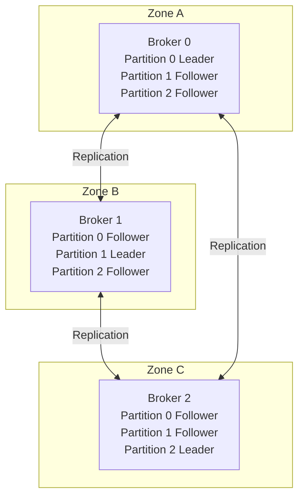

# How to Build a Highly Available Kafka Cluster on GKE with Multi-Zone Replication

Author: [nawazdhandala](https://www.github.com/nawazdhandala)

Tags: GCP, GKE, Kafka, High Availability, Multi-Zone Replication

Description: Deploy a highly available Apache Kafka cluster on Google Kubernetes Engine with multi-zone replication for fault-tolerant streaming workloads.

---

Apache Kafka is the go-to platform for real-time data streaming. But running Kafka in production requires careful planning around availability, data durability, and failure recovery. On Google Kubernetes Engine, you can build a Kafka cluster that survives zone failures by spreading brokers across availability zones and configuring proper replication.

This guide covers deploying Kafka on GKE with multi-zone replication, persistent storage, and the operational configurations needed for production workloads.

## GKE Cluster Setup

Start with a multi-zone GKE cluster that spans three availability zones. This is the foundation for zone-level fault tolerance.

```bash
# Create a regional GKE cluster spanning three zones
gcloud container clusters create kafka-cluster \
  --region=us-central1 \
  --num-nodes=3 \
  --machine-type=e2-standard-8 \
  --disk-size=100GB \
  --node-locations=us-central1-a,us-central1-b,us-central1-c \
  --enable-ip-alias \
  --enable-autoscaling \
  --min-nodes=2 \
  --max-nodes=5
```

Create a dedicated node pool for Kafka brokers with local SSDs for better I/O performance.

```bash
# Kafka benefits from fast local storage for its log segments
gcloud container node-pools create kafka-nodes \
  --cluster=kafka-cluster \
  --region=us-central1 \
  --machine-type=n2-standard-8 \
  --num-nodes=1 \
  --node-locations=us-central1-a,us-central1-b,us-central1-c \
  --local-ssd-count=1 \
  --node-taints=dedicated=kafka:NoSchedule \
  --node-labels=dedicated=kafka
```

## Installing Kafka with Strimzi Operator

Strimzi is a Kubernetes operator that manages Kafka clusters. It handles broker deployment, configuration, rolling updates, and certificate management.

```bash
# Install Strimzi operator using Helm
helm repo add strimzi https://strimzi.io/charts/
helm repo update

helm install strimzi-operator strimzi/strimzi-kafka-operator \
  --namespace kafka \
  --create-namespace \
  --set watchAnyNamespace=true
```

## Kafka Cluster Configuration

Create a Kafka custom resource that deploys brokers across zones.

```yaml
# kafka-cluster.yaml - Multi-zone Kafka deployment
apiVersion: kafka.strimzi.io/v1beta2
kind: Kafka
metadata:
  name: production-kafka
  namespace: kafka
spec:
  kafka:
    version: 3.6.0
    replicas: 3  # One broker per zone
    listeners:
      - name: plain
        port: 9092
        type: internal
        tls: false
      - name: tls
        port: 9093
        type: internal
        tls: true
      - name: external
        port: 9094
        type: loadbalancer
        tls: true
    config:
      # Replication settings for durability
      default.replication.factor: 3
      min.insync.replicas: 2
      offsets.topic.replication.factor: 3
      transaction.state.log.replication.factor: 3
      transaction.state.log.min.isr: 2

      # Log retention
      log.retention.hours: 168  # 7 days
      log.segment.bytes: 1073741824  # 1GB segments
      log.retention.check.interval.ms: 300000

      # Performance tuning
      num.io.threads: 8
      num.network.threads: 5
      num.partitions: 12
      socket.send.buffer.bytes: 102400
      socket.receive.buffer.bytes: 102400
      socket.request.max.bytes: 104857600

    # Zone-aware pod scheduling
    rack:
      topologyKey: topology.kubernetes.io/zone

    template:
      pod:
        tolerations:
          - key: dedicated
            value: kafka
            effect: NoSchedule
        affinity:
          nodeAffinity:
            requiredDuringSchedulingIgnoredDuringExecution:
              nodeSelectorTerms:
                - matchExpressions:
                    - key: dedicated
                      operator: In
                      values:
                        - kafka
          podAntiAffinity:
            # Ensure brokers run in different zones
            requiredDuringSchedulingIgnoredDuringExecution:
              - labelSelector:
                  matchExpressions:
                    - key: strimzi.io/name
                      operator: In
                      values:
                        - production-kafka-kafka
                topologyKey: topology.kubernetes.io/zone

    storage:
      type: persistent-claim
      size: 500Gi
      class: premium-rwo  # SSD-backed persistent volumes
      deleteClaim: false

    metricsConfig:
      type: jmxPrometheusExporter
      valueFrom:
        configMapKeyRef:
          name: kafka-metrics
          key: kafka-metrics-config.yml

  # ZooKeeper configuration (or use KRaft for newer versions)
  zookeeper:
    replicas: 3
    storage:
      type: persistent-claim
      size: 50Gi
      class: premium-rwo
      deleteClaim: false
    template:
      pod:
        affinity:
          podAntiAffinity:
            requiredDuringSchedulingIgnoredDuringExecution:
              - labelSelector:
                  matchExpressions:
                    - key: strimzi.io/name
                      operator: In
                      values:
                        - production-kafka-zookeeper
                topologyKey: topology.kubernetes.io/zone

  entityOperator:
    topicOperator: {}
    userOperator: {}
```

Apply the configuration.

```bash
# Deploy the Kafka cluster
kubectl apply -f kafka-cluster.yaml

# Watch the deployment progress
kubectl -n kafka get kafka production-kafka -w
```

## Understanding Multi-Zone Replication

With `rack.topologyKey: topology.kubernetes.io/zone`, Strimzi is aware of which zone each broker runs in. When combined with `default.replication.factor: 3` and `min.insync.replicas: 2`, every partition has copies across all three zones.

Here is how the replication looks across zones:



If Zone A goes down completely, Broker 0 is lost. Partitions 1 and 2 still have their leaders in other zones. Partition 0 needs a new leader elected from Zone B or Zone C. With `min.insync.replicas: 2`, writes continue as long as two of three replicas are available.

## Creating Topics with Zone Awareness

When creating topics, configure them for multi-zone durability.

```yaml
# topic-orders.yaml - Topic with proper replication
apiVersion: kafka.strimzi.io/v1beta2
kind: KafkaTopic
metadata:
  name: orders
  namespace: kafka
  labels:
    strimzi.io/cluster: production-kafka
spec:
  partitions: 12
  replicas: 3
  config:
    min.insync.replicas: "2"
    retention.ms: "604800000"  # 7 days
    cleanup.policy: "delete"
    max.message.bytes: "10485760"  # 10MB
```

## Producer Configuration for Durability

Your producers need to be configured to take advantage of the replication setup.

```python
# producer_config.py - Kafka producer with durability settings
from confluent_kafka import Producer

# Configure the producer for maximum durability
producer_config = {
    "bootstrap.servers": "production-kafka-kafka-bootstrap.kafka:9092",

    # Wait for all in-sync replicas to acknowledge
    "acks": "all",

    # Retry transient failures
    "retries": 5,
    "retry.backoff.ms": 100,

    # Enable idempotent producer to prevent duplicates on retry
    "enable.idempotence": True,

    # Batch settings for throughput
    "batch.size": 16384,
    "linger.ms": 5,

    # Compression reduces network traffic between zones
    "compression.type": "lz4",
}

producer = Producer(producer_config)

def send_message(topic, key, value):
    """Send a message with delivery confirmation."""
    def delivery_callback(err, msg):
        if err:
            print(f"Delivery failed: {err}")
        else:
            print(f"Delivered to {msg.topic()} [{msg.partition()}] @ {msg.offset()}")

    producer.produce(topic, key=key, value=value, callback=delivery_callback)
    producer.flush()
```

## Monitoring the Cluster

Deploy a monitoring stack to track broker health, replication lag, and consumer group status.

```yaml
# kafka-metrics-configmap.yaml - JMX metrics for Prometheus
apiVersion: v1
kind: ConfigMap
metadata:
  name: kafka-metrics
  namespace: kafka
data:
  kafka-metrics-config.yml: |
    lowercaseOutputName: true
    rules:
    - pattern: kafka.server<type=ReplicaManager, name=UnderReplicatedPartitions><>Value
      name: kafka_server_replicamanager_underreplicatedpartitions
      type: GAUGE
    - pattern: kafka.server<type=BrokerTopicMetrics, name=MessagesInPerSec><>OneMinuteRate
      name: kafka_server_brokertopicmetrics_messagesinpersec
      type: GAUGE
    - pattern: kafka.controller<type=KafkaController, name=OfflinePartitionsCount><>Value
      name: kafka_controller_offlinepartitionscount
      type: GAUGE
    - pattern: kafka.server<type=ReplicaManager, name=PartitionCount><>Value
      name: kafka_server_replicamanager_partitioncount
      type: GAUGE
```

Set up alerting for critical Kafka metrics.

```bash
# Alert when under-replicated partitions are detected
# This indicates a broker or zone may be unhealthy
gcloud monitoring policies create \
  --display-name="Kafka Under-Replicated Partitions" \
  --condition-display-name="Under-replicated partitions > 0" \
  --notification-channels=YOUR_CHANNEL
```

## Disaster Recovery Testing

Regularly test your cluster's zone failure resilience.

```bash
# Simulate a zone failure by cordoning all nodes in one zone
kubectl get nodes -l topology.kubernetes.io/zone=us-central1-a -o name | \
  xargs -I {} kubectl cordon {}

# Verify Kafka continues to serve traffic
kubectl -n kafka exec -it production-kafka-kafka-0 -- \
  bin/kafka-topics.sh --describe --bootstrap-server localhost:9092

# Uncordon the nodes after testing
kubectl get nodes -l topology.kubernetes.io/zone=us-central1-a -o name | \
  xargs -I {} kubectl uncordon {}
```

## Wrapping Up

Running Kafka on GKE with multi-zone replication gives you a streaming platform that survives individual zone failures without data loss. The combination of Strimzi for Kubernetes-native management, zone-aware scheduling for broker placement, and proper replication settings for durability creates a production-grade setup. The key settings to get right are the replication factor, in-sync replicas minimum, and producer acknowledgment configuration - these three together determine your data safety guarantees.
