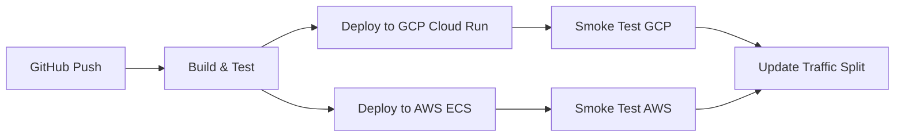

# How to Build a Hybrid CI/CD Pipeline Using GitHub Actions with Deployments to Both GCP and AWS

Author: [nawazdhandala](https://www.github.com/nawazdhandala)

Tags: GCP, AWS, GitHub Actions, CI/CD, Multi-Cloud

Description: Learn how to build a hybrid CI/CD pipeline using GitHub Actions that deploys applications to both Google Cloud Platform and AWS for multi-cloud resilience.

---

More teams are running production workloads across multiple clouds. Maybe your API runs on Cloud Run while your ML pipeline lives on AWS SageMaker, or you have a multi-cloud strategy for redundancy. Either way, you need a CI/CD pipeline that can deploy to both clouds reliably from a single workflow.

GitHub Actions is a natural fit for this because it is cloud-agnostic by default. In this post, I will show you how to set up a GitHub Actions workflow that builds once, tests, and deploys to both GCP and AWS in parallel.

## Architecture Overview

Here is the pipeline we are building:



The workflow builds the container image once, pushes it to registries in both clouds, and deploys simultaneously. Smoke tests verify both deployments before updating the traffic split.

## Step 1: Configure Cloud Authentication

Both GCP and AWS support workload identity federation with GitHub Actions, so you do not need to store long-lived credentials as secrets.

### GCP Workload Identity Federation

Set up workload identity federation for GitHub Actions:

```bash
# Create a workload identity pool
gcloud iam workload-identity-pools create github-pool \
  --location=global \
  --display-name="GitHub Actions Pool"

# Create a provider for GitHub
gcloud iam workload-identity-pools providers create-oidc github-provider \
  --location=global \
  --workload-identity-pool=github-pool \
  --display-name="GitHub Provider" \
  --attribute-mapping="google.subject=assertion.sub,attribute.repository=assertion.repository" \
  --issuer-uri="https://token.actions.githubusercontent.com"

# Create a service account for deployments
gcloud iam service-accounts create github-deploy \
  --display-name="GitHub Actions Deployer"

# Grant necessary roles
gcloud projects add-iam-policy-binding my-gcp-project \
  --member="serviceAccount:github-deploy@my-gcp-project.iam.gserviceaccount.com" \
  --role="roles/run.admin"

gcloud projects add-iam-policy-binding my-gcp-project \
  --member="serviceAccount:github-deploy@my-gcp-project.iam.gserviceaccount.com" \
  --role="roles/artifactregistry.writer"

# Allow GitHub to impersonate the service account
gcloud iam service-accounts add-iam-policy-binding \
  github-deploy@my-gcp-project.iam.gserviceaccount.com \
  --role="roles/iam.workloadIdentityUser" \
  --member="principalSet://iam.googleapis.com/projects/PROJECT_NUMBER/locations/global/workloadIdentityPools/github-pool/attribute.repository/my-org/my-repo"
```

### AWS OIDC Provider

Set up the GitHub OIDC provider in AWS:

```bash
# Create the OIDC provider in AWS
aws iam create-open-id-connect-provider \
  --url https://token.actions.githubusercontent.com \
  --client-id-list sts.amazonaws.com \
  --thumbprint-list 6938fd4d98bab03faadb97b34396831e3780aea1

# Create the IAM role for GitHub Actions
aws iam create-role \
  --role-name github-actions-deploy \
  --assume-role-policy-document '{
    "Version": "2012-10-17",
    "Statement": [{
      "Effect": "Allow",
      "Principal": {
        "Federated": "arn:aws:iam::123456789012:oidc-provider/token.actions.githubusercontent.com"
      },
      "Action": "sts:AssumeRoleWithWebIdentity",
      "Condition": {
        "StringEquals": {
          "token.actions.githubusercontent.com:aud": "sts.amazonaws.com"
        },
        "StringLike": {
          "token.actions.githubusercontent.com:sub": "repo:my-org/my-repo:*"
        }
      }
    }]
  }'

# Attach policies for ECR and ECS
aws iam attach-role-policy \
  --role-name github-actions-deploy \
  --policy-arn arn:aws:iam::aws:policy/AmazonEC2ContainerRegistryPowerUser

aws iam attach-role-policy \
  --role-name github-actions-deploy \
  --policy-arn arn:aws:iam::aws:policy/AmazonECS_FullAccess
```

## Step 2: Create the GitHub Actions Workflow

Here is the full workflow that builds, tests, and deploys to both clouds:

```yaml
# .github/workflows/multi-cloud-deploy.yml
name: Multi-Cloud Deploy

on:
  push:
    branches: [main]
  pull_request:
    branches: [main]

env:
  GCP_PROJECT: my-gcp-project
  GCP_REGION: us-central1
  AWS_REGION: us-east-1
  IMAGE_NAME: my-app

permissions:
  id-token: write
  contents: read

jobs:
  build-and-test:
    runs-on: ubuntu-latest
    steps:
      - uses: actions/checkout@v4

      - name: Run unit tests
        run: |
          npm ci
          npm test

      - name: Build container image
        run: docker build -t $IMAGE_NAME:${{ github.sha }} .

      - name: Save image for downstream jobs
        run: docker save $IMAGE_NAME:${{ github.sha }} > /tmp/image.tar

      - uses: actions/upload-artifact@v4
        with:
          name: container-image
          path: /tmp/image.tar
          retention-days: 1

  deploy-gcp:
    needs: build-and-test
    if: github.ref == 'refs/heads/main'
    runs-on: ubuntu-latest
    steps:
      - uses: actions/download-artifact@v4
        with:
          name: container-image
          path: /tmp

      - name: Load image
        run: docker load < /tmp/image.tar

      # Authenticate to GCP using workload identity
      - id: auth
        uses: google-github-actions/auth@v2
        with:
          workload_identity_provider: projects/PROJECT_NUMBER/locations/global/workloadIdentityPools/github-pool/providers/github-provider
          service_account: github-deploy@my-gcp-project.iam.gserviceaccount.com

      - name: Set up gcloud CLI
        uses: google-github-actions/setup-gcloud@v2

      - name: Configure Docker for Artifact Registry
        run: gcloud auth configure-docker $GCP_REGION-docker.pkg.dev --quiet

      - name: Push to Artifact Registry
        run: |
          docker tag $IMAGE_NAME:${{ github.sha }} \
            $GCP_REGION-docker.pkg.dev/$GCP_PROJECT/app-images/$IMAGE_NAME:${{ github.sha }}
          docker push \
            $GCP_REGION-docker.pkg.dev/$GCP_PROJECT/app-images/$IMAGE_NAME:${{ github.sha }}

      - name: Deploy to Cloud Run
        run: |
          gcloud run deploy $IMAGE_NAME \
            --image=$GCP_REGION-docker.pkg.dev/$GCP_PROJECT/app-images/$IMAGE_NAME:${{ github.sha }} \
            --region=$GCP_REGION \
            --platform=managed \
            --allow-unauthenticated

      - name: Smoke test GCP deployment
        run: |
          URL=$(gcloud run services describe $IMAGE_NAME --region=$GCP_REGION --format='value(status.url)')
          curl -sf "$URL/health" || exit 1

  deploy-aws:
    needs: build-and-test
    if: github.ref == 'refs/heads/main'
    runs-on: ubuntu-latest
    steps:
      - uses: actions/checkout@v4

      - uses: actions/download-artifact@v4
        with:
          name: container-image
          path: /tmp

      - name: Load image
        run: docker load < /tmp/image.tar

      # Authenticate to AWS using OIDC
      - uses: aws-actions/configure-aws-credentials@v4
        with:
          role-to-assume: arn:aws:iam::123456789012:role/github-actions-deploy
          aws-region: us-east-1

      - name: Login to Amazon ECR
        id: ecr-login
        uses: aws-actions/amazon-ecr-login@v2

      - name: Push to ECR
        run: |
          docker tag $IMAGE_NAME:${{ github.sha }} \
            ${{ steps.ecr-login.outputs.registry }}/$IMAGE_NAME:${{ github.sha }}
          docker push \
            ${{ steps.ecr-login.outputs.registry }}/$IMAGE_NAME:${{ github.sha }}

      - name: Deploy to ECS
        run: |
          # Update task definition with new image
          aws ecs describe-task-definition \
            --task-definition $IMAGE_NAME \
            --query 'taskDefinition' > task-def.json

          # Update the image in the task definition
          jq --arg IMAGE "${{ steps.ecr-login.outputs.registry }}/$IMAGE_NAME:${{ github.sha }}" \
            '.containerDefinitions[0].image = $IMAGE' task-def.json > new-task-def.json

          aws ecs register-task-definition \
            --cli-input-json file://new-task-def.json

          aws ecs update-service \
            --cluster my-cluster \
            --service $IMAGE_NAME \
            --task-definition $IMAGE_NAME \
            --force-new-deployment

      - name: Wait for deployment
        run: |
          aws ecs wait services-stable \
            --cluster my-cluster \
            --services $IMAGE_NAME

  post-deploy:
    needs: [deploy-gcp, deploy-aws]
    runs-on: ubuntu-latest
    steps:
      - name: Notify success
        run: |
          echo "Both GCP and AWS deployments successful"
          # Add Slack notification or other alerting here
```

## Step 3: Handle Rollbacks

When one cloud deployment succeeds but the other fails, you need a rollback strategy:

```yaml
  rollback:
    needs: [deploy-gcp, deploy-aws]
    if: failure()
    runs-on: ubuntu-latest
    steps:
      - id: gcp-auth
        uses: google-github-actions/auth@v2
        with:
          workload_identity_provider: projects/PROJECT_NUMBER/locations/global/workloadIdentityPools/github-pool/providers/github-provider
          service_account: github-deploy@my-gcp-project.iam.gserviceaccount.com

      - uses: google-github-actions/setup-gcloud@v2

      - uses: aws-actions/configure-aws-credentials@v4
        with:
          role-to-assume: arn:aws:iam::123456789012:role/github-actions-deploy
          aws-region: us-east-1

      # Roll back GCP to previous revision
      - name: Rollback GCP
        if: always()
        run: |
          PREV_REVISION=$(gcloud run revisions list \
            --service=my-app --region=us-central1 \
            --format='value(name)' --limit=2 | tail -1)
          gcloud run services update-traffic my-app \
            --region=us-central1 \
            --to-revisions=$PREV_REVISION=100

      # Roll back AWS to previous task definition
      - name: Rollback AWS
        if: always()
        run: |
          PREV_TASK=$(aws ecs describe-services \
            --cluster my-cluster --services my-app \
            --query 'services[0].taskDefinition' --output text)
          aws ecs update-service \
            --cluster my-cluster \
            --service my-app \
            --task-definition $PREV_TASK
```

## Environment-Specific Configuration

Use GitHub environments to manage different configurations for staging and production:

```yaml
  deploy-gcp:
    needs: build-and-test
    runs-on: ubuntu-latest
    environment: production-gcp
    # Environment-specific secrets and variables are
    # automatically available when the environment is specified
    steps:
      - name: Deploy
        run: |
          gcloud run deploy $IMAGE_NAME \
            --image=${{ env.GCP_REGION }}-docker.pkg.dev/${{ vars.GCP_PROJECT }}/app-images/$IMAGE_NAME:${{ github.sha }} \
            --region=${{ vars.GCP_REGION }} \
            --set-env-vars="DATABASE_URL=${{ secrets.DATABASE_URL }},API_KEY=${{ secrets.API_KEY }}"
```

## Wrapping Up

Building a multi-cloud CI/CD pipeline with GitHub Actions is straightforward once you have the authentication configured. Workload identity federation on both GCP and AWS eliminates the need for long-lived secrets. Building the container image once and pushing it to both cloud registries ensures consistency.

The key decisions are around failure handling - what happens when one cloud deploys successfully but the other fails? Having automated rollback logic in your workflow means you do not have to make those decisions under pressure during an incident.
