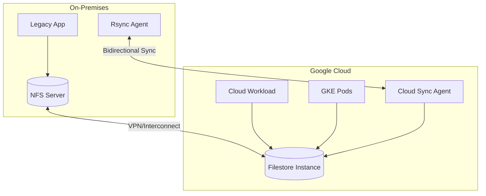

# How to Build a Hybrid Storage Architecture Using Filestore and On-Premises NFS for Seamless Data Access

Author: [nawazdhandala](https://www.github.com/nawazdhandala)

Tags: GCP, Filestore, NFS, Hybrid Storage, Cloud Storage

Description: A practical guide to building a hybrid storage architecture that connects Google Cloud Filestore with on-premises NFS systems for seamless cross-environment data access.

---

When you are migrating workloads to the cloud gradually, one of the hardest challenges is file storage. Your on-premises applications write to NFS shares, and your cloud applications need access to the same data. You cannot just flip a switch - you need a transition period where both environments can read and write files seamlessly.

In this post, I will walk through building a hybrid storage architecture that connects Google Cloud Filestore with your existing on-premises NFS infrastructure, giving both sides transparent access to shared data.

## Architecture Overview

The architecture uses Filestore as the cloud-side NFS server and establishes synchronization with your on-premises NFS:



## Step 1: Set Up Filestore

Create a Filestore instance in the same region as your cloud workloads:

```bash
# Create a high-performance Filestore instance
gcloud filestore instances create hybrid-nfs \
  --zone=us-central1-a \
  --tier=BASIC_HDD \
  --file-share=name=shared_data,capacity=1TB \
  --network=name=hybrid-vpc

# For production workloads that need better performance
gcloud filestore instances create hybrid-nfs-prod \
  --zone=us-central1-a \
  --tier=BASIC_SSD \
  --file-share=name=shared_data,capacity=2.5TB \
  --network=name=hybrid-vpc
```

Get the Filestore IP address for mounting:

```bash
# Get the IP address of the Filestore instance
gcloud filestore instances describe hybrid-nfs \
  --zone=us-central1-a \
  --format="value(networks[0].ipAddresses[0])"
```

## Step 2: Mount Filestore on GCE Instances

Mount the Filestore share on your Compute Engine instances:

```bash
# Install NFS client utilities
sudo apt-get update && sudo apt-get install -y nfs-common

# Create the mount point
sudo mkdir -p /mnt/shared_data

# Mount the Filestore share
# Replace FILESTORE_IP with the actual IP from the previous step
sudo mount FILESTORE_IP:/shared_data /mnt/shared_data

# Make the mount persistent across reboots
echo "FILESTORE_IP:/shared_data /mnt/shared_data nfs defaults,_netdev 0 0" | sudo tee -a /etc/fstab
```

For GKE, use a PersistentVolume and PersistentVolumeClaim:

```yaml
# kubernetes/filestore-pv.yaml
apiVersion: v1
kind: PersistentVolume
metadata:
  name: filestore-pv
spec:
  capacity:
    storage: 1Ti
  accessModes:
    - ReadWriteMany
  nfs:
    # Replace with your Filestore IP
    server: 10.0.0.2
    path: /shared_data
  mountOptions:
    - hard
    - nfsvers=3

---
apiVersion: v1
kind: PersistentVolumeClaim
metadata:
  name: filestore-pvc
spec:
  accessModes:
    - ReadWriteMany
  storageClassName: ""
  volumeName: filestore-pv
  resources:
    requests:
      storage: 1Ti

---
# Use the PVC in a deployment
apiVersion: apps/v1
kind: Deployment
metadata:
  name: app-with-shared-storage
spec:
  replicas: 3
  selector:
    matchLabels:
      app: my-app
  template:
    metadata:
      labels:
        app: my-app
    spec:
      containers:
        - name: app
          image: gcr.io/my-project/my-app:latest
          volumeMounts:
            - name: shared-data
              mountPath: /data
      volumes:
        - name: shared-data
          persistentVolumeClaim:
            claimName: filestore-pvc
```

## Step 3: Establish Network Connectivity

For the hybrid storage to work, your on-premises network needs to reach the Filestore instance. Use Cloud VPN or Cloud Interconnect:

```bash
# If using Cloud VPN, make sure the Filestore subnet is included in the routes
# The Filestore IP must be routable from on-premises

# Verify the Filestore is on the correct VPC
gcloud filestore instances describe hybrid-nfs \
  --zone=us-central1-a \
  --format="yaml(networks)"

# Create firewall rules to allow NFS traffic from on-premises
gcloud compute firewall-rules create allow-nfs-from-onprem \
  --network=hybrid-vpc \
  --allow=tcp:2049,tcp:111,udp:2049,udp:111 \
  --source-ranges=192.168.0.0/16 \
  --description="Allow NFS traffic from on-premises"
```

## Step 4: Set Up Bidirectional Data Synchronization

For real-time or near-real-time sync between on-premises NFS and Filestore, set up a synchronization service. Here is an approach using rsync with inotify for event-driven sync:

```bash
#!/bin/bash
# sync-agent.sh - Runs on a VM with access to both NFS systems
# Uses inotifywait to detect changes and rsync to sync them

# Configuration
ONPREM_PATH="/mnt/onprem_nfs/shared_data"
CLOUD_PATH="/mnt/filestore/shared_data"
LOG_FILE="/var/log/nfs-sync.log"
LOCK_FILE="/tmp/nfs-sync.lock"

log() {
    echo "$(date '+%Y-%m-%d %H:%M:%S') - $1" >> "$LOG_FILE"
}

# Sync from on-premises to cloud
sync_to_cloud() {
    if [ ! -f "$LOCK_FILE" ]; then
        touch "$LOCK_FILE"
        rsync -avz --delete \
            --exclude='.sync-lock' \
            "$ONPREM_PATH/" "$CLOUD_PATH/" >> "$LOG_FILE" 2>&1
        rm -f "$LOCK_FILE"
        log "Synced on-premises changes to cloud"
    fi
}

# Watch for changes on the on-premises NFS mount
inotifywait -m -r -e modify,create,delete,move "$ONPREM_PATH" |
while read -r directory event filename; do
    log "Change detected: $directory $event $filename"
    sync_to_cloud
done
```

For a more robust solution, use a scheduled sync with conflict detection:

```python
# sync_service.py - Robust bidirectional NFS sync service
import os
import time
import hashlib
import subprocess
import logging
from pathlib import Path

logging.basicConfig(level=logging.INFO)
logger = logging.getLogger('nfs-sync')

ONPREM_PATH = '/mnt/onprem_nfs/shared_data'
CLOUD_PATH = '/mnt/filestore/shared_data'
CONFLICT_DIR = '/mnt/filestore/conflicts'

def get_file_hash(filepath):
    """Calculate MD5 hash of a file for change detection."""
    hasher = hashlib.md5()
    with open(filepath, 'rb') as f:
        for chunk in iter(lambda: f.read(8192), b''):
            hasher.update(chunk)
    return hasher.hexdigest()

def detect_conflicts(onprem_files, cloud_files):
    """
    Detect files modified in both locations since last sync.
    Returns a list of conflicting file paths.
    """
    conflicts = []
    for filepath in onprem_files:
        if filepath in cloud_files:
            # Both modified - this is a conflict
            onprem_full = os.path.join(ONPREM_PATH, filepath)
            cloud_full = os.path.join(CLOUD_PATH, filepath)

            if (os.path.getmtime(onprem_full) != os.path.getmtime(cloud_full)
                and get_file_hash(onprem_full) != get_file_hash(cloud_full)):
                conflicts.append(filepath)

    return conflicts

def resolve_conflict(filepath):
    """
    Resolve a conflict by keeping the newer version
    and saving the older version to the conflicts directory.
    """
    onprem_full = os.path.join(ONPREM_PATH, filepath)
    cloud_full = os.path.join(CLOUD_PATH, filepath)

    onprem_mtime = os.path.getmtime(onprem_full)
    cloud_mtime = os.path.getmtime(cloud_full)

    # Keep the newer file, archive the older one
    conflict_path = os.path.join(CONFLICT_DIR, filepath)
    os.makedirs(os.path.dirname(conflict_path), exist_ok=True)

    if onprem_mtime > cloud_mtime:
        # On-premises is newer, archive cloud version
        os.rename(cloud_full, conflict_path + '.cloud-conflict')
        subprocess.run(['cp', '-p', onprem_full, cloud_full])
        logger.info(f"Conflict resolved for {filepath}: kept on-premises version")
    else:
        # Cloud is newer, archive on-premises version
        subprocess.run(['cp', '-p', onprem_full, conflict_path + '.onprem-conflict'])
        subprocess.run(['cp', '-p', cloud_full, onprem_full])
        logger.info(f"Conflict resolved for {filepath}: kept cloud version")

def sync():
    """Run bidirectional sync with conflict detection."""
    logger.info("Starting sync cycle")

    # Use rsync for efficient sync
    # On-premises to cloud
    subprocess.run([
        'rsync', '-avz', '--update',
        f'{ONPREM_PATH}/',
        f'{CLOUD_PATH}/'
    ])

    # Cloud to on-premises
    subprocess.run([
        'rsync', '-avz', '--update',
        f'{CLOUD_PATH}/',
        f'{ONPREM_PATH}/'
    ])

    logger.info("Sync cycle complete")

if __name__ == '__main__':
    while True:
        sync()
        time.sleep(30)  # Sync every 30 seconds
```

## Step 5: Monitor Storage Health

Set up monitoring for both the sync process and the Filestore instance:

```bash
# Monitor Filestore capacity and IOPS
gcloud monitoring dashboards create --config-from-file=- << 'EOF'
{
  "displayName": "Hybrid NFS Storage",
  "mosaicLayout": {
    "tiles": [
      {
        "widget": {
          "title": "Filestore Used Capacity",
          "xyChart": {
            "dataSets": [{
              "timeSeriesQuery": {
                "timeSeriesFilter": {
                  "filter": "resource.type=\"filestore_instance\" AND metric.type=\"file.googleapis.com/nfs/server/used_bytes_percent\""
                }
              }
            }]
          }
        }
      },
      {
        "widget": {
          "title": "Filestore Read/Write IOPS",
          "xyChart": {
            "dataSets": [{
              "timeSeriesQuery": {
                "timeSeriesFilter": {
                  "filter": "resource.type=\"filestore_instance\" AND metric.type=\"file.googleapis.com/nfs/server/read_ops_count\""
                }
              }
            }]
          }
        }
      }
    ]
  }
}
EOF

# Alert when Filestore capacity is getting full
gcloud alpha monitoring policies create \
  --display-name="Filestore Capacity Alert" \
  --condition-display-name="Filestore over 80% full" \
  --condition-filter='resource.type="filestore_instance" AND metric.type="file.googleapis.com/nfs/server/used_bytes_percent"' \
  --condition-threshold-value=80 \
  --condition-threshold-comparison=COMPARISON_GT \
  --notification-channels=projects/my-project/notificationChannels/oncall
```

## Migration Strategy

Once you have the hybrid setup running, plan the full migration:

1. **Phase 1:** Run both systems in parallel with bidirectional sync
2. **Phase 2:** Migrate applications one by one to use Filestore directly
3. **Phase 3:** Switch the sync direction - cloud becomes primary, on-premises becomes the replica
4. **Phase 4:** Decommission the on-premises NFS once all applications are migrated

## Wrapping Up

A hybrid NFS architecture using Filestore and on-premises NFS gives you a smooth migration path without disrupting existing workloads. The key components are network connectivity via VPN or Interconnect, the Filestore instance as your cloud NFS server, and a reliable synchronization mechanism between the two systems.

Start with unidirectional sync from on-premises to cloud, test thoroughly, then enable bidirectional sync when you are confident in the conflict resolution strategy. This approach lets you migrate at your own pace without a risky big-bang cutover.
