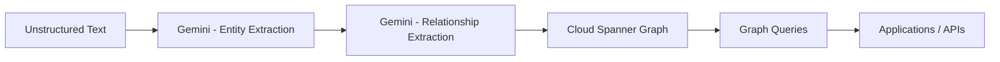

# How to Build a Knowledge Graph from Unstructured Data with Gemini and Cloud Spanner Graph

Author: [nawazdhandala](https://www.github.com/nawazdhandala)

Tags: GCP, Gemini, Cloud Spanner, Knowledge Graph, Graph Database, AI, Google Cloud

Description: Learn how to extract entities and relationships from unstructured text using Gemini and store them in Cloud Spanner Graph for queryable knowledge graphs.

---

Unstructured data - articles, reports, emails, documentation - contains valuable relationships that are invisible to traditional databases. Who reported to whom? Which products depend on which components? What incidents affected which services? A knowledge graph makes these relationships explicit and queryable. In this guide, I will show you how to use Gemini to extract entities and relationships from text and store them in Cloud Spanner Graph, Google's distributed graph database.

## What We Are Building

The pipeline takes unstructured text, uses Gemini to identify entities (people, organizations, products, events) and the relationships between them, and stores everything in Cloud Spanner Graph where you can run graph queries to discover connections and patterns.



## Prerequisites

```bash
# Enable required APIs
gcloud services enable \
    spanner.googleapis.com \
    aiplatform.googleapis.com \
    --project=your-project-id

# Install Python packages
pip install google-cloud-spanner google-cloud-aiplatform
```

## Step 1: Set Up Cloud Spanner with Graph Support

Create a Spanner instance and database with the graph schema:

```bash
# Create a Spanner instance (use a small config for development)
gcloud spanner instances create knowledge-graph-instance \
    --config=regional-us-central1 \
    --description="Knowledge Graph Instance" \
    --processing-units=100

# Create the database
gcloud spanner databases create knowledge-graph-db \
    --instance=knowledge-graph-instance
```

Define the schema with tables that Spanner Graph will use as nodes and edges:

```sql
-- Node table for entities (people, organizations, products, etc.)
CREATE TABLE Entities (
    entity_id STRING(36) NOT NULL,
    entity_type STRING(50) NOT NULL,
    name STRING(500) NOT NULL,
    description STRING(MAX),
    properties JSON,
    source_document STRING(500),
    created_at TIMESTAMP NOT NULL OPTIONS (allow_commit_timestamp=true),
) PRIMARY KEY (entity_id);

-- Edge table for relationships between entities
CREATE TABLE Relationships (
    relationship_id STRING(36) NOT NULL,
    source_entity_id STRING(36) NOT NULL,
    target_entity_id STRING(36) NOT NULL,
    relationship_type STRING(100) NOT NULL,
    properties JSON,
    confidence FLOAT64,
    source_document STRING(500),
    created_at TIMESTAMP NOT NULL OPTIONS (allow_commit_timestamp=true),
    CONSTRAINT FK_Source FOREIGN KEY (source_entity_id) REFERENCES Entities (entity_id),
    CONSTRAINT FK_Target FOREIGN KEY (target_entity_id) REFERENCES Entities (entity_id),
) PRIMARY KEY (relationship_id);

-- Define the property graph schema
CREATE PROPERTY GRAPH KnowledgeGraph
    NODE TABLES (
        Entities
            KEY (entity_id)
            LABEL Entity
            PROPERTIES (entity_type, name, description)
    )
    EDGE TABLES (
        Relationships
            KEY (relationship_id)
            SOURCE KEY (source_entity_id) REFERENCES Entities
            DESTINATION KEY (target_entity_id) REFERENCES Entities
            LABEL Relates
            PROPERTIES (relationship_type, confidence)
    );
```

## Step 2: Extract Entities with Gemini

Build the extraction module that identifies entities in text:

```python
# entity_extractor.py - Extract entities from unstructured text
import vertexai
from vertexai.generative_models import GenerativeModel
import json
import uuid

vertexai.init(project="your-project-id", location="us-central1")
model = GenerativeModel("gemini-2.0-flash")

ENTITY_PROMPT = """Extract all named entities from the following text. For each entity, identify:
- name: the entity's name as mentioned in the text
- type: one of "person", "organization", "product", "technology", "location", "event", "concept"
- description: a brief description based on context in the text (1 sentence max)
- aliases: any alternative names or abbreviations used in the text

Return a JSON array of entity objects. Return ONLY the JSON array.

Text:
{text}"""

RELATIONSHIP_PROMPT = """Given these entities extracted from a text, identify all relationships between them.

Entities:
{entities}

Original text:
{text}

For each relationship, provide:
- source: name of the source entity
- target: name of the target entity
- type: relationship type (e.g., "works_for", "uses", "depends_on", "competes_with", "located_in", "created_by", "part_of")
- description: brief description of the relationship
- confidence: float from 0.0 to 1.0

Return a JSON array of relationship objects. Return ONLY the JSON array."""


def extract_entities(text):
    """Extract entities from text using Gemini.
    Returns a list of entity dictionaries with generated IDs."""

    response = model.generate_content(
        ENTITY_PROMPT.format(text=text),
        generation_config={"temperature": 0.1, "max_output_tokens": 2048}
    )

    entities = json.loads(response.text)

    # Assign unique IDs to each entity
    for entity in entities:
        entity["id"] = str(uuid.uuid4())

    return entities


def extract_relationships(text, entities):
    """Extract relationships between entities using Gemini.
    Takes the previously extracted entities as context."""

    entities_text = json.dumps(
        [{"name": e["name"], "type": e["type"]} for e in entities],
        indent=2
    )

    response = model.generate_content(
        RELATIONSHIP_PROMPT.format(entities=entities_text, text=text),
        generation_config={"temperature": 0.1, "max_output_tokens": 2048}
    )

    relationships = json.loads(response.text)

    # Map entity names to IDs
    name_to_id = {e["name"].lower(): e["id"] for e in entities}

    for rel in relationships:
        rel["id"] = str(uuid.uuid4())
        rel["source_id"] = name_to_id.get(rel["source"].lower())
        rel["target_id"] = name_to_id.get(rel["target"].lower())

    # Filter out relationships where we could not resolve entity IDs
    return [r for r in relationships if r["source_id"] and r["target_id"]]
```

## Step 3: Store in Cloud Spanner Graph

Write the extracted entities and relationships to Spanner:

```python
# graph_store.py - Persist entities and relationships to Cloud Spanner
from google.cloud import spanner
import json

instance_id = "knowledge-graph-instance"
database_id = "knowledge-graph-db"

spanner_client = spanner.Client(project="your-project-id")
instance = spanner_client.instance(instance_id)
database = instance.database(database_id)


def store_entities(entities, source_document):
    """Insert entities into the Spanner Entities table.
    Uses batch mutations for efficiency."""

    with database.batch() as batch:
        for entity in entities:
            batch.insert(
                table="Entities",
                columns=["entity_id", "entity_type", "name", "description",
                         "properties", "source_document", "created_at"],
                values=[(
                    entity["id"],
                    entity["type"],
                    entity["name"],
                    entity.get("description", ""),
                    json.dumps({"aliases": entity.get("aliases", [])}),
                    source_document,
                    spanner.COMMIT_TIMESTAMP,
                )],
            )


def store_relationships(relationships, source_document):
    """Insert relationships into the Spanner Relationships table."""

    with database.batch() as batch:
        for rel in relationships:
            batch.insert(
                table="Relationships",
                columns=["relationship_id", "source_entity_id", "target_entity_id",
                         "relationship_type", "properties", "confidence",
                         "source_document", "created_at"],
                values=[(
                    rel["id"],
                    rel["source_id"],
                    rel["target_id"],
                    rel["type"],
                    json.dumps({"description": rel.get("description", "")}),
                    rel.get("confidence", 0.5),
                    source_document,
                    spanner.COMMIT_TIMESTAMP,
                )],
            )
```

## Step 4: Query the Knowledge Graph

Now you can run graph queries using GQL (Graph Query Language) in Spanner:

```sql
-- Find all entities connected to a specific entity within 2 hops
GRAPH KnowledgeGraph
MATCH (source:Entity {name: 'Kubernetes'})-[r:Relates]->{1,2}(target:Entity)
RETURN source.name, r.relationship_type, target.name, target.entity_type
ORDER BY r.confidence DESC;

-- Find the shortest path between two entities
GRAPH KnowledgeGraph
MATCH path = SHORTEST (a:Entity {name: 'Google Cloud'})-[r:Relates]->{1,5}(b:Entity {name: 'TensorFlow'})
RETURN path;

-- Find all entities of a specific type and their direct connections
GRAPH KnowledgeGraph
MATCH (p:Entity WHERE p.entity_type = 'person')-[r:Relates]->(o:Entity WHERE o.entity_type = 'organization')
WHERE r.relationship_type = 'works_for'
RETURN p.name AS person, o.name AS organization;
```

## Step 5: Build the Processing Pipeline

Create a Cloud Function that processes documents as they are uploaded:

```python
# main.py - Document processing pipeline for knowledge graph
import functions_framework
from google.cloud import storage
from entity_extractor import extract_entities, extract_relationships
from graph_store import store_entities, store_relationships

storage_client = storage.Client()

@functions_framework.cloud_event
def process_document_for_graph(cloud_event):
    """Extract entities and relationships from uploaded documents."""
    data = cloud_event.data
    bucket_name = data["bucket"]
    file_name = data["name"]

    # Only process text files
    if not file_name.endswith((".txt", ".md")):
        return

    # Download and read the document
    bucket = storage_client.bucket(bucket_name)
    blob = bucket.blob(file_name)
    text = blob.download_as_text()

    # Split long documents into chunks for better extraction
    # Gemini handles up to about 30K tokens well
    chunks = split_text(text, max_chars=10000)

    all_entities = []
    all_relationships = []

    for chunk in chunks:
        # Extract entities from this chunk
        entities = extract_entities(chunk)
        all_entities.extend(entities)

        # Extract relationships using the entities found in this chunk
        relationships = extract_relationships(chunk, entities)
        all_relationships.extend(relationships)

    # Deduplicate entities by name (same entity mentioned in multiple chunks)
    unique_entities = deduplicate_entities(all_entities)

    # Store in Spanner Graph
    store_entities(unique_entities, source_document=file_name)
    store_relationships(all_relationships, source_document=file_name)

    print(f"Processed {file_name}: {len(unique_entities)} entities, {len(all_relationships)} relationships")


def split_text(text, max_chars=10000):
    """Split text into chunks at paragraph boundaries."""
    paragraphs = text.split("\n\n")
    chunks = []
    current_chunk = ""

    for para in paragraphs:
        if len(current_chunk) + len(para) > max_chars:
            if current_chunk:
                chunks.append(current_chunk)
            current_chunk = para
        else:
            current_chunk += "\n\n" + para

    if current_chunk:
        chunks.append(current_chunk)

    return chunks


def deduplicate_entities(entities):
    """Merge entities with the same name, keeping the richest description."""
    seen = {}
    for entity in entities:
        key = entity["name"].lower()
        if key not in seen or len(entity.get("description", "")) > len(seen[key].get("description", "")):
            seen[key] = entity
    return list(seen.values())
```

## Monitoring and Maintenance

Knowledge graphs grow over time and need maintenance. Schedule periodic jobs to merge duplicate entities, prune low-confidence relationships, and update entity descriptions with new information. Monitor your Spanner instance utilization and the graph query latency.

Use OneUptime to track the health of both the extraction pipeline and the Spanner database. Alert on extraction failures, Spanner latency spikes, and pipeline throughput drops.

## Summary

Building a knowledge graph from unstructured data is a two-step process: extraction and storage. Gemini handles the extraction by identifying entities and their relationships from natural language text, and Cloud Spanner Graph provides a scalable, queryable storage layer with proper graph traversal capabilities. Start with a focused domain - like mapping your internal documentation or product dependencies - and expand the graph as you validate the extraction quality.
