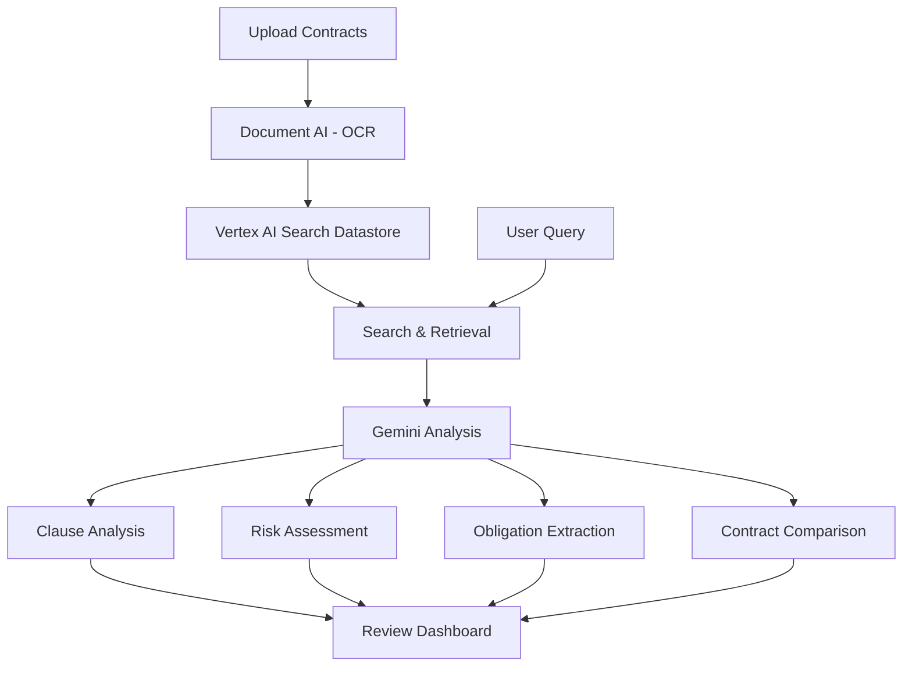

# How to Build a Legal Document Review System with Vertex AI Search and Gemini

Author: [nawazdhandala](https://www.github.com/nawazdhandala)

Tags: GCP, Vertex AI, Gemini, Legal Tech, Document Review

Description: Build a legal document review system using Vertex AI Search for document retrieval and Gemini for clause analysis, risk assessment, and contract comparison on GCP.

---

Legal document review is one of the most time-consuming and expensive parts of legal work. Reviewing contracts, identifying risky clauses, comparing terms across documents, and extracting key provisions - a task that takes a team of associates days can potentially be done in minutes with the right tooling. Vertex AI Search handles the retrieval side - finding relevant documents and clauses. Gemini handles the understanding side - analyzing what those clauses mean and flagging potential issues.

In this post, I'll build a legal document review system that ingests contracts, indexes them for search, and provides AI-powered analysis of terms, risks, and obligations.

## System Architecture



## Setting Up the Document Store

First, create a Vertex AI Search datastore for your legal documents:

```bash
# Enable Vertex AI Search
gcloud services enable discoveryengine.googleapis.com

# Create a GCS bucket for document storage
gsutil mb -l us-central1 gs://YOUR_PROJECT-legal-documents
```

```python
from google.cloud import discoveryengine_v1 as discoveryengine

def create_legal_datastore(project_id, location="global"):
    """Create a Vertex AI Search datastore for legal documents"""
    client = discoveryengine.DataStoreServiceClient()

    datastore = discoveryengine.DataStore(
        display_name="Legal Document Repository",
        industry_vertical=discoveryengine.IndustryVertical.GENERIC,
        solution_types=[discoveryengine.SolutionType.SOLUTION_TYPE_SEARCH],
        content_config=discoveryengine.DataStore.ContentConfig.CONTENT_REQUIRED,
    )

    parent = f"projects/{project_id}/locations/{location}/collections/default_collection"

    operation = client.create_data_store(
        parent=parent,
        data_store=datastore,
        data_store_id="legal-documents",
    )

    result = operation.result()
    print(f"Datastore created: {result.name}")
    return result
```

## Document Ingestion Pipeline

Process and ingest documents into the search datastore:

```python
from google.cloud import documentai_v1
from google.cloud import storage
import json

def ingest_contract(project_id, file_path, metadata):
    """Process and ingest a legal document"""

    # Step 1: Extract text with Document AI
    text_content = extract_document_text(project_id, file_path)

    # Step 2: Pre-process the document with Gemini to extract structure
    structure = extract_document_structure(text_content)

    # Step 3: Upload to Vertex AI Search
    upload_to_datastore(project_id, file_path, text_content, structure, metadata)

def extract_document_structure(text_content):
    """Use Gemini to identify the structure of a legal document"""
    import vertexai
    from vertexai.generative_models import GenerativeModel

    vertexai.init(project="your-project-id", location="us-central1")
    model = GenerativeModel("gemini-1.5-pro")

    response = model.generate_content(
        f"""Analyze this legal document and extract its structure.

Document:
{text_content[:10000]}

Identify:
1. Document type (NDA, employment agreement, SaaS agreement, etc.)
2. Parties involved
3. Effective date
4. Termination/expiry date
5. Key sections and their page numbers
6. Governing law jurisdiction

Output as JSON with fields: document_type, parties (array),
effective_date, expiry_date, sections (array of {{title, summary}}),
governing_law.""",
        generation_config={"temperature": 0.1, "max_output_tokens": 2000},
    )

    try:
        return json.loads(response.text)
    except json.JSONDecodeError:
        return {"raw": response.text}
```

## Legal Analysis Engine

The core of the system - Gemini-powered analysis of legal documents:

```python
import vertexai
from vertexai.generative_models import GenerativeModel
import json

class LegalAnalyzer:
    def __init__(self, project_id):
        vertexai.init(project=project_id, location="us-central1")
        self.model = GenerativeModel("gemini-1.5-pro")

    def analyze_contract(self, contract_text):
        """Run comprehensive analysis on a contract"""
        results = {}

        results["clause_analysis"] = self.analyze_clauses(contract_text)
        results["risk_assessment"] = self.assess_risks(contract_text)
        results["obligations"] = self.extract_obligations(contract_text)
        results["key_terms"] = self.extract_key_terms(contract_text)

        return results

    def analyze_clauses(self, contract_text):
        """Identify and analyze key clauses"""
        response = self.model.generate_content(
            f"""You are a legal analyst. Review this contract and identify
all key clauses. For each clause, provide:

1. Clause type (indemnification, limitation of liability, termination,
   confidentiality, IP assignment, non-compete, etc.)
2. A plain-English summary of what it means
3. Whether it's standard or unusual for this type of agreement
4. Any concerns from the reviewing party's perspective

Contract:
{contract_text[:15000]}

Output as JSON array with fields: clause_type, original_text (first 200 chars),
summary, is_standard (boolean), concerns (array of strings).""",
            generation_config={"temperature": 0.1, "max_output_tokens": 4000},
        )

        try:
            return json.loads(response.text)
        except json.JSONDecodeError:
            return {"raw": response.text}

    def assess_risks(self, contract_text):
        """Identify potential legal risks in the contract"""
        response = self.model.generate_content(
            f"""You are a risk-focused legal reviewer. Analyze this contract
for potential risks. Consider:

1. One-sided clauses that heavily favor one party
2. Missing standard protections (liability caps, indemnification, etc.)
3. Unusual or non-standard terms
4. Broad or vague language that could be interpreted unfavorably
5. Compliance risks (data protection, export controls, etc.)
6. Financial exposure risks

For each risk, rate severity as LOW, MEDIUM, HIGH, or CRITICAL.

Contract:
{contract_text[:15000]}

Output as JSON array with fields: risk_description, severity,
affected_clause, recommendation.""",
            generation_config={"temperature": 0.1, "max_output_tokens": 3000},
        )

        try:
            return json.loads(response.text)
        except json.JSONDecodeError:
            return {"raw": response.text}

    def extract_obligations(self, contract_text):
        """Extract all obligations and commitments from the contract"""
        response = self.model.generate_content(
            f"""Extract all obligations and commitments from this contract.
For each obligation, identify:

1. Which party has the obligation
2. What they must do (or not do)
3. Any deadline or time constraint
4. Consequences of non-compliance
5. Whether it survives termination

Contract:
{contract_text[:15000]}

Output as JSON array with fields: obligated_party, obligation_description,
deadline, consequence, survives_termination (boolean).""",
            generation_config={"temperature": 0.1, "max_output_tokens": 3000},
        )

        try:
            return json.loads(response.text)
        except json.JSONDecodeError:
            return {"raw": response.text}

    def extract_key_terms(self, contract_text):
        """Extract key commercial and legal terms"""
        response = self.model.generate_content(
            f"""Extract the key terms from this contract:

1. Payment terms (amounts, schedule, currency)
2. Duration and renewal terms
3. Termination provisions (notice period, termination for cause/convenience)
4. SLA commitments if any
5. Insurance requirements
6. Intellectual property ownership
7. Data handling and privacy terms
8. Non-compete/non-solicitation scope

Contract:
{contract_text[:15000]}

Output as JSON with descriptive field names for each term found.""",
            generation_config={"temperature": 0.1, "max_output_tokens": 2000},
        )

        try:
            return json.loads(response.text)
        except json.JSONDecodeError:
            return {"raw": response.text}
```

## Contract Comparison

Compare two contracts to identify differences:

```python
def compare_contracts(self, contract_a_text, contract_b_text, focus_areas=None):
    """Compare two contracts and highlight differences"""
    focus = ""
    if focus_areas:
        focus = f"Focus particularly on these areas: {', '.join(focus_areas)}"

    response = self.model.generate_content(
        f"""Compare these two contracts and identify all significant differences.

CONTRACT A:
{contract_a_text[:8000]}

CONTRACT B:
{contract_b_text[:8000]}

{focus}

For each difference, provide:
1. The topic/clause area
2. What Contract A says
3. What Contract B says
4. Which version is more favorable (and to which party)
5. Risk implications of the difference

Output as JSON array with fields: topic, contract_a_position,
contract_b_position, more_favorable_to, risk_implication.""",
        generation_config={"temperature": 0.1, "max_output_tokens": 4000},
    )

    try:
        return json.loads(response.text)
    except json.JSONDecodeError:
        return {"raw": response.text}
```

## Search Integration

Build the search functionality using Vertex AI Search:

```python
from google.cloud import discoveryengine_v1 as discoveryengine

def search_legal_documents(project_id, query, filters=None):
    """Search across the legal document repository"""
    client = discoveryengine.SearchServiceClient()

    serving_config = (
        f"projects/{project_id}/locations/global/"
        f"collections/default_collection/dataStores/legal-documents/"
        f"servingConfigs/default_search"
    )

    request = discoveryengine.SearchRequest(
        serving_config=serving_config,
        query=query,
        page_size=10,
        # Enable extractive answers for direct clause retrieval
        content_search_spec=discoveryengine.SearchRequest.ContentSearchSpec(
            extractive_content_spec=discoveryengine.SearchRequest.ContentSearchSpec.ExtractiveContentSpec(
                max_extractive_answer_count=3,
                max_extractive_segment_count=5,
            ),
            snippet_spec=discoveryengine.SearchRequest.ContentSearchSpec.SnippetSpec(
                return_snippet=True,
            ),
        ),
    )

    response = client.search(request)

    results = []
    for result in response.results:
        doc = result.document
        results.append({
            "document_id": doc.id,
            "title": doc.derived_struct_data.get("title", ""),
            "snippets": [
                s.snippet for s in result.document.derived_struct_data.get("snippets", [])
            ],
            "relevance_score": result.relevance_score if hasattr(result, 'relevance_score') else None,
        })

    return results
```

## Building the Review API

Wrap everything in a Cloud Run service:

```python
from flask import Flask, request, jsonify

app = Flask(__name__)
analyzer = LegalAnalyzer("your-project-id")

@app.route("/analyze", methods=["POST"])
def analyze_document():
    """Analyze a single contract"""
    data = request.get_json()
    contract_text = data["text"]
    analysis = analyzer.analyze_contract(contract_text)
    return jsonify(analysis)

@app.route("/compare", methods=["POST"])
def compare_documents():
    """Compare two contracts"""
    data = request.get_json()
    comparison = analyzer.compare_contracts(
        data["contract_a"],
        data["contract_b"],
        data.get("focus_areas"),
    )
    return jsonify({"comparison": comparison})

@app.route("/search", methods=["GET"])
def search():
    """Search for relevant clauses or documents"""
    query = request.args.get("q")
    results = search_legal_documents("your-project-id", query)
    return jsonify({"results": results})
```

## Wrapping Up

A legal document review system built on Vertex AI Search and Gemini accelerates what used to be purely manual work. Vertex AI Search handles finding the right documents and clauses across your repository. Gemini provides the analysis layer - understanding what clauses mean, identifying risks, extracting obligations, and comparing terms. This doesn't replace lawyers, but it dramatically reduces the time they spend on initial review and lets them focus on the judgment calls that actually require legal expertise. Start with a specific document type your team reviews frequently, validate the analysis against manual reviews, and expand from there.
