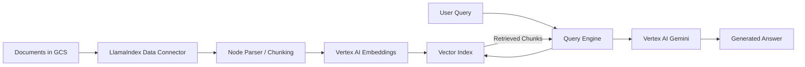

# How to Build a LlamaIndex RAG Pipeline with Vertex AI Embeddings and Cloud Storage

Author: [nawazdhandala](https://www.github.com/nawazdhandala)

Tags: GCP, LlamaIndex, Vertex AI, RAG, Cloud Storage

Description: Build a complete Retrieval-Augmented Generation pipeline using LlamaIndex with Vertex AI embeddings and Google Cloud Storage as the document source.

---

Retrieval-Augmented Generation (RAG) is the go-to pattern for building AI applications that need to answer questions based on your own data. LlamaIndex is a framework built specifically for this purpose - it provides the connectors, indexing strategies, and query engines that make RAG pipelines easier to build and maintain. Combined with Vertex AI for embeddings and language models, and Cloud Storage for document management, you get a fully managed RAG stack on GCP.

This guide walks through building a production-ready RAG pipeline from scratch using these components.

## Architecture Overview



## Prerequisites

- Google Cloud project with Vertex AI and Cloud Storage APIs enabled
- Python 3.9+
- Documents uploaded to a GCS bucket

```bash
# Install LlamaIndex with Vertex AI and GCS integrations
pip install llama-index llama-index-llms-vertex llama-index-embeddings-vertex llama-index-readers-google google-cloud-storage google-cloud-aiplatform
```

## Setting Up the Components

### Initialize Vertex AI Models

LlamaIndex needs two model connections - one for embeddings (converting text to vectors) and one for generation (producing answers).

```python
from llama_index.llms.vertex import Vertex
from llama_index.embeddings.vertex import VertexTextEmbedding
from llama_index.core import Settings

# Configure the embedding model for converting text to vectors
embed_model = VertexTextEmbedding(
    model_name="text-embedding-004",
    project="your-project-id",
    location="us-central1",
)

# Configure the language model for answer generation
llm = Vertex(
    model="gemini-1.5-pro",
    project="your-project-id",
    location="us-central1",
    temperature=0.2,
    max_tokens=2048,
)

# Set these as the defaults for all LlamaIndex operations
Settings.llm = llm
Settings.embed_model = embed_model
Settings.chunk_size = 1024  # Characters per chunk
Settings.chunk_overlap = 200  # Overlap between chunks
```

## Loading Documents from Cloud Storage

LlamaIndex has a dedicated reader for Google Cloud Storage that handles downloading and parsing files from your bucket.

```python
from llama_index.readers.google import GCSReader

# Initialize the GCS reader
gcs_reader = GCSReader(
    bucket="your-document-bucket",
    prefix="knowledge-base/",  # Only read files under this prefix
    project_id="your-project-id",
)

# Load all documents from the bucket
documents = gcs_reader.load_data()
print(f"Loaded {len(documents)} documents from GCS")

# Each document has text content and metadata
for doc in documents[:3]:
    print(f"  Source: {doc.metadata.get('file_name', 'unknown')}")
    print(f"  Length: {len(doc.text)} characters")
```

### Loading Specific File Types

If you need more control over which files to load, you can filter by extension.

```python
import re
from google.cloud import storage

def load_filtered_documents(bucket_name: str, prefix: str, extensions: list):
    """Load only specific file types from GCS."""
    client = storage.Client()
    bucket = client.bucket(bucket_name)
    blobs = bucket.list_blobs(prefix=prefix)

    # Filter blobs by extension
    filtered_blobs = [
        blob for blob in blobs
        if any(blob.name.endswith(ext) for ext in extensions)
    ]

    print(f"Found {len(filtered_blobs)} matching files")

    # Use GCSReader to load filtered files
    reader = GCSReader(
        bucket=bucket_name,
        project_id="your-project-id",
    )

    all_docs = []
    for blob in filtered_blobs:
        docs = reader.load_data(blob_name=blob.name)
        all_docs.extend(docs)

    return all_docs

# Load only PDFs and text files
docs = load_filtered_documents(
    "your-document-bucket",
    "knowledge-base/",
    [".pdf", ".txt", ".md"],
)
```

## Building the Index

The index is where LlamaIndex stores the chunked and embedded documents for retrieval.

```python
from llama_index.core import VectorStoreIndex

# Build the vector index from the loaded documents
# This chunks the documents, generates embeddings, and stores everything
index = VectorStoreIndex.from_documents(
    documents,
    show_progress=True,  # Show a progress bar during indexing
)

print("Index built successfully")
```

### Persisting the Index

You do not want to rebuild the index every time your application starts. Persist it to disk or to GCS.

```python
from llama_index.core import StorageContext, load_index_from_storage

# Save the index to a local directory
index.storage_context.persist(persist_dir="./index_storage")

# Later, load the index from disk instead of rebuilding
storage_context = StorageContext.from_defaults(persist_dir="./index_storage")
loaded_index = load_index_from_storage(storage_context)
```

To persist to GCS for sharing across instances:

```python
from google.cloud import storage
import os

def upload_index_to_gcs(local_dir: str, bucket_name: str, gcs_prefix: str):
    """Upload the persisted index to GCS for durability."""
    client = storage.Client()
    bucket = client.bucket(bucket_name)

    for root, dirs, files in os.walk(local_dir):
        for file_name in files:
            local_path = os.path.join(root, file_name)
            # Construct the GCS blob path
            relative_path = os.path.relpath(local_path, local_dir)
            blob_path = f"{gcs_prefix}/{relative_path}"
            blob = bucket.blob(blob_path)
            blob.upload_from_filename(local_path)
            print(f"Uploaded {blob_path}")

# Upload the index
upload_index_to_gcs("./index_storage", "your-bucket", "indexes/rag-v1")
```

## Querying the Index

### Basic Query

```python
# Create a query engine from the index
query_engine = index.as_query_engine(
    similarity_top_k=5,  # Retrieve top 5 most relevant chunks
)

# Ask a question
response = query_engine.query("What is our refund policy for enterprise customers?")
print(f"Answer: {response}")

# Access the source documents that were used
for source_node in response.source_nodes:
    print(f"\nSource: {source_node.metadata.get('file_name', 'unknown')}")
    print(f"Score: {source_node.score:.4f}")
    print(f"Text: {source_node.text[:200]}...")
```

### Customizing the Query Engine

You can tune how the query engine retrieves and synthesizes answers.

```python
from llama_index.core.response_synthesizers import ResponseMode

# Create a more customized query engine
query_engine = index.as_query_engine(
    similarity_top_k=5,
    response_mode=ResponseMode.COMPACT,  # Combine chunks before sending to LLM
    streaming=True,  # Enable streaming responses
)

# Use streaming to display the response as it is generated
streaming_response = query_engine.query("Explain our SLA guarantees")
for text in streaming_response.response_gen:
    print(text, end="", flush=True)
print()  # New line after streaming completes
```

### Chat-Style Queries

For multi-turn conversations, use the chat engine instead.

```python
# Create a chat engine that maintains conversation context
chat_engine = index.as_chat_engine(
    chat_mode="condense_plus_context",  # Combines chat history with retrieval
    verbose=True,
)

# Have a multi-turn conversation
response1 = chat_engine.chat("What products do we offer?")
print(f"Bot: {response1}")

response2 = chat_engine.chat("Which one has the best pricing for startups?")
print(f"Bot: {response2}")

# Reset the conversation
chat_engine.reset()
```

## Updating the Index

When new documents arrive, you do not need to rebuild the entire index.

```python
from llama_index.core import Document

# Insert new documents into the existing index
new_doc = Document(
    text="New product announcement: We are launching a premium support tier...",
    metadata={"source": "announcements", "date": "2026-02-17"},
)

index.insert(new_doc)
print("New document added to the index")

# Delete a document by its ID
index.delete_ref_doc("doc_id_to_remove")
```

## Evaluation and Quality Checks

Before going to production, evaluate your RAG pipeline's quality.

```python
from llama_index.core.evaluation import RelevancyEvaluator

# Create an evaluator using the same LLM
evaluator = RelevancyEvaluator(llm=llm)

# Test with a known question-answer pair
query = "What is the maximum file upload size?"
response = query_engine.query(query)

# Evaluate whether the response is relevant to the query
eval_result = evaluator.evaluate_response(query=query, response=response)
print(f"Relevant: {eval_result.passing}")
print(f"Feedback: {eval_result.feedback}")
```

## Production Deployment Tips

When deploying this pipeline to production, consider a few things. Keep your index persistence on GCS so all Cloud Run instances share the same data. Set up a Cloud Function triggered by GCS events to automatically re-index when new documents are uploaded. Monitor your Vertex AI API usage to control costs - embedding large document sets can add up.

Use LlamaIndex's built-in caching to avoid re-embedding documents that have not changed. And always test your pipeline with real user queries before launch, not just synthetic ones.

## Summary

LlamaIndex paired with Vertex AI and Cloud Storage gives you a clean, well-integrated RAG pipeline on GCP. The framework handles the tedious parts - chunking, embedding, retrieval, and synthesis - while you focus on the data and the user experience. Start with a small document set, tune your chunk size and retrieval parameters, then scale up once you are happy with the answer quality.
