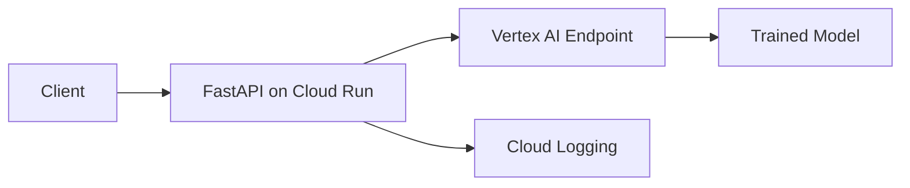

# How to Build a Machine Learning Prediction API with Vertex AI and FastAPI on Cloud Run

Author: [nawazdhandala](https://www.github.com/nawazdhandala)

Tags: GCP, Vertex AI, FastAPI, Cloud Run, Machine Learning

Description: Build a production-ready ML prediction API using Vertex AI for model serving and FastAPI deployed on Cloud Run for scalable inference endpoints.

---

Deploying machine learning models as APIs used to be a pain. You had to manage servers, worry about scaling, handle model versioning, and somehow keep the whole thing running reliably. With Vertex AI and Cloud Run, most of that complexity goes away. Vertex AI handles model hosting and prediction, while FastAPI on Cloud Run gives you a clean, scalable API layer. In this guide, I will show you how to wire it all together.

## Architecture Overview

The system has two main components. Vertex AI hosts your trained model and serves predictions through its prediction API. FastAPI runs on Cloud Run as the public-facing API that accepts requests, validates input, calls Vertex AI for inference, and returns formatted responses.



## Prerequisites

You need a trained model deployed to a Vertex AI endpoint. If you do not have one yet, here is a quick way to deploy a pre-built model.

```bash
# Install required packages
pip install google-cloud-aiplatform fastapi uvicorn

# Make sure you have a GCP project with Vertex AI API enabled
gcloud services enable aiplatform.googleapis.com
```

## Setting Up the FastAPI Application

Let me build the API step by step. First, the main application file.

```python
# main.py - FastAPI application for ML predictions
from fastapi import FastAPI, HTTPException
from pydantic import BaseModel, Field
from google.cloud import aiplatform
from typing import List, Optional
import os
import logging

# Configure logging
logging.basicConfig(level=logging.INFO)
logger = logging.getLogger(__name__)

# Initialize FastAPI with metadata for auto-generated docs
app = FastAPI(
    title="ML Prediction API",
    description="Serves predictions from a Vertex AI model",
    version="1.0.0",
)

# Configuration from environment variables
PROJECT_ID = os.environ.get("GCP_PROJECT", "my-gcp-project")
LOCATION = os.environ.get("GCP_LOCATION", "us-central1")
ENDPOINT_ID = os.environ.get("VERTEX_ENDPOINT_ID")

# Initialize the Vertex AI SDK
aiplatform.init(project=PROJECT_ID, location=LOCATION)
```

## Defining Request and Response Models

Pydantic models give you automatic validation and documentation. Define what your API expects and returns.

```python
# models.py - Request and response schemas
from pydantic import BaseModel, Field
from typing import List, Optional

class PredictionRequest(BaseModel):
    """Input features for the prediction model."""
    features: List[float] = Field(
        ...,
        description="List of numerical features for the model",
        min_length=1,
        max_length=100,
    )
    model_version: Optional[str] = Field(
        default=None,
        description="Specific model version to use (optional)",
    )

    class Config:
        json_schema_extra = {
            "example": {
                "features": [1.5, 2.3, 0.8, 4.1, 3.7],
                "model_version": None,
            }
        }

class PredictionResponse(BaseModel):
    """Prediction results from the model."""
    predictions: List[float]
    model_id: str
    endpoint_id: str
    confidence: Optional[float] = None

class HealthResponse(BaseModel):
    """Health check response."""
    status: str
    model_endpoint: str
```

## Building the Prediction Endpoint

This is the core of the API. It receives a request, sends it to Vertex AI, and returns the prediction.

```python
# Add to main.py - the prediction route
from models import PredictionRequest, PredictionResponse, HealthResponse

@app.post("/predict", response_model=PredictionResponse)
async def predict(request: PredictionRequest):
    """Send features to Vertex AI and return the prediction."""
    if not ENDPOINT_ID:
        raise HTTPException(
            status_code=500,
            detail="VERTEX_ENDPOINT_ID environment variable not set"
        )

    try:
        # Get the Vertex AI endpoint
        endpoint = aiplatform.Endpoint(endpoint_name=ENDPOINT_ID)

        # Format the input as Vertex AI expects it
        # Each instance is a list of feature values
        instances = [request.features]

        # Call the Vertex AI endpoint for prediction
        logger.info(f"Sending prediction request with {len(request.features)} features")
        prediction_result = endpoint.predict(instances=instances)

        # Extract predictions from the response
        predictions = prediction_result.predictions
        model_id = prediction_result.deployed_model_id

        logger.info(f"Got prediction from model {model_id}")

        return PredictionResponse(
            predictions=predictions[0] if isinstance(predictions[0], list) else predictions,
            model_id=model_id,
            endpoint_id=ENDPOINT_ID,
        )

    except Exception as e:
        logger.error(f"Prediction failed: {str(e)}")
        raise HTTPException(
            status_code=500,
            detail=f"Prediction failed: {str(e)}"
        )

@app.get("/health", response_model=HealthResponse)
async def health_check():
    """Check if the service and model endpoint are accessible."""
    return HealthResponse(
        status="healthy",
        model_endpoint=ENDPOINT_ID or "not configured",
    )

@app.get("/")
async def root():
    """Root endpoint with API info."""
    return {
        "service": "ML Prediction API",
        "docs": "/docs",
        "health": "/health",
    }
```

## Adding Batch Prediction Support

Sometimes clients need predictions for multiple inputs at once. Adding a batch endpoint is simple.

```python
# Batch prediction endpoint for multiple inputs at once
@app.post("/predict/batch")
async def predict_batch(requests: List[PredictionRequest]):
    """Process multiple prediction requests in a single call."""
    if len(requests) > 100:
        raise HTTPException(
            status_code=400,
            detail="Maximum 100 instances per batch request"
        )

    try:
        endpoint = aiplatform.Endpoint(endpoint_name=ENDPOINT_ID)

        # Combine all feature sets into a single batch
        instances = [req.features for req in requests]

        # Send all instances in one API call - more efficient than individual calls
        result = endpoint.predict(instances=instances)

        return {
            "predictions": result.predictions,
            "model_id": result.deployed_model_id,
            "count": len(result.predictions),
        }

    except Exception as e:
        logger.error(f"Batch prediction failed: {str(e)}")
        raise HTTPException(status_code=500, detail=str(e))
```

## The Dockerfile

Cloud Run needs a container. Here is a Dockerfile for the FastAPI application.

```dockerfile
# Use a slim Python image for smaller container size
FROM python:3.11-slim

# Set the working directory
WORKDIR /app

# Copy and install dependencies first for better layer caching
COPY requirements.txt .
RUN pip install --no-cache-dir -r requirements.txt

# Copy the application code
COPY . .

# Cloud Run sets PORT environment variable
ENV PORT=8080

# Run with uvicorn - workers=1 because Cloud Run handles scaling at the container level
CMD ["uvicorn", "main:app", "--host", "0.0.0.0", "--port", "8080", "--workers", "1"]
```

And the requirements file.

```
# requirements.txt
fastapi==0.109.0
uvicorn==0.27.0
google-cloud-aiplatform==1.40.0
pydantic==2.5.3
```

## Deploying to Cloud Run

Build and deploy the container with a few gcloud commands.

```bash
# Build the container image using Cloud Build
gcloud builds submit --tag gcr.io/my-gcp-project/ml-prediction-api

# Deploy to Cloud Run with the Vertex AI endpoint configured
gcloud run deploy ml-prediction-api \
    --image gcr.io/my-gcp-project/ml-prediction-api \
    --region us-central1 \
    --platform managed \
    --set-env-vars "GCP_PROJECT=my-gcp-project,VERTEX_ENDPOINT_ID=1234567890" \
    --memory 512Mi \
    --cpu 1 \
    --min-instances 1 \
    --max-instances 10 \
    --allow-unauthenticated
```

Setting `min-instances` to 1 avoids cold starts for the first request. Adjust based on your traffic patterns and budget.

## Testing the API

Once deployed, you can test the endpoints.

```bash
# Get the service URL
SERVICE_URL=$(gcloud run services describe ml-prediction-api \
    --region us-central1 --format 'value(status.url)')

# Test the health endpoint
curl "$SERVICE_URL/health"

# Send a prediction request
curl -X POST "$SERVICE_URL/predict" \
    -H "Content-Type: application/json" \
    -d '{"features": [1.5, 2.3, 0.8, 4.1, 3.7]}'

# Test batch predictions
curl -X POST "$SERVICE_URL/predict/batch" \
    -H "Content-Type: application/json" \
    -d '[{"features": [1.0, 2.0, 3.0]}, {"features": [4.0, 5.0, 6.0]}]'
```

## Monitoring Your ML API

ML APIs need monitoring beyond just uptime. You want to track prediction latency, error rates, and model drift. OneUptime (https://oneuptime.com) can monitor your Cloud Run service endpoint, alert you when prediction latency spikes, and help you catch issues before they affect your downstream applications that depend on model predictions.

## Summary

Combining Vertex AI with FastAPI on Cloud Run gives you a production-grade ML prediction API with minimal infrastructure management. Vertex AI handles the model serving complexity while Cloud Run scales your API layer automatically. The key pieces are: keep your FastAPI application stateless, let Cloud Run handle scaling, use batch endpoints when clients need multiple predictions, and always include a health check endpoint for monitoring. This pattern works well for most ML serving use cases and can be extended with caching, authentication, and rate limiting as your needs grow.
