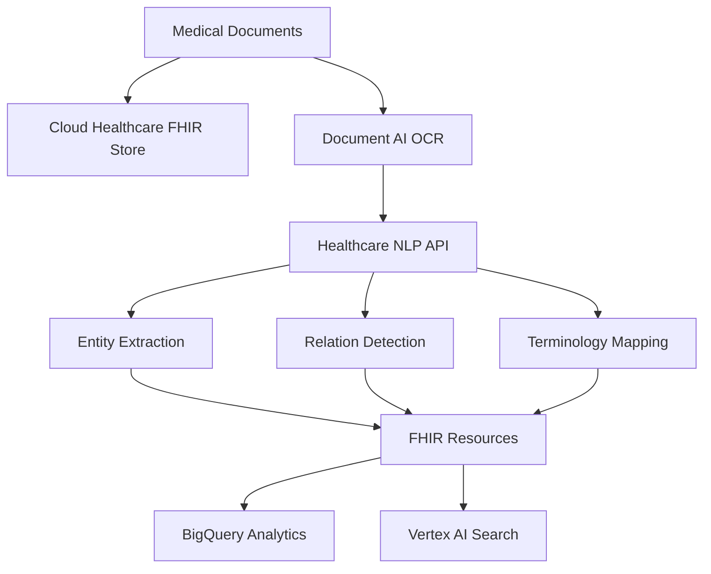

# How to Build a Medical Document Processing Pipeline with Vertex AI and Healthcare NLP

Author: [nawazdhandala](https://www.github.com/nawazdhandala)

Tags: GCP, Vertex AI, Healthcare NLP, Document Processing, Medical AI

Description: Build a pipeline for processing medical documents using Vertex AI and the Healthcare Natural Language API to extract clinical entities, relationships, and structured data.

---

Medical documents - clinical notes, discharge summaries, pathology reports, radiology findings - contain a wealth of information, but it's trapped in unstructured text. Extracting structured data from these documents manually is slow, expensive, and error-prone. GCP's Healthcare Natural Language API, combined with Vertex AI, gives you the tools to build automated processing pipelines that can extract clinical entities, map them to standard medical terminologies, and structure the data for downstream use.

In this guide, I'll walk through building a medical document processing pipeline that handles document ingestion, clinical NLP extraction, terminology mapping, and structured output generation.

## Important Note on Compliance

Before processing any medical data on GCP, you must ensure your project and organization meet HIPAA requirements. This means signing a Business Associate Agreement (BAA) with Google, using HIPAA-eligible services only, and configuring appropriate access controls and audit logging. The code in this post demonstrates the technical implementation - your compliance and legal teams need to approve the operational configuration.

## Pipeline Architecture



## Setting Up the Healthcare Environment

```bash
# Enable required APIs
gcloud services enable healthcare.googleapis.com
gcloud services enable aiplatform.googleapis.com
gcloud services enable documentai.googleapis.com

# Create a Healthcare dataset
gcloud healthcare datasets create medical-documents \
    --location=us-central1

# Create a FHIR store for structured output
gcloud healthcare fhir-stores create processed-documents \
    --dataset=medical-documents \
    --location=us-central1 \
    --version=R4
```

## Document Ingestion and OCR

For scanned documents, use Document AI to extract text before NLP processing:

```python
from google.cloud import documentai_v1

def extract_text_from_document(project_id, location, processor_id, file_path):
    """Extract text from a medical document using Document AI"""
    client = documentai_v1.DocumentProcessorServiceClient()

    # Read the file
    with open(file_path, "rb") as f:
        content = f.read()

    # Determine the MIME type
    mime_type = "application/pdf"
    if file_path.endswith(".png") or file_path.endswith(".jpg"):
        mime_type = "image/png" if file_path.endswith(".png") else "image/jpeg"

    # Process the document
    request = documentai_v1.ProcessRequest(
        name=f"projects/{project_id}/locations/{location}/processors/{processor_id}",
        raw_document=documentai_v1.RawDocument(
            content=content,
            mime_type=mime_type,
        ),
    )

    result = client.process_document(request=request)
    document = result.document

    # Extract text and maintain page structure
    pages = []
    for page in document.pages:
        page_text = ""
        for paragraph in page.paragraphs:
            # Get the text for this paragraph from the layout
            text_anchor = paragraph.layout.text_anchor
            for segment in text_anchor.text_segments:
                start = int(segment.start_index) if segment.start_index else 0
                end = int(segment.end_index)
                page_text += document.text[start:end]
            page_text += "\n"
        pages.append(page_text)

    return {
        "full_text": document.text,
        "pages": pages,
        "page_count": len(document.pages),
    }
```

## Clinical Entity Extraction with Healthcare NLP

The Healthcare Natural Language API understands medical terminology and can extract clinical entities:

```python
from google.cloud import language_v1
import requests

def extract_clinical_entities(project_id, text):
    """Extract clinical entities from medical text using Healthcare NLP"""
    url = (
        f"https://healthcare.googleapis.com/v1/"
        f"projects/{project_id}/locations/us-central1/"
        f"services/nlp:analyzeEntities"
    )

    # Get access token for authentication
    import google.auth
    import google.auth.transport.requests
    credentials, _ = google.auth.default()
    auth_req = google.auth.transport.requests.Request()
    credentials.refresh(auth_req)

    headers = {
        "Authorization": f"Bearer {credentials.token}",
        "Content-Type": "application/json",
    }

    # Send the text for analysis
    body = {
        "documentContent": text,
        "licensedVocabularies": [
            "ICD10CM",      # International Classification of Diseases
            "SNOMEDCT_US",  # SNOMED Clinical Terms
            "RXNORM",       # Medication terminology
            "LOINC",        # Lab test codes
        ],
    }

    response = requests.post(url, headers=headers, json=body)
    response.raise_for_status()
    result = response.json()

    # Parse the extracted entities
    entities = []
    for entity in result.get("entities", []):
        parsed_entity = {
            "text": entity.get("mentionText", ""),
            "type": entity.get("entityType", ""),
            "certainty": entity.get("certaintyAssessment", {}).get(
                "confidence", 0
            ),
            "temporal": entity.get("temporalAssessment", {}).get(
                "value", ""
            ),
            "subject": entity.get("subjectAssessment", {}).get(
                "value", "PATIENT"
            ),
            "vocabulary_codes": [],
        }

        # Extract mapped vocabulary codes
        for vocab in entity.get("linkedEntities", []):
            parsed_entity["vocabulary_codes"].append({
                "vocabulary": vocab.get("vocabulary", ""),
                "code": vocab.get("entityId", ""),
                "preferred_term": vocab.get("preferredTerm", ""),
            })

        entities.append(parsed_entity)

    # Parse relationships between entities
    relationships = []
    for relation in result.get("relationships", []):
        relationships.append({
            "type": relation.get("relationType", ""),
            "subject": relation.get("subject", {}).get("mentionText", ""),
            "object": relation.get("object", {}).get("mentionText", ""),
        })

    return {
        "entities": entities,
        "relationships": relationships,
        "entity_count": len(entities),
    }
```

## Converting to FHIR Resources

Map extracted entities to FHIR (Fast Healthcare Interoperability Resources) format:

```python
import json
import uuid
from datetime import datetime

def create_fhir_resources(document_id, entities, patient_id):
    """Convert extracted clinical entities to FHIR resources"""
    resources = []

    for entity in entities:
        entity_type = entity["type"]

        if entity_type == "PROBLEM":
            # Create a Condition resource
            condition = {
                "resourceType": "Condition",
                "id": str(uuid.uuid4()),
                "subject": {"reference": f"Patient/{patient_id}"},
                "code": _build_codeable_concept(entity),
                "clinicalStatus": {
                    "coding": [{
                        "system": "http://terminology.hl7.org/CodeSystem/condition-clinical",
                        "code": "active",
                    }]
                },
                "recordedDate": datetime.utcnow().isoformat(),
                "note": [{"text": f"Extracted from document {document_id}"}],
            }
            resources.append(condition)

        elif entity_type == "MEDICINE":
            # Create a MedicationStatement resource
            medication = {
                "resourceType": "MedicationStatement",
                "id": str(uuid.uuid4()),
                "subject": {"reference": f"Patient/{patient_id}"},
                "medicationCodeableConcept": _build_codeable_concept(entity),
                "status": "active",
                "dateAsserted": datetime.utcnow().isoformat(),
            }

            # Add dosage if relationship data is available
            dosage_info = _find_related_dosage(entity, entities)
            if dosage_info:
                medication["dosage"] = [{
                    "text": dosage_info,
                }]

            resources.append(medication)

        elif entity_type == "PROCEDURE":
            # Create a Procedure resource
            procedure = {
                "resourceType": "Procedure",
                "id": str(uuid.uuid4()),
                "subject": {"reference": f"Patient/{patient_id}"},
                "code": _build_codeable_concept(entity),
                "status": "completed",
            }
            resources.append(procedure)

    return resources

def _build_codeable_concept(entity):
    """Build a FHIR CodeableConcept from vocabulary codes"""
    codings = []
    for code in entity.get("vocabulary_codes", []):
        system_map = {
            "ICD10CM": "http://hl7.org/fhir/sid/icd-10-cm",
            "SNOMEDCT_US": "http://snomed.info/sct",
            "RXNORM": "http://www.nlm.nih.gov/research/umls/rxnorm",
        }
        system = system_map.get(code["vocabulary"], code["vocabulary"])
        codings.append({
            "system": system,
            "code": code["code"],
            "display": code["preferred_term"],
        })

    return {
        "coding": codings,
        "text": entity["text"],
    }
```

## Storing Results in FHIR Store

Push the generated FHIR resources to the Healthcare API FHIR store:

```python
def store_fhir_resources(project_id, location, dataset_id, fhir_store_id, resources):
    """Store FHIR resources in Cloud Healthcare API"""
    import google.auth
    import google.auth.transport.requests

    credentials, _ = google.auth.default()
    auth_req = google.auth.transport.requests.Request()
    credentials.refresh(auth_req)

    base_url = (
        f"https://healthcare.googleapis.com/v1/"
        f"projects/{project_id}/locations/{location}/"
        f"datasets/{dataset_id}/fhirStores/{fhir_store_id}/fhir"
    )

    headers = {
        "Authorization": f"Bearer {credentials.token}",
        "Content-Type": "application/fhir+json",
    }

    stored_resources = []
    for resource in resources:
        resource_type = resource["resourceType"]
        url = f"{base_url}/{resource_type}"

        response = requests.post(url, headers=headers, json=resource)

        if response.status_code == 201:
            stored = response.json()
            stored_resources.append({
                "type": resource_type,
                "id": stored["id"],
                "status": "created",
            })
        else:
            stored_resources.append({
                "type": resource_type,
                "status": "failed",
                "error": response.text,
            })

    return stored_resources
```

## Enrichment with Vertex AI

Use Gemini on Vertex AI for more nuanced understanding that the structured NLP might miss:

```python
import vertexai
from vertexai.generative_models import GenerativeModel

def enrich_with_gemini(clinical_text, extracted_entities):
    """Use Gemini to add context and catch entities the NLP API might miss"""
    vertexai.init(project="your-project-id", location="us-central1")
    model = GenerativeModel("gemini-1.5-pro")

    prompt = f"""You are a medical document analysis assistant. Review this clinical text
and the entities that were already extracted. Identify any important clinical
information that may have been missed.

Clinical text:
{clinical_text}

Already extracted entities:
{json.dumps(extracted_entities, indent=2)}

Provide your analysis as JSON with these fields:
- missed_entities: entities not in the extracted list
- clinical_summary: brief summary of the key clinical findings
- severity_assessment: your assessment of the overall clinical picture
- follow_up_recommendations: any follow-up items mentioned

Important: Only output valid JSON. Do not include any explanatory text outside the JSON."""

    response = model.generate_content(
        prompt,
        generation_config={
            "temperature": 0.1,
            "max_output_tokens": 2000,
        },
    )

    return json.loads(response.text)
```

## Wrapping Up

Building a medical document processing pipeline requires careful attention to both the technical implementation and the regulatory environment. The Healthcare NLP API handles the heavy lifting of clinical entity extraction and terminology mapping, Document AI deals with scanned documents, and Vertex AI with Gemini adds a layer of contextual understanding. The FHIR output format ensures interoperability with existing healthcare systems. Start with a specific document type - like discharge summaries or pathology reports - validate the extraction accuracy with clinical staff, and expand to other document types as you build confidence in the pipeline's output quality.
