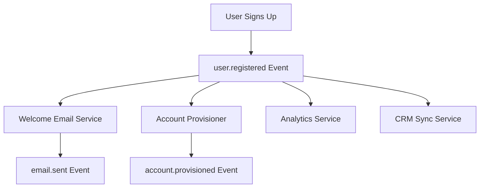

# How to Build a Microservice Choreography Architecture on GCP Using Pub/Sub and Cloud Functions

Author: [nawazdhandala](https://www.github.com/nawazdhandala)

Tags: GCP, Cloud Pub/Sub, Cloud Functions, Microservices, Choreography, Event-Driven Architecture

Description: Build a choreography-based microservice architecture on Google Cloud where services communicate through events using Pub/Sub and Cloud Functions without a central orchestrator.

---

There are two main approaches to coordinating work across microservices: orchestration and choreography. In orchestration, a central coordinator tells each service what to do and when. In choreography, there is no coordinator. Each service knows what to do when it receives a specific event, and it publishes its own events when it finishes. Services dance together like musicians in a jazz ensemble - each responding to what the others play.

Choreography leads to more decoupled systems because no single service needs to know the full workflow. On Google Cloud, Pub/Sub and Cloud Functions are a natural fit for this pattern. Pub/Sub handles event distribution, and Cloud Functions provide the serverless compute for each service to react to events.

## When to Use Choreography

Choreography works well when your workflows are relatively simple, when services are truly independent, and when you want maximum decoupling. It starts to get messy when you have long chains of events or complex branching logic - that is when orchestration might be a better fit. But for many real-world scenarios, choreography keeps things clean and simple.

Let us build a user registration flow as an example. When a new user signs up, several things need to happen: send a welcome email, provision their account resources, update analytics, and sync to a CRM. None of these steps depend on each other, making it a perfect choreography scenario.



## Setting Up the Event Infrastructure

Create the Pub/Sub topics that form your event bus. Each topic represents a domain event, not a service.

```bash
# Create topics for domain events - named after what happened, not who sends them
gcloud pubsub topics create user-registered
gcloud pubsub topics create email-sent
gcloud pubsub topics create account-provisioned
gcloud pubsub topics create analytics-updated
gcloud pubsub topics create crm-synced

# Each consuming service gets its own subscription
# This means each service processes events independently
gcloud pubsub subscriptions create welcome-email-sub \
  --topic=user-registered \
  --ack-deadline=30

gcloud pubsub subscriptions create account-provisioner-sub \
  --topic=user-registered \
  --ack-deadline=60

gcloud pubsub subscriptions create analytics-sub \
  --topic=user-registered \
  --ack-deadline=30

gcloud pubsub subscriptions create crm-sync-sub \
  --topic=user-registered \
  --ack-deadline=30
```

## Publishing the Initial Event

The registration API publishes the user.registered event. It does not know or care about what happens next.

```javascript
// registration-api/index.js
const { PubSub } = require('@google-cloud/pubsub');
const { Firestore } = require('@google-cloud/firestore');

const pubsub = new PubSub();
const db = new Firestore();

exports.registerUser = async (req, res) => {
  const { email, name, plan } = req.body;

  // Create the user record
  const userId = `user-${Date.now()}`;
  await db.collection('users').doc(userId).set({
    email,
    name,
    plan,
    status: 'pending',
    createdAt: new Date().toISOString(),
  });

  // Publish the domain event - this is the only thing the registration
  // service needs to do. Everything else is handled by other services
  // reacting to this event.
  const topic = pubsub.topic('user-registered');
  await topic.publishMessage({
    json: {
      userId,
      email,
      name,
      plan,
      timestamp: new Date().toISOString(),
    },
  });

  res.status(201).json({ userId, message: 'Registration initiated' });
};
```

## Building the Welcome Email Service

This function listens for user.registered events and sends a welcome email.

```javascript
// welcome-email/index.js
const { PubSub } = require('@google-cloud/pubsub');
const sgMail = require('@sendgrid/mail');

const pubsub = new PubSub();
sgMail.setApiKey(process.env.SENDGRID_API_KEY);

// Triggered by messages on the user-registered topic
exports.sendWelcomeEmail = async (message) => {
  const data = JSON.parse(Buffer.from(message.data, 'base64').toString());
  const { userId, email, name } = data;

  try {
    // Send the welcome email
    await sgMail.send({
      to: email,
      from: 'hello@example.com',
      subject: `Welcome aboard, ${name}!`,
      templateId: 'd-welcome-template-id',
      dynamicTemplateData: { name, userId },
    });

    // Publish our own event so other services know the email was sent
    await pubsub.topic('email-sent').publishMessage({
      json: {
        userId,
        email,
        emailType: 'welcome',
        sentAt: new Date().toISOString(),
      },
    });

    console.log(`Welcome email sent to ${email}`);
  } catch (error) {
    console.error(`Failed to send welcome email to ${email}:`, error.message);
    // Throwing here will cause the message to be redelivered
    throw error;
  }

  message.ack();
};
```

## Building the Account Provisioner

The account provisioner sets up resources for the new user based on their plan.

```javascript
// account-provisioner/index.js
const { PubSub } = require('@google-cloud/pubsub');
const { Firestore } = require('@google-cloud/firestore');

const pubsub = new PubSub();
const db = new Firestore();

exports.provisionAccount = async (message) => {
  const data = JSON.parse(Buffer.from(message.data, 'base64').toString());
  const { userId, plan } = data;

  // Define resource limits based on the plan
  const planLimits = {
    free: { storage: '1GB', apiCalls: 1000, projects: 3 },
    pro: { storage: '50GB', apiCalls: 50000, projects: 20 },
    enterprise: { storage: '500GB', apiCalls: 500000, projects: 100 },
  };

  const limits = planLimits[plan] || planLimits.free;

  // Create the account resources
  await db.collection('accounts').doc(userId).set({
    userId,
    plan,
    limits,
    usage: { storage: '0', apiCalls: 0, projects: 0 },
    provisionedAt: new Date().toISOString(),
  });

  // Update the user status
  await db.collection('users').doc(userId).update({
    status: 'active',
    accountProvisionedAt: new Date().toISOString(),
  });

  // Publish the provisioned event
  await pubsub.topic('account-provisioned').publishMessage({
    json: { userId, plan, limits },
  });

  console.log(`Account provisioned for user ${userId} on ${plan} plan`);
  message.ack();
};
```

## Adding a New Service Without Touching Existing Code

This is where choreography really shines. Let us say the marketing team wants to add a referral tracking service. You just create a new function that subscribes to the same topic. No existing service needs to change.

```bash
# Create a subscription for the new service
gcloud pubsub subscriptions create referral-tracking-sub \
  --topic=user-registered \
  --ack-deadline=30
```

```javascript
// referral-tracker/index.js - New service, zero changes to existing code
exports.trackReferral = async (message) => {
  const data = JSON.parse(Buffer.from(message.data, 'base64').toString());
  const { userId, email } = data;

  // Check if this user was referred by someone
  const referralCode = await lookupReferralCode(email);
  if (referralCode) {
    await creditReferrer(referralCode, userId);
    console.log(`Referral credited for user ${userId}`);
  }

  message.ack();
};
```

## Deploying All the Functions

```bash
# Deploy each function with its Pub/Sub trigger
gcloud functions deploy sendWelcomeEmail \
  --runtime=nodejs20 \
  --trigger-topic=user-registered \
  --source=./welcome-email \
  --set-env-vars=SENDGRID_API_KEY=$SENDGRID_KEY

gcloud functions deploy provisionAccount \
  --runtime=nodejs20 \
  --trigger-topic=user-registered \
  --source=./account-provisioner

gcloud functions deploy trackReferral \
  --runtime=nodejs20 \
  --trigger-topic=user-registered \
  --source=./referral-tracker

gcloud functions deploy registerUser \
  --runtime=nodejs20 \
  --trigger-http \
  --source=./registration-api \
  --allow-unauthenticated
```

## Handling Failures in a Choreography

Without a central orchestrator, tracking failures requires a different approach. Dead letter topics and monitoring become essential.

```bash
# Set up dead letter topics for failed messages
gcloud pubsub topics create dead-letter

# Update subscriptions to use dead letter topics after 5 retries
gcloud pubsub subscriptions update welcome-email-sub \
  --dead-letter-topic=dead-letter \
  --max-delivery-attempts=5

gcloud pubsub subscriptions update account-provisioner-sub \
  --dead-letter-topic=dead-letter \
  --max-delivery-attempts=5
```

## Tracing Events Across Services

Since there is no central coordinator, you need a correlation ID to trace events across the choreography.

```javascript
// Include a correlation ID in every event so you can trace the full flow
function publishEvent(topic, data, correlationId) {
  return pubsub.topic(topic).publishMessage({
    json: { ...data, correlationId },
    attributes: { correlationId },
  });
}
```

## Summary

Choreography gives you maximum decoupling and the ability to extend your system without modifying existing services. The tradeoff is that the overall workflow is implicit - it lives in the event subscriptions rather than in code. Make sure you document your event flows and monitor each service independently. Tools like OneUptime can help you track the health and latency of each function in the choreography, alerting you when any participant starts falling behind or failing, which is critical since no single service has visibility into the entire flow.
