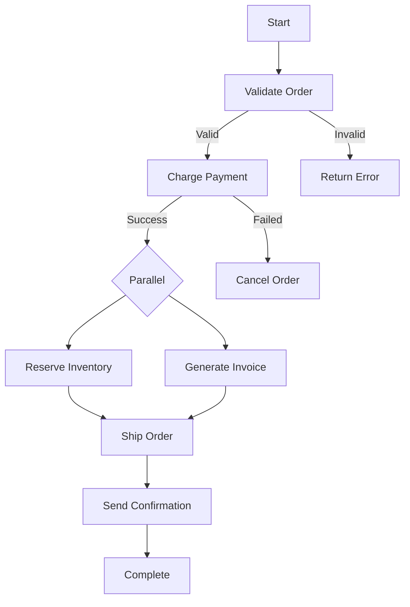

# How to Build a Microservice Orchestration Layer Using Google Cloud Workflows

Author: [nawazdhandala](https://www.github.com/nawazdhandala)

Tags: GCP, Cloud Workflows, Microservices, Orchestration, Serverless, Workflow Automation

Description: Build a centralized microservice orchestration layer using Google Cloud Workflows to coordinate complex multi-service operations with built-in error handling and retries.

---

When you have a business process that spans multiple microservices, you need some way to coordinate the work. The choreography approach works for simple flows, but when you have conditional logic, parallel execution, error handling with retries, and human-readable audit trails, a central orchestrator makes more sense. Google Cloud Workflows is a fully managed orchestration service that lets you define multi-step workflows in YAML, with built-in support for calling HTTP endpoints, handling errors, and managing state.

In this post, I will show you how to build an order fulfillment workflow that coordinates multiple Cloud Run services, handles failures gracefully, and provides visibility into the execution state at every step.

## Why Cloud Workflows for Orchestration

Cloud Workflows fills a gap between simple Cloud Functions triggers and heavyweight tools like Apache Airflow. It gives you a declarative way to define service coordination without running any infrastructure. Each workflow execution is durable - if a step fails, the execution state is preserved, and you can configure retries or fallback logic. You also get a complete execution history for auditing and debugging.

## The Order Fulfillment Workflow

Our workflow coordinates these steps: validate the order, charge the payment, check inventory, ship the order, and send a confirmation email. Some steps run in parallel where they can, and failures at each step are handled differently.



## Defining the Workflow

Here is the complete workflow definition in YAML.

```yaml
# order-fulfillment.yaml
main:
  params: [input]
  steps:
    # Step 1: Validate the order data
    - validate_order:
        call: http.post
        args:
          url: https://order-service-xxxx.run.app/validate
          auth:
            type: OIDC
          body:
            order_id: ${input.order_id}
            customer_id: ${input.customer_id}
            items: ${input.items}
        result: validation_result

    # Step 2: Check if validation passed
    - check_validation:
        switch:
          - condition: ${validation_result.body.valid == false}
            steps:
              - return_validation_error:
                  return:
                    status: "failed"
                    reason: ${validation_result.body.errors}

    # Step 3: Process the payment with retry logic
    - charge_payment:
        try:
          call: http.post
          args:
            url: https://payment-service-xxxx.run.app/charge
            auth:
              type: OIDC
            body:
              order_id: ${input.order_id}
              customer_id: ${input.customer_id}
              amount: ${validation_result.body.total_amount}
            timeout: 30
          result: payment_result
        retry:
          predicate: ${default_retry_predicate}
          max_retries: 3
          backoff:
            initial_delay: 2
            max_delay: 30
            multiplier: 2
        except:
          as: payment_error
          steps:
            - handle_payment_failure:
                call: http.post
                args:
                  url: https://order-service-xxxx.run.app/cancel
                  auth:
                    type: OIDC
                  body:
                    order_id: ${input.order_id}
                    reason: "Payment failed"
                result: cancel_result
            - return_payment_error:
                return:
                  status: "failed"
                  reason: "Payment processing failed"
                  details: ${payment_error}

    # Step 4: Run inventory reservation and invoice generation in parallel
    - parallel_operations:
        parallel:
          branches:
            - reserve_inventory_branch:
                steps:
                  - reserve_inventory:
                      call: http.post
                      args:
                        url: https://inventory-service-xxxx.run.app/reserve
                        auth:
                          type: OIDC
                        body:
                          order_id: ${input.order_id}
                          items: ${input.items}
                      result: inventory_result

            - generate_invoice_branch:
                steps:
                  - generate_invoice:
                      call: http.post
                      args:
                        url: https://billing-service-xxxx.run.app/invoice
                        auth:
                          type: OIDC
                        body:
                          order_id: ${input.order_id}
                          customer_id: ${input.customer_id}
                          amount: ${validation_result.body.total_amount}
                          payment_id: ${payment_result.body.payment_id}
                      result: invoice_result

    # Step 5: Initiate shipping
    - ship_order:
        call: http.post
        args:
          url: https://shipping-service-xxxx.run.app/ship
          auth:
            type: OIDC
          body:
            order_id: ${input.order_id}
            customer_id: ${input.customer_id}
            items: ${input.items}
            shipping_address: ${input.shipping_address}
        result: shipping_result

    # Step 6: Send confirmation email
    - send_confirmation:
        call: http.post
        args:
          url: https://notification-service-xxxx.run.app/email
          auth:
            type: OIDC
          body:
            customer_id: ${input.customer_id}
            template: "order_confirmation"
            data:
              order_id: ${input.order_id}
              tracking_number: ${shipping_result.body.tracking_number}
              estimated_delivery: ${shipping_result.body.estimated_delivery}
        result: email_result

    # Return the successful result
    - return_success:
        return:
          status: "completed"
          order_id: ${input.order_id}
          payment_id: ${payment_result.body.payment_id}
          tracking_number: ${shipping_result.body.tracking_number}
```

## Deploying the Workflow

```bash
# Deploy the workflow definition
gcloud workflows deploy order-fulfillment \
  --location=us-central1 \
  --source=order-fulfillment.yaml \
  --service-account=workflow-sa@my-project.iam.gserviceaccount.com

# Make sure the service account can invoke Cloud Run services
gcloud run services add-iam-policy-binding order-service \
  --region=us-central1 \
  --member="serviceAccount:workflow-sa@my-project.iam.gserviceaccount.com" \
  --role="roles/run.invoker"
```

## Triggering the Workflow

You can trigger the workflow from an API call, a Cloud Function, or a Pub/Sub event.

```python
# trigger_workflow.py - Trigger the workflow from your API
from google.cloud import workflows_v1
from google.cloud.workflows import executions_v1
import json

def start_order_fulfillment(order_data):
    """Trigger the order fulfillment workflow."""
    client = executions_v1.ExecutionsClient()

    # Build the execution request
    execution = executions_v1.Execution(
        argument=json.dumps(order_data)
    )

    parent = (
        f'projects/my-project/locations/us-central1'
        f'/workflows/order-fulfillment'
    )

    # Start the workflow execution
    response = client.create_execution(
        parent=parent,
        execution=execution,
    )

    return {
        'execution_id': response.name.split('/')[-1],
        'state': response.state.name,
    }

def check_execution_status(execution_id):
    """Check the status of a running workflow execution."""
    client = executions_v1.ExecutionsClient()

    name = (
        f'projects/my-project/locations/us-central1'
        f'/workflows/order-fulfillment/executions/{execution_id}'
    )

    execution = client.get_execution(request={'name': name})

    return {
        'state': execution.state.name,
        'result': json.loads(execution.result) if execution.result else None,
        'error': str(execution.error) if execution.error else None,
        'start_time': str(execution.start_time),
        'end_time': str(execution.end_time) if execution.end_time else None,
    }
```

## Adding a Callback for Long-Running Steps

Some steps might take minutes or hours (like manual approval). Cloud Workflows supports callbacks that pause execution and resume when an external signal arrives.

```yaml
# Workflow with a human approval step
- wait_for_approval:
    call: events.await_callback
    args:
      callback:
        url: ${approval_callback_url}
      timeout: 86400  # Wait up to 24 hours
    result: approval_result

- check_approval:
    switch:
      - condition: ${approval_result.body.approved == true}
        next: ship_order
      - condition: ${approval_result.body.approved == false}
        next: cancel_order
```

## Monitoring Workflow Executions

Cloud Workflows provides built-in execution logs, but you should also set up alerts for failed executions.

```bash
# List recent workflow executions
gcloud workflows executions list order-fulfillment \
  --location=us-central1 \
  --filter="state=FAILED" \
  --limit=10

# Get detailed logs for a specific execution
gcloud workflows executions describe EXECUTION_ID \
  --workflow=order-fulfillment \
  --location=us-central1
```

## Handling Idempotency

Since workflows can retry failed steps, make sure your services are idempotent. Include an idempotency key in every request.

```yaml
- charge_payment:
    call: http.post
    args:
      url: https://payment-service-xxxx.run.app/charge
      headers:
        # Use order_id as idempotency key so retries do not double-charge
        Idempotency-Key: ${input.order_id}
      body:
        order_id: ${input.order_id}
        amount: ${validation_result.body.total_amount}
```

## Wrapping Up

Google Cloud Workflows gives you a clean, declarative way to orchestrate microservices without running your own workflow engine. The built-in support for parallel execution, retries, error handling, and callbacks covers most common orchestration needs. For complex business processes that span multiple services, it is much easier to reason about and debug than a web of event-driven choreography.

Pair Cloud Workflows with OneUptime for end-to-end visibility into your orchestrated flows. While Workflows shows you the execution state of each step, OneUptime monitors the health and performance of the underlying Cloud Run services, giving you early warning when a service that participates in critical workflows starts degrading.
