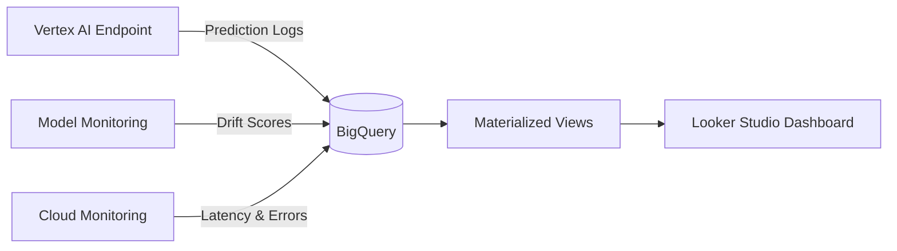

# How to Build a Model Performance Dashboard with Vertex AI and BigQuery

Author: [nawazdhandala](https://www.github.com/nawazdhandala)

Tags: Vertex AI, BigQuery, Model Monitoring, Dashboard, Google Cloud

Description: Learn how to build a comprehensive model performance dashboard using Vertex AI metrics and BigQuery for tracking ML model health in production.

---

A model performance dashboard is not a nice-to-have - it is a necessity for any team running ML models in production. Without one, you are flying blind. You do not know if your model is degrading, if latency is creeping up, or if certain segments of users are getting worse predictions than others.

In this post, I will show you how to build a model performance dashboard using Vertex AI prediction logs, BigQuery for data processing, and Looker Studio for visualization. The dashboard will track prediction accuracy, latency, error rates, feature distributions, and model drift over time.

## Architecture

The dashboard pulls data from three sources:



## Step 1: Enable Prediction Logging

Configure your Vertex AI Endpoint to log all prediction requests and responses to BigQuery.

```python
# setup_logging.py
from google.cloud import aiplatform

aiplatform.init(project="my-project", location="us-central1")

endpoint = aiplatform.Endpoint("ENDPOINT_ID")

# Enable request-response logging
endpoint.update(
    predict_request_response_logging_config={
        "enabled": True,
        "sampling_rate": 1.0,  # Log all predictions
        "bigquery_destination": {
            "output_uri": "bq://my-project.ml_monitoring.prediction_logs"
        },
    },
)

print("Prediction logging enabled")
```

## Step 2: Create the BigQuery Schema for Dashboard Data

Set up the tables and views that will power your dashboard.

```sql
-- Create the dataset for monitoring data
CREATE SCHEMA IF NOT EXISTS ml_monitoring
OPTIONS(location="US");

-- Create a table for ground truth labels
-- You will populate this as outcomes become known
CREATE TABLE IF NOT EXISTS ml_monitoring.ground_truth (
    request_id STRING NOT NULL,
    model_id STRING,
    actual_label STRING,
    actual_value FLOAT64,
    outcome_timestamp TIMESTAMP DEFAULT CURRENT_TIMESTAMP(),
);

-- Create a table for custom performance metrics
-- Written by your evaluation pipeline
CREATE TABLE IF NOT EXISTS ml_monitoring.performance_metrics (
    model_id STRING NOT NULL,
    metric_name STRING NOT NULL,
    metric_value FLOAT64 NOT NULL,
    evaluation_timestamp TIMESTAMP DEFAULT CURRENT_TIMESTAMP(),
    dataset_size INT64,
    notes STRING,
);

-- Create a table for drift scores from model monitoring
CREATE TABLE IF NOT EXISTS ml_monitoring.drift_scores (
    monitoring_job_id STRING,
    feature_name STRING NOT NULL,
    drift_score FLOAT64 NOT NULL,
    drift_type STRING,  -- 'prediction_drift' or 'training_serving_skew'
    threshold FLOAT64,
    is_anomaly BOOL,
    measured_at TIMESTAMP DEFAULT CURRENT_TIMESTAMP(),
);
```

## Step 3: Build Dashboard Views

Create materialized views that aggregate the data for efficient dashboard querying.

```sql
-- Hourly prediction volume and error rate
CREATE OR REPLACE VIEW ml_monitoring.hourly_prediction_stats AS
SELECT
    TIMESTAMP_TRUNC(logging_time, HOUR) AS hour,
    deployed_model_id,
    COUNT(*) AS prediction_count,
    -- Calculate error rate from HTTP status codes
    COUNTIF(status_code != 200) AS error_count,
    ROUND(COUNTIF(status_code != 200) / COUNT(*) * 100, 2) AS error_rate_pct,
    -- Calculate latency percentiles
    ROUND(AVG(latency_ms), 2) AS avg_latency_ms,
    ROUND(APPROX_QUANTILES(latency_ms, 100)[OFFSET(50)], 2) AS p50_latency_ms,
    ROUND(APPROX_QUANTILES(latency_ms, 100)[OFFSET(95)], 2) AS p95_latency_ms,
    ROUND(APPROX_QUANTILES(latency_ms, 100)[OFFSET(99)], 2) AS p99_latency_ms,
FROM
    ml_monitoring.prediction_logs
WHERE
    logging_time > TIMESTAMP_SUB(CURRENT_TIMESTAMP(), INTERVAL 30 DAY)
GROUP BY
    hour, deployed_model_id
ORDER BY
    hour DESC;


-- Daily accuracy tracking (requires ground truth)
CREATE OR REPLACE VIEW ml_monitoring.daily_accuracy AS
SELECT
    DATE(p.logging_time) AS prediction_date,
    p.deployed_model_id,
    COUNT(*) AS total_predictions,
    COUNTIF(
        JSON_EXTRACT_SCALAR(p.response, '$.predictions[0].class') = g.actual_label
    ) AS correct_predictions,
    ROUND(
        COUNTIF(
            JSON_EXTRACT_SCALAR(p.response, '$.predictions[0].class') = g.actual_label
        ) / COUNT(*) * 100, 2
    ) AS accuracy_pct,
FROM
    ml_monitoring.prediction_logs p
JOIN
    ml_monitoring.ground_truth g
ON
    p.request_id = g.request_id
WHERE
    p.logging_time > TIMESTAMP_SUB(CURRENT_TIMESTAMP(), INTERVAL 30 DAY)
GROUP BY
    prediction_date, p.deployed_model_id
ORDER BY
    prediction_date DESC;


-- Feature distribution summary for drift visualization
CREATE OR REPLACE VIEW ml_monitoring.feature_drift_timeline AS
SELECT
    DATE(measured_at) AS drift_date,
    feature_name,
    ROUND(AVG(drift_score), 4) AS avg_drift_score,
    MAX(drift_score) AS max_drift_score,
    threshold,
    COUNTIF(is_anomaly) AS anomaly_count,
FROM
    ml_monitoring.drift_scores
WHERE
    measured_at > TIMESTAMP_SUB(CURRENT_TIMESTAMP(), INTERVAL 30 DAY)
GROUP BY
    drift_date, feature_name, threshold
ORDER BY
    drift_date DESC, avg_drift_score DESC;
```

## Step 4: Write a Pipeline to Compute Accuracy Metrics

Create a scheduled pipeline that joins predictions with ground truth to compute accuracy.

```python
# metrics_pipeline.py
from google.cloud import bigquery
from datetime import datetime, timedelta

def compute_daily_metrics():
    """Compute daily model performance metrics and store them."""
    client = bigquery.Client()

    # Calculate metrics for yesterday's predictions
    yesterday = (datetime.utcnow() - timedelta(days=1)).strftime("%Y-%m-%d")

    # Compute accuracy by model version
    accuracy_query = f"""
    INSERT INTO ml_monitoring.performance_metrics
        (model_id, metric_name, metric_value, evaluation_timestamp, dataset_size)
    SELECT
        p.deployed_model_id AS model_id,
        'daily_accuracy' AS metric_name,
        ROUND(
            COUNTIF(
                JSON_EXTRACT_SCALAR(p.response, '$.predictions[0].class') = g.actual_label
            ) / COUNT(*), 4
        ) AS metric_value,
        CURRENT_TIMESTAMP() AS evaluation_timestamp,
        COUNT(*) AS dataset_size
    FROM
        ml_monitoring.prediction_logs p
    JOIN
        ml_monitoring.ground_truth g ON p.request_id = g.request_id
    WHERE
        DATE(p.logging_time) = '{yesterday}'
    GROUP BY
        p.deployed_model_id
    """
    client.query(accuracy_query).result()

    # Compute precision and recall per class
    class_metrics_query = f"""
    WITH predictions AS (
        SELECT
            p.deployed_model_id,
            JSON_EXTRACT_SCALAR(p.response, '$.predictions[0].class') AS predicted_class,
            g.actual_label AS actual_class,
        FROM
            ml_monitoring.prediction_logs p
        JOIN
            ml_monitoring.ground_truth g ON p.request_id = g.request_id
        WHERE
            DATE(p.logging_time) = '{yesterday}'
    )
    INSERT INTO ml_monitoring.performance_metrics
        (model_id, metric_name, metric_value, evaluation_timestamp, dataset_size, notes)
    SELECT
        deployed_model_id,
        CONCAT('precision_class_', actual_class),
        ROUND(
            COUNTIF(predicted_class = actual_class)
            / NULLIF(COUNTIF(predicted_class = actual_class OR predicted_class != actual_class), 0),
            4
        ),
        CURRENT_TIMESTAMP(),
        COUNT(*),
        actual_class
    FROM predictions
    GROUP BY deployed_model_id, actual_class
    """
    client.query(class_metrics_query).result()

    print(f"Daily metrics computed for {yesterday}")


def compute_segment_metrics():
    """Compute metrics broken down by user segments."""
    client = bigquery.Client()

    query = """
    INSERT INTO ml_monitoring.performance_metrics
        (model_id, metric_name, metric_value, evaluation_timestamp, notes)
    SELECT
        p.deployed_model_id,
        CONCAT('accuracy_segment_', segment) AS metric_name,
        ROUND(
            COUNTIF(
                JSON_EXTRACT_SCALAR(p.response, '$.predictions[0].class') = g.actual_label
            ) / COUNT(*), 4
        ) AS metric_value,
        CURRENT_TIMESTAMP(),
        segment AS notes
    FROM
        ml_monitoring.prediction_logs p
    JOIN
        ml_monitoring.ground_truth g ON p.request_id = g.request_id
    CROSS JOIN
        UNNEST(['mobile', 'desktop', 'tablet']) AS segment
    WHERE
        JSON_EXTRACT_SCALAR(p.request, '$.instances[0].device_type') = segment
        AND p.logging_time > TIMESTAMP_SUB(CURRENT_TIMESTAMP(), INTERVAL 1 DAY)
    GROUP BY
        p.deployed_model_id, segment
    """
    client.query(query).result()
    print("Segment metrics computed")
```

## Step 5: Export Cloud Monitoring Metrics to BigQuery

Pull infrastructure metrics from Cloud Monitoring into BigQuery for the dashboard.

```python
# export_monitoring_metrics.py
from google.cloud import monitoring_v3
from google.cloud import bigquery
import time

def export_endpoint_metrics():
    """Export Vertex AI endpoint metrics to BigQuery for dashboard use."""
    monitoring_client = monitoring_v3.MetricServiceClient()
    bq_client = bigquery.Client()

    project_name = "projects/my-project"
    now = time.time()

    # Query prediction count metrics
    interval = monitoring_v3.TimeInterval({
        "end_time": {"seconds": int(now)},
        "start_time": {"seconds": int(now - 3600)},  # Last hour
    })

    metrics_to_export = [
        "aiplatform.googleapis.com/prediction/online/prediction_count",
        "aiplatform.googleapis.com/prediction/online/error_count",
        "aiplatform.googleapis.com/prediction/online/response_latencies",
    ]

    rows = []
    for metric_type in metrics_to_export:
        results = monitoring_client.list_time_series(
            request={
                "name": project_name,
                "filter": f'metric.type="{metric_type}"',
                "interval": interval,
                "view": monitoring_v3.ListTimeSeriesRequest.TimeSeriesView.FULL,
            }
        )

        for series in results:
            endpoint_id = series.resource.labels.get("endpoint_id", "unknown")
            for point in series.points:
                rows.append({
                    "metric_type": metric_type.split("/")[-1],
                    "endpoint_id": endpoint_id,
                    "value": point.value.int64_value or point.value.double_value,
                    "timestamp": point.interval.end_time.isoformat(),
                })

    if rows:
        errors = bq_client.insert_rows_json(
            "ml_monitoring.infrastructure_metrics", rows
        )
        if errors:
            print(f"Errors: {errors}")
        else:
            print(f"Exported {len(rows)} metric data points")
```

## Step 6: Create the Dashboard in Looker Studio

Connect Looker Studio to the BigQuery views and build the dashboard panels.

The dashboard should include these key panels:

**Prediction Volume** - Line chart showing prediction count over time, grouped by model version.

```sql
-- Data source query for prediction volume panel
SELECT
    hour,
    deployed_model_id,
    prediction_count
FROM ml_monitoring.hourly_prediction_stats
WHERE hour > TIMESTAMP_SUB(CURRENT_TIMESTAMP(), INTERVAL 7 DAY)
```

**Accuracy Trend** - Line chart showing daily accuracy over time.

```sql
-- Data source query for accuracy trend panel
SELECT
    prediction_date,
    deployed_model_id,
    accuracy_pct
FROM ml_monitoring.daily_accuracy
WHERE prediction_date > DATE_SUB(CURRENT_DATE(), INTERVAL 30 DAY)
```

**Latency Distribution** - Bar chart showing p50, p95, and p99 latency.

```sql
-- Data source query for latency panel
SELECT
    hour,
    p50_latency_ms,
    p95_latency_ms,
    p99_latency_ms
FROM ml_monitoring.hourly_prediction_stats
WHERE hour > TIMESTAMP_SUB(CURRENT_TIMESTAMP(), INTERVAL 24 HOUR)
```

**Drift Score Heatmap** - Table showing drift scores per feature over time.

```sql
-- Data source query for drift heatmap
SELECT
    drift_date,
    feature_name,
    avg_drift_score,
    CASE
        WHEN avg_drift_score > 0.5 THEN 'critical'
        WHEN avg_drift_score > 0.3 THEN 'warning'
        ELSE 'normal'
    END AS severity
FROM ml_monitoring.feature_drift_timeline
```

## Step 7: Schedule Data Refresh

Set up Cloud Scheduler to refresh the dashboard data periodically.

```bash
# Schedule the metrics computation to run daily
gcloud scheduler jobs create http compute-daily-metrics \
  --schedule="0 6 * * *" \
  --uri="https://us-central1-my-project.cloudfunctions.net/compute-metrics" \
  --http-method=POST \
  --oidc-service-account-email=ml-pipeline-sa@my-project.iam.gserviceaccount.com \
  --location=us-central1

# Schedule infrastructure metric export hourly
gcloud scheduler jobs create http export-infra-metrics \
  --schedule="0 * * * *" \
  --uri="https://us-central1-my-project.cloudfunctions.net/export-metrics" \
  --http-method=POST \
  --oidc-service-account-email=ml-pipeline-sa@my-project.iam.gserviceaccount.com \
  --location=us-central1
```

## Wrapping Up

A model performance dashboard is your window into how your ML models are actually performing in production. By combining Vertex AI prediction logging, BigQuery for data processing, and Looker Studio for visualization, you get a comprehensive view of accuracy, latency, error rates, and drift. The key is to set this up early - before you have problems, not after. When a model starts degrading, you want to see it on the dashboard before your users notice it in the product.
