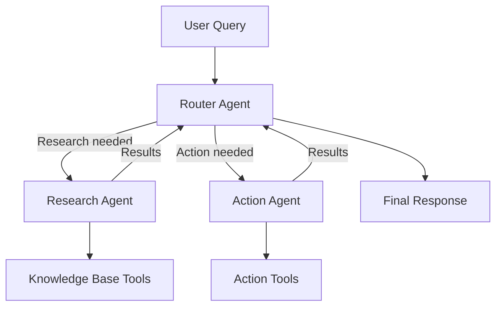

# How to Build a Multi-Agent System with LangChain and Vertex AI Agent Engine

Author: [nawazdhandala](https://www.github.com/nawazdhandala)

Tags: GCP, Vertex AI, LangChain, Multi-Agent, AI Agents

Description: Step-by-step guide to building multi-agent systems where specialized AI agents collaborate using LangChain and Vertex AI Agent Engine on GCP.

---

Single-purpose AI agents can handle straightforward tasks, but real-world problems often require multiple specialized agents working together. A multi-agent system lets you break complex workflows into smaller pieces, with each agent responsible for a specific domain. Vertex AI Agent Engine provides the infrastructure to host and manage these agents, while LangChain gives you the orchestration layer to coordinate them.

This guide walks through designing, building, and deploying a multi-agent system on GCP where agents communicate and delegate tasks to each other.

## Why Multi-Agent Systems

Consider a customer support scenario. You need one agent that understands billing, another that handles technical troubleshooting, and a third that manages account changes. Rather than cramming all that knowledge and tooling into one monolithic agent, you split responsibilities. Each agent gets a focused system prompt, a smaller set of tools, and a clearer purpose. The result is better accuracy, easier maintenance, and simpler testing.

## Prerequisites

- Google Cloud project with Vertex AI API enabled
- Python 3.9+
- LangChain and Vertex AI packages installed

```bash
# Install required packages
pip install langchain langchain-google-vertexai langchain-core google-cloud-aiplatform
```

## Designing the Agent Architecture

Before writing code, map out your agents and their responsibilities. For this example, we will build a system with three agents:

1. **Router Agent** - Receives user input and delegates to the right specialist
2. **Research Agent** - Searches knowledge bases and retrieves information
3. **Action Agent** - Executes actions like creating records or sending notifications



## Building Individual Agents

### The Research Agent

This agent specializes in finding information. It has access to search and retrieval tools.

```python
from langchain_google_vertexai import ChatVertexAI
from langchain_core.tools import tool
from langchain.agents import create_react_agent, AgentExecutor
from langchain_core.prompts import ChatPromptTemplate, MessagesPlaceholder

# Initialize the Gemini model for the research agent
research_llm = ChatVertexAI(
    model_name="gemini-1.5-pro",
    project="your-project-id",
    location="us-central1",
    temperature=0.1,  # Low temperature for factual retrieval
)

@tool
def search_knowledge_base(query: str) -> str:
    """Search the internal knowledge base for information about products, policies, or procedures."""
    # In production, this connects to your actual search backend
    return f"Knowledge base results for '{query}': Found relevant documentation about the topic."

@tool
def lookup_documentation(doc_id: str) -> str:
    """Look up a specific document by its ID to get full content."""
    return f"Document {doc_id}: Full content of the requested documentation."

research_tools = [search_knowledge_base, lookup_documentation]

research_prompt = ChatPromptTemplate.from_messages([
    ("system", """You are a research specialist. Your job is to find accurate information
    from the knowledge base. Always cite your sources and provide detailed answers.
    If you cannot find the information, say so clearly."""),
    ("human", "{input}"),
    MessagesPlaceholder(variable_name="agent_scratchpad"),
])

research_agent = create_react_agent(
    llm=research_llm,
    tools=research_tools,
    prompt=research_prompt,
)

research_executor = AgentExecutor(
    agent=research_agent,
    tools=research_tools,
    verbose=True,
    max_iterations=3,
)
```

### The Action Agent

This agent handles operations that change state - creating tickets, updating records, sending emails.

```python
# Initialize a separate model instance for the action agent
action_llm = ChatVertexAI(
    model_name="gemini-1.5-pro",
    project="your-project-id",
    location="us-central1",
    temperature=0.0,  # Zero temperature for deterministic actions
)

@tool
def create_ticket(title: str, description: str, priority: str) -> str:
    """Create a support ticket. Priority must be low, medium, or high."""
    return f"Created ticket: {title} with priority {priority}. Ticket ID: TKT-2024-001"

@tool
def send_notification(recipient: str, message: str) -> str:
    """Send a notification email to a user or team."""
    return f"Notification sent to {recipient}: {message}"

@tool
def update_account(account_id: str, field: str, value: str) -> str:
    """Update a specific field on a customer account."""
    return f"Updated {field} to {value} on account {account_id}"

action_tools = [create_ticket, send_notification, update_account]

action_prompt = ChatPromptTemplate.from_messages([
    ("system", """You are an action specialist. You execute operations like creating tickets,
    sending notifications, and updating records. Always confirm what action you are about
    to take before executing it. Report the result of each action clearly."""),
    ("human", "{input}"),
    MessagesPlaceholder(variable_name="agent_scratchpad"),
])

action_agent = create_react_agent(
    llm=action_llm,
    tools=action_tools,
    prompt=action_prompt,
)

action_executor = AgentExecutor(
    agent=action_agent,
    tools=action_tools,
    verbose=True,
    max_iterations=3,
)
```

## Building the Router Agent

The router agent is the coordinator. It receives user input, determines which specialist should handle it, and orchestrates the response.

```python
# The router wraps the specialist agents as tools
@tool
def delegate_to_research(query: str) -> str:
    """Delegate a question to the research agent when the user needs information,
    answers to questions, or documentation lookup."""
    result = research_executor.invoke({"input": query})
    return result["output"]

@tool
def delegate_to_actions(instruction: str) -> str:
    """Delegate to the action agent when something needs to be done - creating tickets,
    sending notifications, or updating records."""
    result = action_executor.invoke({"input": instruction})
    return result["output"]

router_llm = ChatVertexAI(
    model_name="gemini-1.5-pro",
    project="your-project-id",
    location="us-central1",
    temperature=0.1,
)

router_tools = [delegate_to_research, delegate_to_actions]

router_prompt = ChatPromptTemplate.from_messages([
    ("system", """You are a routing agent that coordinates between specialist agents.
    Analyze the user's request and delegate to the appropriate specialist:
    - Use delegate_to_research for questions, information lookup, or documentation needs
    - Use delegate_to_actions for creating tickets, sending notifications, or making changes
    You can call multiple specialists if the request requires both research and action.
    Combine the results into a clear, helpful response."""),
    MessagesPlaceholder(variable_name="chat_history", optional=True),
    ("human", "{input}"),
    MessagesPlaceholder(variable_name="agent_scratchpad"),
])

router_agent = create_react_agent(
    llm=router_llm,
    tools=router_tools,
    prompt=router_prompt,
)

router_executor = AgentExecutor(
    agent=router_agent,
    tools=router_tools,
    verbose=True,
    max_iterations=5,  # Higher limit since it coordinates multiple agents
    handle_parsing_errors=True,
)
```

## Running the Multi-Agent System

```python
# Test with a query that requires both research and action
result = router_executor.invoke({
    "input": "I need to understand our refund policy and then create a support ticket for a customer requesting a refund on order #12345",
    "chat_history": [],
})

print(result["output"])
```

The router will first delegate the policy question to the research agent, then pass the ticket creation to the action agent, and combine both results.

## Deploying on Vertex AI Agent Engine

Vertex AI Agent Engine lets you deploy and manage agents as scalable services. Here is how to register and deploy your multi-agent system.

```python
from google.cloud import aiplatform

# Initialize the AI Platform SDK
aiplatform.init(project="your-project-id", location="us-central1")

# Package your agent for deployment
# The Agent Engine expects a specific interface
class MultiAgentApp:
    def __init__(self):
        # Initialize all agents during startup
        self.router = router_executor

    def query(self, user_input: str, session_id: str = None) -> dict:
        """Handle incoming queries through the router agent."""
        result = self.router.invoke({
            "input": user_input,
            "chat_history": [],
        })
        return {"response": result["output"]}
```

## Error Handling Between Agents

When agents delegate to each other, failures can cascade. Implement proper error boundaries.

```python
@tool
def delegate_to_research_safe(query: str) -> str:
    """Delegate to research agent with error handling."""
    try:
        result = research_executor.invoke({"input": query})
        return result["output"]
    except Exception as e:
        # Return a graceful fallback instead of crashing the whole system
        return f"Research agent encountered an issue: {str(e)}. Unable to retrieve information at this time."
```

## Monitoring and Observability

In a multi-agent system, tracing which agent handled what becomes critical. Use LangChain's callback system to log the full execution trace.

```python
from langchain_core.callbacks import BaseCallbackHandler

class AgentTracingHandler(BaseCallbackHandler):
    """Custom callback handler to trace multi-agent execution."""

    def on_agent_action(self, action, **kwargs):
        print(f"[TRACE] Agent action: {action.tool} with input: {action.tool_input}")

    def on_tool_end(self, output, **kwargs):
        print(f"[TRACE] Tool output: {output[:200]}...")

# Attach the handler when running the router
result = router_executor.invoke(
    {"input": "Check the status of my account"},
    config={"callbacks": [AgentTracingHandler()]},
)
```

## Summary

Multi-agent systems with LangChain and Vertex AI give you a clean way to decompose complex AI workflows. The key principles are: keep each agent focused on a single domain, use a router to coordinate delegation, implement error boundaries between agents, and add tracing for visibility. Start with two or three agents, validate the routing logic thoroughly, then expand as your use cases grow. The Vertex AI Agent Engine handles the infrastructure so you can focus on the agent logic itself.
