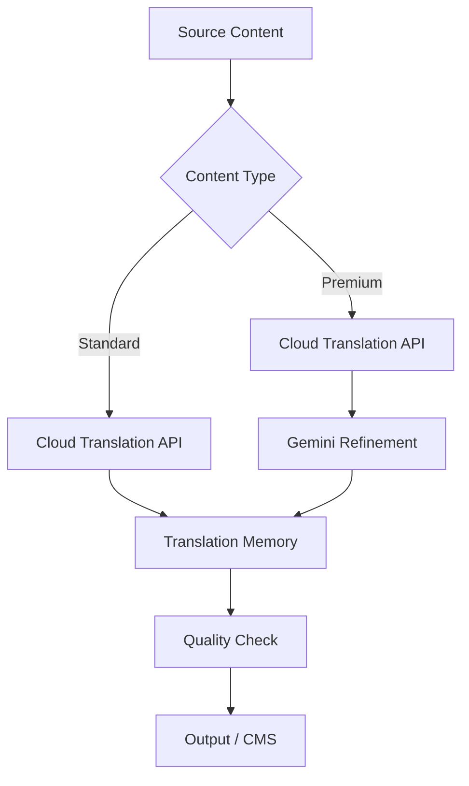

# How to Build a Multi-Language Translation Pipeline with Gemini and Cloud Translation on GCP

Author: [nawazdhandala](https://www.github.com/nawazdhandala)

Tags: GCP, Cloud Translation, Gemini, Vertex AI, Localization

Description: Build a multi-language translation pipeline that combines Cloud Translation API for standard translations with Gemini for context-aware, domain-specific translation on GCP.

---

Translating content across languages is something most growing products need eventually. The Cloud Translation API handles straightforward translations well, but domain-specific content - marketing copy, technical documentation, legal text - often needs more nuance than a direct translation can provide. By combining Cloud Translation for the heavy lifting with Gemini for context-aware refinement, you can build a pipeline that handles both volume and quality.

This guide walks through building a translation pipeline that processes content in batches, handles multiple target languages, and uses Gemini to refine translations for specific domains.

## When to Use Which Service

Cloud Translation API (Advanced) is best for high-volume, general-purpose translation. It's fast, cheap, and supports over 100 languages. Gemini is better when you need the translation to understand context, maintain brand voice, or handle domain-specific terminology. The smart approach is to use both: Cloud Translation for the initial pass, Gemini for refinement of critical content.

## Pipeline Architecture



## Setting Up Cloud Translation

```bash
# Enable the Translation API
gcloud services enable translate.googleapis.com

# Create a glossary for domain-specific terms
# First, upload your glossary to GCS
gsutil cp glossary.csv gs://YOUR_PROJECT-translation/glossaries/
```

The glossary CSV maps terms across languages:

```csv
en,es,fr,de,ja
dashboard,panel de control,tableau de bord,Dashboard,ダッシュボード
uptime,tiempo de actividad,disponibilite,Verfuegbarkeit,稼働時間
incident,incidente,incident,Vorfall,インシデント
monitoring,monitoreo,surveillance,Ueberwachung,監視
alert,alerta,alerte,Alarm,アラート
```

Register the glossary with the Translation API:

```python
from google.cloud import translate_v3 as translate

def create_glossary(project_id, glossary_id, glossary_uri, languages):
    """Register a glossary for consistent terminology translation"""
    client = translate.TranslationServiceClient()
    parent = f"projects/{project_id}/locations/us-central1"

    # Configure the glossary for multiple language pairs
    glossary = translate.Glossary()
    glossary.name = f"{parent}/glossaries/{glossary_id}"
    glossary.language_codes_set = translate.Glossary.LanguageCodesSet(
        language_codes=languages
    )
    glossary.input_config = translate.GlossaryInputConfig(
        gcs_source=translate.GcsSource(input_uri=glossary_uri)
    )

    operation = client.create_glossary(parent=parent, glossary=glossary)
    result = operation.result(timeout=180)
    print(f"Glossary created: {result.name}")
    return result
```

## The Translation Pipeline

Here's the core translation function that handles both standard and premium translations:

```python
from google.cloud import translate_v3 as translate
import vertexai
from vertexai.generative_models import GenerativeModel

class TranslationPipeline:
    def __init__(self, project_id, location="us-central1"):
        self.project_id = project_id
        self.location = location
        self.parent = f"projects/{project_id}/locations/{location}"

        # Initialize clients
        self.translate_client = translate.TranslationServiceClient()
        vertexai.init(project=project_id, location=location)
        self.gemini_model = GenerativeModel("gemini-1.5-pro")

        # Translation memory cache
        self.memory = {}

    def translate_content(
        self,
        content,
        source_lang,
        target_langs,
        content_type="standard",
        domain=None,
        glossary_id=None,
    ):
        """Translate content to multiple target languages"""
        results = {}

        for target_lang in target_langs:
            # Check translation memory first
            cache_key = f"{source_lang}:{target_lang}:{hash(content)}"
            if cache_key in self.memory:
                results[target_lang] = self.memory[cache_key]
                continue

            # Step 1: Get the base translation from Cloud Translation
            base_translation = self._cloud_translate(
                content, source_lang, target_lang, glossary_id
            )

            if content_type == "premium" and domain:
                # Step 2: Refine with Gemini for premium content
                refined = self._gemini_refine(
                    content, base_translation, source_lang,
                    target_lang, domain
                )
                results[target_lang] = refined
            else:
                results[target_lang] = base_translation

            # Store in translation memory
            self.memory[cache_key] = results[target_lang]

        return results

    def _cloud_translate(self, text, source_lang, target_lang, glossary_id=None):
        """Translate using Cloud Translation API"""
        request_params = {
            "parent": self.parent,
            "contents": [text],
            "source_language_code": source_lang,
            "target_language_code": target_lang,
            "mime_type": "text/html" if "<" in text else "text/plain",
        }

        # Add glossary if provided
        if glossary_id:
            glossary_path = f"{self.parent}/glossaries/{glossary_id}"
            request_params["glossary_config"] = translate.TranslateTextGlossaryConfig(
                glossary=glossary_path
            )

        response = self.translate_client.translate_text(**request_params)

        # Use glossary translation if available, otherwise default
        if glossary_id and response.glossary_translations:
            return response.glossary_translations[0].translated_text
        return response.translations[0].translated_text

    def _gemini_refine(
        self, original, translation, source_lang, target_lang, domain
    ):
        """Refine a translation using Gemini for domain awareness"""
        domain_instructions = {
            "marketing": (
                "This is marketing copy. The translation should be persuasive, "
                "maintain the brand voice, and feel natural to native speakers. "
                "Adapt idioms and cultural references rather than translating literally."
            ),
            "technical": (
                "This is technical documentation. Maintain precision and clarity. "
                "Keep technical terms consistent. Code examples and variable names "
                "should remain in English."
            ),
            "legal": (
                "This is legal text. Maintain the exact meaning and legal implications. "
                "Do not simplify or paraphrase legal terms. When a direct equivalent "
                "exists in the target language's legal system, use it."
            ),
            "ui": (
                "This is user interface text. Keep it concise. "
                "Consider space constraints. Button labels and menu items "
                "should be short and action-oriented."
            ),
        }

        instruction = domain_instructions.get(domain, "")

        prompt = f"""You are a professional translator specializing in {domain} content.

Original text ({source_lang}):
{original}

Machine translation ({target_lang}):
{translation}

{instruction}

Review the machine translation and improve it. Fix any:
- Awkward phrasing that sounds unnatural
- Incorrect domain-specific terminology
- Loss of meaning or nuance
- Grammatical errors

Output only the improved translation, nothing else."""

        response = self.gemini_model.generate_content(
            prompt,
            generation_config={
                "temperature": 0.2,
                "max_output_tokens": 2000,
            },
        )

        return response.text.strip()
```

## Batch Processing

For translating large volumes of content:

```python
def batch_translate(
    pipeline,
    content_items,
    source_lang,
    target_langs,
    content_type="standard",
    domain=None,
):
    """Translate a batch of content items"""
    results = []

    for item in content_items:
        translations = pipeline.translate_content(
            content=item["text"],
            source_lang=source_lang,
            target_langs=target_langs,
            content_type=content_type,
            domain=domain,
            glossary_id="product-glossary",
        )

        results.append({
            "id": item["id"],
            "original": item["text"],
            "translations": translations,
        })

    return results

# For very large batches, use Cloud Translation's batch endpoint
def batch_translate_with_gcs(project_id, source_uri, target_uri, target_langs):
    """Use Cloud Translation batch API for large-scale translation"""
    client = translate.TranslationServiceClient()
    parent = f"projects/{project_id}/locations/us-central1"

    # Configure batch translation
    input_config = translate.BatchDocumentInputConfig(
        gcs_source=translate.GcsSource(input_uri=source_uri)
    )

    output_config = translate.BatchDocumentOutputConfig(
        gcs_destination=translate.GcsDestination(
            output_uri_prefix=target_uri
        )
    )

    operation = client.batch_translate_document(
        request={
            "parent": parent,
            "source_language_code": "en",
            "target_language_codes": target_langs,
            "input_configs": [input_config],
            "output_config": output_config,
        }
    )

    print(f"Batch translation started: {operation.operation.name}")
    result = operation.result(timeout=3600)
    print(f"Translated {result.total_characters} characters")
    return result
```

## Quality Checking

Verify translation quality automatically:

```python
def check_translation_quality(original, translation, source_lang, target_lang):
    """Use Gemini to evaluate translation quality"""
    model = GenerativeModel("gemini-1.5-pro")

    prompt = f"""Evaluate this translation on a scale of 1-10 for each criterion:

Original ({source_lang}): {original}
Translation ({target_lang}): {translation}

Rate on:
1. Accuracy (1-10): Does the translation convey the same meaning?
2. Fluency (1-10): Does it read naturally in the target language?
3. Completeness (1-10): Is all information from the original preserved?
4. Terminology (1-10): Are domain terms translated correctly?

Output as JSON: {{accuracy, fluency, completeness, terminology, overall, issues}}
Where overall is the average and issues is an array of specific problems found.
Only output JSON."""

    response = model.generate_content(
        prompt,
        generation_config={"temperature": 0.1, "max_output_tokens": 500},
    )

    import json
    try:
        return json.loads(response.text)
    except json.JSONDecodeError:
        return {"error": "Could not parse quality assessment"}
```

## Deploying the Service

```bash
# Deploy as a Cloud Run service
gcloud run deploy translation-pipeline \
    --source . \
    --region us-central1 \
    --memory 2Gi \
    --timeout 300 \
    --service-account translator@YOUR_PROJECT.iam.gserviceaccount.com

# Schedule daily batch translations
gcloud scheduler jobs create http daily-translation \
    --schedule "0 3 * * *" \
    --uri "https://translation-pipeline-xxxxx.run.app/batch" \
    --http-method POST \
    --body '{"source_lang":"en","target_langs":["es","fr","de","ja"]}'
```

## Wrapping Up

Combining Cloud Translation and Gemini gives you a translation pipeline that handles both scale and quality. Cloud Translation does the heavy lifting at low cost for standard content, while Gemini refines domain-specific translations where nuance matters. The glossary ensures consistency for your product terminology, and the quality checking step catches issues before translated content reaches users. Start by identifying which content needs premium translation (marketing, legal) and which is fine with standard translation (log messages, internal docs), then route each type through the appropriate path.
