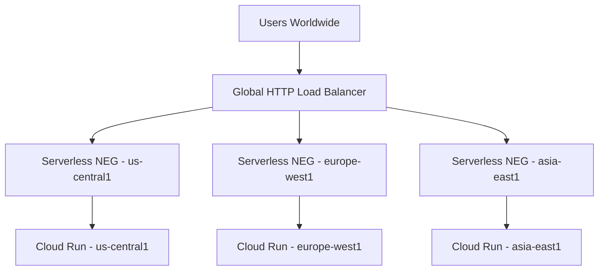

# How to Build a Multi-Region Cloud Run Service with Traffic Splitting for High Availability

Author: [nawazdhandala](https://www.github.com/nawazdhandala)

Tags: GCP, Cloud Run, Multi-Region, Traffic Splitting, High Availability

Description: Step-by-step guide to deploying Cloud Run services across multiple regions with global load balancing and traffic splitting for high availability on Google Cloud.

---

Cloud Run is excellent for running containers without worrying about infrastructure, but a single-region deployment leaves you vulnerable to regional outages. If us-central1 goes down and that is where your Cloud Run service lives, your application goes with it.

The solution is deploying your service to multiple regions and putting a global load balancer in front. In this post, I will walk through the full setup - from deploying services across regions to configuring traffic splitting and health-check-based failover.

## Architecture Overview

Here is what we are building:



The global load balancer routes users to the nearest healthy region automatically. If one region fails, traffic shifts to the remaining regions without any manual intervention.

## Step 1: Deploy Cloud Run Services to Multiple Regions

Start by deploying the same container image to Cloud Run in each target region. Make sure your container image is stored in Artifact Registry where all regions can pull from it:

```bash
# Build and push the container image
gcloud builds submit --tag gcr.io/my-project/my-app:v1.0.0

# Deploy to us-central1
gcloud run deploy my-app \
  --image=gcr.io/my-project/my-app:v1.0.0 \
  --platform=managed \
  --region=us-central1 \
  --allow-unauthenticated \
  --min-instances=1 \
  --max-instances=100 \
  --memory=512Mi \
  --cpu=1

# Deploy to europe-west1
gcloud run deploy my-app \
  --image=gcr.io/my-project/my-app:v1.0.0 \
  --platform=managed \
  --region=europe-west1 \
  --allow-unauthenticated \
  --min-instances=1 \
  --max-instances=100 \
  --memory=512Mi \
  --cpu=1

# Deploy to asia-east1
gcloud run deploy my-app \
  --image=gcr.io/my-project/my-app:v1.0.0 \
  --platform=managed \
  --region=asia-east1 \
  --allow-unauthenticated \
  --min-instances=1 \
  --max-instances=100 \
  --memory=512Mi \
  --cpu=1
```

Setting `--min-instances=1` keeps at least one instance warm in each region, which avoids cold start latency for the first request after a period of inactivity.

## Step 2: Create Serverless Network Endpoint Groups

Serverless NEGs are the bridge between the global load balancer and your Cloud Run services. Create one for each region:

```bash
# Create serverless NEG for us-central1
gcloud compute network-endpoint-groups create my-app-neg-us \
  --region=us-central1 \
  --network-endpoint-type=serverless \
  --cloud-run-service=my-app

# Create serverless NEG for europe-west1
gcloud compute network-endpoint-groups create my-app-neg-eu \
  --region=europe-west1 \
  --network-endpoint-type=serverless \
  --cloud-run-service=my-app

# Create serverless NEG for asia-east1
gcloud compute network-endpoint-groups create my-app-neg-asia \
  --region=asia-east1 \
  --network-endpoint-type=serverless \
  --cloud-run-service=my-app
```

## Step 3: Set Up the Global Load Balancer

Now connect everything together with a global HTTP(S) load balancer. This involves creating a backend service, URL map, target proxy, and forwarding rule:

```bash
# Create a backend service
gcloud compute backend-services create my-app-backend \
  --global \
  --load-balancing-scheme=EXTERNAL_MANAGED

# Add each serverless NEG to the backend service
gcloud compute backend-services add-backend my-app-backend \
  --global \
  --network-endpoint-group=my-app-neg-us \
  --network-endpoint-group-region=us-central1

gcloud compute backend-services add-backend my-app-backend \
  --global \
  --network-endpoint-group=my-app-neg-eu \
  --network-endpoint-group-region=europe-west1

gcloud compute backend-services add-backend my-app-backend \
  --global \
  --network-endpoint-group=my-app-neg-asia \
  --network-endpoint-group-region=asia-east1

# Create a URL map
gcloud compute url-maps create my-app-url-map \
  --default-service=my-app-backend

# Reserve a static global IP
gcloud compute addresses create my-app-ip \
  --global \
  --ip-version=IPV4

# Get the reserved IP for DNS configuration later
gcloud compute addresses describe my-app-ip --global --format="value(address)"

# Create an SSL certificate (using managed certificate)
gcloud compute ssl-certificates create my-app-cert \
  --domains=app.example.com \
  --global

# Create the HTTPS target proxy
gcloud compute target-https-proxies create my-app-proxy \
  --url-map=my-app-url-map \
  --ssl-certificates=my-app-cert

# Create the forwarding rule
gcloud compute forwarding-rules create my-app-forwarding \
  --global \
  --target-https-proxy=my-app-proxy \
  --address=my-app-ip \
  --ports=443
```

## Step 4: Configure Traffic Splitting

By default, the global load balancer routes traffic to the nearest region. But you can also split traffic by weight if you want to control distribution:

```bash
# Set capacity for each backend to control traffic distribution
# This gives 50% to US, 30% to EU, and 20% to Asia
gcloud compute backend-services update-backend my-app-backend \
  --global \
  --network-endpoint-group=my-app-neg-us \
  --network-endpoint-group-region=us-central1 \
  --max-rate=5000

gcloud compute backend-services update-backend my-app-backend \
  --global \
  --network-endpoint-group=my-app-neg-eu \
  --network-endpoint-group-region=europe-west1 \
  --max-rate=3000

gcloud compute backend-services update-backend my-app-backend \
  --global \
  --network-endpoint-group=my-app-neg-asia \
  --network-endpoint-group-region=asia-east1 \
  --max-rate=2000
```

For more granular control, use URL map traffic policies with Terraform:

```hcl
# terraform/traffic-splitting.tf
resource "google_compute_url_map" "my_app" {
  name            = "my-app-url-map"
  default_service = google_compute_backend_service.my_app.id

  default_route_action {
    weighted_backend_services {
      backend_service = google_compute_backend_service.my_app_us.id
      weight          = 50
    }
    weighted_backend_services {
      backend_service = google_compute_backend_service.my_app_eu.id
      weight          = 30
    }
    weighted_backend_services {
      backend_service = google_compute_backend_service.my_app_asia.id
      weight          = 20
    }
  }
}
```

## Step 5: Implement Health Checks

Cloud Run services behind a global load balancer get automatic health checking. But you should also implement a proper health endpoint in your application:

```python
# app.py - Health check endpoint for Cloud Run
from flask import Flask, jsonify
import psycopg2
import os

app = Flask(__name__)

@app.route('/health', methods=['GET'])
def health_check():
    """
    Returns service health status.
    Checks database connectivity and returns appropriate status codes.
    """
    checks = {
        'service': 'healthy',
        'database': 'unknown',
        'region': os.environ.get('CLOUD_RUN_REGION', 'unknown')
    }

    try:
        # Check database connectivity
        conn = psycopg2.connect(os.environ['DATABASE_URL'])
        cursor = conn.cursor()
        cursor.execute('SELECT 1')
        conn.close()
        checks['database'] = 'healthy'
    except Exception as e:
        checks['database'] = f'unhealthy: {str(e)}'
        return jsonify(checks), 503

    return jsonify(checks), 200

@app.route('/', methods=['GET'])
def index():
    region = os.environ.get('CLOUD_RUN_REGION', 'unknown')
    return jsonify({'message': 'Hello', 'serving_region': region})
```

Configure the backend service to use your health endpoint:

```bash
# Create a health check
gcloud compute health-checks create http my-app-health-check \
  --global \
  --request-path=/health \
  --port=8080 \
  --check-interval=10s \
  --timeout=5s \
  --healthy-threshold=2 \
  --unhealthy-threshold=3

# Update backend service to use the health check
gcloud compute backend-services update my-app-backend \
  --global \
  --health-checks=my-app-health-check
```

## Step 6: Automate Multi-Region Deployments

You do not want to manually deploy to three regions every time you push a change. Set up a Cloud Build pipeline that handles it:

```yaml
# cloudbuild.yaml - Deploy to all regions in parallel
steps:
  # Build the container image
  - name: 'gcr.io/cloud-builders/docker'
    args: ['build', '-t', 'gcr.io/$PROJECT_ID/my-app:$SHORT_SHA', '.']
    id: 'build'

  # Push the image
  - name: 'gcr.io/cloud-builders/docker'
    args: ['push', 'gcr.io/$PROJECT_ID/my-app:$SHORT_SHA']
    id: 'push'
    waitFor: ['build']

  # Deploy to all three regions in parallel
  - name: 'gcr.io/cloud-builders/gcloud'
    args:
      - 'run'
      - 'deploy'
      - 'my-app'
      - '--image=gcr.io/$PROJECT_ID/my-app:$SHORT_SHA'
      - '--region=us-central1'
      - '--platform=managed'
    id: 'deploy-us'
    waitFor: ['push']

  - name: 'gcr.io/cloud-builders/gcloud'
    args:
      - 'run'
      - 'deploy'
      - 'my-app'
      - '--image=gcr.io/$PROJECT_ID/my-app:$SHORT_SHA'
      - '--region=europe-west1'
      - '--platform=managed'
    id: 'deploy-eu'
    waitFor: ['push']

  - name: 'gcr.io/cloud-builders/gcloud'
    args:
      - 'run'
      - 'deploy'
      - 'my-app'
      - '--image=gcr.io/$PROJECT_ID/my-app:$SHORT_SHA'
      - '--region=asia-east1'
      - '--platform=managed'
    id: 'deploy-asia'
    waitFor: ['push']
```

## Monitoring Multi-Region Performance

Set up dashboards to compare latency and error rates across regions:

```bash
# Create a dashboard that shows per-region metrics
gcloud monitoring dashboards create --config-from-file=- <<'EOF'
{
  "displayName": "Multi-Region Cloud Run",
  "mosaicLayout": {
    "tiles": [
      {
        "widget": {
          "title": "Request Latency by Region",
          "xyChart": {
            "dataSets": [{
              "timeSeriesQuery": {
                "timeSeriesFilter": {
                  "filter": "resource.type=\"cloud_run_revision\" AND metric.type=\"run.googleapis.com/request_latencies\""
                }
              }
            }]
          }
        }
      }
    ]
  }
}
EOF
```

## Wrapping Up

Running Cloud Run across multiple regions with a global load balancer gives you automatic failover, lower latency for global users, and the ability to do weighted traffic splitting for gradual rollouts. The setup involves more moving parts than a single-region deployment, but the reliability improvement is significant.

The key pieces are: deploy your service to multiple regions, wire them up with serverless NEGs, put a global load balancer in front, and automate the whole deployment pipeline so it stays consistent. Once this is in place, regional outages become a non-event for your users.
