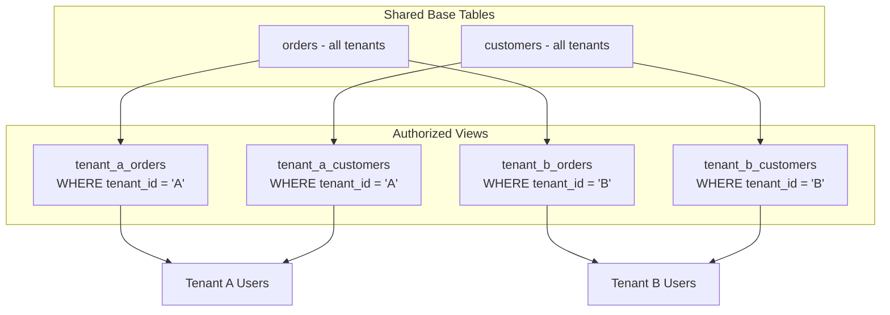

# How to Build a Multi-Tenant Data Architecture on BigQuery Using Authorized Views and Column-Level Security

Author: [nawazdhandala](https://www.github.com/nawazdhandala)

Tags: GCP, BigQuery, Multi-Tenant, Column-Level Security, Authorized Views, Data Architecture, IAM

Description: A practical guide to building multi-tenant data architectures on BigQuery using authorized views for row-level access and column-level security for sensitive field protection.

---

When multiple customers or business units share the same BigQuery infrastructure, you need to make sure each tenant can only see their own data. This is the multi-tenant data architecture problem, and BigQuery provides several tools to solve it without duplicating data across separate datasets. Authorized views handle row-level filtering, column-level security protects sensitive fields, and together they create a clean separation between tenants. Here is how to build it.

## Multi-Tenancy Approaches

There are three common approaches to multi-tenancy in BigQuery:

1. Separate datasets per tenant - simple but does not scale beyond a handful of tenants
2. Shared tables with row-level filtering via authorized views - scales well, single source of truth
3. Shared tables with BigQuery row-level security policies - newest approach, built into BigQuery

This guide focuses on approach 2 with column-level security layered on top, as it works for the widest range of use cases.



## Step 1: Create the Shared Base Tables

Start with base tables that contain data for all tenants, with a `tenant_id` column for filtering:

```sql
-- Create the dataset for base tables (restricted access)
CREATE SCHEMA IF NOT EXISTS `my-project.base_data`
OPTIONS (
  location = 'us-central1',
  description = 'Base tables with all tenant data. No direct user access.'
);

-- Shared orders table with tenant identifier
CREATE TABLE IF NOT EXISTS `my-project.base_data.orders`
(
  order_id STRING NOT NULL,
  tenant_id STRING NOT NULL,
  customer_id STRING NOT NULL,
  order_date DATE,
  total_amount NUMERIC,
  status STRING,
  -- Sensitive column that some tenants should not see
  internal_margin NUMERIC,
  -- PII that needs column-level protection
  customer_email STRING,
  customer_phone STRING,
  created_at TIMESTAMP DEFAULT CURRENT_TIMESTAMP()
)
PARTITION BY order_date
CLUSTER BY tenant_id
OPTIONS (description = 'All tenant orders - access through authorized views only');
```

Important: Do not grant any users direct access to the `base_data` dataset. All access should go through authorized views.

## Step 2: Create Authorized Views for Each Tenant

Authorized views are BigQuery views that have been granted access to read from the base tables. Users who have access to the view can query it, even without direct access to the underlying tables.

```sql
-- Create a dataset for Tenant A's views
CREATE SCHEMA IF NOT EXISTS `my-project.tenant_a`
OPTIONS (
  location = 'us-central1',
  description = 'Authorized views for Tenant A'
);

-- Create the authorized view that filters to Tenant A's data
CREATE OR REPLACE VIEW `my-project.tenant_a.orders` AS
SELECT
  order_id,
  customer_id,
  order_date,
  total_amount,
  status,
  customer_email,
  -- Tenant A can see margins
  internal_margin,
  created_at
FROM `my-project.base_data.orders`
WHERE tenant_id = 'tenant_a';

-- Create a dataset for Tenant B's views
CREATE SCHEMA IF NOT EXISTS `my-project.tenant_b`
OPTIONS (
  location = 'us-central1',
  description = 'Authorized views for Tenant B'
);

-- Create the authorized view that filters to Tenant B's data
-- Note: Tenant B does NOT get to see internal_margin
CREATE OR REPLACE VIEW `my-project.tenant_b.orders` AS
SELECT
  order_id,
  customer_id,
  order_date,
  total_amount,
  status,
  customer_email,
  created_at
FROM `my-project.base_data.orders`
WHERE tenant_id = 'tenant_b';
```

## Step 3: Authorize the Views

The critical step is authorizing these views to access the base dataset:

```bash
# Authorize Tenant A's views to access the base dataset
bq update --dataset \
  --authorized_view='{"projectId":"my-project","datasetId":"tenant_a","tableId":"orders"}' \
  my-project:base_data

# Authorize Tenant B's views
bq update --dataset \
  --authorized_view='{"projectId":"my-project","datasetId":"tenant_b","tableId":"orders"}' \
  my-project:base_data
```

Or using Python for programmatic management:

```python
# authorize_views.py - Programmatically authorize views for all tenants
from google.cloud import bigquery

client = bigquery.Client()

def authorize_tenant_views(base_dataset_id, tenant_dataset_id, view_ids):
    """Authorize a tenant's views to access the base dataset."""
    # Get the current dataset metadata
    dataset = client.get_dataset(base_dataset_id)
    access_entries = list(dataset.access_entries)

    # Add authorized view entries
    for view_id in view_ids:
        view_ref = bigquery.DatasetReference(
            project='my-project', dataset_id=tenant_dataset_id
        ).table(view_id)

        entry = bigquery.AccessEntry(
            role=None,
            entity_type='view',
            entity_id=view_ref
        )

        if entry not in access_entries:
            access_entries.append(entry)
            print(f"Authorizing {tenant_dataset_id}.{view_id}")

    dataset.access_entries = access_entries
    client.update_dataset(dataset, ['access_entries'])
    print(f"Updated access for {base_dataset_id}")


# Authorize views for multiple tenants
tenants = {
    'tenant_a': ['orders', 'customers', 'products'],
    'tenant_b': ['orders', 'customers', 'products'],
    'tenant_c': ['orders', 'customers'],
}

for tenant_id, views in tenants.items():
    authorize_tenant_views('my-project.base_data', tenant_id, views)
```

## Step 4: Grant Tenant Users Access to Their Views

Now grant each tenant's users access only to their authorized view dataset:

```bash
# Grant Tenant A users read access to their dataset
bq add-iam-policy-binding \
  --member="group:tenant-a-users@company.com" \
  --role="roles/bigquery.dataViewer" \
  my-project:tenant_a

# Grant Tenant B users read access to their dataset
bq add-iam-policy-binding \
  --member="group:tenant-b-users@company.com" \
  --role="roles/bigquery.dataViewer" \
  my-project:tenant_b

# Make sure neither group has access to base_data
# (they should not be listed in base_data's IAM policy)
```

## Step 5: Add Column-Level Security

For sensitive columns like PII, use BigQuery column-level security through policy tags:

```bash
# Create a taxonomy for data classification
gcloud data-catalog taxonomies create \
  --location=us-central1 \
  --display-name="Data Sensitivity" \
  --description="Classification for column-level security"

# Create policy tags within the taxonomy
gcloud data-catalog taxonomies policy-tags create \
  --taxonomy="projects/my-project/locations/us-central1/taxonomies/TAXONOMY_ID" \
  --display-name="PII" \
  --description="Personally identifiable information"

gcloud data-catalog taxonomies policy-tags create \
  --taxonomy="projects/my-project/locations/us-central1/taxonomies/TAXONOMY_ID" \
  --display-name="Confidential" \
  --description="Business confidential data"
```

Apply policy tags to sensitive columns:

```sql
-- Apply PII policy tag to customer_email and customer_phone columns
ALTER TABLE `my-project.base_data.orders`
ALTER COLUMN customer_email
SET OPTIONS (
  policy_tags = ['projects/my-project/locations/us-central1/taxonomies/TAXONOMY_ID/policyTags/PII_TAG_ID']
);

ALTER TABLE `my-project.base_data.orders`
ALTER COLUMN customer_phone
SET OPTIONS (
  policy_tags = ['projects/my-project/locations/us-central1/taxonomies/TAXONOMY_ID/policyTags/PII_TAG_ID']
);

-- Apply confidential tag to internal_margin
ALTER TABLE `my-project.base_data.orders`
ALTER COLUMN internal_margin
SET OPTIONS (
  policy_tags = ['projects/my-project/locations/us-central1/taxonomies/TAXONOMY_ID/policyTags/CONFIDENTIAL_TAG_ID']
);
```

Grant specific roles access to read tagged columns:

```bash
# Allow Tenant A admins to see PII columns
gcloud data-catalog taxonomies policy-tags add-iam-policy-binding \
  "projects/my-project/locations/us-central1/taxonomies/TAXONOMY_ID/policyTags/PII_TAG_ID" \
  --member="group:tenant-a-admins@company.com" \
  --role="roles/datacatalog.categoryFineGrainedReader"

# Allow finance team to see confidential margin data
gcloud data-catalog taxonomies policy-tags add-iam-policy-binding \
  "projects/my-project/locations/us-central1/taxonomies/TAXONOMY_ID/policyTags/CONFIDENTIAL_TAG_ID" \
  --member="group:finance-team@company.com" \
  --role="roles/datacatalog.categoryFineGrainedReader"
```

## Step 6: Dynamic Row-Level Security

For a more scalable approach to row filtering, use BigQuery's row access policies instead of separate views per tenant:

```sql
-- Create a row access policy that filters based on the user's group membership
CREATE OR REPLACE ROW ACCESS POLICY tenant_filter
ON `my-project.base_data.orders`
GRANT TO (
  "group:tenant-a-users@company.com"
)
FILTER USING (tenant_id = 'tenant_a');

-- Add another policy for Tenant B
CREATE OR REPLACE ROW ACCESS POLICY tenant_b_filter
ON `my-project.base_data.orders`
GRANT TO (
  "group:tenant-b-users@company.com"
)
FILTER USING (tenant_id = 'tenant_b');

-- Admin users can see all rows
CREATE OR REPLACE ROW ACCESS POLICY admin_full_access
ON `my-project.base_data.orders`
GRANT TO (
  "group:data-admins@company.com"
)
FILTER USING (TRUE);
```

## Step 7: Automating Tenant Onboarding

When you need to add a new tenant, automate the entire process:

```python
# onboard_tenant.py - Automate new tenant setup
from google.cloud import bigquery

client = bigquery.Client(project='my-project')

def onboard_tenant(tenant_id, user_group, tables, include_confidential=False):
    """Set up a new tenant with authorized views and access controls."""

    # Step 1: Create the tenant's dataset
    dataset_id = f"my-project.{tenant_id}"
    dataset = bigquery.Dataset(dataset_id)
    dataset.location = "us-central1"
    dataset.description = f"Authorized views for {tenant_id}"
    dataset = client.create_dataset(dataset, exists_ok=True)
    print(f"Created dataset: {dataset_id}")

    # Step 2: Create authorized views for each table
    for table_name in tables:
        # Determine which columns to include
        columns = get_columns_for_tenant(table_name, include_confidential)
        column_list = ", ".join(columns)

        view_query = f"""
        SELECT {column_list}
        FROM `my-project.base_data.{table_name}`
        WHERE tenant_id = '{tenant_id}'
        """

        view_ref = dataset.table(table_name)
        view = bigquery.Table(view_ref)
        view.view_query = view_query
        client.create_table(view, exists_ok=True)
        print(f"Created view: {tenant_id}.{table_name}")

    # Step 3: Authorize views on the base dataset
    base_dataset = client.get_dataset('my-project.base_data')
    access_entries = list(base_dataset.access_entries)

    for table_name in tables:
        view_ref = bigquery.DatasetReference(
            'my-project', tenant_id
        ).table(table_name)
        entry = bigquery.AccessEntry(
            role=None, entity_type='view', entity_id=view_ref
        )
        if entry not in access_entries:
            access_entries.append(entry)

    base_dataset.access_entries = access_entries
    client.update_dataset(base_dataset, ['access_entries'])
    print("Updated base dataset access")

    # Step 4: Grant the tenant's user group access
    policy = client.get_iam_policy(dataset)
    policy.bindings.append({
        "role": "roles/bigquery.dataViewer",
        "members": [f"group:{user_group}"]
    })
    client.set_iam_policy(dataset, policy)
    print(f"Granted access to {user_group}")

    print(f"\nTenant {tenant_id} onboarded successfully!")


def get_columns_for_tenant(table_name, include_confidential):
    """Determine which columns a tenant can see based on their tier."""
    # Get all columns from the base table
    table = client.get_table(f'my-project.base_data.{table_name}')
    all_columns = [field.name for field in table.schema]

    # Remove tenant_id (they should not see this)
    columns = [c for c in all_columns if c != 'tenant_id']

    if not include_confidential:
        # Remove confidential columns for basic tier tenants
        confidential = ['internal_margin', 'customer_phone']
        columns = [c for c in columns if c not in confidential]

    return columns


# Onboard a new tenant
onboard_tenant(
    tenant_id='tenant_c',
    user_group='tenant-c-analysts@company.com',
    tables=['orders', 'customers'],
    include_confidential=False
)
```

## Performance Considerations

1. Cluster base tables by `tenant_id`. This ensures that authorized views only scan the relevant data partitions for each tenant, keeping costs proportional to each tenant's data volume.

2. Use partition pruning. If your views include date filters, BigQuery will only scan the necessary partitions.

3. Monitor per-tenant costs using BigQuery labels and Information Schema queries:

```sql
-- Check query costs per tenant dataset
SELECT
  user_email,
  referenced_table.dataset_id AS tenant_dataset,
  COUNT(*) AS query_count,
  SUM(total_bytes_billed) / POW(1024, 4) AS total_tb_billed
FROM `region-us-central1.INFORMATION_SCHEMA.JOBS`
CROSS JOIN UNNEST(referenced_tables) AS referenced_table
WHERE creation_time >= TIMESTAMP_SUB(CURRENT_TIMESTAMP(), INTERVAL 30 DAY)
GROUP BY 1, 2
ORDER BY total_tb_billed DESC;
```

Multi-tenant data architecture on BigQuery is about creating the right abstraction layers. Base tables hold all the data, authorized views provide the row-level filtering, column-level security protects sensitive fields, and IAM controls who can access which views. Once the pattern is established, onboarding new tenants becomes a quick automated process.
