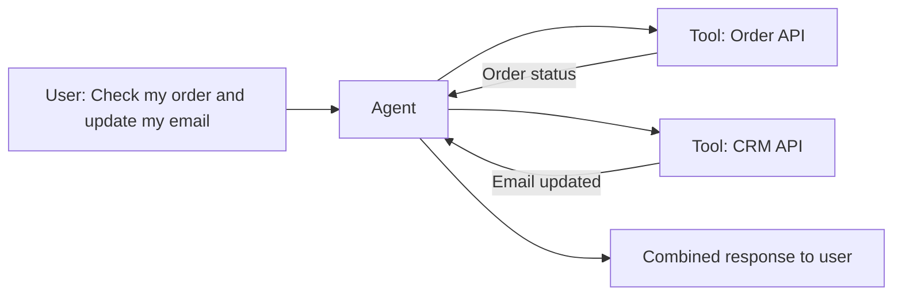

# How to Build a Multi-Tool Agent with Vertex AI Agent Builder and Custom APIs

Author: [nawazdhandala](https://www.github.com/nawazdhandala)

Tags: GCP, Vertex AI, Agent Builder, Custom APIs, Tool Integration

Description: Build a multi-tool AI agent using Vertex AI Agent Builder that connects to custom APIs for order management, CRM, and internal systems integration.

---

An AI agent that can only talk is limited. The real value comes when the agent can take action - look up an order, create a support ticket, update a customer record, or check inventory. Vertex AI Agent Builder supports connecting agents to custom APIs through tool definitions, allowing the agent to call your existing backend services as part of its reasoning process. This guide shows how to build an agent with multiple custom API tools.

## The Tool Architecture

When you give an agent tools, it gains the ability to interact with the outside world. Each tool is defined by an API specification that tells the agent what the tool does, what parameters it needs, and what it returns. The agent then decides autonomously when to use each tool based on the user's request.



## Prerequisites

- Google Cloud project with Vertex AI API enabled
- Backend APIs accessible from GCP (Cloud Run, GKE, or external)
- Python 3.9+

```bash
pip install google-cloud-aiplatform langchain-google-vertexai
```

## Defining Custom Tools with OpenAPI

Each tool is defined using an OpenAPI specification. This tells the agent what the API does and how to call it.

### Order Management Tool

```python
# Define the Order Management API tool
order_api_spec = {
    "openapi": "3.0.0",
    "info": {
        "title": "Order Management API",
        "description": "API for managing customer orders",
        "version": "1.0",
    },
    "servers": [
        {"url": "https://orders-api-xxxxx.run.app"}  # Your Cloud Run service URL
    ],
    "paths": {
        "/orders/{order_id}": {
            "get": {
                "operationId": "getOrder",
                "summary": "Get order details and status",
                "description": "Retrieve the current status, items, and tracking information for an order",
                "parameters": [
                    {
                        "name": "order_id",
                        "in": "path",
                        "required": True,
                        "description": "The unique order identifier",
                        "schema": {"type": "string"},
                    }
                ],
                "responses": {
                    "200": {
                        "description": "Order details",
                        "content": {
                            "application/json": {
                                "schema": {
                                    "type": "object",
                                    "properties": {
                                        "order_id": {"type": "string"},
                                        "status": {"type": "string", "enum": ["pending", "shipped", "delivered", "cancelled"]},
                                        "items": {"type": "array", "items": {"type": "object"}},
                                        "tracking_number": {"type": "string"},
                                        "estimated_delivery": {"type": "string"},
                                    },
                                }
                            }
                        },
                    }
                },
            }
        },
        "/orders/{order_id}/cancel": {
            "post": {
                "operationId": "cancelOrder",
                "summary": "Cancel an order",
                "description": "Cancel a pending order. Only works for orders that have not shipped yet.",
                "parameters": [
                    {
                        "name": "order_id",
                        "in": "path",
                        "required": True,
                        "schema": {"type": "string"},
                    }
                ],
                "requestBody": {
                    "content": {
                        "application/json": {
                            "schema": {
                                "type": "object",
                                "properties": {
                                    "reason": {"type": "string", "description": "Reason for cancellation"},
                                },
                                "required": ["reason"],
                            }
                        }
                    }
                },
                "responses": {
                    "200": {"description": "Order cancelled successfully"},
                    "400": {"description": "Order cannot be cancelled"},
                },
            }
        },
    },
}
```

### CRM Tool

```python
# Define the CRM API tool
crm_api_spec = {
    "openapi": "3.0.0",
    "info": {
        "title": "Customer CRM API",
        "description": "API for managing customer profiles and preferences",
        "version": "1.0",
    },
    "servers": [
        {"url": "https://crm-api-xxxxx.run.app"}
    ],
    "paths": {
        "/customers/{customer_id}": {
            "get": {
                "operationId": "getCustomer",
                "summary": "Get customer profile",
                "description": "Retrieve customer details including name, email, plan, and preferences",
                "parameters": [
                    {
                        "name": "customer_id",
                        "in": "path",
                        "required": True,
                        "schema": {"type": "string"},
                    }
                ],
                "responses": {
                    "200": {
                        "description": "Customer profile",
                        "content": {
                            "application/json": {
                                "schema": {
                                    "type": "object",
                                    "properties": {
                                        "customer_id": {"type": "string"},
                                        "name": {"type": "string"},
                                        "email": {"type": "string"},
                                        "plan": {"type": "string"},
                                        "created_at": {"type": "string"},
                                    },
                                }
                            }
                        },
                    }
                },
            },
            "patch": {
                "operationId": "updateCustomer",
                "summary": "Update customer profile",
                "description": "Update specific fields on a customer profile",
                "parameters": [
                    {
                        "name": "customer_id",
                        "in": "path",
                        "required": True,
                        "schema": {"type": "string"},
                    }
                ],
                "requestBody": {
                    "content": {
                        "application/json": {
                            "schema": {
                                "type": "object",
                                "properties": {
                                    "name": {"type": "string"},
                                    "email": {"type": "string"},
                                    "phone": {"type": "string"},
                                },
                            }
                        }
                    }
                },
                "responses": {
                    "200": {"description": "Customer updated successfully"},
                },
            },
        },
    },
}
```

### Support Ticket Tool

```python
# Define the Support Ticket API tool
ticket_api_spec = {
    "openapi": "3.0.0",
    "info": {
        "title": "Support Ticket API",
        "description": "API for creating and managing support tickets",
        "version": "1.0",
    },
    "servers": [
        {"url": "https://tickets-api-xxxxx.run.app"}
    ],
    "paths": {
        "/tickets": {
            "post": {
                "operationId": "createTicket",
                "summary": "Create a new support ticket",
                "description": "Create a support ticket for tracking customer issues",
                "requestBody": {
                    "content": {
                        "application/json": {
                            "schema": {
                                "type": "object",
                                "properties": {
                                    "customer_id": {"type": "string"},
                                    "subject": {"type": "string"},
                                    "description": {"type": "string"},
                                    "priority": {"type": "string", "enum": ["low", "medium", "high", "urgent"]},
                                    "category": {"type": "string"},
                                },
                                "required": ["customer_id", "subject", "description", "priority"],
                            }
                        }
                    }
                },
                "responses": {
                    "201": {
                        "description": "Ticket created",
                        "content": {
                            "application/json": {
                                "schema": {
                                    "type": "object",
                                    "properties": {
                                        "ticket_id": {"type": "string"},
                                        "status": {"type": "string"},
                                    },
                                }
                            }
                        },
                    }
                },
            }
        },
    },
}
```

## Building the Multi-Tool Agent with LangChain

Now let us wire these tools into an agent using LangChain with Vertex AI.

```python
from langchain_google_vertexai import ChatVertexAI
from langchain_core.tools import tool
from langchain.agents import create_react_agent, AgentExecutor
from langchain_core.prompts import ChatPromptTemplate, MessagesPlaceholder
import requests

# Simulated API endpoints - in production, these call your actual services
@tool
def get_order(order_id: str) -> str:
    """Look up an order by its ID. Returns order status, items, tracking number, and estimated delivery date."""
    # In production: response = requests.get(f"https://orders-api.run.app/orders/{order_id}")
    return f"Order {order_id}: Status=shipped, Tracking=1Z999AA10123456784, Estimated delivery=Feb 20 2026, Items: [Wireless Keyboard, USB-C Hub]"

@tool
def cancel_order(order_id: str, reason: str) -> str:
    """Cancel a pending order. Only works for orders that have not shipped yet. Requires a cancellation reason."""
    return f"Order {order_id} cancellation requested. Reason: {reason}. Note: This order has already shipped and cannot be cancelled."

@tool
def get_customer(customer_id: str) -> str:
    """Look up a customer profile by ID. Returns name, email, plan type, and account creation date."""
    return f"Customer {customer_id}: Name=Jane Smith, Email=jane@example.com, Plan=Professional, Created=2024-03-15"

@tool
def update_customer(customer_id: str, field: str, value: str) -> str:
    """Update a field on a customer profile. Supported fields: name, email, phone."""
    return f"Updated {field} to {value} for customer {customer_id}. Change will take effect immediately."

@tool
def create_ticket(customer_id: str, subject: str, description: str, priority: str) -> str:
    """Create a support ticket for a customer issue. Priority must be low, medium, high, or urgent."""
    return f"Ticket TKT-2026-0042 created for customer {customer_id}. Subject: {subject}. Priority: {priority}. A support agent will respond within 4 hours."

# Initialize the model
llm = ChatVertexAI(
    model_name="gemini-1.5-pro",
    project="your-project-id",
    location="us-central1",
    temperature=0.1,
)

# Collect all tools
tools = [get_order, cancel_order, get_customer, update_customer, create_ticket]

# Create the agent prompt
prompt = ChatPromptTemplate.from_messages([
    ("system", """You are a customer support agent with access to multiple tools for managing orders, customer profiles, and support tickets.

Guidelines:
1. Always verify the customer's identity before making changes
2. When a user asks about an order, look it up first before answering
3. For complex requests that involve multiple systems, handle them step by step
4. If an action fails, explain why and suggest alternatives
5. After completing actions, summarize what was done
6. Be proactive - if you notice something relevant while looking up information, mention it"""),
    MessagesPlaceholder(variable_name="chat_history", optional=True),
    ("human", "{input}"),
    MessagesPlaceholder(variable_name="agent_scratchpad"),
])

# Build the agent
agent = create_react_agent(llm=llm, tools=tools, prompt=prompt)
agent_executor = AgentExecutor(
    agent=agent,
    tools=tools,
    verbose=True,
    max_iterations=8,  # Allow more iterations for multi-tool tasks
    handle_parsing_errors=True,
)
```

## Testing Multi-Tool Interactions

```python
# Simple single-tool request
result = agent_executor.invoke({
    "input": "What is the status of order ORD-12345?",
    "chat_history": [],
})
print(f"Response: {result['output']}")

# Multi-tool request - requires looking up order and creating a ticket
result = agent_executor.invoke({
    "input": "Order ORD-12345 was supposed to arrive yesterday but it hasn't. Can you check the status and create a ticket about the delay? My customer ID is CUST-789.",
    "chat_history": [],
})
print(f"Response: {result['output']}")

# Complex request - multiple tools in sequence
result = agent_executor.invoke({
    "input": "I am customer CUST-789. I need to update my email to jane.new@example.com and also check if my order ORD-12345 has shipped.",
    "chat_history": [],
})
print(f"Response: {result['output']}")
```

## Securing API Tools

When your agent calls external APIs, authentication is critical.

```python
import google.auth.transport.requests
import google.oauth2.id_token

def get_authenticated_response(url: str) -> dict:
    """Call a Cloud Run service with proper authentication."""
    # Get an ID token for the target service
    auth_req = google.auth.transport.requests.Request()
    id_token = google.oauth2.id_token.fetch_id_token(auth_req, url)

    # Make the authenticated request
    headers = {"Authorization": f"Bearer {id_token}"}
    response = requests.get(url, headers=headers)
    return response.json()
```

## Error Handling for Tools

Tools can fail for many reasons. The agent should handle failures gracefully.

```python
@tool
def safe_get_order(order_id: str) -> str:
    """Look up an order by ID with built-in error handling."""
    try:
        # Validate input
        if not order_id or len(order_id) < 3:
            return "Error: Invalid order ID format. Please provide a valid order ID."

        # Call the API
        response = requests.get(
            f"https://orders-api.run.app/orders/{order_id}",
            timeout=10,
        )

        if response.status_code == 404:
            return f"Order {order_id} not found. Please verify the order ID."
        elif response.status_code != 200:
            return f"Unable to retrieve order {order_id} at this time. Please try again later."

        return str(response.json())

    except requests.Timeout:
        return "The order lookup service is taking too long to respond. Please try again."
    except Exception as e:
        return f"An unexpected error occurred while looking up the order: {str(e)}"
```

## Summary

Building a multi-tool agent with Vertex AI Agent Builder connects your AI to the real systems that power your business. Define each tool with a clear OpenAPI spec so the agent understands what it can do, implement proper authentication and error handling, and give the agent clear guidelines on when and how to use each tool. The result is an agent that can handle complex, multi-step requests across your order management, CRM, and ticketing systems in a single conversation. Start with read-only tools to build confidence, then add write operations once you trust the agent's decision-making.
