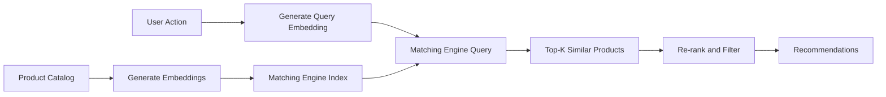

# How to Build a Product Recommendation Engine with Vertex AI Matching Engine

Author: [nawazdhandala](https://www.github.com/nawazdhandala)

Tags: GCP, Vertex AI, Matching Engine, Recommendations, Machine Learning

Description: Build a scalable product recommendation engine using Vertex AI Matching Engine for real-time approximate nearest neighbor search on product and user embeddings.

---

Recommendation engines power a huge portion of what people interact with online - product suggestions, content feeds, "customers also bought" sections. At their core, most modern recommendation systems work by converting items and users into numerical vectors (embeddings) and then finding the most similar vectors quickly. The "quickly" part is where Vertex AI Matching Engine comes in. It's a managed service for approximate nearest neighbor (ANN) search that can handle billions of vectors with millisecond query latency.

In this post, I'll walk through building a product recommendation engine from scratch using Matching Engine, covering everything from generating embeddings to serving real-time recommendations.

## How It Works

The basic flow is: generate embeddings for all your products, index them in Matching Engine, and then at query time, generate an embedding for the user's context and find the nearest product embeddings. Those nearest products become your recommendations.



## Generating Product Embeddings

You can generate embeddings using a pre-trained model or a custom one. For product recommendations, I'll use Vertex AI's text embedding model to create embeddings from product descriptions, then enrich them with behavioral signals.

```python
import vertexai
from vertexai.language_models import TextEmbeddingModel
from google.cloud import bigquery
import json
import numpy as np

def generate_product_embeddings(project_id, location="us-central1"):
    """Generate embeddings for all products in the catalog"""
    vertexai.init(project=project_id, location=location)
    model = TextEmbeddingModel.from_pretrained("text-embedding-004")

    # Fetch product data from BigQuery
    bq_client = bigquery.Client()
    query = """
        SELECT
            product_id,
            name,
            description,
            category,
            brand,
            price,
            avg_rating
        FROM `your-project.catalog.products`
        WHERE active = TRUE
    """
    products = list(bq_client.query(query).result())

    embeddings = []
    batch_size = 250  # API supports batching

    for i in range(0, len(products), batch_size):
        batch = products[i:i + batch_size]

        # Create a rich text representation of each product
        texts = []
        for product in batch:
            text = (
                f"{product.name}. {product.description}. "
                f"Category: {product.category}. "
                f"Brand: {product.brand}. "
                f"Rating: {product.avg_rating}/5."
            )
            texts.append(text)

        # Generate embeddings for the batch
        batch_embeddings = model.get_embeddings(texts)

        for product, embedding in zip(batch, batch_embeddings):
            embeddings.append({
                "id": product.product_id,
                "embedding": embedding.values,
            })

        print(f"Processed {min(i + batch_size, len(products))}/{len(products)} products")

    return embeddings

def save_embeddings_to_gcs(embeddings, bucket_name, file_prefix):
    """Save embeddings in the format Matching Engine expects"""
    from google.cloud import storage

    client = storage.Client()
    bucket = client.bucket(bucket_name)

    # Matching Engine expects JSON Lines format
    # Each line: {"id": "item_id", "embedding": [0.1, 0.2, ...]}
    lines = []
    for emb in embeddings:
        line = json.dumps({
            "id": emb["id"],
            "embedding": emb["embedding"],
        })
        lines.append(line)

    # Write in chunks to avoid memory issues with large catalogs
    chunk_size = 10000
    for i in range(0, len(lines), chunk_size):
        chunk = lines[i:i + chunk_size]
        blob = bucket.blob(f"{file_prefix}/embeddings_{i // chunk_size}.json")
        blob.upload_from_string("\n".join(chunk))
        print(f"Uploaded chunk {i // chunk_size}")
```

## Creating the Matching Engine Index

Set up the index that will store and search your product embeddings:

```python
from google.cloud import aiplatform

def create_matching_engine_index(
    project_id,
    location,
    display_name,
    embeddings_gcs_uri,
    dimensions=768,
):
    """Create a Matching Engine index from product embeddings"""
    aiplatform.init(project=project_id, location=location)

    # Create the index with configuration for product recommendations
    index = aiplatform.MatchingEngineIndex.create_tree_ah_index(
        display_name=display_name,
        # URI of the embeddings in GCS
        contents_delta_uri=embeddings_gcs_uri,
        # Embedding dimension (768 for text-embedding-004)
        dimensions=dimensions,
        # ANN algorithm parameters
        approximate_neighbors_count=150,
        # Distance metric - dot product works well for normalized embeddings
        distance_measure_type="DOT_PRODUCT_DISTANCE",
        # Leaf node parameters for the tree structure
        leaf_node_embedding_count=1000,
        leaf_nodes_to_search_percent=10,
        description="Product catalog embeddings for recommendation engine",
    )

    print(f"Index created: {index.resource_name}")
    return index

def deploy_index_to_endpoint(project_id, location, index_resource_name):
    """Deploy the index to an endpoint for online serving"""
    aiplatform.init(project=project_id, location=location)

    # Create the index endpoint
    endpoint = aiplatform.MatchingEngineIndexEndpoint.create(
        display_name="product-recommendations-endpoint",
        public_endpoint_enabled=True,
    )

    # Deploy the index to the endpoint
    endpoint.deploy_index(
        index=aiplatform.MatchingEngineIndex(index_resource_name),
        deployed_index_id="product_recs_v1",
        # Autoscaling configuration
        min_replica_count=1,
        max_replica_count=5,
    )

    print(f"Endpoint: {endpoint.resource_name}")
    return endpoint
```

## Querying for Recommendations

Now you can find similar products in real-time:

```python
def get_recommendations(
    endpoint,
    user_embedding,
    num_recommendations=20,
    category_filter=None,
):
    """Query Matching Engine for product recommendations"""

    # Build the query with optional filtering
    queries = [user_embedding]

    # Find the nearest neighbors
    response = endpoint.find_neighbors(
        deployed_index_id="product_recs_v1",
        queries=queries,
        num_neighbors=num_recommendations,
    )

    # Parse results
    recommendations = []
    for neighbor in response[0]:
        recommendations.append({
            "product_id": neighbor.id,
            "similarity_score": neighbor.distance,
        })

    return recommendations

def get_user_embedding(user_id, recent_interactions):
    """Generate a query embedding based on user behavior"""
    vertexai.init(project="your-project-id", location="us-central1")
    model = TextEmbeddingModel.from_pretrained("text-embedding-004")

    # Build a representation of the user's interests
    # from their recent product interactions
    interaction_texts = []
    for interaction in recent_interactions:
        interaction_texts.append(
            f"{interaction['product_name']} "
            f"({interaction['category']})"
        )

    # Create a combined user interest text
    user_interest_text = (
        f"Customer interested in: {', '.join(interaction_texts)}. "
        f"Looking for similar products."
    )

    # Generate the embedding
    embedding = model.get_embeddings([user_interest_text])[0]
    return embedding.values
```

## Building the Recommendation API

Wrap it in a Cloud Run service for production serving:

```python
from flask import Flask, request, jsonify
from google.cloud import aiplatform
import vertexai

app = Flask(__name__)

# Initialize on cold start
aiplatform.init(project="your-project-id", location="us-central1")
endpoint = aiplatform.MatchingEngineIndexEndpoint(
    "projects/YOUR_PROJECT/locations/us-central1/indexEndpoints/ENDPOINT_ID"
)

@app.route("/recommend", methods=["POST"])
def recommend():
    """Get product recommendations for a user"""
    data = request.get_json()
    user_id = data["user_id"]
    recent_products = data.get("recent_products", [])
    num_results = data.get("num_results", 10)

    # Generate the query embedding from user's recent activity
    query_embedding = get_user_embedding(user_id, recent_products)

    # Query Matching Engine
    raw_recommendations = get_recommendations(
        endpoint, query_embedding, num_recommendations=num_results * 2
    )

    # Post-process: remove products the user already bought
    purchased = set(data.get("purchased_products", []))
    filtered = [
        r for r in raw_recommendations
        if r["product_id"] not in purchased
    ][:num_results]

    # Enrich with product details from cache or database
    enriched = enrich_recommendations(filtered)

    return jsonify({
        "user_id": user_id,
        "recommendations": enriched,
    })

@app.route("/similar", methods=["GET"])
def similar_products():
    """Get products similar to a given product"""
    product_id = request.args.get("product_id")
    num_results = int(request.args.get("num_results", 10))

    # Get the product's embedding and query for neighbors
    product_embedding = get_product_embedding(product_id)
    similar = get_recommendations(
        endpoint, product_embedding, num_recommendations=num_results + 1
    )

    # Remove the query product itself from results
    similar = [s for s in similar if s["product_id"] != product_id][:num_results]

    return jsonify({
        "product_id": product_id,
        "similar_products": similar,
    })
```

## Keeping the Index Fresh

Product catalogs change frequently. Set up a pipeline to update the index:

```python
def update_index_incrementally(index_resource_name, new_embeddings_uri):
    """Update the Matching Engine index with new or modified products"""
    aiplatform.init(project="your-project-id", location="us-central1")

    index = aiplatform.MatchingEngineIndex(index_resource_name)

    # Upsert new embeddings (add or update)
    index.update_embeddings(
        contents_delta_uri=new_embeddings_uri,
        is_complete_overwrite=False,  # Incremental update
    )

    print(f"Index update initiated for {index_resource_name}")
```

## Wrapping Up

Vertex AI Matching Engine handles the hardest part of building a recommendation engine - serving nearest neighbor queries at scale with low latency. The key decisions are in how you generate your embeddings. Good embeddings that capture product similarity well will produce good recommendations regardless of the search infrastructure. Start with text embeddings from product descriptions, measure the recommendation quality, and then iterate on the embedding strategy - adding behavioral signals, category information, or training custom models to improve relevance over time.
