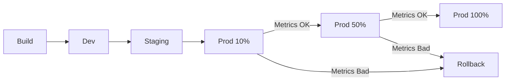

# How to Build a Progressive Delivery Pipeline for GKE Using Cloud Deploy and Canary Analysis

Author: [nawazdhandala](https://www.github.com/nawazdhandala)

Tags: GCP, Cloud Deploy, GKE, Canary Deployment, Progressive Delivery

Description: Learn how to build a progressive delivery pipeline for GKE using Google Cloud Deploy with automated canary analysis for safe production rollouts.

---

Pushing a new version straight to 100% of your production traffic is like jumping off a cliff and hoping the parachute works. Progressive delivery takes a safer approach - you roll out changes incrementally, monitor key metrics at each stage, and automatically roll back if something looks wrong.

Cloud Deploy is Google's managed continuous delivery service for GKE. Combined with canary deployments, it gives you a pipeline where new versions are gradually promoted through environments, with automated analysis at each step. In this post, I will show you how to build this pipeline from scratch.

## What Is Progressive Delivery?

Progressive delivery extends continuous delivery by adding controlled rollout strategies. Instead of deploying to 100% of production at once, you might:

1. Deploy to 10% of pods, analyze metrics for 10 minutes
2. If metrics look good, expand to 50%
3. Analyze again for 10 minutes
4. If still healthy, roll out to 100%

If metrics degrade at any step, the pipeline automatically rolls back.



## Step 1: Set Up Cloud Deploy Pipeline

First, define your delivery pipeline. This tells Cloud Deploy the sequence of targets (environments) and the promotion strategy:

```yaml
# clouddeploy.yaml - Delivery pipeline definition
apiVersion: deploy.cloud.google.com/v1
kind: DeliveryPipeline
metadata:
  name: my-app-pipeline
description: Progressive delivery pipeline with canary
serialPipeline:
  stages:
    - targetId: dev
      profiles: [dev]
    - targetId: staging
      profiles: [staging]
    - targetId: production
      profiles: [production]
      strategy:
        canary:
          runtimeConfig:
            kubernetes:
              serviceNetworking:
                service: my-app-service
                deployment: my-app
          canaryDeployment:
            percentages: [10, 50]
            verify: true
---
apiVersion: deploy.cloud.google.com/v1
kind: Target
metadata:
  name: dev
description: Development cluster
gke:
  cluster: projects/my-project/locations/us-central1/clusters/dev-cluster
---
apiVersion: deploy.cloud.google.com/v1
kind: Target
metadata:
  name: staging
description: Staging cluster
gke:
  cluster: projects/my-project/locations/us-central1/clusters/staging-cluster
---
apiVersion: deploy.cloud.google.com/v1
kind: Target
metadata:
  name: production
description: Production cluster
gke:
  cluster: projects/my-project/locations/us-central1/clusters/prod-cluster
```

Apply the pipeline:

```bash
# Register the delivery pipeline and targets
gcloud deploy apply --file=clouddeploy.yaml --region=us-central1
```

## Step 2: Create the Skaffold Configuration

Cloud Deploy uses Skaffold to manage the build and deploy lifecycle:

```yaml
# skaffold.yaml
apiVersion: skaffold/v4beta7
kind: Config
metadata:
  name: my-app
manifests:
  rawYaml:
    - k8s/*.yaml
deploy:
  kubectl: {}
profiles:
  - name: dev
    manifests:
      rawYaml:
        - k8s/base/*.yaml
        - k8s/overlays/dev/*.yaml
  - name: staging
    manifests:
      rawYaml:
        - k8s/base/*.yaml
        - k8s/overlays/staging/*.yaml
  - name: production
    manifests:
      rawYaml:
        - k8s/base/*.yaml
        - k8s/overlays/production/*.yaml
```

## Step 3: Define Kubernetes Manifests

Set up your base Kubernetes manifests:

```yaml
# k8s/base/deployment.yaml
apiVersion: apps/v1
kind: Deployment
metadata:
  name: my-app
  labels:
    app: my-app
spec:
  replicas: 5
  selector:
    matchLabels:
      app: my-app
  template:
    metadata:
      labels:
        app: my-app
    spec:
      containers:
        - name: my-app
          image: gcr.io/my-project/my-app
          ports:
            - containerPort: 8080
          resources:
            requests:
              cpu: 250m
              memory: 256Mi
            limits:
              cpu: 500m
              memory: 512Mi
          readinessProbe:
            httpGet:
              path: /health
              port: 8080
            initialDelaySeconds: 5
            periodSeconds: 10
          livenessProbe:
            httpGet:
              path: /health
              port: 8080
            initialDelaySeconds: 15
            periodSeconds: 20

---
# k8s/base/service.yaml
apiVersion: v1
kind: Service
metadata:
  name: my-app-service
spec:
  selector:
    app: my-app
  ports:
    - port: 80
      targetPort: 8080
  type: ClusterIP
```

Production overlay with higher replicas:

```yaml
# k8s/overlays/production/replicas-patch.yaml
apiVersion: apps/v1
kind: Deployment
metadata:
  name: my-app
spec:
  replicas: 10
```

## Step 4: Configure Canary Verification

Cloud Deploy supports a verify phase that runs after each canary step. Create a verification job that checks metrics:

```yaml
# k8s/verify/verify-job.yaml
apiVersion: batch/v1
kind: Job
metadata:
  name: canary-verify
  labels:
    app.kubernetes.io/managed-by: cloud-deploy
spec:
  backoffLimit: 0
  template:
    spec:
      containers:
        - name: verify
          image: gcr.io/my-project/canary-verifier:latest
          env:
            - name: SERVICE_NAME
              value: "my-app-service"
            - name: CANARY_PERCENTAGE
              valueFrom:
                fieldRef:
                  fieldPath: metadata.annotations['deploy.cloud.google.com/canary-percentage']
            - name: VERIFY_DURATION
              value: "600"
      restartPolicy: Never
```

Build a verification container that checks metrics from Cloud Monitoring:

```python
# canary-verifier/verify.py
# Checks error rates and latency during canary deployment

import os
import sys
import time
from google.cloud import monitoring_v3

PROJECT_ID = os.environ.get('PROJECT_ID', 'my-project')
SERVICE_NAME = os.environ.get('SERVICE_NAME', 'my-app-service')
VERIFY_DURATION = int(os.environ.get('VERIFY_DURATION', '600'))

# Thresholds for canary verification
ERROR_RATE_THRESHOLD = 0.01  # 1% error rate
P99_LATENCY_THRESHOLD = 2000  # 2 seconds

def get_error_rate(client, project_name, duration_minutes=10):
    """Query error rate from Cloud Monitoring."""
    now = time.time()
    interval = monitoring_v3.TimeInterval({
        'start_time': {'seconds': int(now - duration_minutes * 60)},
        'end_time': {'seconds': int(now)}
    })

    # Query 5xx error rate
    results = client.list_time_series(
        request={
            'name': project_name,
            'filter': f'resource.type="k8s_container" AND metric.type="custom.googleapis.com/http/error_rate" AND resource.labels.container_name="{SERVICE_NAME}"',
            'interval': interval,
            'aggregation': {
                'alignment_period': {'seconds': 60},
                'per_series_aligner': monitoring_v3.Aggregation.Aligner.ALIGN_RATE,
            }
        }
    )

    rates = []
    for series in results:
        for point in series.points:
            rates.append(point.value.double_value)

    return sum(rates) / len(rates) if rates else 0.0

def get_p99_latency(client, project_name, duration_minutes=10):
    """Query P99 latency from Cloud Monitoring."""
    now = time.time()
    interval = monitoring_v3.TimeInterval({
        'start_time': {'seconds': int(now - duration_minutes * 60)},
        'end_time': {'seconds': int(now)}
    })

    results = client.list_time_series(
        request={
            'name': project_name,
            'filter': f'resource.type="k8s_container" AND metric.type="custom.googleapis.com/http/latency" AND resource.labels.container_name="{SERVICE_NAME}"',
            'interval': interval,
            'aggregation': {
                'alignment_period': {'seconds': 60},
                'per_series_aligner': monitoring_v3.Aggregation.Aligner.ALIGN_PERCENTILE_99,
            }
        }
    )

    latencies = []
    for series in results:
        for point in series.points:
            latencies.append(point.value.double_value)

    return max(latencies) if latencies else 0.0

def main():
    """Run canary verification."""
    client = monitoring_v3.MetricServiceClient()
    project_name = f'projects/{PROJECT_ID}'

    print(f"Starting canary verification for {SERVICE_NAME}")
    print(f"Monitoring for {VERIFY_DURATION} seconds")
    print(f"Error rate threshold: {ERROR_RATE_THRESHOLD}")
    print(f"P99 latency threshold: {P99_LATENCY_THRESHOLD}ms")

    # Wait for the configured duration, checking periodically
    check_interval = 60  # Check every minute
    checks_passed = 0
    total_checks = VERIFY_DURATION // check_interval

    for i in range(total_checks):
        time.sleep(check_interval)

        error_rate = get_error_rate(client, project_name)
        p99_latency = get_p99_latency(client, project_name)

        print(f"Check {i+1}/{total_checks}: error_rate={error_rate:.4f}, p99_latency={p99_latency:.0f}ms")

        if error_rate > ERROR_RATE_THRESHOLD:
            print(f"FAIL: Error rate {error_rate:.4f} exceeds threshold {ERROR_RATE_THRESHOLD}")
            sys.exit(1)

        if p99_latency > P99_LATENCY_THRESHOLD:
            print(f"FAIL: P99 latency {p99_latency:.0f}ms exceeds threshold {P99_LATENCY_THRESHOLD}ms")
            sys.exit(1)

        checks_passed += 1

    print(f"PASS: All {checks_passed} checks passed")
    sys.exit(0)

if __name__ == '__main__':
    main()
```

## Step 5: Create a Release and Promote

With everything configured, create a release and let it flow through the pipeline:

```bash
# Create a new release
gcloud deploy releases create release-v1-3-0 \
  --delivery-pipeline=my-app-pipeline \
  --region=us-central1 \
  --images=my-app=gcr.io/my-project/my-app:v1.3.0

# The release automatically deploys to the first target (dev)
# Check the status
gcloud deploy releases describe release-v1-3-0 \
  --delivery-pipeline=my-app-pipeline \
  --region=us-central1

# Promote to staging
gcloud deploy releases promote \
  --release=release-v1-3-0 \
  --delivery-pipeline=my-app-pipeline \
  --region=us-central1

# Promote to production (this starts the canary process)
gcloud deploy releases promote \
  --release=release-v1-3-0 \
  --delivery-pipeline=my-app-pipeline \
  --region=us-central1
```

## Step 6: Monitor the Canary Rollout

Watch the canary progress through Cloud Deploy:

```bash
# Check the rollout status
gcloud deploy rollouts list \
  --delivery-pipeline=my-app-pipeline \
  --release=release-v1-3-0 \
  --region=us-central1

# Get detailed rollout info
gcloud deploy rollouts describe rollout-name \
  --delivery-pipeline=my-app-pipeline \
  --release=release-v1-3-0 \
  --region=us-central1
```

If the canary needs to be manually advanced or rolled back:

```bash
# Advance to the next canary phase
gcloud deploy rollouts advance rollout-name \
  --delivery-pipeline=my-app-pipeline \
  --release=release-v1-3-0 \
  --region=us-central1

# Or roll back if something is wrong
gcloud deploy targets rollback production \
  --delivery-pipeline=my-app-pipeline \
  --region=us-central1
```

## Wrapping Up

Progressive delivery with Cloud Deploy and canary analysis gives you confidence that production deployments will not break things. By rolling out incrementally and verifying metrics at each stage, you catch problems when they only affect 10% of traffic rather than 100%.

The setup takes some effort - defining the pipeline, creating verification jobs, setting up metric collection - but once it is in place, every deployment gets the same rigorous treatment automatically. Your developers push code, and the pipeline handles the rest.
