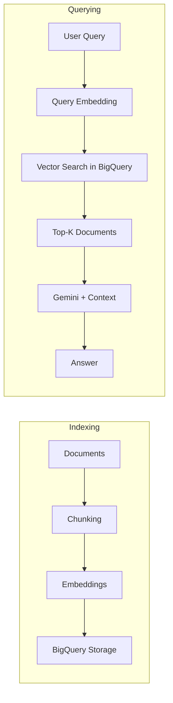

# How to Build a RAG Application with LangChain and BigQuery Vector Search

Author: [nawazdhandala](https://www.github.com/nawazdhandala)

Tags: GCP, LangChain, BigQuery, Vector Search, RAG

Description: A step-by-step guide to building a retrieval-augmented generation application using LangChain with BigQuery vector search for scalable document retrieval.

---

Retrieval-augmented generation (RAG) grounds LLM responses in your own data. Instead of hoping the model knows about your internal documentation or product catalog, you retrieve relevant documents and include them in the prompt. BigQuery vector search gives you a scalable, serverless way to store and search document embeddings, and LangChain provides the orchestration framework to tie it all together.

I have been building RAG systems on BigQuery for clients who already have their data in the Google Cloud ecosystem. The advantage is clear - no separate vector database to manage, and BigQuery handles any scale. Let me walk through the full implementation.

## Architecture Overview

The RAG pipeline has two phases: indexing (turning documents into vectors and storing them) and querying (finding relevant documents and generating answers).



## Setting Up the Environment

Install the required packages and configure your project.

```python
# Install dependencies
# pip install langchain langchain-google-vertexai langchain-google-community
# pip install google-cloud-bigquery

import vertexai
from langchain_google_vertexai import VertexAI, VertexAIEmbeddings
from google.cloud import bigquery

# Initialize Vertex AI
vertexai.init(project="your-project-id", location="us-central1")

# Initialize the BigQuery client
bq_client = bigquery.Client(project="your-project-id")

# Initialize the embedding model
embeddings = VertexAIEmbeddings(model_name="text-embedding-005")

# Initialize the LLM
llm = VertexAI(model_name="gemini-2.0-flash", temperature=0.2)
```

## Creating the BigQuery Vector Table

First, create a BigQuery table to store your document chunks and their embeddings.

```python
# Create a dataset if it does not exist
dataset_id = "your-project-id.rag_data"
dataset = bigquery.Dataset(dataset_id)
dataset.location = "US"

try:
    bq_client.create_dataset(dataset)
    print(f"Dataset {dataset_id} created")
except Exception:
    print(f"Dataset {dataset_id} already exists")

# Create the vector table
create_table_sql = """
CREATE TABLE IF NOT EXISTS `your-project-id.rag_data.document_chunks` (
    chunk_id STRING NOT NULL,
    document_id STRING NOT NULL,
    chunk_text STRING NOT NULL,
    embedding ARRAY<FLOAT64>,
    metadata JSON,
    created_at TIMESTAMP DEFAULT CURRENT_TIMESTAMP()
)
"""

bq_client.query(create_table_sql).result()
print("Vector table created")
```

## Chunking Documents

Split your documents into chunks that are small enough for effective retrieval but large enough to contain meaningful context.

```python
from langchain.text_splitter import RecursiveCharacterTextSplitter
import uuid

def chunk_documents(documents):
    """Split documents into chunks for embedding."""
    text_splitter = RecursiveCharacterTextSplitter(
        chunk_size=1000,
        chunk_overlap=200,
        separators=["\n\n", "\n", ". ", " ", ""]
    )

    all_chunks = []

    for doc in documents:
        chunks = text_splitter.split_text(doc["content"])

        for i, chunk_text in enumerate(chunks):
            all_chunks.append({
                "chunk_id": str(uuid.uuid4()),
                "document_id": doc["id"],
                "chunk_text": chunk_text,
                "metadata": {
                    "source": doc.get("source", ""),
                    "title": doc.get("title", ""),
                    "chunk_index": i,
                    "total_chunks": len(chunks)
                }
            })

    return all_chunks

# Example documents
documents = [
    {
        "id": "doc-001",
        "title": "GKE Best Practices",
        "source": "internal-wiki",
        "content": "Google Kubernetes Engine best practices include... "
                   "(your long document content here)"
    },
    {
        "id": "doc-002",
        "title": "Cloud SQL Setup Guide",
        "source": "internal-wiki",
        "content": "Setting up Cloud SQL involves several steps... "
                   "(your long document content here)"
    }
]

chunks = chunk_documents(documents)
print(f"Created {len(chunks)} chunks from {len(documents)} documents")
```

## Generating and Storing Embeddings

Generate embeddings for each chunk and store them in BigQuery.

```python
import json

def embed_and_store(chunks, batch_size=100):
    """Generate embeddings and store in BigQuery."""
    rows_to_insert = []

    for i in range(0, len(chunks), batch_size):
        batch = chunks[i:i + batch_size]
        texts = [c["chunk_text"] for c in batch]

        # Generate embeddings in batch
        batch_embeddings = embeddings.embed_documents(texts)

        for chunk, embedding in zip(batch, batch_embeddings):
            rows_to_insert.append({
                "chunk_id": chunk["chunk_id"],
                "document_id": chunk["document_id"],
                "chunk_text": chunk["chunk_text"],
                "embedding": embedding,
                "metadata": json.dumps(chunk["metadata"])
            })

        print(f"Embedded batch {i // batch_size + 1}")

    # Insert into BigQuery
    table_id = "your-project-id.rag_data.document_chunks"

    errors = bq_client.insert_rows_json(table_id, rows_to_insert)

    if errors:
        print(f"Errors inserting rows: {errors}")
    else:
        print(f"Successfully inserted {len(rows_to_insert)} rows")

# Store embeddings
embed_and_store(chunks)
```

## Creating a Vector Search Index

Create a vector search index in BigQuery for efficient similarity search.

```python
# Create a vector index for fast similarity search
create_index_sql = """
CREATE VECTOR INDEX IF NOT EXISTS doc_embedding_index
ON `your-project-id.rag_data.document_chunks`(embedding)
OPTIONS(
    index_type = 'IVF',
    distance_type = 'COSINE',
    ivf_options = '{"num_lists": 100}'
)
"""

bq_client.query(create_index_sql).result()
print("Vector index created")
```

## Implementing Vector Search

Search for relevant chunks using cosine similarity.

```python
def vector_search(query, top_k=5):
    """Search for relevant document chunks using vector similarity."""
    # Generate embedding for the query
    query_embedding = embeddings.embed_query(query)

    # Format the embedding as a BigQuery array literal
    embedding_str = ", ".join([str(v) for v in query_embedding])

    # Run the vector search query
    search_sql = f"""
    SELECT
        chunk_id,
        document_id,
        chunk_text,
        metadata,
        ML.DISTANCE(
            embedding,
            [{embedding_str}],
            'COSINE'
        ) AS distance
    FROM `your-project-id.rag_data.document_chunks`
    ORDER BY distance ASC
    LIMIT {top_k}
    """

    results = bq_client.query(search_sql).result()

    chunks = []
    for row in results:
        chunks.append({
            "chunk_id": row.chunk_id,
            "document_id": row.document_id,
            "text": row.chunk_text,
            "metadata": json.loads(row.metadata) if row.metadata else {},
            "distance": row.distance
        })

    return chunks

# Search for relevant chunks
results = vector_search("How do I set up autoscaling in GKE?")
for r in results:
    print(f"Distance: {r['distance']:.4f} | {r['text'][:80]}...")
```

## Building the RAG Chain with LangChain

Now connect everything together using LangChain to create a complete RAG pipeline.

```python
from langchain.chains import RetrievalQA
from langchain.schema import Document
from langchain.vectorstores.base import VectorStoreRetriever

class BigQueryVectorRetriever:
    """Custom retriever that uses BigQuery vector search."""

    def __init__(self, embeddings_model, top_k=5):
        self.embeddings = embeddings_model
        self.top_k = top_k

    def get_relevant_documents(self, query):
        """Retrieve relevant documents for a query."""
        results = vector_search(query, top_k=self.top_k)

        documents = []
        for r in results:
            doc = Document(
                page_content=r["text"],
                metadata={
                    "chunk_id": r["chunk_id"],
                    "document_id": r["document_id"],
                    "distance": r["distance"],
                    **r["metadata"]
                }
            )
            documents.append(doc)

        return documents

# Create the retriever
retriever = BigQueryVectorRetriever(embeddings, top_k=5)

# Build the RAG prompt
from langchain.prompts import PromptTemplate

rag_prompt = PromptTemplate(
    template="""Answer the question based on the provided context.
If the context does not contain enough information, say so.
Always cite which document the information came from.

Context:
{context}

Question: {question}

Answer:""",
    input_variables=["context", "question"]
)
```

## Creating the Full RAG Pipeline

Put it all together into a clean pipeline.

```python
class RAGPipeline:
    """Complete RAG pipeline with BigQuery vector search."""

    def __init__(self):
        self.retriever = BigQueryVectorRetriever(embeddings, top_k=5)
        self.llm = VertexAI(model_name="gemini-2.0-flash", temperature=0.2)

    def query(self, question):
        """Answer a question using RAG."""
        # Step 1: Retrieve relevant documents
        docs = self.retriever.get_relevant_documents(question)

        # Step 2: Build the context
        context_parts = []
        for i, doc in enumerate(docs, 1):
            source = doc.metadata.get("source", "unknown")
            title = doc.metadata.get("title", "untitled")
            context_parts.append(
                f"[Source {i}: {title} ({source})]\n{doc.page_content}"
            )
        context = "\n\n".join(context_parts)

        # Step 3: Generate answer with context
        prompt = (
            f"Answer the question based on the provided context. "
            f"Cite your sources by reference number.\n\n"
            f"Context:\n{context}\n\n"
            f"Question: {question}\n\n"
            f"Answer:"
        )

        answer = self.llm.invoke(prompt)

        return {
            "answer": answer,
            "sources": [
                {
                    "title": doc.metadata.get("title"),
                    "document_id": doc.metadata.get("document_id"),
                    "distance": doc.metadata.get("distance"),
                    "text_preview": doc.page_content[:100]
                }
                for doc in docs
            ]
        }

# Usage
rag = RAGPipeline()
result = rag.query("How do I configure horizontal pod autoscaling in GKE?")

print(f"Answer: {result['answer']}")
print(f"\nSources used: {len(result['sources'])}")
for s in result["sources"]:
    print(f"  - {s['title']} (distance: {s['distance']:.4f})")
```

## Updating the Index

As new documents are added, you need to index them into BigQuery.

```python
def add_documents(new_documents):
    """Add new documents to the RAG index."""
    # Chunk the new documents
    new_chunks = chunk_documents(new_documents)
    print(f"Created {len(new_chunks)} new chunks")

    # Embed and store
    embed_and_store(new_chunks)
    print("New documents indexed")

def delete_document(document_id):
    """Remove a document and its chunks from the index."""
    delete_sql = f"""
    DELETE FROM `your-project-id.rag_data.document_chunks`
    WHERE document_id = '{document_id}'
    """
    bq_client.query(delete_sql).result()
    print(f"Deleted chunks for document: {document_id}")
```

## Monitoring RAG Quality

Track retrieval quality and answer accuracy to maintain a healthy RAG system.

```python
class RAGMonitor:
    """Monitor RAG pipeline quality."""

    def __init__(self):
        self.queries = []

    def log_query(self, question, answer, sources, user_feedback=None):
        """Log a RAG query for analysis."""
        self.queries.append({
            "question": question,
            "answer_length": len(answer),
            "num_sources": len(sources),
            "avg_distance": sum(s["distance"] for s in sources) / max(len(sources), 1),
            "feedback": user_feedback
        })

    def report(self):
        """Generate a quality report."""
        if not self.queries:
            return "No queries logged"

        total = len(self.queries)
        avg_sources = sum(q["num_sources"] for q in self.queries) / total
        avg_distance = sum(q["avg_distance"] for q in self.queries) / total

        positive = sum(1 for q in self.queries if q.get("feedback") == "helpful")
        rated = sum(1 for q in self.queries if q.get("feedback") is not None)

        print(f"RAG Quality Report")
        print(f"  Total queries: {total}")
        print(f"  Avg sources per query: {avg_sources:.1f}")
        print(f"  Avg retrieval distance: {avg_distance:.4f}")
        if rated > 0:
            print(f"  User satisfaction: {positive/rated:.0%} ({rated} rated)")
```

## Wrapping Up

Building a RAG application with LangChain and BigQuery vector search gives you a scalable, serverless document retrieval system that integrates naturally with the Google Cloud ecosystem. BigQuery handles the vector storage and search, LangChain provides the orchestration, and Gemini generates the answers. The key is good chunking, quality embeddings, and a well-crafted prompt that instructs the model to use the retrieved context faithfully. Monitor your RAG pipeline's retrieval quality and answer accuracy with tools like OneUptime to catch degradation early.
