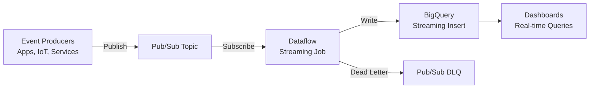

# How to Build a Real-Time Analytics Pipeline Using Pub/Sub Dataflow Streaming and BigQuery

Author: [nawazdhandala](https://www.github.com/nawazdhandala)

Tags: GCP, Pub/Sub, Dataflow, BigQuery, Streaming, Real-Time Analytics, Apache Beam

Description: Learn how to build a real-time analytics pipeline on GCP that streams events through Pub/Sub, processes them with Dataflow, and lands results in BigQuery for instant querying.

---

Batch processing is fine for daily reports, but when your business needs to react to events in seconds rather than hours, you need a streaming pipeline. The canonical GCP streaming stack is Pub/Sub for ingestion, Dataflow for processing, and BigQuery for analytics. This guide walks through building this pipeline from scratch with working code.

## Why This Stack

Each component plays a specific role:

- Pub/Sub handles message ingestion at any scale. It decouples producers from consumers and buffers messages during traffic spikes.
- Dataflow (Apache Beam) provides exactly-once processing, windowing for time-based aggregations, and auto-scaling.
- BigQuery gives you a SQL interface for querying streaming data with sub-second latency when using the streaming buffer.



## Step 1: Set Up the Pub/Sub Infrastructure

Create the topic and subscription for your event stream:

```bash
# Create the main events topic
gcloud pubsub topics create user-events \
  --message-retention-duration=1d

# Create a subscription for the Dataflow pipeline
gcloud pubsub subscriptions create user-events-dataflow \
  --topic=user-events \
  --ack-deadline=60 \
  --min-retry-delay=10s \
  --max-retry-delay=600s

# Create a dead letter topic for failed messages
gcloud pubsub topics create user-events-dlq

# Create a subscription for monitoring the dead letter queue
gcloud pubsub subscriptions create user-events-dlq-monitor \
  --topic=user-events-dlq
```

## Step 2: Define the BigQuery Destination Tables

Create the tables that will receive the streaming data:

```sql
-- Raw events table - receives individual events from the stream
CREATE TABLE IF NOT EXISTS `my-project.analytics.user_events`
(
  event_id STRING NOT NULL,
  user_id STRING NOT NULL,
  event_type STRING NOT NULL,
  event_timestamp TIMESTAMP NOT NULL,
  page_url STRING,
  session_id STRING,
  device_type STRING,
  country STRING,
  properties JSON,
  processing_timestamp TIMESTAMP
)
PARTITION BY DATE(event_timestamp)
CLUSTER BY event_type, user_id
OPTIONS (
  description = 'Real-time user events streamed from Dataflow'
);

-- Pre-aggregated table for real-time dashboards
CREATE TABLE IF NOT EXISTS `my-project.analytics.event_counts_per_minute`
(
  window_start TIMESTAMP NOT NULL,
  window_end TIMESTAMP NOT NULL,
  event_type STRING NOT NULL,
  event_count INT64,
  unique_users INT64
)
PARTITION BY DATE(window_start)
OPTIONS (
  description = 'Per-minute event aggregations computed by Dataflow'
);
```

## Step 3: Build the Dataflow Pipeline

Here is the Apache Beam pipeline in Python that reads from Pub/Sub, processes events, and writes to BigQuery:

```python
# streaming_pipeline.py - Real-time event processing pipeline
import apache_beam as beam
from apache_beam.options.pipeline_options import PipelineOptions, StandardOptions
from apache_beam.transforms.window import FixedWindows
from apache_beam.transforms.trigger import AfterWatermark, AfterProcessingTime, AccumulationMode
import json
import logging
from datetime import datetime

# Define the pipeline options
class StreamingOptions(PipelineOptions):
    @classmethod
    def _add_argparse_args(cls, parser):
        parser.add_argument('--input_subscription',
                          required=True,
                          help='Pub/Sub subscription to read from')
        parser.add_argument('--output_table',
                          required=True,
                          help='BigQuery table for raw events (project:dataset.table)')
        parser.add_argument('--agg_output_table',
                          required=True,
                          help='BigQuery table for aggregated events')
        parser.add_argument('--dead_letter_topic',
                          required=True,
                          help='Pub/Sub topic for failed messages')


class ParseEventFn(beam.DoFn):
    """Parse raw Pub/Sub messages into structured event dictionaries."""

    def process(self, element):
        try:
            # Decode the message payload
            raw_data = element.decode('utf-8')
            event = json.loads(raw_data)

            # Validate required fields
            required_fields = ['event_id', 'user_id', 'event_type', 'event_timestamp']
            for field in required_fields:
                if field not in event:
                    raise ValueError(f"Missing required field: {field}")

            # Normalize and enrich the event
            parsed = {
                'event_id': str(event['event_id']),
                'user_id': str(event['user_id']),
                'event_type': event['event_type'].lower(),
                'event_timestamp': event['event_timestamp'],
                'page_url': event.get('page_url', ''),
                'session_id': event.get('session_id', ''),
                'device_type': event.get('device_type', 'unknown'),
                'country': event.get('country', 'unknown'),
                'properties': json.dumps(event.get('properties', {})),
                'processing_timestamp': datetime.utcnow().isoformat()
            }

            yield beam.pvalue.TaggedOutput('parsed', parsed)

        except Exception as e:
            # Send failed messages to the dead letter queue
            logging.error(f"Failed to parse event: {e}")
            yield beam.pvalue.TaggedOutput('failed', {
                'raw_message': str(element),
                'error': str(e),
                'timestamp': datetime.utcnow().isoformat()
            })


class CountEventsFn(beam.DoFn):
    """Count events per type within each window."""

    def process(self, element, window=beam.DoFn.WindowParam):
        event_type, events = element
        event_list = list(events)
        unique_users = len(set(e['user_id'] for e in event_list))

        yield {
            'window_start': window.start.to_utc_datetime().isoformat(),
            'window_end': window.end.to_utc_datetime().isoformat(),
            'event_type': event_type,
            'event_count': len(event_list),
            'unique_users': unique_users
        }


def run():
    options = StreamingOptions()
    options.view_as(StandardOptions).streaming = True

    with beam.Pipeline(options=options) as pipeline:
        # Read from Pub/Sub
        raw_messages = (
            pipeline
            | 'ReadFromPubSub' >> beam.io.ReadFromPubSub(
                subscription=options.input_subscription)
        )

        # Parse events with error handling
        parsed_results = (
            raw_messages
            | 'ParseEvents' >> beam.ParDo(ParseEventFn())
                .with_outputs('parsed', 'failed')
        )

        # Write parsed events to BigQuery (raw events table)
        parsed_results.parsed | 'WriteRawEvents' >> beam.io.WriteToBigQuery(
            table=options.output_table,
            write_disposition=beam.io.BigQueryDisposition.WRITE_APPEND,
            create_disposition=beam.io.BigQueryDisposition.CREATE_NEVER,
            method=beam.io.WriteToBigQuery.Method.STREAMING_INSERTS,
            insert_retry_strategy=beam.io.gcp.bigquery_tools.RetryStrategy.RETRY_ON_TRANSIENT_ERROR
        )

        # Window and aggregate events per minute
        (
            parsed_results.parsed
            | 'AddWindow' >> beam.WindowInto(
                FixedWindows(60),  # 1-minute windows
                trigger=AfterWatermark(
                    early=AfterProcessingTime(30)  # Emit partial results every 30 seconds
                ),
                accumulation_mode=AccumulationMode.DISCARDING
            )
            | 'KeyByType' >> beam.Map(lambda e: (e['event_type'], e))
            | 'GroupByType' >> beam.GroupByKey()
            | 'CountEvents' >> beam.ParDo(CountEventsFn())
            | 'WriteAggregations' >> beam.io.WriteToBigQuery(
                table=options.agg_output_table,
                write_disposition=beam.io.BigQueryDisposition.WRITE_APPEND,
                create_disposition=beam.io.BigQueryDisposition.CREATE_NEVER,
                method=beam.io.WriteToBigQuery.Method.STREAMING_INSERTS
            )
        )

        # Send failed messages to dead letter topic
        (
            parsed_results.failed
            | 'SerializeFailures' >> beam.Map(lambda x: json.dumps(x).encode('utf-8'))
            | 'WriteToDLQ' >> beam.io.WriteToPubSub(topic=options.dead_letter_topic)
        )


if __name__ == '__main__':
    logging.getLogger().setLevel(logging.INFO)
    run()
```

## Step 4: Deploy the Pipeline

Deploy the streaming pipeline to Dataflow:

```bash
# Deploy the streaming pipeline to Dataflow
python streaming_pipeline.py \
  --runner=DataflowRunner \
  --project=my-project \
  --region=us-central1 \
  --temp_location=gs://my-project-dataflow-temp/temp \
  --staging_location=gs://my-project-dataflow-temp/staging \
  --input_subscription=projects/my-project/subscriptions/user-events-dataflow \
  --output_table=my-project:analytics.user_events \
  --agg_output_table=my-project:analytics.event_counts_per_minute \
  --dead_letter_topic=projects/my-project/topics/user-events-dlq \
  --max_num_workers=10 \
  --autoscaling_algorithm=THROUGHPUT_BASED \
  --experiments=enable_streaming_engine \
  --streaming
```

## Step 5: Send Test Events

Publish some test events to verify the pipeline:

```python
# publish_test_events.py - Send sample events to Pub/Sub
from google.cloud import pubsub_v1
import json
import uuid
from datetime import datetime

publisher = pubsub_v1.PublisherClient()
topic_path = publisher.topic_path('my-project', 'user-events')

# Generate and publish test events
event_types = ['page_view', 'click', 'purchase', 'signup']
for i in range(100):
    event = {
        'event_id': str(uuid.uuid4()),
        'user_id': f'user_{i % 20}',
        'event_type': event_types[i % len(event_types)],
        'event_timestamp': datetime.utcnow().isoformat(),
        'page_url': f'https://example.com/page/{i % 10}',
        'session_id': f'session_{i % 5}',
        'device_type': 'desktop' if i % 2 == 0 else 'mobile',
        'country': 'US',
        'properties': {'button_id': f'btn_{i}'}
    }

    future = publisher.publish(
        topic_path,
        json.dumps(event).encode('utf-8')
    )
    print(f"Published event {event['event_id']}: {future.result()}")

print("Done publishing test events")
```

## Step 6: Query Real-Time Data

Once events flow through the pipeline, query them in BigQuery:

```sql
-- Check the most recent events (includes streaming buffer data)
SELECT
  event_type,
  COUNT(*) AS event_count,
  COUNT(DISTINCT user_id) AS unique_users
FROM `my-project.analytics.user_events`
WHERE event_timestamp > TIMESTAMP_SUB(CURRENT_TIMESTAMP(), INTERVAL 5 MINUTE)
GROUP BY event_type
ORDER BY event_count DESC;

-- Query the pre-aggregated real-time metrics
SELECT
  window_start,
  event_type,
  event_count,
  unique_users
FROM `my-project.analytics.event_counts_per_minute`
WHERE window_start > TIMESTAMP_SUB(CURRENT_TIMESTAMP(), INTERVAL 1 HOUR)
ORDER BY window_start DESC, event_count DESC;
```

## Monitoring the Pipeline

Keep an eye on your pipeline health with these key metrics:

```bash
# Check pipeline status
gcloud dataflow jobs list --region=us-central1 --status=active

# Monitor Pub/Sub subscription backlog
gcloud pubsub subscriptions describe user-events-dataflow \
  --format='value(numUndeliveredMessages)'
```

Set up alerts for the subscription backlog:

```bash
# Alert when message backlog exceeds 10,000
gcloud monitoring policies create \
  --notification-channels="projects/my-project/notificationChannels/12345" \
  --condition-display-name="PubSub backlog too high" \
  --condition-filter='resource.type="pubsub_subscription" AND metric.type="pubsub.googleapis.com/subscription/num_undelivered_messages"' \
  --condition-threshold-value=10000 \
  --condition-threshold-duration=300s
```

## Performance Considerations

1. Use the Streaming Engine (`enable_streaming_engine` experiment) to offload shuffle and state management from worker VMs. This reduces costs and improves performance.

2. Choose the right window size for your aggregations. Shorter windows give you fresher data but create more writes to BigQuery. One-minute windows are a good starting point for most dashboards.

3. Enable BigQuery Storage Write API instead of streaming inserts for higher throughput and lower cost at scale. Change the Beam write method to `STORAGE_WRITE_API`.

4. Monitor the Dataflow watermark lag. If it keeps growing, your pipeline cannot keep up with the input rate and you need more workers.

5. Use Pub/Sub ordering keys if event ordering matters for your use case. This ensures events with the same key are processed in order, though it reduces parallelism.

This stack handles everything from a few events per second to millions. The auto-scaling capabilities of both Dataflow and BigQuery mean you do not need to pre-provision capacity for peak loads. Start small, watch your metrics, and the pipeline will scale as your traffic grows.
