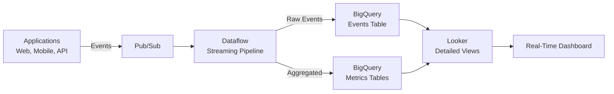

# How to Build a Real-Time Dashboard Pipeline Using Pub/Sub Dataflow BigQuery and Looker

Author: [nawazdhandala](https://www.github.com/nawazdhandala)

Tags: GCP, Pub/Sub, Dataflow, BigQuery, Looker, Real-Time Dashboards, Data Pipeline

Description: Learn how to build an end-to-end real-time dashboard pipeline that streams events through Pub/Sub, processes them with Dataflow, stores results in BigQuery, and visualizes in Looker.

---

Real-time dashboards are one of those features that stakeholders love to ask for but few teams deliver well. The challenge is not just showing current data - it is building a pipeline that is reliable, cost-effective, and does not require constant babysitting. This guide walks through building the complete pipeline from event ingestion to dashboard visualization using GCP's managed services.

## The End-to-End Architecture



## Step 1: Set Up the Event Ingestion Layer

Create the Pub/Sub infrastructure for receiving events:

```bash
# Create the events topic
gcloud pubsub topics create dashboard-events \
  --message-retention-duration=24h

# Create subscriptions
gcloud pubsub subscriptions create dashboard-events-dataflow \
  --topic=dashboard-events \
  --ack-deadline=120 \
  --expiration-period=never

# Create a dead letter topic for failed messages
gcloud pubsub topics create dashboard-events-dlq
```

Define the event schema that your applications will publish:

```python
# event_publisher.py - Publish dashboard events from your application
from google.cloud import pubsub_v1
import json
from datetime import datetime
import uuid

publisher = pubsub_v1.PublisherClient()
topic_path = publisher.topic_path('my-project', 'dashboard-events')

def publish_page_view(user_id, page, device, country):
    """Publish a page view event."""
    event = {
        'event_id': str(uuid.uuid4()),
        'event_type': 'page_view',
        'user_id': user_id,
        'timestamp': datetime.utcnow().isoformat() + 'Z',
        'properties': {
            'page': page,
            'device': device,
            'country': country,
            'referrer': 'direct',
        }
    }
    data = json.dumps(event).encode('utf-8')
    future = publisher.publish(topic_path, data=data)
    return future.result()

def publish_transaction(user_id, amount, currency, product_id):
    """Publish a transaction event."""
    event = {
        'event_id': str(uuid.uuid4()),
        'event_type': 'transaction',
        'user_id': user_id,
        'timestamp': datetime.utcnow().isoformat() + 'Z',
        'properties': {
            'amount': amount,
            'currency': currency,
            'product_id': product_id,
        }
    }
    data = json.dumps(event).encode('utf-8')
    future = publisher.publish(topic_path, data=data)
    return future.result()
```

## Step 2: Create BigQuery Destination Tables

Set up tables optimized for dashboard queries:

```sql
-- Raw events table - every event lands here
CREATE TABLE IF NOT EXISTS `my-project.realtime.events`
(
  event_id STRING,
  event_type STRING,
  user_id STRING,
  event_timestamp TIMESTAMP,
  page STRING,
  device STRING,
  country STRING,
  amount NUMERIC,
  currency STRING,
  product_id STRING,
  processing_time TIMESTAMP
)
PARTITION BY DATE(event_timestamp)
CLUSTER BY event_type, country
OPTIONS (
  description = 'Raw event stream for detailed analysis',
  partition_expiration_days = 90
);

-- Per-minute metrics - pre-aggregated for fast dashboard queries
CREATE TABLE IF NOT EXISTS `my-project.realtime.metrics_per_minute`
(
  window_start TIMESTAMP,
  window_end TIMESTAMP,
  event_type STRING,
  country STRING,
  device STRING,
  event_count INT64,
  unique_users INT64,
  total_revenue NUMERIC
)
PARTITION BY DATE(window_start)
CLUSTER BY event_type
OPTIONS (description = 'Per-minute aggregated metrics for real-time dashboards');

-- Hourly summary - for trend analysis
CREATE TABLE IF NOT EXISTS `my-project.realtime.metrics_per_hour`
(
  hour_start TIMESTAMP,
  event_type STRING,
  country STRING,
  event_count INT64,
  unique_users INT64,
  total_revenue NUMERIC,
  avg_revenue_per_transaction NUMERIC
)
PARTITION BY DATE(hour_start)
OPTIONS (description = 'Hourly aggregated metrics for trend dashboards');
```

## Step 3: Build the Dataflow Streaming Pipeline

The pipeline reads from Pub/Sub, processes events, and writes to both the raw and aggregated BigQuery tables:

```python
# streaming_dashboard_pipeline.py - Dataflow pipeline for real-time dashboards
import apache_beam as beam
from apache_beam.options.pipeline_options import PipelineOptions, StandardOptions
from apache_beam.transforms.window import FixedWindows, SlidingWindows
from apache_beam.transforms.trigger import (
    AfterWatermark, AfterProcessingTime, AccumulationMode
)
import json
import logging
from datetime import datetime

class ParseEventFn(beam.DoFn):
    """Parse raw JSON events into structured dictionaries."""

    def process(self, element):
        try:
            data = json.loads(element.decode('utf-8'))

            # Flatten the event structure for BigQuery
            parsed = {
                'event_id': data.get('event_id'),
                'event_type': data.get('event_type'),
                'user_id': data.get('user_id'),
                'event_timestamp': data.get('timestamp'),
                'page': data.get('properties', {}).get('page'),
                'device': data.get('properties', {}).get('device'),
                'country': data.get('properties', {}).get('country'),
                'amount': data.get('properties', {}).get('amount'),
                'currency': data.get('properties', {}).get('currency'),
                'product_id': data.get('properties', {}).get('product_id'),
                'processing_time': datetime.utcnow().isoformat(),
            }
            yield parsed

        except Exception as e:
            logging.error(f"Failed to parse event: {e}")
            yield beam.pvalue.TaggedOutput('failed', str(element))


class AggregateMetrics(beam.DoFn):
    """Aggregate events within a window into dashboard metrics."""

    def process(self, element, window=beam.DoFn.WindowParam):
        key, events = element
        event_type, country, device = key

        event_list = list(events)
        unique_users = len(set(e['user_id'] for e in event_list if e.get('user_id')))

        total_revenue = sum(
            float(e.get('amount', 0) or 0) for e in event_list
        )

        yield {
            'window_start': window.start.to_utc_datetime().isoformat(),
            'window_end': window.end.to_utc_datetime().isoformat(),
            'event_type': event_type,
            'country': country or 'unknown',
            'device': device or 'unknown',
            'event_count': len(event_list),
            'unique_users': unique_users,
            'total_revenue': total_revenue,
        }


def run():
    options = PipelineOptions()
    options.view_as(StandardOptions).streaming = True

    with beam.Pipeline(options=options) as pipeline:
        # Read from Pub/Sub
        raw_messages = (
            pipeline
            | 'ReadPubSub' >> beam.io.ReadFromPubSub(
                subscription='projects/my-project/subscriptions/dashboard-events-dataflow'
            )
        )

        # Parse events
        parsed = (
            raw_messages
            | 'ParseEvents' >> beam.ParDo(ParseEventFn()).with_outputs('failed', main='parsed')
        )

        # Write raw events to BigQuery
        parsed.parsed | 'WriteRawEvents' >> beam.io.WriteToBigQuery(
            table='my-project:realtime.events',
            write_disposition=beam.io.BigQueryDisposition.WRITE_APPEND,
            create_disposition=beam.io.BigQueryDisposition.CREATE_NEVER,
            method=beam.io.WriteToBigQuery.Method.STREAMING_INSERTS,
        )

        # Aggregate into 1-minute windows for the dashboard
        (
            parsed.parsed
            | 'WindowMinute' >> beam.WindowInto(
                FixedWindows(60),  # 1 minute windows
                trigger=AfterWatermark(
                    early=AfterProcessingTime(15)  # Emit early results every 15 seconds
                ),
                accumulation_mode=AccumulationMode.DISCARDING,
            )
            | 'KeyForAgg' >> beam.Map(
                lambda e: ((e['event_type'], e.get('country'), e.get('device')), e)
            )
            | 'GroupByKey' >> beam.GroupByKey()
            | 'Aggregate' >> beam.ParDo(AggregateMetrics())
            | 'WriteMetrics' >> beam.io.WriteToBigQuery(
                table='my-project:realtime.metrics_per_minute',
                write_disposition=beam.io.BigQueryDisposition.WRITE_APPEND,
                create_disposition=beam.io.BigQueryDisposition.CREATE_NEVER,
                method=beam.io.WriteToBigQuery.Method.STREAMING_INSERTS,
            )
        )

if __name__ == '__main__':
    logging.getLogger().setLevel(logging.INFO)
    run()
```

Deploy the pipeline:

```bash
# Deploy the streaming pipeline to Dataflow
python streaming_dashboard_pipeline.py \
  --runner=DataflowRunner \
  --project=my-project \
  --region=us-central1 \
  --temp_location=gs://my-project-temp/dataflow \
  --max_num_workers=5 \
  --experiments=enable_streaming_engine \
  --streaming
```

## Step 4: Create Looker Views and Explores

Define LookML models that Looker will use to query the dashboard data.

The events explore for detailed analysis:

```lookml
# views/events.view.lkml
view: events {
  sql_table_name: `my-project.realtime.events` ;;

  dimension: event_id {
    primary_key: yes
    type: string
    sql: ${TABLE}.event_id ;;
  }

  dimension: event_type {
    type: string
    sql: ${TABLE}.event_type ;;
  }

  dimension: user_id {
    type: string
    sql: ${TABLE}.user_id ;;
  }

  dimension_group: event_timestamp {
    type: time
    timeframes: [raw, time, minute, hour, date, week, month]
    sql: ${TABLE}.event_timestamp ;;
  }

  dimension: country {
    type: string
    map_layer_name: countries
    sql: ${TABLE}.country ;;
  }

  dimension: device {
    type: string
    sql: ${TABLE}.device ;;
  }

  dimension: amount {
    type: number
    value_format_name: usd
    sql: ${TABLE}.amount ;;
  }

  measure: event_count {
    type: count
  }

  measure: unique_users {
    type: count_distinct
    sql: ${user_id} ;;
  }

  measure: total_revenue {
    type: sum
    value_format_name: usd
    sql: ${amount} ;;
    filters: [event_type: "transaction"]
  }

  measure: avg_revenue_per_transaction {
    type: average
    value_format_name: usd
    sql: ${amount} ;;
    filters: [event_type: "transaction"]
  }
}
```

The real-time metrics explore for the dashboard:

```lookml
# views/realtime_metrics.view.lkml
view: realtime_metrics {
  sql_table_name: `my-project.realtime.metrics_per_minute` ;;

  dimension_group: window_start {
    type: time
    timeframes: [raw, time, minute5, minute15, hour, date]
    sql: ${TABLE}.window_start ;;
  }

  dimension: event_type {
    type: string
    sql: ${TABLE}.event_type ;;
  }

  dimension: country {
    type: string
    sql: ${TABLE}.country ;;
  }

  measure: total_events {
    type: sum
    sql: ${TABLE}.event_count ;;
  }

  measure: total_unique_users {
    type: sum
    sql: ${TABLE}.unique_users ;;
  }

  measure: total_revenue {
    type: sum
    value_format_name: usd
    sql: ${TABLE}.total_revenue ;;
  }
}
```

## Step 5: Build the Dashboard

Create a Looker dashboard using the Looker API or the UI:

```python
# create_dashboard.py - Create a Looker dashboard programmatically
import looker_sdk

sdk = looker_sdk.init40()

# Create the dashboard
dashboard = sdk.create_dashboard(
    body=looker_sdk.models40.WriteDashboard(
        title="Real-Time Operations Dashboard",
        description="Live metrics from the streaming pipeline",
    )
)

# Add a tile for events per minute
sdk.create_dashboard_element(
    body=looker_sdk.models40.WriteDashboardElement(
        dashboard_id=dashboard.id,
        title="Events Per Minute",
        type="looker_line",
        look=None,
        query=looker_sdk.models40.WriteQuery(
            model="realtime",
            view="realtime_metrics",
            fields=["realtime_metrics.window_start_minute5", "realtime_metrics.total_events"],
            filters={"realtime_metrics.window_start_date": "today"},
            sorts=["realtime_metrics.window_start_minute5 asc"],
        ),
    )
)

print(f"Dashboard created: {dashboard.id}")
```

## Step 6: Optimize for Dashboard Performance

Real-time dashboards need fast queries. Here are optimizations specific to this pipeline:

```sql
-- Create a materialized view for the most common dashboard query
-- This pre-computes the aggregation and refreshes automatically
CREATE MATERIALIZED VIEW `my-project.realtime.live_summary`
OPTIONS (
  enable_refresh = true,
  refresh_interval_minutes = 1
)
AS
SELECT
  TIMESTAMP_TRUNC(window_start, MINUTE) AS minute,
  event_type,
  SUM(event_count) AS events,
  SUM(unique_users) AS users,
  SUM(total_revenue) AS revenue
FROM `my-project.realtime.metrics_per_minute`
WHERE window_start >= TIMESTAMP_SUB(CURRENT_TIMESTAMP(), INTERVAL 24 HOUR)
GROUP BY 1, 2;
```

Enable BI Engine for sub-second query response times:

```bash
# Create a BI Engine reservation for the real-time dataset
bq mk --bi_reservation \
  --project_id=my-project \
  --location=us-central1 \
  --reservation_size=1G

# Add the realtime dataset to BI Engine
bq update --bi_reservation \
  --project_id=my-project \
  --location=us-central1 \
  --preferred_table="my-project.realtime.live_summary"
```

## Step 7: Set Up Auto-Refresh and Alerts

Configure Looker dashboards to auto-refresh:

```lookml
# models/realtime.model.lkml
# Set a datagroup to control caching
datagroup: realtime_datagroup {
  max_cache_age: "1 minute"
  sql_trigger: SELECT MAX(window_start) FROM `my-project.realtime.metrics_per_minute` ;;
}

explore: realtime_metrics {
  persist_with: realtime_datagroup
}
```

Set up Looker alerts for anomaly detection:

```python
# Create an alert for unusual traffic drops
alert = sdk.create_alert(
    body=looker_sdk.models40.WriteAlert(
        comparison_type="less_than",
        threshold=100,  # Alert if events drop below 100 per minute
        field=looker_sdk.models40.AlertField(
            title="Events Per Minute",
            name="realtime_metrics.total_events",
        ),
        destinations=[
            looker_sdk.models40.AlertDestination(
                destination_type="email",
                email_address="oncall@company.com"
            )
        ],
        cron="*/5 * * * *",  # Check every 5 minutes
    )
)
```

## Monitoring the Pipeline Health

Keep your pipeline running smoothly by monitoring key metrics:

```bash
# Check Dataflow pipeline status
gcloud dataflow jobs list --region=us-central1 --status=active

# Monitor Pub/Sub backlog (messages waiting to be processed)
gcloud monitoring dashboards create \
  --config-from-file=monitoring/dashboard_pipeline_health.json
```

The key metrics to watch are:
- Pub/Sub undelivered message count (should stay near zero)
- Dataflow system lag (time between event creation and processing)
- BigQuery streaming insert error rate
- Dashboard query latency in Looker

Building a real-time dashboard pipeline is about connecting the right components in the right order. Pub/Sub handles the ingestion pressure, Dataflow does the heavy lifting of aggregation, BigQuery provides the SQL interface, and Looker makes it visual. Each piece is managed and auto-scaling, so once it is running, your main job is monitoring rather than maintenance.
