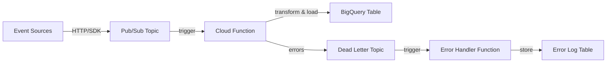

# How to Build a Real-Time Data Pipeline with Python Cloud Functions Pub/Sub and BigQuery

Author: [nawazdhandala](https://www.github.com/nawazdhandala)

Tags: GCP, Cloud Functions, Pub/Sub, BigQuery, Data Pipeline

Description: Build a real-time data pipeline using Python Cloud Functions triggered by Pub/Sub to ingest, transform, and load streaming data into BigQuery.

---

Real-time data pipelines are essential for applications that need to act on events as they happen - tracking user behavior, monitoring system metrics, processing transactions, or aggregating IoT sensor data. On GCP, you can build these pipelines using Pub/Sub for ingestion, Cloud Functions for transformation, and BigQuery for storage and analysis. This is a serverless stack that scales automatically and requires no infrastructure management.

## Pipeline Architecture

The pipeline follows a standard ETL pattern: events are published to Pub/Sub, Cloud Functions consume and transform them, and the processed data lands in BigQuery.



## Setting Up the Infrastructure

Create the Pub/Sub topic, BigQuery dataset, and table.

```bash
# Create the Pub/Sub topic for incoming events
gcloud pubsub topics create raw-events

# Create a dead letter topic for failed messages
gcloud pubsub topics create raw-events-dlq

# Create a BigQuery dataset
bq mk --dataset --location=US my_project:analytics

# Create the destination table with a schema
bq mk --table \
    my_project:analytics.events \
    event_id:STRING,event_type:STRING,user_id:STRING,timestamp:TIMESTAMP,properties:JSON,processed_at:TIMESTAMP
```

## The Event Producer

Your application publishes events to the Pub/Sub topic. Here is a reusable event publisher.

```python
# event_publisher.py - Publish events to the pipeline
from google.cloud import pubsub_v1
import json
import uuid
from datetime import datetime, timezone

class EventPublisher:
    """Publish events to the data pipeline."""

    def __init__(self, project_id, topic_id="raw-events"):
        self.publisher = pubsub_v1.PublisherClient()
        self.topic_path = self.publisher.topic_path(project_id, topic_id)

    def publish(self, event_type, user_id, properties=None):
        """Publish an event with automatic ID and timestamp."""
        event = {
            "event_id": str(uuid.uuid4()),
            "event_type": event_type,
            "user_id": user_id,
            "timestamp": datetime.now(timezone.utc).isoformat(),
            "properties": properties or {},
        }

        future = self.publisher.publish(
            self.topic_path,
            data=json.dumps(event).encode("utf-8"),
            event_type=event_type,  # Attribute for filtering
        )
        return future.result()

# Usage in your application
publisher = EventPublisher("my-gcp-project")

# Track user actions
publisher.publish("page_view", "user-123", {
    "page": "/pricing",
    "referrer": "google.com",
    "duration_ms": 4500,
})

publisher.publish("button_click", "user-123", {
    "button": "signup",
    "page": "/pricing",
})

publisher.publish("purchase", "user-456", {
    "product_id": "prod-789",
    "amount": 49.99,
    "currency": "USD",
})
```

## The Cloud Function Pipeline

The Cloud Function receives events from Pub/Sub, transforms them, and inserts them into BigQuery.

```python
# main.py - Cloud Function for the data pipeline
import functions_framework
import base64
import json
import logging
from google.cloud import bigquery
from datetime import datetime, timezone

logging.basicConfig(level=logging.INFO)
logger = logging.getLogger(__name__)

# Initialize the BigQuery client once (reused across invocations)
bq_client = bigquery.Client()

# Configuration
DATASET = "analytics"
TABLE = "events"
PROJECT = "my-gcp-project"
TABLE_ID = f"{PROJECT}.{DATASET}.{TABLE}"

@functions_framework.cloud_event
def process_event(cloud_event):
    """Process a raw event from Pub/Sub and insert it into BigQuery."""
    # Decode the Pub/Sub message
    message_data = base64.b64decode(cloud_event.data["message"]["data"])
    event = json.loads(message_data)

    logger.info(f"Processing event: {event.get('event_type')} for user {event.get('user_id')}")

    # Validate required fields
    required_fields = ["event_id", "event_type", "user_id", "timestamp"]
    for field in required_fields:
        if field not in event:
            logger.error(f"Missing required field: {field}")
            return  # Acknowledge to prevent infinite retries on bad data

    # Transform the event
    transformed = transform_event(event)

    # Insert into BigQuery
    insert_into_bigquery(transformed)

    logger.info(f"Event {event['event_id']} processed successfully")
```

## Event Transformation

Transform raw events into the schema expected by your BigQuery table.

```python
def transform_event(raw_event):
    """Transform a raw event into the BigQuery table schema."""
    # Parse and validate the timestamp
    try:
        event_time = datetime.fromisoformat(raw_event["timestamp"].replace("Z", "+00:00"))
    except (ValueError, KeyError):
        event_time = datetime.now(timezone.utc)

    # Normalize the event type to lowercase
    event_type = raw_event["event_type"].lower().strip()

    # Extract and clean properties
    properties = raw_event.get("properties", {})

    # Enrich with derived fields
    if event_type == "purchase" and "amount" in properties:
        properties["amount_cents"] = int(float(properties["amount"]) * 100)

    if event_type == "page_view" and "duration_ms" in properties:
        properties["duration_seconds"] = properties["duration_ms"] / 1000

    return {
        "event_id": raw_event["event_id"],
        "event_type": event_type,
        "user_id": raw_event["user_id"],
        "timestamp": event_time.isoformat(),
        "properties": json.dumps(properties),
        "processed_at": datetime.now(timezone.utc).isoformat(),
    }
```

## BigQuery Insertion

Insert transformed events into BigQuery. For better performance, use streaming inserts.

```python
def insert_into_bigquery(event):
    """Insert a single event into BigQuery using streaming insert."""
    errors = bq_client.insert_rows_json(
        TABLE_ID,
        [event],
        row_ids=[event["event_id"]],  # Use event_id for deduplication
    )

    if errors:
        logger.error(f"BigQuery insert errors: {errors}")
        # Raise to trigger a Pub/Sub retry
        raise RuntimeError(f"Failed to insert event: {errors}")
```

## Batch Insert for Higher Throughput

For high-volume pipelines, batch events together before inserting. This is more efficient than individual inserts.

```python
# batch_processor.py - Batch processing version
import functions_framework
import base64
import json
import logging
from google.cloud import bigquery
from datetime import datetime, timezone

logger = logging.getLogger(__name__)
bq_client = bigquery.Client()
TABLE_ID = "my-project.analytics.events"

# Buffer for batch inserts
event_buffer = []
BATCH_SIZE = 50

@functions_framework.cloud_event
def process_event_batched(cloud_event):
    """Buffer events and insert in batches for better throughput."""
    message_data = base64.b64decode(cloud_event.data["message"]["data"])
    event = json.loads(message_data)

    transformed = transform_event(event)
    event_buffer.append(transformed)

    # Flush when buffer reaches batch size
    if len(event_buffer) >= BATCH_SIZE:
        flush_buffer()

def flush_buffer():
    """Insert all buffered events into BigQuery."""
    global event_buffer
    if not event_buffer:
        return

    batch = event_buffer.copy()
    event_buffer = []

    row_ids = [e["event_id"] for e in batch]
    errors = bq_client.insert_rows_json(TABLE_ID, batch, row_ids=row_ids)

    if errors:
        logger.error(f"Batch insert errors ({len(errors)} failed): {errors}")
        raise RuntimeError(f"Failed to insert batch: {len(errors)} errors")

    logger.info(f"Inserted batch of {len(batch)} events")
```

## Deploying the Pipeline

Deploy the Cloud Function with a Pub/Sub trigger.

```bash
# Deploy the pipeline function
gcloud functions deploy process-events \
    --gen2 \
    --runtime=python311 \
    --region=us-central1 \
    --source=. \
    --entry-point=process_event \
    --trigger-topic=raw-events \
    --memory=256Mi \
    --timeout=60s \
    --max-instances=20 \
    --min-instances=1 \
    --set-env-vars="GCP_PROJECT=my-gcp-project"
```

## Error Handling with Dead Letter Queue

Set up a dead letter queue to capture events that fail repeatedly.

```python
# error_handler.py - Process events from the dead letter queue
import functions_framework
import base64
import json
import logging
from google.cloud import bigquery
from datetime import datetime, timezone

logger = logging.getLogger(__name__)
bq_client = bigquery.Client()

@functions_framework.cloud_event
def handle_dead_letter(cloud_event):
    """Store failed events for later investigation."""
    message_data = base64.b64decode(cloud_event.data["message"]["data"])
    attributes = cloud_event.data["message"].get("attributes", {})

    # Log the failed event
    logger.warning(f"Dead letter event: {message_data[:200]}")

    # Store in a separate BigQuery table for analysis
    error_record = {
        "raw_data": message_data.decode("utf-8"),
        "error_time": datetime.now(timezone.utc).isoformat(),
        "message_id": cloud_event.data["message"]["messageId"],
        "attributes": json.dumps(attributes),
    }

    errors = bq_client.insert_rows_json(
        "my-project.analytics.pipeline_errors",
        [error_record],
    )

    if errors:
        logger.error(f"Failed to store error record: {errors}")
```

## Querying the Pipeline Output

Once data flows into BigQuery, you can run analytics queries.

```python
from google.cloud import bigquery

client = bigquery.Client()

# Real-time dashboard query - events in the last hour
query = """
    SELECT
        event_type,
        COUNT(*) as event_count,
        COUNT(DISTINCT user_id) as unique_users,
        AVG(TIMESTAMP_DIFF(processed_at, timestamp, MILLISECOND)) as avg_latency_ms
    FROM `my-project.analytics.events`
    WHERE timestamp >= TIMESTAMP_SUB(CURRENT_TIMESTAMP(), INTERVAL 1 HOUR)
    GROUP BY event_type
    ORDER BY event_count DESC
"""

df = client.query(query).to_dataframe()
print(df)
```

## Monitoring the Pipeline

A data pipeline that silently fails is worse than no pipeline at all. You need to monitor message backlog, processing latency, and error rates. OneUptime (https://oneuptime.com) can monitor your pipeline components and alert you when messages start backing up, when processing latency exceeds thresholds, or when your Cloud Functions start throwing errors. This gives you confidence that your real-time data is actually flowing in real time.

## Summary

Building a real-time data pipeline with Cloud Functions, Pub/Sub, and BigQuery gives you a fully serverless architecture that scales with your event volume. The key design decisions are: validate events early and discard bad data instead of retrying forever, use streaming inserts for low-latency delivery to BigQuery, set up dead letter queues for failed events, and include processing timestamps so you can monitor pipeline latency. This architecture handles thousands of events per second without any servers to manage.
