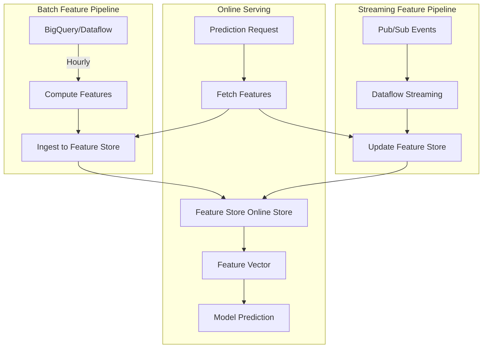

# How to Build a Real-Time Feature Serving Pipeline with Vertex AI Feature Store Online Serving

Author: [nawazdhandala](https://www.github.com/nawazdhandala)

Tags: GCP, Vertex AI, Feature Store, Online Serving, Real-Time ML

Description: Learn how to build a real-time feature serving pipeline using Vertex AI Feature Store online serving for low-latency ML predictions.

---

When a user clicks "Buy Now" on your e-commerce site, your fraud detection model needs their recent purchase history, account age, and device fingerprint features in milliseconds. Querying a data warehouse at prediction time is too slow. Pre-computing and caching features is fragile. A feature store with online serving gives you a managed, low-latency solution for serving pre-computed features at prediction time.

Vertex AI Feature Store provides both offline storage for training and online serving for real-time inference. This guide focuses on the online serving side - getting features to your model as fast as possible.

## Architecture of a Real-Time Feature Pipeline

The overall architecture has two paths: a batch path that computes and ingests features periodically, and a streaming path that keeps features fresh in near-real-time.



## Setting Up the Feature Store for Online Serving

Start by creating a feature store with online serving enabled and defining your entity types and features.

This code sets up a feature store optimized for online serving:

```python
from google.cloud import aiplatform

aiplatform.init(project="your-project-id", location="us-central1")

# Create a feature store with online serving enabled
feature_store = aiplatform.Featurestore.create(
    featurestore_id="realtime_features",
    online_serving_config=aiplatform.Featurestore.OnlineServingConfig(
        fixed_node_count=3  # Number of serving nodes for online reads
    )
)

# Create an entity type for users
user_entity = feature_store.create_entity_type(
    entity_type_id="users",
    description="User features for fraud detection",
    online_serving_config=aiplatform.Featurestore.OnlineServingConfig(
        fixed_node_count=3
    )
)

# Create features with different value types
user_entity.batch_create_features(
    feature_configs={
        "purchase_count_7d": {
            "value_type": "INT64",
            "description": "Number of purchases in last 7 days"
        },
        "avg_purchase_amount_30d": {
            "value_type": "DOUBLE",
            "description": "Average purchase amount in last 30 days"
        },
        "account_age_days": {
            "value_type": "INT64",
            "description": "Days since account creation"
        },
        "last_login_hours_ago": {
            "value_type": "DOUBLE",
            "description": "Hours since last login"
        },
        "device_trust_score": {
            "value_type": "DOUBLE",
            "description": "Trust score of the current device"
        },
        "is_verified_email": {
            "value_type": "BOOL",
            "description": "Whether email has been verified"
        }
    }
)

print(f"Feature store created: {feature_store.resource_name}")
```

## Ingesting Features for Online Serving

Features need to be ingested before they can be served online. You can ingest from BigQuery, GCS, or DataFrames.

This code shows batch ingestion from BigQuery:

```python
from google.cloud import aiplatform

aiplatform.init(project="your-project-id", location="us-central1")

feature_store = aiplatform.Featurestore("realtime_features")
user_entity = feature_store.get_entity_type("users")

# Ingest features from BigQuery
user_entity.ingest_from_bq(
    feature_ids=[
        "purchase_count_7d",
        "avg_purchase_amount_30d",
        "account_age_days",
        "last_login_hours_ago",
        "device_trust_score",
        "is_verified_email"
    ],
    feature_time="feature_timestamp",  # Column name in BQ table
    bq_source_uri="bq://your-project-id.features.user_features",
    entity_id_field="user_id"
)

print("Feature ingestion started")
```

## Streaming Feature Updates

For features that need to stay fresh, set up a streaming pipeline that updates the feature store as events occur.

This Dataflow pipeline processes events and updates features:

```python
# streaming_features.py - Dataflow pipeline for real-time feature updates

import apache_beam as beam
from apache_beam.options.pipeline_options import PipelineOptions
from google.cloud import aiplatform_v1

class ComputeFeatures(beam.DoFn):
    """Compute features from raw events."""

    def process(self, event):
        """Transform a purchase event into feature updates."""
        import json
        data = json.loads(event)

        # Compute features from the event
        yield {
            "entity_id": data["user_id"],
            "feature_values": {
                "purchase_count_7d": data.get("running_purchase_count", 0),
                "avg_purchase_amount_30d": data.get("running_avg_amount", 0.0),
                "last_login_hours_ago": 0.0  # Just made a purchase, so recently active
            },
            "timestamp": data["event_timestamp"]
        }

class WriteToFeatureStore(beam.DoFn):
    """Write computed features to Vertex AI Feature Store."""

    def setup(self):
        """Initialize the Feature Store client once per worker."""
        self.client = aiplatform_v1.FeaturestoreOnlineServingServiceClient(
            client_options={"api_endpoint": "us-central1-aiplatform.googleapis.com"}
        )
        self.entity_type = (
            "projects/your-project-id/locations/us-central1/"
            "featurestores/realtime_features/entityTypes/users"
        )

    def process(self, feature_update):
        """Write a single feature update to the online store."""
        from google.protobuf import timestamp_pb2
        from google.cloud.aiplatform_v1.types import featurestore_online_service

        # Build the write request
        request = featurestore_online_service.WriteFeatureValuesRequest(
            entity_type=self.entity_type,
            payloads=[
                featurestore_online_service.WriteFeatureValuesPayload(
                    entity_id=feature_update["entity_id"],
                    feature_values={
                        k: featurestore_online_service.FeatureValue(
                            int64_value=v if isinstance(v, int) else None,
                            double_value=v if isinstance(v, float) else None
                        )
                        for k, v in feature_update["feature_values"].items()
                    }
                )
            ]
        )

        self.client.write_feature_values(request=request)

def run_streaming_pipeline():
    """Run the streaming feature computation pipeline."""
    options = PipelineOptions(
        runner="DataflowRunner",
        project="your-project-id",
        region="us-central1",
        streaming=True,
        temp_location="gs://your-bucket/temp/"
    )

    with beam.Pipeline(options=options) as p:
        (
            p
            | "Read Events" >> beam.io.ReadFromPubSub(
                topic="projects/your-project-id/topics/purchase-events"
            )
            | "Compute Features" >> beam.ParDo(ComputeFeatures())
            | "Write to Feature Store" >> beam.ParDo(WriteToFeatureStore())
        )

if __name__ == "__main__":
    run_streaming_pipeline()
```

## Reading Features at Prediction Time

The core use case: reading features with low latency when a prediction request arrives.

This code reads features for a single entity:

```python
from google.cloud import aiplatform

aiplatform.init(project="your-project-id", location="us-central1")

feature_store = aiplatform.Featurestore("realtime_features")
user_entity = feature_store.get_entity_type("users")

# Read features for a single user - online serving
feature_values = user_entity.read(
    entity_ids=["user_12345"],
    feature_ids=[
        "purchase_count_7d",
        "avg_purchase_amount_30d",
        "account_age_days",
        "device_trust_score",
        "is_verified_email"
    ]
)

print(feature_values)
```

## Integrating with Prediction Endpoints

For production use, you want to fetch features and call the model in a single prediction flow. Here is how to integrate feature serving with a Vertex AI prediction endpoint.

This Cloud Function handles the full prediction flow:

```python
# prediction_service.py - Combines feature fetching with model prediction

import functions_framework
from google.cloud import aiplatform
import json

# Initialize once outside the handler for connection reuse
aiplatform.init(project="your-project-id", location="us-central1")

feature_store = aiplatform.Featurestore("realtime_features")
user_entity = feature_store.get_entity_type("users")
endpoint = aiplatform.Endpoint(
    "projects/your-project-id/locations/us-central1/endpoints/ENDPOINT_ID"
)

FEATURE_IDS = [
    "purchase_count_7d",
    "avg_purchase_amount_30d",
    "account_age_days",
    "last_login_hours_ago",
    "device_trust_score",
    "is_verified_email"
]

@functions_framework.http
def predict_fraud(request):
    """Handle a fraud detection prediction request."""
    request_json = request.get_json()
    user_id = request_json.get("user_id")
    transaction_amount = request_json.get("transaction_amount")

    if not user_id:
        return json.dumps({"error": "user_id is required"}), 400

    # Step 1: Fetch user features from the online store
    features_df = user_entity.read(
        entity_ids=[user_id],
        feature_ids=FEATURE_IDS
    )

    if features_df.empty:
        return json.dumps({"error": "User not found in feature store"}), 404

    # Step 2: Combine stored features with request-time features
    feature_vector = features_df.iloc[0].to_dict()
    feature_vector["transaction_amount"] = transaction_amount

    # Step 3: Call the model endpoint
    prediction = endpoint.predict(instances=[feature_vector])

    # Step 4: Return the result
    result = {
        "user_id": user_id,
        "fraud_score": prediction.predictions[0]["fraud_probability"],
        "is_fraud": prediction.predictions[0]["fraud_probability"] > 0.8
    }

    return json.dumps(result), 200
```

## Optimizing Online Serving Performance

Several configuration choices impact the latency of online feature reads.

The number of online serving nodes directly affects throughput and tail latency. Start with 3 nodes and scale based on your QPS requirements. Each node can handle roughly 1000-5000 reads per second depending on the number of features per read.

Read only the features you need. Fetching 5 features is faster than fetching 50. If different models need different feature subsets, specify only the relevant feature IDs in each read call.

Batch your reads when possible. If you need features for multiple entities in one request, pass all entity IDs in a single read call rather than making separate calls.

Keep your feature values small. Large string features or high-cardinality arrays add serialization overhead. Pre-compute aggregations instead of storing raw data.

Feature freshness depends on your ingestion pipeline. Batch ingestion updates features on an hourly or daily cadence. Streaming ingestion through Dataflow can achieve near-real-time freshness with latencies of a few seconds. Choose based on how stale your features can be without hurting model quality.

A well-configured feature store online serving setup typically achieves P99 latencies under 10 milliseconds for small feature vectors, making it suitable for user-facing prediction services where every millisecond counts.
