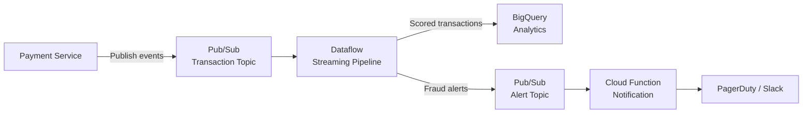

# How to Build a Real-Time Fraud Detection Pipeline Using Pub/Sub and Dataflow Streaming

Author: [nawazdhandala](https://www.github.com/nawazdhandala)

Tags: GCP, Pub/Sub, Dataflow, Fraud Detection, Streaming, Apache Beam, BigQuery

Description: Build a real-time fraud detection pipeline on Google Cloud using Pub/Sub for event ingestion, Dataflow for stream processing, and BigQuery for analysis and alerting.

---

Fraud detection needs to happen in real time. If you are processing transactions in batch - even hourly batches - by the time you detect a fraudulent pattern, the money is already gone. The standard approach on GCP is to use Pub/Sub for ingestion, Dataflow (Apache Beam) for stream processing and scoring, and BigQuery as the analytical store.

This guide walks through building a complete real-time fraud detection pipeline, from ingesting transaction events to flagging suspicious activity within seconds.

## Architecture

Here is the full pipeline:



Transaction events flow from the payment service into a Pub/Sub topic. Dataflow reads those events in real time, enriches them with user history, runs them through scoring rules, and writes the results to BigQuery. Transactions that score above the fraud threshold are published to a separate alert topic, which triggers notifications.

## Step 1: Set Up Pub/Sub Topics

Create the topics for transaction ingestion and fraud alerts.

```bash
# Create the transaction events topic
gcloud pubsub topics create transaction-events

# Create a subscription for Dataflow to read from
gcloud pubsub subscriptions create transaction-events-sub \
  --topic=transaction-events \
  --ack-deadline=120

# Create the fraud alerts topic
gcloud pubsub topics create fraud-alerts

# Create a subscription for the alerting service
gcloud pubsub subscriptions create fraud-alerts-sub \
  --topic=fraud-alerts
```

## Step 2: Define the Transaction Event Schema

Define a consistent schema for transaction events. Here is a sample JSON structure:

```json
{
  "transaction_id": "txn_abc123",
  "user_id": "usr_456",
  "amount": 299.99,
  "currency": "USD",
  "merchant_id": "merch_789",
  "merchant_category": "electronics",
  "card_last_four": "4242",
  "timestamp": "2026-02-17T14:30:00Z",
  "ip_address": "203.0.113.42",
  "device_fingerprint": "fp_xyz",
  "location": {
    "country": "US",
    "city": "Chicago",
    "latitude": 41.8781,
    "longitude": -87.6298
  }
}
```

## Step 3: Build the Dataflow Pipeline

This is the core of the system. The pipeline reads transactions from Pub/Sub, enriches them, applies fraud scoring rules, and routes the results.

```python
# fraud_pipeline.py - Real-time fraud detection pipeline
import apache_beam as beam
from apache_beam.options.pipeline_options import PipelineOptions, StandardOptions
from apache_beam.transforms.window import FixedWindows, SlidingWindows
from apache_beam.transforms.trigger import AfterWatermark, AfterProcessingTime, AccumulationMode
import json
import math
from datetime import datetime

class ParseTransaction(beam.DoFn):
    """Parse raw Pub/Sub messages into transaction dictionaries."""
    def process(self, element):
        try:
            data = json.loads(element.decode('utf-8'))
            # Validate required fields
            required = ['transaction_id', 'user_id', 'amount', 'timestamp']
            if all(field in data for field in required):
                yield data
            else:
                # Route invalid messages to dead letter
                yield beam.pvalue.TaggedOutput('invalid', element)
        except json.JSONDecodeError:
            yield beam.pvalue.TaggedOutput('invalid', element)

class EnrichWithUserHistory(beam.DoFn):
    """Look up user transaction history from BigQuery side input."""
    def process(self, transaction, user_profiles):
        user_id = transaction['user_id']
        profile = user_profiles.get(user_id, {})

        # Add enrichment fields from user profile
        transaction['avg_transaction_amount'] = profile.get('avg_amount', 0)
        transaction['transaction_count_30d'] = profile.get('txn_count_30d', 0)
        transaction['usual_country'] = profile.get('usual_country', 'unknown')
        transaction['account_age_days'] = profile.get('account_age_days', 0)

        yield transaction

class ScoreFraudRisk(beam.DoFn):
    """Apply rule-based fraud scoring to each transaction."""
    def process(self, transaction):
        score = 0.0
        reasons = []

        amount = transaction.get('amount', 0)
        avg_amount = transaction.get('avg_transaction_amount', 0)

        # Rule 1: Transaction amount significantly higher than average
        if avg_amount > 0 and amount > avg_amount * 5:
            score += 30
            reasons.append(f"Amount {amount} is {amount/avg_amount:.1f}x average")

        # Rule 2: Transaction from unusual country
        if (transaction.get('usual_country', 'unknown') != 'unknown' and
            transaction.get('location', {}).get('country') != transaction.get('usual_country')):
            score += 25
            reasons.append("Transaction from unusual country")

        # Rule 3: High amount on new account
        if transaction.get('account_age_days', 0) < 30 and amount > 500:
            score += 20
            reasons.append("High amount on new account")

        # Rule 4: Rapid succession of transactions (detected via windowing)
        if transaction.get('velocity_count', 0) > 5:
            score += 25
            reasons.append(f"High velocity: {transaction['velocity_count']} txns in window")

        # Cap the score at 100
        score = min(score, 100)

        transaction['fraud_score'] = score
        transaction['fraud_reasons'] = reasons
        transaction['is_flagged'] = score >= 50

        yield transaction

class CalculateVelocity(beam.DoFn):
    """Count transactions per user within the window period."""
    def process(self, element):
        user_id, transactions = element
        txn_list = list(transactions)
        count = len(txn_list)

        # Add velocity count to each transaction
        for txn in txn_list:
            txn['velocity_count'] = count
            yield txn

def run():
    options = PipelineOptions()
    options.view_as(StandardOptions).streaming = True

    with beam.Pipeline(options=options) as p:
        # Read transaction events from Pub/Sub
        raw_events = (
            p
            | "ReadFromPubSub" >> beam.io.ReadFromPubSub(
                subscription="projects/MY_PROJECT/subscriptions/transaction-events-sub"
            )
        )

        # Parse and validate transactions
        parsed = (
            raw_events
            | "ParseTransactions" >> beam.ParDo(ParseTransaction())
                .with_outputs('invalid', main='valid')
        )

        # Calculate transaction velocity using sliding windows
        # 5-minute windows sliding every 1 minute
        velocity_enriched = (
            parsed.valid
            | "WindowForVelocity" >> beam.WindowInto(
                SlidingWindows(size=300, period=60)
            )
            | "KeyByUser" >> beam.Map(lambda txn: (txn['user_id'], txn))
            | "GroupByUser" >> beam.GroupByKey()
            | "CalculateVelocity" >> beam.ParDo(CalculateVelocity())
        )

        # Score each transaction for fraud risk
        scored = (
            velocity_enriched
            | "ScoreFraud" >> beam.ParDo(ScoreFraudRisk())
        )

        # Write all scored transactions to BigQuery
        (
            scored
            | "FormatForBQ" >> beam.Map(lambda txn: {
                'transaction_id': txn['transaction_id'],
                'user_id': txn['user_id'],
                'amount': txn['amount'],
                'fraud_score': txn['fraud_score'],
                'is_flagged': txn['is_flagged'],
                'fraud_reasons': json.dumps(txn.get('fraud_reasons', [])),
                'timestamp': txn['timestamp'],
            })
            | "WriteToBigQuery" >> beam.io.WriteToBigQuery(
                table='MY_PROJECT:fraud_detection.scored_transactions',
                schema='transaction_id:STRING,user_id:STRING,amount:FLOAT,'
                       'fraud_score:FLOAT,is_flagged:BOOLEAN,'
                       'fraud_reasons:STRING,timestamp:TIMESTAMP',
                write_disposition=beam.io.BigQueryDisposition.WRITE_APPEND,
                create_disposition=beam.io.BigQueryDisposition.CREATE_IF_NEEDED,
            )
        )

        # Route flagged transactions to the alerts topic
        (
            scored
            | "FilterFlagged" >> beam.Filter(lambda txn: txn.get('is_flagged', False))
            | "SerializeAlert" >> beam.Map(lambda txn: json.dumps(txn).encode('utf-8'))
            | "PublishAlert" >> beam.io.WriteToPubSub(
                topic="projects/MY_PROJECT/topics/fraud-alerts"
            )
        )

if __name__ == '__main__':
    run()
```

## Step 4: Deploy the Pipeline to Dataflow

```bash
# Deploy the fraud detection pipeline to Dataflow
python fraud_pipeline.py \
  --runner=DataflowRunner \
  --project=MY_PROJECT \
  --region=us-central1 \
  --temp_location=gs://MY_BUCKET/temp/ \
  --staging_location=gs://MY_BUCKET/staging/ \
  --job_name=fraud-detection-pipeline \
  --streaming \
  --num_workers=3 \
  --max_num_workers=10 \
  --autoscaling_algorithm=THROUGHPUT_BASED
```

## Step 5: Create the BigQuery Table

```bash
# Create the BigQuery dataset and table for scored transactions
bq mk --dataset MY_PROJECT:fraud_detection

bq mk --table \
  MY_PROJECT:fraud_detection.scored_transactions \
  transaction_id:STRING,user_id:STRING,amount:FLOAT,fraud_score:FLOAT,is_flagged:BOOLEAN,fraud_reasons:STRING,timestamp:TIMESTAMP
```

## Step 6: Set Up Alerting

Create a Cloud Function that listens to the fraud alerts topic and sends notifications.

```python
# Cloud Function to handle fraud alerts
import json
import base64
import requests

def handle_fraud_alert(event, context):
    """Triggered by Pub/Sub message on fraud-alerts topic."""
    # Decode the Pub/Sub message
    message_data = base64.b64decode(event['data']).decode('utf-8')
    transaction = json.loads(message_data)

    # Format the alert message
    alert_text = (
        f"FRAUD ALERT: Transaction {transaction['transaction_id']}\n"
        f"User: {transaction['user_id']}\n"
        f"Amount: ${transaction['amount']:.2f}\n"
        f"Score: {transaction['fraud_score']}/100\n"
        f"Reasons: {', '.join(transaction.get('fraud_reasons', []))}"
    )

    # Send to Slack webhook
    slack_webhook = "https://hooks.slack.com/services/YOUR/WEBHOOK/URL"
    requests.post(slack_webhook, json={"text": alert_text})
```

## Step 7: Test the Pipeline

Publish some test transactions to validate the pipeline.

```bash
# Publish a normal transaction
gcloud pubsub topics publish transaction-events --message='{
  "transaction_id": "txn_001",
  "user_id": "usr_100",
  "amount": 45.00,
  "timestamp": "2026-02-17T14:30:00Z",
  "merchant_category": "groceries",
  "location": {"country": "US"}
}'

# Publish a suspicious transaction - high amount
gcloud pubsub topics publish transaction-events --message='{
  "transaction_id": "txn_002",
  "user_id": "usr_100",
  "amount": 9999.99,
  "timestamp": "2026-02-17T14:31:00Z",
  "merchant_category": "electronics",
  "location": {"country": "BR"}
}'
```

Check BigQuery for the scored results after a minute or two:

```sql
-- Check scored transactions
SELECT transaction_id, amount, fraud_score, is_flagged, fraud_reasons
FROM `fraud_detection.scored_transactions`
ORDER BY timestamp DESC
LIMIT 10
```

## Wrapping Up

This pipeline gives you a working foundation for real-time fraud detection on GCP. The combination of Pub/Sub for ingestion, Dataflow for processing, and BigQuery for analytics is well-proven at scale. The scoring logic shown here is rule-based, which is a good starting point. As your system matures, you can swap in ML model predictions using Vertex AI endpoints without changing the pipeline architecture - just replace the scoring DoFn with an API call to your model. The key is getting the real-time infrastructure right first, and the scoring intelligence can evolve over time.
