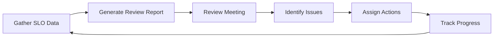

# How to Build a Reliability Review Process Using SLO Data from Google Cloud Monitoring

Author: [nawazdhandala](https://www.github.com/nawazdhandala)

Tags: GCP, SRE, SLO, Reliability, Cloud Monitoring, Operations, Google Cloud

Description: Build a structured reliability review process that uses SLO data from Google Cloud Monitoring to drive data-informed reliability decisions.

---

SLOs are only useful if someone actually looks at them and makes decisions based on the data. Many teams set up SLOs, build dashboards, and then ignore them until something breaks. A reliability review process changes this by creating a regular cadence where your team examines SLO data, identifies trends, and makes proactive decisions about reliability investments. Here is how to build one using Google Cloud Monitoring as your data source.

## What a Reliability Review Covers

A reliability review is a regular meeting (weekly or biweekly) where the team examines:

- Current SLO compliance and error budget status
- Trends in reliability metrics over time
- Recent incidents and their impact on SLOs
- Upcoming changes that might affect reliability
- Action items from previous reviews



## Step 1: Set Up SLOs in Cloud Monitoring

Start by defining SLOs for each critical service:

```python
# setup_slos.py - Create SLOs for reliability tracking
from google.cloud import monitoring_v3

client = monitoring_v3.ServiceMonitoringServiceClient()

def create_service_slos(project_id, service_name, service_id):
    """Create a standard set of SLOs for a service.
    Every service gets availability and latency SLOs at minimum."""

    parent = f"projects/{project_id}"

    # Create the service
    service = client.create_service(
        parent=parent,
        service=monitoring_v3.Service(
            display_name=service_name,
            custom=monitoring_v3.Service.Custom(),
        ),
        service_id=service_id,
    )

    # Availability SLO - 99.9% of requests succeed
    availability_slo = client.create_service_level_objective(
        parent=service.name,
        service_level_objective=monitoring_v3.ServiceLevelObjective(
            display_name=f"{service_name} - Availability 99.9%",
            goal=0.999,
            rolling_period={"seconds": 30 * 24 * 3600},
            service_level_indicator=monitoring_v3.ServiceLevelIndicator(
                request_based=monitoring_v3.RequestBasedSli(
                    good_total_ratio=monitoring_v3.TimeSeriesRatio(
                        good_service_filter=f'resource.type="cloud_run_revision" AND resource.labels.service_name="{service_id}" AND metric.type="run.googleapis.com/request_count" AND metric.labels.response_code_class="2xx"',
                        total_service_filter=f'resource.type="cloud_run_revision" AND resource.labels.service_name="{service_id}" AND metric.type="run.googleapis.com/request_count"',
                    ),
                ),
            ),
        ),
        service_level_objective_id=f"{service_id}-availability",
    )

    # Latency SLO - 95% of requests under 200ms
    latency_slo = client.create_service_level_objective(
        parent=service.name,
        service_level_objective=monitoring_v3.ServiceLevelObjective(
            display_name=f"{service_name} - Latency P95 < 200ms",
            goal=0.95,
            rolling_period={"seconds": 30 * 24 * 3600},
            service_level_indicator=monitoring_v3.ServiceLevelIndicator(
                request_based=monitoring_v3.RequestBasedSli(
                    distribution_cut=monitoring_v3.DistributionCut(
                        distribution_filter=f'resource.type="cloud_run_revision" AND resource.labels.service_name="{service_id}" AND metric.type="run.googleapis.com/request_latencies"',
                        range=monitoring_v3.Range(max=200),
                    ),
                ),
            ),
        ),
        service_level_objective_id=f"{service_id}-latency",
    )

    return [availability_slo, latency_slo]

# Create SLOs for each critical service
services = [
    ("API Gateway", "api-gateway"),
    ("User Service", "user-service"),
    ("Payment Service", "payment-service"),
    ("Search Service", "search-service"),
]

for name, sid in services:
    slos = create_service_slos("your-project-id", name, sid)
    print(f"Created SLOs for {name}: {len(slos)} SLOs")
```

## Step 2: Build the Automated Review Report

Create a report generator that pulls SLO data and formats it for the review meeting:

```python
# review_report.py - Generate the reliability review report
from google.cloud import monitoring_v3, bigquery
from datetime import datetime, timedelta
import json

monitoring_client = monitoring_v3.ServiceMonitoringServiceClient()
bq_client = bigquery.Client()

def generate_reliability_report(project_id, services):
    """Generate a comprehensive reliability report for the review meeting.
    Pulls SLO data, error budget status, and incident history."""

    report = {
        "generated_at": datetime.utcnow().isoformat(),
        "review_period": "Last 7 days",
        "services": [],
    }

    for service_name, service_id in services:
        service_report = {
            "name": service_name,
            "slos": [],
            "incidents": [],
            "trends": {},
        }

        # Get all SLOs for this service
        parent = f"projects/{project_id}/services/{service_id}"
        slos = monitoring_client.list_service_level_objectives(parent=parent)

        for slo in slos:
            slo_data = {
                "name": slo.display_name,
                "goal": slo.goal,
                "current_performance": get_slo_performance(slo.name),
                "error_budget_remaining_pct": calculate_error_budget(slo),
                "burn_rate_7d": calculate_burn_rate(slo, days=7),
            }
            service_report["slos"].append(slo_data)

        # Pull recent incidents from BigQuery
        service_report["incidents"] = get_recent_incidents(project_id, service_id)

        report["services"].append(service_report)

    # Add overall summary
    report["summary"] = generate_summary(report)

    return report


def calculate_error_budget(slo):
    """Calculate remaining error budget as a percentage."""
    # In production, query the actual time series data
    current_performance = get_slo_performance(slo.name)
    total_budget = 1 - slo.goal
    consumed = max(0, slo.goal - current_performance)
    remaining_pct = ((total_budget - consumed) / total_budget) * 100
    return round(remaining_pct, 1)


def calculate_burn_rate(slo, days=7):
    """Calculate how fast the error budget is being consumed.
    A burn rate > 1 means the budget will be exhausted before the window ends."""
    # Simplified calculation
    # In production, compute from actual time series data
    budget_consumed_pct = 100 - calculate_error_budget(slo)
    days_in_window = 30
    expected_consumption = (days / days_in_window) * 100

    if expected_consumption == 0:
        return 0
    return round(budget_consumed_pct / expected_consumption, 2)


def get_recent_incidents(project_id, service_id):
    """Pull incidents from the past week that affected this service."""
    query = f"""
    SELECT
        incident_id,
        title,
        severity,
        started_at,
        resolved_at,
        TIMESTAMP_DIFF(resolved_at, started_at, MINUTE) AS duration_minutes,
        impact_description
    FROM `{project_id}.incidents.incident_log`
    WHERE service = '{service_id}'
    AND started_at > TIMESTAMP_SUB(CURRENT_TIMESTAMP(), INTERVAL 7 DAY)
    ORDER BY started_at DESC
    """
    results = bq_client.query(query).to_dataframe()
    return results.to_dict(orient='records')


def generate_summary(report):
    """Generate an executive summary of the reliability report."""
    total_slos = sum(len(s["slos"]) for s in report["services"])
    slos_at_risk = sum(
        1 for s in report["services"]
        for slo in s["slos"]
        if slo["error_budget_remaining_pct"] < 25
    )
    total_incidents = sum(len(s["incidents"]) for s in report["services"])
    high_burn_rate = sum(
        1 for s in report["services"]
        for slo in s["slos"]
        if slo.get("burn_rate_7d", 0) > 1.5
    )

    return {
        "total_slos_tracked": total_slos,
        "slos_at_risk": slos_at_risk,
        "total_incidents_this_week": total_incidents,
        "slos_with_high_burn_rate": high_burn_rate,
        "overall_health": "healthy" if slos_at_risk == 0 else "needs_attention" if slos_at_risk < 3 else "critical",
    }
```

## Step 3: Format the Report for Review

Create a readable output that the team can discuss:

```python
# format_report.py - Format the reliability report for human consumption
def format_report_text(report):
    """Format the reliability report as readable text for the review meeting."""

    lines = []
    lines.append(f"# Reliability Review Report")
    lines.append(f"Generated: {report['generated_at']}")
    lines.append(f"Period: {report['review_period']}")

    # Executive Summary
    summary = report["summary"]
    lines.append(f"\n## Executive Summary")
    lines.append(f"- SLOs tracked: {summary['total_slos_tracked']}")
    lines.append(f"- SLOs at risk (< 25% budget): {summary['slos_at_risk']}")
    lines.append(f"- Incidents this week: {summary['total_incidents_this_week']}")
    lines.append(f"- SLOs with high burn rate: {summary['slos_with_high_burn_rate']}")
    lines.append(f"- Overall health: {summary['overall_health'].upper()}")

    # Per-service details
    for service in report["services"]:
        lines.append(f"\n## {service['name']}")

        # SLO table
        lines.append("\n| SLO | Goal | Current | Budget Remaining | Burn Rate |")
        lines.append("|-----|------|---------|------------------|-----------|")
        for slo in service["slos"]:
            budget_indicator = ""
            if slo["error_budget_remaining_pct"] < 10:
                budget_indicator = " [CRITICAL]"
            elif slo["error_budget_remaining_pct"] < 25:
                budget_indicator = " [WARNING]"

            lines.append(
                f"| {slo['name']} "
                f"| {slo['goal']*100:.1f}% "
                f"| {slo['current_performance']*100:.2f}% "
                f"| {slo['error_budget_remaining_pct']:.1f}%{budget_indicator} "
                f"| {slo.get('burn_rate_7d', 'N/A')}x |"
            )

        # Incidents
        if service["incidents"]:
            lines.append(f"\nIncidents ({len(service['incidents'])}):")
            for inc in service["incidents"]:
                lines.append(
                    f"  - [{inc['severity']}] {inc['title']} "
                    f"({inc['duration_minutes']} min)"
                )
        else:
            lines.append("\nNo incidents this week.")

    return "\n".join(lines)
```

## Step 4: Automate Report Distribution

Send the report automatically before each review meeting:

```python
# distribute_report.py - Send the report via email and Slack
import functions_framework
from google.cloud import secretmanager
import requests
import json

@functions_framework.http
def distribute_reliability_report(request):
    """Generate and distribute the reliability report before the review meeting."""

    services = [
        ("API Gateway", "api-gateway"),
        ("User Service", "user-service"),
        ("Payment Service", "payment-service"),
        ("Search Service", "search-service"),
    ]

    # Generate the report
    report = generate_reliability_report("your-project-id", services)
    formatted = format_report_text(report)

    # Send to Slack
    slack_webhook = get_secret("slack-webhook-url")
    requests.post(slack_webhook, json={
        "text": f"Reliability Review Report is ready",
        "blocks": [
            {
                "type": "section",
                "text": {
                    "type": "mrkdwn",
                    "text": f"*Reliability Review Report*\n"
                            f"Overall Health: {report['summary']['overall_health'].upper()}\n"
                            f"SLOs at Risk: {report['summary']['slos_at_risk']}\n"
                            f"Incidents: {report['summary']['total_incidents_this_week']}"
                }
            }
        ]
    })

    # Store the full report in BigQuery for historical tracking
    bq_client.insert_rows_json(
        "your-project.sre_metrics.reliability_reviews",
        [{
            "review_date": datetime.utcnow().isoformat(),
            "report_json": json.dumps(report),
            "overall_health": report["summary"]["overall_health"],
            "slos_at_risk": report["summary"]["slos_at_risk"],
        }]
    )

    return {"status": "distributed"}, 200
```

Schedule it before your weekly review:

```bash
# Send the report every Tuesday at 9 AM before the 10 AM review meeting
gcloud scheduler jobs create http reliability-report \
    --schedule="0 9 * * 2" \
    --uri="https://REGION-PROJECT.cloudfunctions.net/distribute-reliability-report" \
    --http-method=POST \
    --time-zone="America/New_York"
```

## Step 5: Track Action Items

Create a system to track reliability action items from each review:

```python
# action_tracker.py - Track reliability review action items
from google.cloud import firestore
from datetime import datetime

db = firestore.Client()

def create_action_item(review_date, item):
    """Create a reliability action item from the review meeting."""
    doc = {
        "review_date": review_date,
        "title": item["title"],
        "owner": item["owner"],
        "priority": item["priority"],  # P0, P1, P2
        "related_slo": item.get("slo"),
        "related_service": item.get("service"),
        "due_date": item.get("due_date"),
        "status": "open",
        "created_at": datetime.utcnow().isoformat(),
    }
    db.collection("reliability_actions").add(doc)
    return doc

def get_open_actions():
    """Get all open action items for review in the next meeting."""
    actions = db.collection("reliability_actions") \
        .where("status", "==", "open") \
        .order_by("priority") \
        .stream()

    return [a.to_dict() for a in actions]
```

## Running the Review Meeting

A typical reliability review follows this agenda:

1. **SLO status check** (5 min): Walk through the report, flag any SLOs at risk
2. **Incident review** (10 min): Discuss recent incidents, their SLO impact, and whether action items were created
3. **Trend analysis** (5 min): Look at week-over-week trends - are things getting better or worse?
4. **Action item review** (10 min): Check progress on existing action items, close completed ones
5. **New actions** (5 min): Assign new action items based on the review findings
6. **Upcoming risks** (5 min): Discuss planned changes that might affect reliability

## Monitoring

Use OneUptime to provide an additional layer of monitoring on top of Google Cloud Monitoring. While Cloud Monitoring tracks your SLOs, OneUptime can monitor the external user experience, giving you an outside-in view of reliability that complements your internal metrics. This dual perspective often catches issues that internal monitoring misses.

## Summary

A reliability review process turns SLO data from a passive dashboard into an active decision-making tool. The key components are automated report generation from Cloud Monitoring SLO data, a regular review cadence, tracked action items, and historical trend analysis. Start with a weekly review covering your most critical services, and expand coverage as the process matures. The goal is creating a feedback loop where SLO data drives reliability investments, and those investments measurably improve SLO performance.
