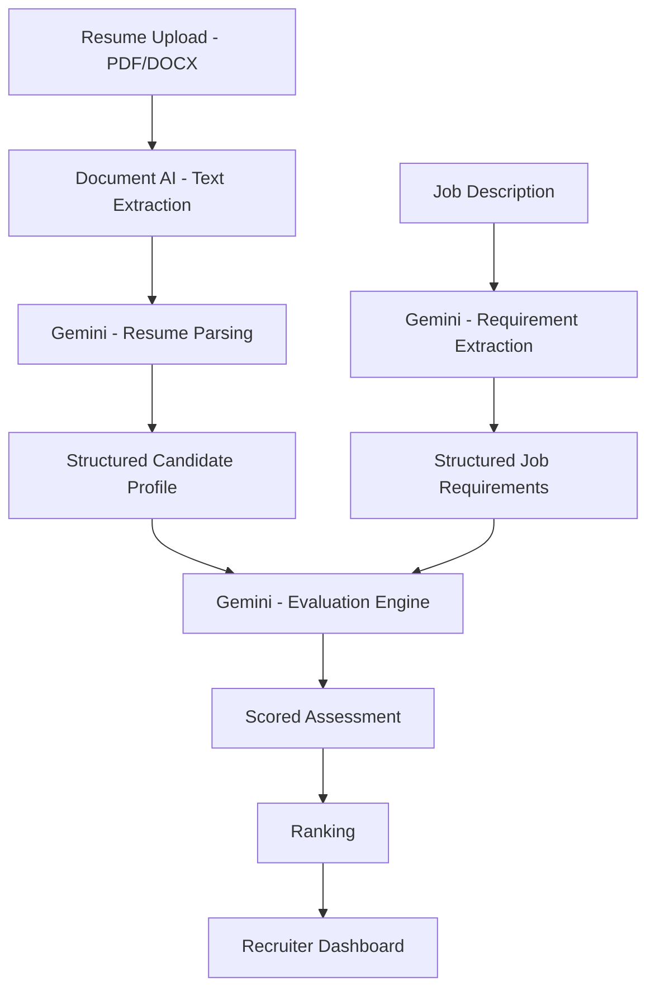

# How to Build a Resume Screening and Ranking System with Gemini on Vertex AI

Author: [nawazdhandala](https://www.github.com/nawazdhandala)

Tags: GCP, Vertex AI, Gemini, HR Tech, Resume Screening

Description: Build an automated resume screening and ranking system using Gemini on Vertex AI that evaluates candidates against job requirements and produces structured assessments.

---

Hiring teams at growing companies can receive hundreds of applications for a single role. Manually screening each resume is time-consuming, inconsistent, and prone to unconscious bias. An automated screening system can provide a consistent first pass, evaluating every resume against the same criteria and surfacing the strongest candidates for human review.

In this post, I'll build a resume screening system using Gemini on Vertex AI that parses resumes, evaluates candidates against job requirements, generates structured assessments, and ranks applicants. The goal isn't to replace human judgment but to help recruiters focus their time on the most promising candidates.

## Important Considerations

Before diving into the code, a few critical points. AI-based hiring tools need careful handling. Always have humans make final decisions. Be transparent with candidates about AI usage in your process. Regularly audit the system for bias across demographic groups. And check your local regulations - some jurisdictions have specific rules about AI in hiring.

## System Architecture



## Extracting Text from Resumes

Resumes come in various formats. Use Document AI to handle PDFs and images:

```python
from google.cloud import documentai_v1
from google.cloud import storage

def extract_resume_text(project_id, processor_id, file_path):
    """Extract text from a resume file using Document AI"""
    client = documentai_v1.DocumentProcessorServiceClient()

    # Read the file content
    with open(file_path, "rb") as f:
        content = f.read()

    # Determine MIME type
    if file_path.endswith(".pdf"):
        mime_type = "application/pdf"
    elif file_path.endswith(".docx"):
        mime_type = "application/vnd.openxmlformats-officedocument.wordprocessingml.document"
    elif file_path.endswith(".png") or file_path.endswith(".jpg"):
        mime_type = "image/png" if file_path.endswith(".png") else "image/jpeg"
    else:
        mime_type = "application/pdf"

    request = documentai_v1.ProcessRequest(
        name=f"projects/{project_id}/locations/us/processors/{processor_id}",
        raw_document=documentai_v1.RawDocument(
            content=content,
            mime_type=mime_type,
        ),
    )

    result = client.process_document(request=request)
    return result.document.text
```

## Parsing Resumes into Structured Data

Use Gemini to convert raw resume text into structured profiles:

```python
import vertexai
from vertexai.generative_models import GenerativeModel
import json

def parse_resume(project_id, resume_text):
    """Parse resume text into a structured candidate profile"""
    vertexai.init(project=project_id, location="us-central1")
    model = GenerativeModel("gemini-1.5-pro")

    response = model.generate_content(
        f"""Parse this resume into a structured format. Extract all available
information accurately. Do not infer or make up information that isn't present.

Resume:
{resume_text}

Output as JSON with these fields:
- name: string
- email: string or null
- phone: string or null
- location: string or null
- summary: brief professional summary (generate from content if not explicit)
- total_experience_years: estimated total years of professional experience (number)
- education: array of {{degree, field, institution, graduation_year, gpa}}
- work_experience: array of {{company, title, start_date, end_date, duration_months, responsibilities (array of strings), achievements (array of strings)}}
- skills: {{technical (array), soft (array), languages (array), certifications (array)}}
- notable_achievements: array of standout accomplishments

Only output valid JSON.""",
        generation_config={"temperature": 0.1, "max_output_tokens": 3000},
    )

    try:
        return json.loads(response.text)
    except json.JSONDecodeError:
        # Try to extract JSON from the response
        text = response.text
        start = text.find('{')
        end = text.rfind('}') + 1
        if start >= 0 and end > start:
            return json.loads(text[start:end])
        return {"parse_error": True, "raw": response.text}
```

## Extracting Job Requirements

Convert job descriptions into structured requirements for consistent evaluation:

```python
def parse_job_requirements(project_id, job_description):
    """Extract structured requirements from a job description"""
    vertexai.init(project=project_id, location="us-central1")
    model = GenerativeModel("gemini-1.5-pro")

    response = model.generate_content(
        f"""Extract structured hiring requirements from this job description.
Separate requirements into must-have and nice-to-have categories.

Job Description:
{job_description}

Output as JSON with fields:
- title: job title
- department: string
- level: entry/mid/senior/lead/principal
- must_have: {{
    min_experience_years: number,
    required_skills: array of strings,
    required_education: string or null,
    required_certifications: array of strings,
    other_requirements: array of strings
  }}
- nice_to_have: {{
    preferred_skills: array of strings,
    preferred_experience: array of strings,
    preferred_education: string or null
  }}
- evaluation_criteria: array of {{criterion, weight (1-10), description}}

Generate 5-8 evaluation criteria based on what this role values most.
Only output valid JSON.""",
        generation_config={"temperature": 0.1, "max_output_tokens": 2000},
    )

    try:
        return json.loads(response.text)
    except json.JSONDecodeError:
        return {"parse_error": True, "raw": response.text}
```

## The Evaluation Engine

Score candidates against job requirements:

```python
class CandidateEvaluator:
    def __init__(self, project_id):
        vertexai.init(project=project_id, location="us-central1")
        self.model = GenerativeModel("gemini-1.5-pro")

    def evaluate_candidate(self, candidate_profile, job_requirements):
        """Score a candidate against job requirements"""
        response = self.model.generate_content(
            f"""You are an unbiased hiring evaluator. Evaluate this candidate
against the job requirements. Be objective and focus only on
qualifications, skills, and experience.

CANDIDATE PROFILE:
{json.dumps(candidate_profile, indent=2)}

JOB REQUIREMENTS:
{json.dumps(job_requirements, indent=2)}

Evaluate the candidate on each criterion from the job requirements.
For each criterion, provide:
1. A score from 1-10
2. Evidence from the resume supporting the score
3. Any gaps or concerns

Also provide:
- Overall fit score (1-100)
- Top 3 strengths for this role
- Top 3 gaps or concerns
- Whether must-have requirements are met (boolean for each)
- Suggested interview questions based on gaps

Output as JSON with fields:
- criterion_scores: array of {{criterion, score, evidence, concerns}}
- overall_score: number (1-100)
- strengths: array of strings
- gaps: array of strings
- must_have_met: object with each requirement as key, boolean as value
- all_must_haves_met: boolean
- suggested_questions: array of strings
- recommendation: "advance" or "hold" or "reject"

Be fair and consistent. Do not factor in name, gender, age, or any
demographic information. Focus solely on qualifications and experience.
Only output valid JSON.""",
            generation_config={"temperature": 0.1, "max_output_tokens": 3000},
        )

        try:
            return json.loads(response.text)
        except json.JSONDecodeError:
            return {"parse_error": True, "raw": response.text}

    def rank_candidates(self, evaluations):
        """Rank evaluated candidates by overall score"""
        # Sort by overall score, with must-have requirements as a gate
        qualified = [e for e in evaluations if e.get("all_must_haves_met", False)]
        unqualified = [e for e in evaluations if not e.get("all_must_haves_met", False)]

        qualified.sort(key=lambda x: x.get("overall_score", 0), reverse=True)
        unqualified.sort(key=lambda x: x.get("overall_score", 0), reverse=True)

        return {
            "qualified_candidates": qualified,
            "unqualified_candidates": unqualified,
            "total_evaluated": len(evaluations),
            "total_qualified": len(qualified),
        }
```

## Batch Processing Pipeline

Process multiple applications at once:

```python
from google.cloud import bigquery
from datetime import datetime

def process_application_batch(project_id, job_id, resume_files):
    """Process a batch of applications for a job posting"""
    # Get job requirements
    job_desc = get_job_description(job_id)
    requirements = parse_job_requirements(project_id, job_desc)

    evaluator = CandidateEvaluator(project_id)
    results = []

    for file_path in resume_files:
        try:
            # Extract text
            resume_text = extract_resume_text(
                project_id, "your-processor-id", file_path
            )

            # Parse into structured profile
            profile = parse_resume(project_id, resume_text)

            if profile.get("parse_error"):
                results.append({
                    "file": file_path,
                    "status": "parse_error",
                    "error": "Could not parse resume",
                })
                continue

            # Evaluate against requirements
            evaluation = evaluator.evaluate_candidate(profile, requirements)

            results.append({
                "file": file_path,
                "name": profile.get("name", "Unknown"),
                "status": "evaluated",
                "profile": profile,
                "evaluation": evaluation,
            })

        except Exception as e:
            results.append({
                "file": file_path,
                "status": "error",
                "error": str(e),
            })

    # Rank the successfully evaluated candidates
    evaluated = [r["evaluation"] for r in results if r["status"] == "evaluated"]
    for i, r in enumerate(results):
        if r["status"] == "evaluated":
            r["evaluation"]["candidate_name"] = r["name"]

    rankings = evaluator.rank_candidates(evaluated)

    # Store results
    store_screening_results(project_id, job_id, results, rankings)

    return rankings

def store_screening_results(project_id, job_id, results, rankings):
    """Store screening results in BigQuery for audit and analysis"""
    client = bigquery.Client(project=project_id)
    table_id = f"{project_id}.hiring.screening_results"

    rows = []
    for result in results:
        rows.append({
            "job_id": job_id,
            "candidate_name": result.get("name", "Unknown"),
            "status": result["status"],
            "overall_score": result.get("evaluation", {}).get("overall_score", 0),
            "recommendation": result.get("evaluation", {}).get("recommendation", ""),
            "must_haves_met": result.get("evaluation", {}).get("all_must_haves_met", False),
            "evaluation_json": json.dumps(result.get("evaluation", {})),
            "screened_at": datetime.utcnow().isoformat(),
        })

    errors = client.insert_rows_json(table_id, rows)
    if errors:
        print(f"BigQuery errors: {errors}")
```

## Building the API

```python
from flask import Flask, request, jsonify

app = Flask(__name__)

@app.route("/screen", methods=["POST"])
def screen_resume():
    """Screen a single resume against a job"""
    data = request.get_json()
    project_id = "your-project-id"

    profile = parse_resume(project_id, data["resume_text"])
    requirements = parse_job_requirements(project_id, data["job_description"])

    evaluator = CandidateEvaluator(project_id)
    evaluation = evaluator.evaluate_candidate(profile, requirements)

    return jsonify({
        "profile": profile,
        "evaluation": evaluation,
    })

@app.route("/batch-screen", methods=["POST"])
def batch_screen():
    """Screen multiple resumes for a job posting"""
    data = request.get_json()
    rankings = process_application_batch(
        "your-project-id",
        data["job_id"],
        data["resume_files"],
    )
    return jsonify(rankings)
```

## Deployment

```bash
gcloud run deploy resume-screener \
    --source . \
    --region us-central1 \
    --memory 2Gi \
    --timeout 300 \
    --service-account screener@YOUR_PROJECT.iam.gserviceaccount.com \
    --no-allow-unauthenticated
```

## Wrapping Up

An AI-powered resume screening system handles the volume problem in hiring - consistently evaluating every application against the same criteria. Gemini's understanding of natural language means it can work with the messy reality of resumes (different formats, inconsistent terminology, varied structures) and still produce structured, comparable evaluations. The key is positioning this as a first-pass tool that helps recruiters prioritize, not as a final decision-maker. Always keep humans in the loop for actual hiring decisions, regularly audit the system's recommendations for fairness, and be transparent with candidates about your process. Start with a single high-volume role, compare the system's rankings with your recruiters' assessments, and calibrate from there.
