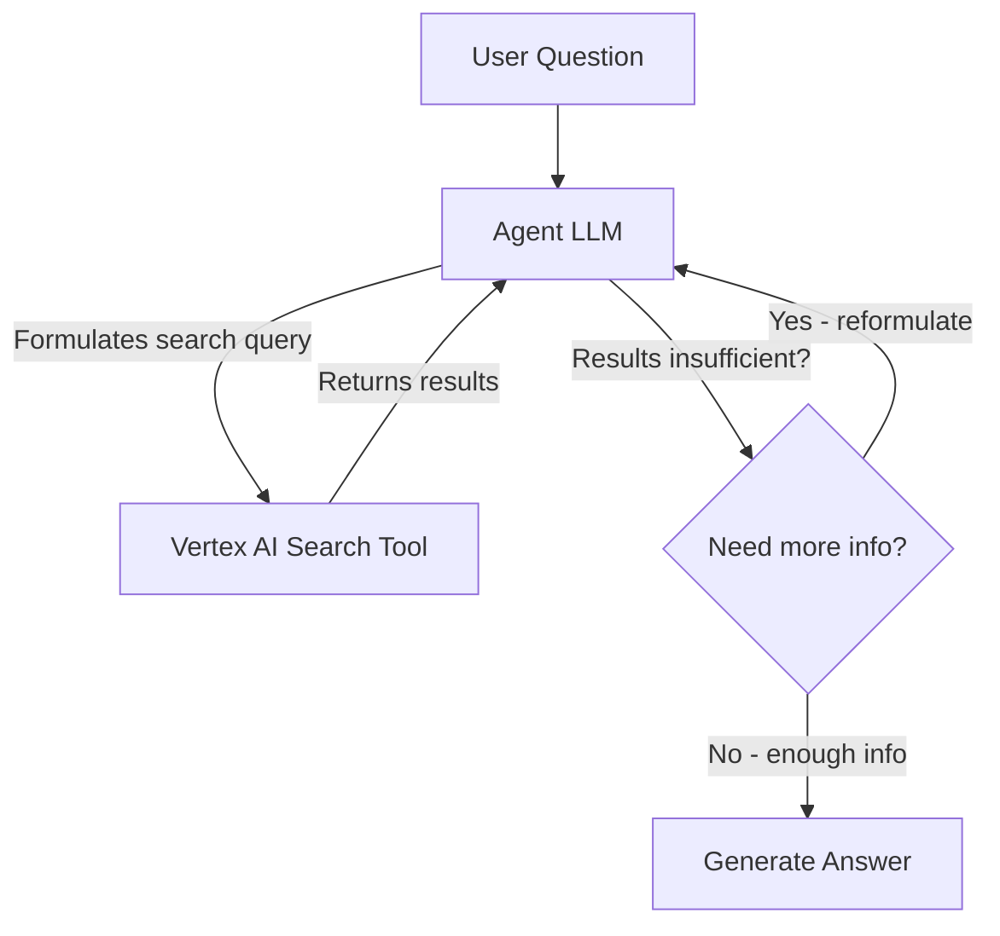

# How to Build a Retrieval Agent with LangChain Tools and Vertex AI Search

Author: [nawazdhandala](https://www.github.com/nawazdhandala)

Tags: GCP, LangChain, Vertex AI Search, Retrieval Agent, AI Tools

Description: Build a retrieval agent that uses LangChain tools and Vertex AI Search to dynamically find and synthesize information from enterprise data stores.

---

Static RAG pipelines work well when you know exactly what kind of questions users will ask. But when queries are unpredictable and might require multiple search passes, reformulations, or combining results from different sources, you need something smarter. A retrieval agent uses a language model to decide when and how to search, what queries to run, and when it has enough information to answer. By connecting LangChain's agent framework to Vertex AI Search, you get an agent that can reason about retrieval against your enterprise data.

This guide shows how to build a retrieval agent that uses Vertex AI Search as its primary knowledge tool.

## What Makes a Retrieval Agent Different from RAG

In a standard RAG pipeline, the flow is fixed: embed the query, retrieve the top-k documents, feed them to the LLM. The model has no control over the retrieval process.

A retrieval agent, on the other hand, has the search capability as a tool. The model can decide to search, look at the results, decide they are not good enough, reformulate the query, and search again. This iterative approach produces better answers for complex questions.



## Prerequisites

- Google Cloud project with Vertex AI Search configured
- A Vertex AI Search data store with indexed content
- Python 3.9+

```bash
# Install required packages
pip install langchain langchain-google-vertexai langchain-google-community google-cloud-discoveryengine google-cloud-aiplatform
```

## Setting Up Vertex AI Search

Before building the agent, you need a Vertex AI Search data store. If you have not set one up yet, you can do it through the Cloud Console or the API.

```python
from google.cloud import discoveryengine_v1 as discoveryengine

def create_search_data_store(project_id: str, location: str, data_store_id: str):
    """Create a Vertex AI Search data store for unstructured documents."""
    client = discoveryengine.DataStoreServiceClient()

    # Create the data store
    data_store = discoveryengine.DataStore(
        display_name="Enterprise Knowledge Base",
        industry_vertical=discoveryengine.IndustryVertical.GENERIC,
        content_config=discoveryengine.DataStore.ContentConfig.CONTENT_REQUIRED,
    )

    parent = f"projects/{project_id}/locations/{location}/collections/default_collection"

    operation = client.create_data_store(
        parent=parent,
        data_store=data_store,
        data_store_id=data_store_id,
    )

    result = operation.result()
    print(f"Created data store: {result.name}")
    return result
```

## Building the Search Tool

LangChain lets you wrap any function as a tool for an agent. We will create a tool that queries Vertex AI Search.

```python
from langchain_core.tools import tool
from google.cloud import discoveryengine_v1 as discoveryengine

PROJECT_ID = "your-project-id"
LOCATION = "global"
DATA_STORE_ID = "your-data-store-id"
ENGINE_ID = "your-search-engine-id"

@tool
def search_enterprise_docs(query: str) -> str:
    """Search the enterprise knowledge base for information about products, policies,
    technical documentation, and internal procedures. Use this tool whenever you need
    to find factual information to answer a question."""

    # Initialize the search client
    client = discoveryengine.SearchServiceClient()

    # Build the serving config path
    serving_config = (
        f"projects/{PROJECT_ID}/locations/{LOCATION}"
        f"/collections/default_collection/engines/{ENGINE_ID}"
        f"/servingConfigs/default_search"
    )

    # Create the search request
    request = discoveryengine.SearchRequest(
        serving_config=serving_config,
        query=query,
        page_size=5,  # Return top 5 results
        content_search_spec=discoveryengine.SearchRequest.ContentSearchSpec(
            snippet_spec=discoveryengine.SearchRequest.ContentSearchSpec.SnippetSpec(
                return_snippet=True,
                max_snippet_count=3,
            ),
            summary_spec=discoveryengine.SearchRequest.ContentSearchSpec.SummarySpec(
                summary_result_count=3,
                include_citations=True,
            ),
            extractive_content_spec=discoveryengine.SearchRequest.ContentSearchSpec.ExtractiveContentSpec(
                max_extractive_answer_count=3,
            ),
        ),
    )

    # Execute the search
    response = client.search(request)

    # Format the results for the agent
    results = []
    for result in response.results:
        doc = result.document
        doc_data = doc.derived_struct_data

        title = doc_data.get("title", "Untitled")
        snippets = doc_data.get("snippets", [])
        snippet_text = " ".join(s.get("snippet", "") for s in snippets)

        results.append(f"Title: {title}\nContent: {snippet_text}")

    if not results:
        return "No results found for this query. Try rephrasing your search."

    return "\n\n---\n\n".join(results)
```

## Adding a Specialized Follow-Up Tool

Sometimes the agent needs to dive deeper into a specific document. Let us add a tool for that.

```python
@tool
def get_document_details(document_id: str) -> str:
    """Retrieve the full content of a specific document from the knowledge base.
    Use this when search results mention a document that needs more detail."""

    client = discoveryengine.DocumentServiceClient()

    doc_path = (
        f"projects/{PROJECT_ID}/locations/{LOCATION}"
        f"/collections/default_collection/dataStores/{DATA_STORE_ID}"
        f"/branches/default_branch/documents/{document_id}"
    )

    try:
        doc = client.get_document(name=doc_path)
        content = doc.derived_struct_data.get("content", "No content available")
        title = doc.derived_struct_data.get("title", "Untitled")
        return f"Document: {title}\n\nFull Content:\n{content}"
    except Exception as e:
        return f"Could not retrieve document {document_id}: {str(e)}"
```

## Building the Retrieval Agent

Now we assemble the agent with both tools and a system prompt that guides its retrieval strategy.

```python
from langchain_google_vertexai import ChatVertexAI
from langchain.agents import create_react_agent, AgentExecutor
from langchain_core.prompts import ChatPromptTemplate, MessagesPlaceholder

# Initialize the Gemini model
llm = ChatVertexAI(
    model_name="gemini-1.5-pro",
    project="your-project-id",
    location="us-central1",
    temperature=0.1,
)

# Collect the tools
tools = [search_enterprise_docs, get_document_details]

# Define the agent prompt with retrieval strategy guidance
prompt = ChatPromptTemplate.from_messages([
    ("system", """You are a knowledgeable assistant with access to the enterprise knowledge base.

Your retrieval strategy:
1. When a user asks a question, first search the knowledge base for relevant information
2. If the initial results are too broad or not specific enough, reformulate your query and search again
3. If a search result references a document that seems highly relevant, use get_document_details to read it fully
4. Only answer after you have sufficient information from the knowledge base
5. Always cite which documents your answer is based on
6. If you cannot find the answer in the knowledge base, say so clearly

Be thorough but efficient - avoid redundant searches."""),
    MessagesPlaceholder(variable_name="chat_history", optional=True),
    ("human", "{input}"),
    MessagesPlaceholder(variable_name="agent_scratchpad"),
])

# Create the ReAct agent
agent = create_react_agent(llm=llm, tools=tools, prompt=prompt)

# Wrap in an executor
agent_executor = AgentExecutor(
    agent=agent,
    tools=tools,
    verbose=True,
    max_iterations=6,  # Allow multiple search rounds
    handle_parsing_errors=True,
    return_intermediate_steps=True,  # Keep track of the agent's search history
)
```

## Running the Agent

```python
# Simple factual question
result = agent_executor.invoke({
    "input": "What is our company's data retention policy?",
    "chat_history": [],
})
print(f"\nAnswer: {result['output']}")

# Show the agent's search steps
print(f"\nSearch steps taken: {len(result['intermediate_steps'])}")
for step in result['intermediate_steps']:
    action = step[0]
    print(f"  Tool: {action.tool}, Query: {action.tool_input}")
```

```python
# Complex question requiring multiple searches
result = agent_executor.invoke({
    "input": "Compare our standard and premium support tiers - what are the differences in response times and included services?",
    "chat_history": [],
})
print(f"\nAnswer: {result['output']}")
```

## Multi-Turn Conversations

The agent can maintain context across multiple turns, building on previous searches.

```python
from langchain_core.messages import HumanMessage, AIMessage

chat_history = []

def ask_agent(question: str) -> str:
    """Ask the agent a question with conversation context."""
    result = agent_executor.invoke({
        "input": question,
        "chat_history": chat_history,
    })

    # Update conversation history
    chat_history.append(HumanMessage(content=question))
    chat_history.append(AIMessage(content=result["output"]))

    return result["output"]

# Multi-turn example
print(ask_agent("What integrations does our product support?"))
print(ask_agent("Which of those work with Slack specifically?"))
print(ask_agent("How do I set up the Slack integration?"))
```

## Adding Source Attribution

Good retrieval agents cite their sources. Here is how to format the output with citations.

```python
@tool
def search_with_citations(query: str) -> str:
    """Search the knowledge base and return results with source citations."""
    client = discoveryengine.SearchServiceClient()

    serving_config = (
        f"projects/{PROJECT_ID}/locations/{LOCATION}"
        f"/collections/default_collection/engines/{ENGINE_ID}"
        f"/servingConfigs/default_search"
    )

    request = discoveryengine.SearchRequest(
        serving_config=serving_config,
        query=query,
        page_size=5,
        content_search_spec=discoveryengine.SearchRequest.ContentSearchSpec(
            extractive_content_spec=discoveryengine.SearchRequest.ContentSearchSpec.ExtractiveContentSpec(
                max_extractive_answer_count=3,
                max_extractive_segment_count=3,
            ),
        ),
    )

    response = client.search(request)

    results = []
    for i, result in enumerate(response.results, 1):
        doc = result.document
        doc_data = doc.derived_struct_data
        title = doc_data.get("title", "Untitled")
        uri = doc_data.get("link", "no-link")

        extractive_answers = doc_data.get("extractive_answers", [])
        content = " ".join(a.get("content", "") for a in extractive_answers)

        results.append(f"[{i}] {title} ({uri})\n{content}")

    return "\n\n".join(results) if results else "No results found."
```

## Error Handling

Make the agent resilient to search failures.

```python
@tool
def safe_search(query: str) -> str:
    """Search with built-in error handling and retry logic."""
    import time

    max_retries = 2
    for attempt in range(max_retries + 1):
        try:
            # Call the actual search function
            return search_enterprise_docs.invoke(query)
        except Exception as e:
            if attempt < max_retries:
                time.sleep(1)  # Brief pause before retry
                continue
            return f"Search temporarily unavailable after {max_retries + 1} attempts. Error: {str(e)}"
```

## Summary

A retrieval agent built with LangChain and Vertex AI Search can handle complex, multi-step information needs that a static RAG pipeline cannot. The key is giving the agent clear guidance on when to search, when to reformulate, and when it has enough information. Start with a single search tool, test it against your most common query types, then add specialized tools as you identify gaps. The agent's ability to iteratively search and reason about results is what makes it significantly more capable than a fixed retrieval pipeline.
